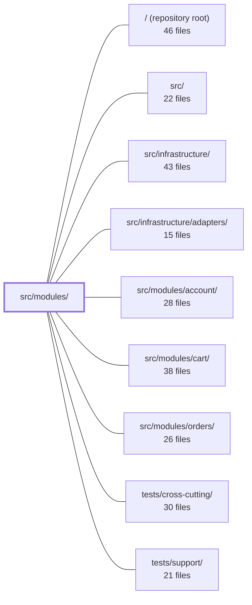

---
tags:
  - 2repo
  - 2repo/module
  - project/boilerplate-node-backend
type: module
module: src/modules/
files: 20
updated: 2026-09-02T18:32:12.681749+00:00
---

# src/modules/

## Purpose

`src/modules/` holds the application's domain modules, each a self-contained directory with its own model, service, routes, tests, and a single barrel file that defines the public API. In this codebase the directory contains two modules: **audit-logs**, which owns the durable, append-only compliance trail and its queryable projection, and **observability**, which exposes operator-facing endpoints (health, metrics, SSE events, audit reading) under `/observability`. Both follow the same structural conventions as other domain modules (`account`, `cart`, `orders`): a `module.ts` side-effect file for wiring, a `metrics.ts` for domain-owned Prometheus counters, and a strict import boundary enforced by the barrel.

## Key parts

- **`audit-logs/`** — The compliance-grade audit trail.
  - `model.ts` defines the Mongoose schema (snake_case, TTL-indexed, no buffering).
  - `repository.ts` provides append-only read/write with no update or delete path.
  - `service.ts` implements the `AuditSink` (fire-and-forget write) and the paginated `search` used by the API.
  - `module.ts` is a side-effect-only file that registers the sink into the observability pipeline at import time, so any `emitAuditEvent` call persists transparently.
  - `metrics.ts` owns the one Prometheus counter for lost entries (log-line-to-trail drop).
  - `tests/` covers integration (repository against in-memory Mongo), unit (service failure semantics, TTL retention), and a schema-contract test that pins the document shape as a security artifact.

- **`observability/`** — The operator dashboard under `/observability`.
  - `module.ts` registers routes, locales, and config with the kernel.
  - `routes.ts` defines five GET endpoints with per-route auth guards (cookie for SSE `EventSource`, static scraper credential for Prometheus, admin JWT for the rest).
  - `controllers/` holds handlers for health, metrics-overview, and audit-reading. The audit controller is the only point where observability reaches into a sibling module.
  - `openapi.yaml` / `asyncapi.yaml` are self-validating contract slices for JSON and SSE endpoints respectively.
  - `tests/` includes contract tests (wire-shape + semantic invariants against the OpenAPI spec) and unit tests for the metrics-overview and inline route handlers.

## How it connects

- **observability → audit-logs**: The `get-observability-audit` controller is the sole cross-module import; it reads the audit collection via the barrel export. No other file in observability touches audit-logs internals.
- **Both → `src/infrastructure/`**: The observability pipeline (`@infrastructure/observability/audit`) is the write path that `audit-logs/module.ts` hooks into. The metrics-overview controller resolves counters by name against the shared `prom-client` registry rather than importing domain metric files directly, keeping observability decoupled from `account`, `cart`, and `orders`.
- **Sibling modules (`account`, `cart`, `orders`)**: These emit audit events through the shared pipeline but never import `audit-logs` themselves—the `module.ts` side-effect ensures persistence is transparent. They own their own `metrics.ts` counters, which the metrics-overview endpoint discovers by name.
- **`tests/support/` / `tests/cross-cutting/`**: Provide the in-memory MongoDB harness (`setupTestDb`), API-spec validation helpers (`toSatisfyApiSpec()`), and shared fixtures that both modules' test suites consume.

## Where to start

1. **`src/modules/audit-logs/module.ts`** — Three lines that show the entire wiring: import the sink, register it with the observability layer. Reading this first makes it clear why no call-site in `account`, `cart`, or `orders` knows about the database.
2. **`src/modules/observability/routes.ts`** — Lays out the full endpoint surface, the per-route auth strategy, and the five GET handlers in one screen. It is the natural entry point for understanding what the operator sees and how each endpoint is protected.

## Connected modules

[[boilerplate-node-backend_ROOT|/ (repository root)]] · [[boilerplate-node-backend_src|src/]] · [[boilerplate-node-backend_src_infrastructure|src/infrastructure/]] · [[boilerplate-node-backend_src_infrastructure_adapters|src/infrastructure/adapters/]] · [[boilerplate-node-backend_src_modules_account|src/modules/account/]] · [[boilerplate-node-backend_src_modules_cart|src/modules/cart/]] · [[boilerplate-node-backend_src_modules_orders|src/modules/orders/]] · [[boilerplate-node-backend_tests_cross-cutting|tests/cross-cutting/]] · [[boilerplate-node-backend_tests_support|tests/support/]]

## Files
- `src/modules/audit-logs/index.ts` — Public barrel (export surface) for the `audit-logs` module. It is the **only** file a sibling module is allowed to import from this directory (same convention as `modules/products/index.ts`). It exists to keep the module's internal structure (service, repository, model, types) encapsulated while still exposing the read path that `observability` needs to serve `GET /observability/audit`.
- `src/modules/audit-logs/metrics.ts` — Defines the single Prometheus counter that the audit-logs module owns, tracking how many audit entries made it into the compliance log but were lost on the path to the queryable trail. It lives in the module (not in `infrastructure/`) following the same pattern as `modules/account/metrics.ts`, so the overview endpoint can read the value without a direct import of this file.
- `src/modules/audit-logs/model.ts` — Mongoose model, schema, and serialization transform for the persisted audit-log collection. It is the durable, queryable half of the audit system: the log line (written by `@infrastructure/observability/audit`) is the compliance record, while this collection exists so `GET /observability/audit` can answer "what has actor X done" from the API. Fields use **snake_case** deliberately — the document is returned verbatim as `AuditEventItem` in `openapi.yaml` and must match the shape a SIEM ingests.
- `src/modules/audit-logs/module.ts` — Side-effect-only module that wires the audit-log persistence sink into the observability layer at import time. It exists so that calling `emitAuditEvent` anywhere in the codebase transparently persists entries to the database, without any call-site needing to know about the storage implementation.
- `src/modules/audit-logs/repository.ts` — Append-only read/write access to the audit-log collection. Deliberately exposes no update or delete path — an editable audit trail defeats the purpose — and delegates expiry to the model's TTL index rather than in-app cleanup.
- `src/modules/audit-logs/service.ts` — The audit log service that bridges the audit pipeline to persistence: it is the `AuditSink` implementation (fire-and-forget write) registered by the audit-logs module, and the paginated read path behind `GET /observability/audit`.
- `src/modules/audit-logs/tests/integration/repository.test.ts` — Integration tests for `auditLogRepository`, executed against the in-memory MongoDB that `setupTestDb` provisions. Covers entry creation, multi-filter search, the exclusive `since` boundary, pagination metadata, response shaping (stripping `_id`/`__v`, ISO-8601 timestamps), and a deep-paging regression guard for the former 200-row read cap.
- `src/modules/audit-logs/tests/unit/retention.test.ts` — Unit test verifying that the audit-log collection's TTL index is created with the correct `expireAfterSeconds` value, both when the `NODE_AUDIT_RETENTION_DAYS` environment variable is unset (default) and when it is explicitly configured.
- `src/modules/audit-logs/tests/unit/schema-contract.test.ts` — Compliance test that pins the audit-log schema's structural contract: which fields are mandatory, which enums are closed, which Mongoose options are set, and which indexes (including the TTL) exist. It treats the schema as a security artifact rather than a convenience, so that silent drift—missing fields, open-ended enums, a buffering write, or a misconfigured TTL—fails loudly instead of degrading audit coverage.
- `src/modules/audit-logs/tests/unit/service.test.ts` — Unit tests for the two functions exported by `auditLogService`. The tests focus on their deliberately asymmetric failure semantics: `record` is fail-open (must never throw, swallows rejections into a log line) and `search` is fail-closed (propagates errors to the caller). The repository is fully mocked so failure paths can be exercised deterministically.
- `src/modules/observability/asyncapi.yaml` — AsyncAPI 2.6.0 contract defining the three SSE channels served at `/observability/events` by the observability module. It is a self-validating slice that a bundler merges (servers, channels, components) into the service-wide contract; the `info` block exists only so the file can be linted and opened standalone.
- `src/modules/observability/controllers/get-observability-audit.ts` — Controller handler for `GET /observability/audit`. It provides a filtered, paged read over the `audit-logs` collection — the single point where the observability module reaches outside its own process snapshot, and the sole reason it depends on `audit-logs`.
- `src/modules/observability/controllers/get-observability-health.ts` — Handler for `GET /observability/health`. Assembles the **readiness** snapshot for this instance by pulling dependency state, telemetry-sink configuration, and process resource metrics from the `infrastructure/observability` layer, then sends a single JSON response. Readiness is deliberately distinct from liveness (`GET /`): an orchestrator acts on liveness, whereas this endpoint answers "which backing service is missing so the instance cannot fulfil its contract?"
- `src/modules/observability/controllers/get-observability-metrics-overview.ts` — Handler for `GET /observability/metrics/overview`. Aggregates HTTP, auth, business, database, and process metrics into a single structured JSON response. It resolves domain counters by metric **name** against the shared prom-client registry instead of importing them directly, so the observability module never compiles against the domains it reports on.
- `src/modules/observability/module.ts` — Module manifest for the `observability` module. Registers the module's identity (name, base path, routes, locales, required config) with the kernel so the service can serve operator-facing endpoints: health, a metrics overview, the live SSE stream, the Prometheus scrape endpoint, and the audit trail.
- `src/modules/observability/openapi.yaml` — OpenAPI 3.0.3 contract (v2.0.0) for the observability module. It defines five endpoints that expose operational visibility — SSE event stream, health snapshot, Prometheus metrics, a JSON metrics summary, and a paginated audit log — each with its own auth model suited to the consumer (browsers, Prometheus scrapers, or admin JWTs).
- `src/modules/observability/routes.ts` — Defines the Express route table for the operator dashboard (mounted at `/observability`). It wires five read-only GET endpoints to their controllers and, per route, selects the authentication guard that matches the caller's capability — cookie-based auth for a browser `EventSource`, a static scraper credential for Prometheus, and the standard admin-JWT chain for normal API clients.
- `src/modules/observability/tests/contract/api.contract.test.ts` — Contract tests for the three JSON endpoints under `/observability` (`/health`, `/metrics/overview`, `/audit`). Each response shape is hand-assembled field-by-field in the source module rather than produced by a shared serializer, so these tests are the primary guard against silent drift from the OpenAPI spec. They assert both the wire shape (via `toSatisfyApiSpec()`) and a few semantic invariants (status vocabulary, counter presence, pagination meta) that a pure schema check would miss.
- `src/modules/observability/tests/unit/metrics-overview.test.ts` — Unit tests for the `GET /observability/metrics/overview` controller. Verifies that each domain row in the response carries real counter values resolved by metric name from the shared Prometheus registry, and that a missing counter degrades to `0` rather than crashing.
- `src/modules/observability/tests/unit/routes.test.ts` — Unit tests for the observability router and its two inline handlers (`GET /events`, `GET /metrics`). The handlers are not separately exported from `routes.ts`, so the suite drives them through the Express router stack. The file also asserts the route table's shape, ordering, and the distinct authentication guard applied to each endpoint.

---
[[boilerplate-node-backend_INDEX|← boilerplate-node-backend index]]
