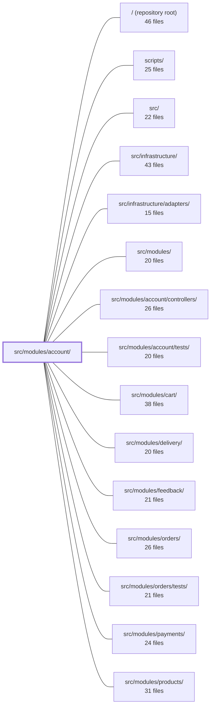

---
tags:
  - 2repo
  - 2repo/module
  - project/boilerplate-node-backend
type: module
module: src/modules/account/
files: 28
updated: 2026-09-02T18:32:27.737391+00:00
---

# src/modules/account/

## Purpose

The account module owns every concern around a user's identity and personal data: authentication (login, signup, token refresh, logout), two-factor authentication, email verification, password management, session lifecycle, the user's address book, and account-level operations (GDPR export, hard delete). It deliberately does **not** own the User document itself—that lives in the shared `users` kernel—but it owns all token/auth-flow logic and the separate address-book collection.

## Key parts

- **Module entry & manifest** — `module.ts` installs the auth resolver and declares the `AppModule` manifest (routes, domain-event subscriptions, config validation, demo seeding). `index.ts` is the barrel that exposes the module's single cross-module concern (checkout address lookup) to siblings.
- **Auth & session** — `services/authentication.ts` (login/signup/logout, token issue & revoke), `services/two-factor.ts` (TOTP lifecycle), `services/verification.ts` (email-verification token flow), `services/tokens.ts` (live-token primitives), `services/token-cleanup.ts` (sweep expired tokens). The `session/` sub-directory (`jwt.ts`, `cookies.ts`, `config.ts`, `session.ts`, `login-observability.ts`) isolates JWT signing, cookie mechanics, env-config parsing, the shared "mint a full session" helper, and the post-login observability tail. `two-factor.ts` (top-level) holds pure TOTP crypto with no DB or HTTP dependency.
- **Addresses** — `model.ts` (Mongoose schema, one doc per `userId`), `repository.ts` (read-modify-write to enforce the single-default invariant), `services/addresses.ts` (CRUD + checkout lookup), `fixtures.ts` / `demo.ts` (test & demo data), `emails.ts` (i18n email builders).
- **Profile & lifecycle** — `services/profile.ts` (read/update profile, change password, delete account), `services/export.ts` (GDPR data-export payload).
- **Observability** — `analytics.ts` (event-name registry), `audit.ts` (audit-action vocabulary), `metrics.ts` (Prometheus counters on the shared registry).
- **API surface** — `routes.ts` (Express router; wires rate-limiting, auth guards, cache invalidation), `openapi.yaml` (v2.0.0 contract for `/account*`), `probes.ts` (HTTP probes for multi-state scenarios).

## How it connects

- **`users` module** — The User document (including its `tokens` array) lives in `users`; the account module delegates token persistence to `@modules/users` and reads/writes profile fields through that shared document.
- **`orders` / `delivery` / `cart` / `products` / `payments` / `feedback` / `wishlist` modules** — `services/export.ts` reads user-owned records from every one of these to assemble the GDPR payload. The checkout address resolved by `services/addresses.ts` is consumed by the order/delivery flow (shipping address is a snapshot that can later diverge from the live book).
- **`infrastructure` / `infrastructure/adapters`** — `analytics.ts` registers event names into the shared analytics port; `audit.ts` augments the infrastructure audit-action type map; `metrics.ts` registers counters on the shared `metricsRegistry` so a single `/metrics` scrape covers them.
- **`account/controllers/`** — The controller layer (e.g., `post-login`, `post-login-2fa`) calls into the service and session helpers defined here; `login-observability.ts` was extracted specifically so those controllers share one tail.
- **`account/tests/`, `tests/cross-cutting/`, `tests/unit/infrastructure/`** — Unit and integration tests that exercise the service, repository, session, and crypto layers defined in this module.
- **`scripts/` / repository root** — Demo-seeding entry points that call `demo.ts` to populate the address-book fixtures.

## Where to start

1. **`module.ts`** — Reading this first gives the full picture of what the module mounts (routes, events, config keys, demo seeds) and how it hands control to the kernel.
2. **`services/index.ts`** — The flat re-export barrel lets you see every public service function in one glance, making it easy to orient before diving into the individual service files.

## Connected modules

[[boilerplate-node-backend_ROOT|/ (repository root)]] · [[boilerplate-node-backend_scripts|scripts/]] · [[boilerplate-node-backend_src|src/]] · [[boilerplate-node-backend_src_infrastructure|src/infrastructure/]] · [[boilerplate-node-backend_src_infrastructure_adapters|src/infrastructure/adapters/]] · [[boilerplate-node-backend_src_modules|src/modules/]] · [[boilerplate-node-backend_src_modules_account_controllers|src/modules/account/controllers/]] · [[boilerplate-node-backend_src_modules_account_tests|src/modules/account/tests/]] · [[boilerplate-node-backend_src_modules_cart|src/modules/cart/]] · [[boilerplate-node-backend_src_modules_delivery|src/modules/delivery/]] · [[boilerplate-node-backend_src_modules_feedback|src/modules/feedback/]] · [[boilerplate-node-backend_src_modules_orders|src/modules/orders/]] · [[boilerplate-node-backend_src_modules_orders_tests|src/modules/orders/tests/]] · [[boilerplate-node-backend_src_modules_payments|src/modules/payments/]] · [[boilerplate-node-backend_src_modules_products|src/modules/products/]] · … and 6 more

## Files
- `src/modules/account/analytics.ts` — Declares the analytics event names owned by the account module and registers them into the shared analytics port's type map. It exists so that every account-domain event has exactly one authoritative name and a compile-time-safe reference, keeping the event catalogue distributed alongside the module that owns each name.
- `src/modules/account/audit.ts` — Central registry of audit-action strings emitted by the account module. It defines the vocabulary once and augments the infrastructure audit-action map at the type level so that the union of all valid actions grows with the modules that own them, without any module needing to edit a shared file.
- `src/modules/account/demo.ts` — Provides the address-book slice of the demo dataset. It defines two seeded address books (admin with two entries, ordinary customer with one), a seeding function, and a read-back export. It exists so that demo scenarios like "exactly one default entry per book" and "an order's shipping address is a snapshot that can diverge from the live book" are observable against real data.
- `src/modules/account/emails.ts` — Contains every email-content builder for the account domain. Each exported function resolves i18n strings for a given locale and returns a fully-formed `EmailContent` object (template name, subject, render data) that can later be rendered by the mailer worker without needing a request context.
- `src/modules/account/fixtures.ts` — Factory for building address-book fixtures (test data and demo datasets). It translates caller-supplied overrides into an `AddressBookFixture` shaped for `addressBookRepository.create`, handling the identity mapping between the contract's `id` field and the Mongoose subdocument `_id`.
- `src/modules/account/index.ts` — Barrel file that defines the **only** public import surface of the `account` module for sibling modules. It deliberately exposes a single cross-module concern—the address a checkout resolves—and explicitly withholds the session/token API (which is handled exclusively by `kernel/authentication.ts`).
- `src/modules/account/metrics.ts` — Defines and exports a fixed set of Prometheus `Counter` instances covering the account/auth domain (logins, sign-ups, resets, 2FA, token refresh, account deletion, etc.). All counters register on the shared `metricsRegistry` so a single `/metrics` scrape includes them alongside HTTP-level metrics. No code imports these to *read* values; they are resolved by name via `GET /observability/metrics/overview`.
- `src/modules/account/model.ts` — Defines the Mongoose schema and compiled model for the user address book — one document per `userId`, holding an array of independently-addressable address entries. It lives in its own collection (mirroring the cart's pattern) so that editing a single address touches one small document rather than rewriting the entire user record.
- `src/modules/account/module.ts` — Entry point and module manifest for the **account** module. At import time it installs the kernel's authentication resolver (so every guard can identify the caller before the first request), and it declares the `AppModule` manifest that the kernel uses to mount routes, subscribe to domain events, validate config, and seed demo data. The module owns the address-book collection and all token/auth-flow logic, while the User document itself remains the shared kernel with the `users` module.
- `src/modules/account/openapi.yaml` — OpenAPI 3.0.3 contract for the **account** module (v2.0.0). It defines the REST surface for user profile management, password changes, step-up re-authentication, TOTP two-factor lifecycle, session introspection, and logout. Serves as the single source of truth for client SDK generation and API documentation for everything under `/account*`.
- `src/modules/account/probes.ts` — Defines the four HTTP probe requests for the account module that the OpenAPI contract cannot itself express (error-triggering calls, multi-state scenarios). These probes are emitted alongside the contract-generated collection to verify behaviors that have no single-operation representation in the spec.
- `src/modules/account/repository.ts` — Read-modify-write repository for a user's address book (a single Mongoose document holding an array of entries). It exists because the "exactly one default address" invariant spans the whole array and cannot be enforced with atomic `$set`/`$pull` operators, so every write loads the document, mutates it in memory, and saves.
- `src/modules/account/routes.ts` — Express router for the account module. It declares every HTTP route for authentication (login, signup, token refresh, logout), password management, email verification, two-factor auth, session management, address-book CRUD, and account lifecycle (deletion, data export). Cross-cutting concerns—rate limiting, auth-context population, cache invalidation, and fresh-session re-auth—are wired in at the route level here rather than inside individual controllers.
- `src/modules/account/services/addresses.ts` — Service layer for the account's address book: CRUD operations plus a checkout lookup, all scoped to a single user. It exists as a slice of the account service (`./index`) rather than a standalone namespace so the account's two aggregates (auth + addresses) share one service handle. The file owns the "exactly one default" invariant at the list level and maps the repository's document shape to the OpenAPI wire contract.
- `src/modules/account/services/authentication.ts` — Handles the write-side of identity: issuing and revoking opaque tokens (password-reset, account-deletion, session refresh) and the login/logout endpoints that surround them. It deliberately does **not** store or verify credential values — hashing lives in the model's pre-save hook, JWT signing in `../session/jwt`, and password changes in `./profile`.
- `src/modules/account/services/export.ts` — Handler for `POST /account/export` — the GDPR Art. 15 / 20 "give me all my data" endpoint. It assembles a single JSON payload by reading the caller's records from every module that stores user-owned data, strips fields that don't belong in an export (or that expose staff-only data), and returns the result. It does not authenticate (that's `requireFreshAuth` on the route) and does not mutate anything.
- `src/modules/account/services/index.ts` — Barrel module that re-exports every function from the account sub-services (authentication, profile, addresses, verification, tokens, token-cleanup, export, two-factor) into a single `accountService` namespace plus a short list of named re-exports. It exists so callers have one import site and the namespace acts as a catch-all registry; no business logic lives here.
- `src/modules/account/services/profile.ts` — Implements the "maintain my account" side of the account module: reading one's own profile, updating profile fields (email, username, locale, image), changing password (both from a reset link and with current-password proof), and hard-deleting one's own account. Split from `./authentication` along the proving-vs-maintaining boundary — authentication answers "who is this", this file answers "change something about the account I'm already authenticated as."
- `src/modules/account/services/token-cleanup.ts` — Removes expired (and grace-window-lapsed rotated) tokens from user documents. Exposes two entry points: a fire-and-forget sweep run as a pre-flight step on every login/refresh request, and an admin-triggered cleanup behind `DELETE /account/tokens/expired` that must return a concrete outcome and write an audit record.
- `src/modules/account/services/tokens.ts` — Single owner of the user's `tokens` array for all non-password flows (reset, verification, delete confirmation, refresh sessions). Defines what "live" means, provides find/spend primitives, and shapes the session list exposed by `GET /account/sessions`. Keeping both halves of the live-token rule in one module so callers never reach into the users module directly.
- `src/modules/account/services/two-factor.ts` — Service layer for the full two-factor authentication lifecycle: enrolling a new TOTP secret, confirming it with a code from the user's authenticator, disabling the feature, and verifying the code at login time. It deliberately stops short of session minting — that responsibility belongs to the post-login controller, keeping "verify a code" and "create a session" in separate units.
- `src/modules/account/services/verification.ts` — Centralises the full email-verification lifecycle — token issuance, localised email composition, queueing, and the final "mark verified" write — in one module so that the three flows that trigger it (signup, email-address change, explicit re-send) share a single code path and cannot drift.
- `src/modules/account/session/config.ts` — Centralized read-only accessor for all token-related environment variables (expiry durations, signing secrets, TOTP encryption key, rotation grace period). It holds no tokens and issues none — it merely parses env vars into typed values that `./jwt` signs against, `./cookies` reads for `maxAge`, and `two-factor.ts` uses for at-rest encryption.
- `src/modules/account/session/cookies.ts` — Encapsulates all HTTP cookie creation and destruction for the account session, keeping cookie mechanics (flags, paths, clearing) in one place and decoupled from JWT token logic. Manages two cookies with distinct roles: `jwt` (the long-lived refresh-token credential) and `isAuth` (a non-secret boolean hint that lets the client shell render authenticated chrome before the first API round-trip completes).
- `src/modules/account/session/jwt.ts` — JWT creation and verification for the `account` domain. All signing, verification, rotation, and revocation logic for access tokens, refresh tokens, and MFA challenge tokens lives here. Secrets and TTL policy are delegated to `./config`; token persistence is delegated to `@modules/users`.
- `src/modules/account/session/login-observability.ts` — Shared observability tail (metrics, audit, analytics) that fires at the end of a completed login. Extracted from `post-login.ts` so `post-login-2fa.ts` reuses it rather than re-implementing "a login happened." Deliberately lives at the controller/session layer, not in the authentication service, because the success emit must only fire after a session actually exists (cookies, access token)—a controller-layer fact.
- `src/modules/account/session/session.ts` — Single-entry-point helper that mints a complete live session (refresh token → cookies → access token) in one call. Extracted from `postLogin` so that every flow that needs to create or re-create a session — password change, re-auth, 2FA completion — shares identical cookie/token logic instead of duplicating it.
- `src/modules/account/two-factor.ts` — Pure-crypto layer for TOTP two-factor authentication: secret generation, AES-256-GCM encryption/decryption of the stored secret, code verification, and one-time backup-code minting. Contains no database or HTTP logic — that lives in `services/two-factor.ts`. The split exists so the crypto can be unit-tested against fixed clocks and known secrets without a database in the loop.

---
[[boilerplate-node-backend_INDEX|← boilerplate-node-backend index]]
