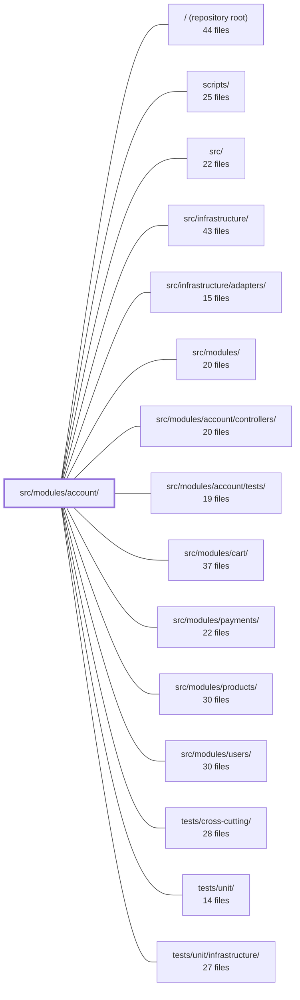

---
tags:
  - 2repo
  - 2repo/module
  - project/boilerplate-node-backend
type: module
module: src/modules/account/
files: 23
updated: 2026-08-31T20:52:15.733882+00:00
---

# src/modules/account/

## Purpose

The `account` module owns every user-facing account operation: authentication (signup, login, password reset, token refresh), session and token lifecycle, email verification, profile self-service, and the per-user address book. It is the single mount point for the `/account` HTTP surface and the authoritative source for account-domain events, metrics, and audit actions.

## Key parts

- **Module wiring & public surface** — `module.ts` (entry point, manifest, auth-resolver hookup), `routes.ts` (Express router for every endpoint), `index.ts` (the only cross-module import surface; deliberately exposes the checkout-resolved address and nothing more).
- **Service layer** (`services/`) — Six focused files split by concern: `authentication.ts` (token writes + entry flows), `profile.ts` (field updates, password change), `addresses.ts` (address-book CRUD + checkout lookup, owns the "exactly one default" invariant), `verification.ts` (email-verify token issue/spend), `tokens.ts` (one-time-link find/spend, session listing), `token-cleanup.ts` (expired-token sweep). `services/index.ts` re-exports all six behind a single `accountService` namespace.
- **Data & persistence** — `model.ts` (Mongoose schema: one document per `userId`, array of `AddressItem` subdocuments) and `repository.ts` (read-modify-write repository, needed because the single-default invariant spans the whole array).
- **Session machinery** (`session/`) — `config.ts` (all token env/TTL reads), `jwt.ts` (sign/verify/persist mechanics), `cookies.ts` (`jwt` refresh cookie + `isAuth` flag cookie).
- **Observability & contract** — `analytics.ts`, `audit.ts`, `metrics.ts` (event names, audit-action strings, Prometheus counters all registered into shared infrastructure registries); `openapi.yaml` (single source of truth for the HTTP contract); `probes.ts` (multi-state / error-trigger scenarios the spec can't express).
- **Emails & demo data** — `emails.ts` (i18n-resolved `EmailContent` builders for every lifecycle mail), `demo.ts` (seeded address books), `fixtures.ts` (deterministic `AddressBook` document factories bridging API ↔ Mongo shapes).
- **Controllers** (`controllers/`) — Thin HTTP handlers that translate request/response to the service layer, invoked by `routes.ts`.
- **Tests** (`tests/`) — Module-scoped unit and integration tests.

## How it connects

- **`src/modules/account/controllers/`** — Controllers are the HTTP→service bridge; `routes.ts` dispatches to them.
- **`src/infrastructure/`** — The module registers analytics events, audit actions, and Prometheus counters into shared infrastructure registries; in return it consumes the audit and analytics type maps it augments.
- **`src/infrastructure/adapters/`** — The address-book repository and user-document writes go through the infrastructure adapter layer for database I/O.
- **`src/modules/users/`** — Account flows operate on the user document (tokens array, profile fields); the module's `index.ts` deliberately withholds session/token APIs to `kernel/authentication.ts`, keeping a clean boundary between "account service" and "user record ownership."
- **`src/modules/cart/`** — The address-book model mirrors the cart's single-document-per-user pattern; the cart module consumes the checkout-resolved address that `index.ts` exposes.
- **`src/modules/payments/`** — Payment flows reference the shipping address snapshot that originates in the address book.
- **`tests/cross-cutting/`, `tests/unit/`, `tests/unit/infrastructure/`** — Integration, unit, and adapter-level tests that exercise account endpoints and data paths alongside other modules.
- **`scripts/`** — CI/contract-test tooling consumes `openapi.yaml` and `probes.ts` directly.

## Where to start

1. **`module.ts`** — Ten lines that show how the module mounts, what it subscribes to, and how it hands off to the kernel's auth resolver. Reading this first gives you the shape of everything else.
2. **`services/index.ts`** — The curated re-export list is effectively a table of contents for the service layer, showing which concern lives where and the single `accountService` handle every controller imports.

## Connected modules

[[boilerplate-node-backend_ROOT|/ (repository root)]] · [[boilerplate-node-backend_scripts|scripts/]] · [[boilerplate-node-backend_src|src/]] · [[boilerplate-node-backend_src_infrastructure|src/infrastructure/]] · [[boilerplate-node-backend_src_infrastructure_adapters|src/infrastructure/adapters/]] · [[boilerplate-node-backend_src_modules|src/modules/]] · [[boilerplate-node-backend_src_modules_account_controllers|src/modules/account/controllers/]] · [[boilerplate-node-backend_src_modules_account_tests|src/modules/account/tests/]] · [[boilerplate-node-backend_src_modules_cart|src/modules/cart/]] · [[boilerplate-node-backend_src_modules_payments|src/modules/payments/]] · [[boilerplate-node-backend_src_modules_products|src/modules/products/]] · [[boilerplate-node-backend_src_modules_users|src/modules/users/]] · [[boilerplate-node-backend_tests_cross-cutting|tests/cross-cutting/]] · [[boilerplate-node-backend_tests_unit|tests/unit/]] · [[boilerplate-node-backend_tests_unit_infrastructure|tests/unit/infrastructure/]] · … and 1 more

## Files
- `src/modules/account/analytics.ts` — Declares the analytics event names owned by the account module and registers them into the shared analytics port's type map. It exists so that every account-domain event has exactly one authoritative name and a compile-time-safe reference, keeping the event catalogue distributed alongside the module that owns each name.
- `src/modules/account/audit.ts` — Defines the canonical set of audit-action strings the account module emits and registers them (type-only) into the shared `AuditActionMap` interface via a module augmentation of `@infrastructure/observability/audit`. It exists so every caller references one source of truth for action names while the infrastructure layer gains the union without a runtime import back into the module.
- `src/modules/account/demo.ts` — Provides the address-book slice of the demo dataset. It defines two seeded address books (admin with two entries, ordinary customer with one), a seeding function, and a read-back export. It exists so that demo scenarios like "exactly one default entry per book" and "an order's shipping address is a snapshot that can diverge from the live book" are observable against real data.
- `src/modules/account/emails.ts` — Defines the copy and payload for every account-lifecycle email (verification, password reset, account setup, deletion). Each exported builder resolves all strings into finished text via the i18n translator at call time and returns a complete `EmailContent` object, so the downstream mailer worker only needs to interpolate a static template with no request context, locale store, or environment access.
- `src/modules/account/fixtures.ts` — Factory functions that build AddressBook documents in a shape ready for `addressBookRepository.create`. It bridges the gap between the API-level `Address` type (which carries an `id`) and the MongoDB subdocument shape (`AddressItem` with `_id`), and gives tests and the demo-dataset exporter a single, deterministic way to construct fixtures.
- `src/modules/account/index.ts` — Barrel file that defines the **only** public import surface of the `account` module for sibling modules. It deliberately exposes a single cross-module concern—the address a checkout resolves—and explicitly withholds the session/token API (which is handled exclusively by `kernel/authentication.ts`).
- `src/modules/account/metrics.ts` — Defines the set of Prometheus `Counter` metrics for the account/auth domain (login, sign-up, password reset, refresh, verify, cleanup, deletion). All counters register onto the shared `metricsRegistry`, so a single `/metrics` scrape returns them alongside HTTP-level metrics. No consumer imports these to *read* values; the overview endpoint resolves them by name off the registry.
- `src/modules/account/model.ts` — Defines the Mongoose schema and compiled model for the user address book — one document per `userId`, holding an array of independently-addressable address entries. It lives in its own collection (mirroring the cart's pattern) so that editing a single address touches one small document rather than rewriting the entire user record.
- `src/modules/account/module.ts` — Module entry-point for the `account` mount. It wires the kernel's authentication resolver (mapping verified JWTs to a minimal user shape) and declares the module's manifest — routes, event subscriptions, demo seeds, and locale path — so the runtime can mount `/account` and react to user lifecycle events.
- `src/modules/account/openapi.yaml` — OpenAPI 3.0.3 specification for the **account** module (v2.0.0). It is the single source of truth for the HTTP contract of everything account-related: profile read/update/delete, password change, session management, and the user's address book. Other tools (code-gen, client SDKs, CI contract tests) consume this file directly.
- `src/modules/account/probes.ts` — Defines the four HTTP probe requests for the account module that the OpenAPI contract cannot itself express (error-triggering calls, multi-state scenarios). These probes are emitted alongside the contract-generated collection to verify behaviors that have no single-operation representation in the spec.
- `src/modules/account/repository.ts` — Read-modify-write repository for a user's address book (a single Mongoose document holding an array of entries). It exists because the "exactly one default address" invariant spans the whole array and cannot be enforced with atomic `$set`/`$pull` operators, so every write loads the document, mutates it in memory, and saves.
- `src/modules/account/routes.ts` — Express router for the account module. It wires every account/auth HTTP endpoint—login, signup, password reset, email verification, token refresh, session management, address-book CRUD, and account deletion—to its controller, applying shared middleware (auth population, cache-control, rate-limiting) at the appropriate scope.
- `src/modules/account/services/addresses.ts` — Service layer for the account's address book: CRUD operations plus a checkout lookup, all scoped to a single user. It exists as a slice of the account service (`./index`) rather than a standalone namespace so the account's two aggregates (auth + addresses) share one service handle. The file owns the "exactly one default" invariant at the list level and maps the repository's document shape to the OpenAPI wire contract.
- `src/modules/account/services/authentication.ts` — Implements the two token writes that every account flow depends on—issuing (`tokenAdd`) and revoking (`sessionRemove` / `tokenRemoveByValue`)—plus the user-facing endpoints built on them: signup, login, password reset, account-deletion request, session logout, and token refresh. Credential *values* (hashing, JWT signing, password change) are deliberately excluded; they live on the model hook, `../session/jwt`, and `./profile` respectively.
- `src/modules/account/services/index.ts` — Barrel module for the account service layer. It re-exports every function from the six internal service files (`authentication`, `profile`, `addresses`, `verification`, `tokens`, `token-cleanup`) through two channels: a curated set of named exports for direct imports, and a single `accountService` namespace object that carries the full surface. It exists so controllers and external callers address one path (`../services`) rather than reaching into sub-files.
- `src/modules/account/services/profile.ts` — Self-service account maintenance: profile field updates and password changes for an already-authenticated user. Split from `./authentication` along the proving-vs-maintaining line — authentication answers "who is this?", this file answers "change something about my account." Password lives here because every flow that writes one is a modification to an existing record, not a way into the system.
- `src/modules/account/services/token-cleanup.ts` — Sweeps expired entries from the `tokens` array in user documents. Exposes two entry points that share the same underlying repository call but differ in contract: a fire-and-forget pre-flight step for login/refresh requests, and an admin-triggered action that must return an outcome and emit an audit record.
- `src/modules/account/services/tokens.ts` — Central owner of the user's `tokens` array. Every non-password flow (password reset, email verification, delete confirmation, refresh sessions) is an entry in that array, and "live" semantics are defined once here. Provides the find/spend pair used by one-time-link controllers and the `GET /account/sessions` service function.
- `src/modules/account/services/verification.ts` — Centralises all email-verification logic—token issuance, email dispatch, and account confirmation—so the three flows that trigger it (signup, profile email change, explicit re-send) share one code path and cannot drift. Tokens are scoped to the string type `'verify'` (outside the JWT `TokenType` enum) and expire after 24 hours.
- `src/modules/account/session/config.ts` — Centralises all token-related environment variable reads (expiry durations, signing secrets) into one module. It performs no token issuance or verification itself—callers (`jwt.ts`, `cookies.ts`) consume its values to sign tokens or set cookie `maxAge`.
- `src/modules/account/session/cookies.ts` — HTTP cookie creation and destruction for the two session cookies (`jwt` and `isAuth`), kept deliberately separate from JWT token logic. The `jwt` cookie carries the long-lived refresh token (httpOnly credential); the `isAuth` cookie is a non-secret flag the client shell reads to render the correct UI before its first API response arrives.
- `src/modules/account/session/jwt.ts` — Owns all JWT issuance and verification for the `account` domain: minting access and refresh tokens, verifying them, and persisting refresh tokens on the user document. Policy (secrets, TTLs, expiry tiers) is delegated to `./config`; this file is purely the sign/verify/persist mechanics.

---
[[boilerplate-node-backend_INDEX|← boilerplate-node-backend index]]
