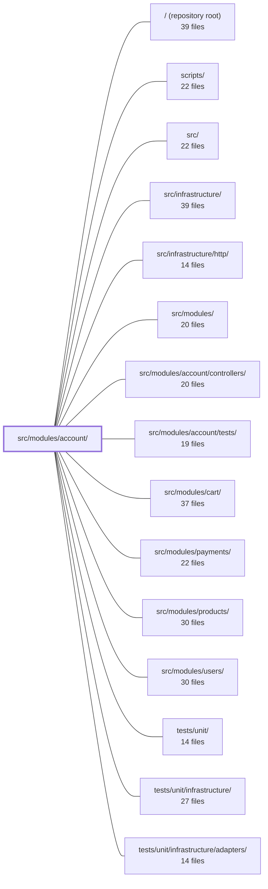

---
tags:
  - 2repo
  - 2repo/module
  - project/boilerplate-node-backend
type: module
module: src/modules/account/
files: 23
updated: 2026-08-28T11:57:59.893420+00:00
---

# src/modules/account/

## Purpose

The account module owns everything a user does to manage their own identity and preferences: sign-up, login, token lifecycle, profile read/update/delete, email verification, and the per-user shipping-address book. It is the "who are you and what do you own" domain, deliberately separate from the users module (which stores the credential record) and from cart/payments (which consume the resolved shipping address).

## Key parts

- **Module wiring** — `module.ts` registers the token→user auth resolver at import time, declares the `/account` route group and its dependency on `users`, and subscribes to `USER_DELETED` for address-book cleanup. `routes.ts` maps every endpoint to a controller handler with shared/per-route middleware (auth, rate-limit, cache-bust, upload). `index.ts` is the single cross-module barrel; it exposes only the checkout address-resolver and one supporting type—everything else is internal.
- **Services** (`services/`) — the business-logic layer. `authentication.ts` handles token lifecycle (issue, revoke, refresh) and high-level flows (signup, reset, deletion, logout). `profile.ts` covers self-service reads/writes, password changes, and hard-delete. `addresses.ts` implements the address-book CRUD with the "exactly one default" invariant and the checkout resolver. `tokens.ts` centralises the "token is live" check and the find/spend pair for non-password tokens. `verification.ts` is the single code path for email-verification issuance and consumption. `token-cleanup.ts` provides the expired-token sweep. `index.ts` aggregates all six into one `accountService` namespace.
- **Session layer** (`session/`) — `jwt.ts` signs/verifies access and refresh tokens (refresh tokens are persisted on the user doc for revocation). `cookies.ts` wraps the two auth cookies. `config.ts` reads the deployment's expiry/secret values so the other two files don't hard-code them.
- **Data layer** — `model.ts` defines the Mongoose address-book schema (one doc per user, array of entries). `repository.ts` is the read-modify-write data-access layer with Mongoose optimistic versioning as the concurrency guard.
- **Observability & contracts** — `analytics.ts` and `audit.ts` register event-name vocabularies into shared type maps (no runtime coupling to infrastructure). `metrics.ts` exports Prometheus counters onto the shared registry. `openapi.yaml` is the 3.0.3 contract for every endpoint. `probes.ts` holds hand-written negative-path requests (401/403/409/429) that the contract cannot express.
- **Email** — `emails.ts` contains every email-copy builder, each returning a fully-resolved `EmailContent` object so the downstream worker needs no ambient state.
- **Demo & fixtures** — `demo.ts` seeds the address-book collection; `factory.ts` converts the wire `Address` shape into the Mongoose subdocument shape with pinned `_id`s for reproducible exports.

## How it connects

- **`src/modules/users/`** — The module manifest declares a hard dependency on `users`. User documents hold credentials, the `verified` flag, refresh-token storage, and the account record that `profile.ts` reads/writes. `USER_DELETED` from users triggers address-book cleanup here.
- **`src/modules/cart/`** — Cart checkout calls the single public function exported through `index.ts` to resolve a shipping address at order-confirmation time. This is the only cross-module surface this module exposes.
- **`src/infrastructure/`** — Analytics events, audit-action strings, and Prometheus counters are registered into shared type maps and the global metrics registry so the infrastructure layer (logging, `/metrics` scrape, analytics pipeline) recognises them without importing account code.
- **`src/infrastructure/http/`** — Provides the Express app, shared middleware (auth guard, rate-limiter), and the cookie/header plumbing that `routes.ts` and `session/cookies.ts` build on.
- **`src/modules/account/controllers/`** — Sibling directory holding the thin HTTP handlers that `routes.ts` wires up; they delegate immediately to the services layer.
- **`src/modules/account/tests/`** — Integration/E2E tests that exercise the full route→controller→service→repository chain for this module.
- **`scripts/`** — `export-demo-dataset.ts` imports `factory.ts` / `demo.ts` to produce a stable fixture bundle for seeding or CI.
- **`tests/unit/`** — Unit tests (including under `tests/unit/infrastructure/adapters/`) that call individual service functions in isolation.

## Where to start

1. **`module.ts`** — Reading this first gives you the module's shape in one file: what it depends on, which routes it owns, what event it subscribes to, and how the auth resolver is installed. It is the table of contents.
2. **`services/authentication.ts`** — The largest and most central service; understanding the signup → token-issuance → refresh → revoke flow here makes the rest of the services (tokens, verification, profile) fall into place as specialisations of the same lifecycle.

## Connected modules

[[boilerplate-node-backend_ROOT|/ (repository root)]] · [[boilerplate-node-backend_scripts|scripts/]] · [[boilerplate-node-backend_src|src/]] · [[boilerplate-node-backend_src_infrastructure|src/infrastructure/]] · [[boilerplate-node-backend_src_infrastructure_http|src/infrastructure/http/]] · [[boilerplate-node-backend_src_modules|src/modules/]] · [[boilerplate-node-backend_src_modules_account_controllers|src/modules/account/controllers/]] · [[boilerplate-node-backend_src_modules_account_tests|src/modules/account/tests/]] · [[boilerplate-node-backend_src_modules_cart|src/modules/cart/]] · [[boilerplate-node-backend_src_modules_payments|src/modules/payments/]] · [[boilerplate-node-backend_src_modules_products|src/modules/products/]] · [[boilerplate-node-backend_src_modules_users|src/modules/users/]] · [[boilerplate-node-backend_tests_unit|tests/unit/]] · [[boilerplate-node-backend_tests_unit_infrastructure|tests/unit/infrastructure/]] · [[boilerplate-node-backend_tests_unit_infrastructure_adapters|tests/unit/infrastructure/adapters/]]

## Files
- `src/modules/account/analytics.ts` — Declares the analytics event names owned by the account domain and registers them in the shared `AnalyticsEventMap` type via a module augmentation. This keeps the event catalogue distributed across the modules that emit each event, so `infrastructure` never needs to know about any specific domain.
- `src/modules/account/audit.ts` — Declares the vocabulary of audit-action strings emitted by the account domain and registers them (type-only) into the shared `AuditActionMap` so the observability layer recognizes them without a runtime import or a central enumeration file.
- `src/modules/account/demo.ts` — Defines the demo dataset for the address-book collection and the seed/export functions the persistence layer calls to populate and read back those fixtures. Without this file the seeder skips the collection entirely (a module that declares no `seeds` is silently omitted), leaving `/account/addresses` empty and the checkout address step with nothing to select.
- `src/modules/account/emails.ts` — Contains every email-copy builder for the account module. Each builder resolves all translated strings, interpolated values, and links into a finished `EmailContent` object at call time, so the downstream email worker can render the template with nothing but the payload—no request, no locale store, no ambient state.
- `src/modules/account/factory.ts` — Factory for building address-book fixtures used in demo data and tests. It converts the wire-contract `Address` shape into the Mongoose subdocument shape and pins `_id` values (on both the book and its entries) so that `scripts/export-demo-dataset.ts` produces stable, reproducible output across runs.
- `src/modules/account/index.ts` — Public barrel (single cross-module entry point) for the `account` module. It exposes exactly one cross-module capability—resolving a shipping address for checkout—and one supporting type. Everything else the module does (token issuance, session management, address CRUD) stays internal and is unreachable by sibling modules through this file.
- `src/modules/account/metrics.ts` — Defines and exports Prometheus counters for the auth/account domain. These are registered on the shared `metricsRegistry` so a single `/metrics` scrape includes them alongside HTTP metrics. They exist as cheap, always-on aggregates suitable for alerting (e.g., "signup failure ratio above 20% for 5 min")—a use case distinct from audit logs or analytics pipelines.
- `src/modules/account/model.ts` — Defines the Mongoose schema and model for a user's address book. One document per user (keyed by `userId`), storing an array of address entries. It exists so the `account` module owns a collection in its own right, and so address mutations touch one small document rather than the whole account record.
- `src/modules/account/module.ts` — Module manifest and auth-resolver registration for the `account` subdomain. At import time it installs the token→user resolver the kernel uses on every request, and at boot time (via the `AppModule` contract) it declares the `/account` routes, its dependency on `users`, and its `USER_DELETED` subscription for address-book cleanup.
- `src/modules/account/openapi.yaml` — OpenAPI 3.0.3 contract for the account module. It defines every endpoint a user calls to manage their own identity, credentials, sessions, and address book — from profile read/update through two-step deletion, password change, session revocation, and CRUD on saved shipping addresses. Serves as the single source of truth for client codegen and server validation.
- `src/modules/account/probes.ts` — Exports a set of hand-written HTTP "probe" requests that exercise negative paths (401, 403, 409, 429) the account API's OpenAPI contract cannot declare. Because a contract only describes valid calls and their declared responses, there is no home inside it for requests whose purpose is to prove the API *rejects* something. These probes are appended to every generated client collection after the contract-derived requests.
- `src/modules/account/repository.ts` — Data-access layer for a per-user address book (Mongoose). Every write is a full READ-MODIFY-WRITE cycle because the "exactly one default" invariant spans the entire `items` array and cannot be expressed as a single atomic `$set`/`$pull`. Mongoose optimistic versioning on `save()` is the concurrency guard; a conflicting write is expected to be retried manually rather than silently lost.
- `src/modules/account/routes.ts` — Express router that wires all account and authentication endpoints (profile, login, signup, password reset, token refresh, sessions, addresses, email verification, account deletion) to their controller handlers, applying shared and per-route middleware (auth, rate-limiting, cache invalidation, upload).
- `src/modules/account/services/addresses.ts` — Service-layer functions for the account module's address book. Every mutating endpoint returns the **full** book (`{ addresses }`) rather than a single entry, because the invariant "exactly one default" is a property of the list. Also provides the address-resolution helper that cart checkout consumes.
- `src/modules/account/services/authentication.ts` — Central authentication service that manages the *lifecycle* of identity tokens (issue, revoke, refresh) and the high-level flows built on them (signup, password reset, account deletion, session logout). It deliberately excludes credential *value* operations: hashing lives in the user model's pre-save hook, token signing in `../session/jwt`, and password changes in `./profile`.
- `src/modules/account/services/index.ts` — Barrel file that aggregates every function in the account-service folder into a single `accountService` namespace and selectively re-exports a small subset by name. It exists so callers (controllers, tests, the module's `../index`) have one import target regardless of which of the six sub-files a function actually lives in.
- `src/modules/account/services/profile.ts` — Self-service account maintenance: reading, updating, and hard-deleting the caller's own profile, plus password changes (reset-link and live-session). Sits on the "maintain an identity" side of the account split; `./authentication` handles "prove an identity". Password lives here because every flow that writes one (reset link, logged-in change) is a mutation of an existing account, not a gate into it.
- `src/modules/account/services/token-cleanup.ts` — Provides two entry points for removing expired authentication tokens from user documents: a fire-and-forget pre-flight sweep invoked on every login and refresh request, and an admin-triggered cleanup that returns the removal count to the caller and emits an audit record.
- `src/modules/account/services/tokens.ts` — Centralizes the "token is live" rule (entry exists, type matches, not expired) that was previously copy-pasted across three controllers and a fourth inline check. Provides the canonical find/spend pair for non-password tokens (reset, verification, delete-confirmation, refresh) and the session-listing logic for `GET /account/sessions`, so every flow asks for the rule by name instead of re-deriving it.
- `src/modules/account/services/verification.ts` — Centralizes email-verification logic so that the three flows that trigger it (signup, email-address change, explicit re-send) share a single code path and cannot drift. It issues a token, enqueues the verification email, handles the `POST /account/verify-request` endpoint end-to-end, and writes the `verified` flag once the token is spent.
- `src/modules/account/session/config.ts` — Centralises all token-related environment settings (expiry durations and signing secrets) in one place. It holds no token and issues none — it simply reads the deployment's "how long does a session last" values so that `./jwt` can sign against them and `./cookies` can derive `maxAge` from them.
- `src/modules/account/session/cookies.ts` — Provides thin wrapper functions for setting and clearing two HTTP cookies (`jwt` and `isAuth`) used in the authentication flow. It isolates cookie manipulation from JWT signing/verification logic so that controllers can manage cookie state without embedding cookie configuration inline.
- `src/modules/account/session/jwt.ts` — Issues and verifies the application's JWTs (access and refresh tokens). Access-token verification is a pure signature check; refresh-token verification additionally confirms the token is still present on the user document. Refresh tokens are persisted to the user record at creation time, making revocation a matter of removing the stored value.

---
[[boilerplate-node-backend_INDEX|← boilerplate-node-backend index]]
