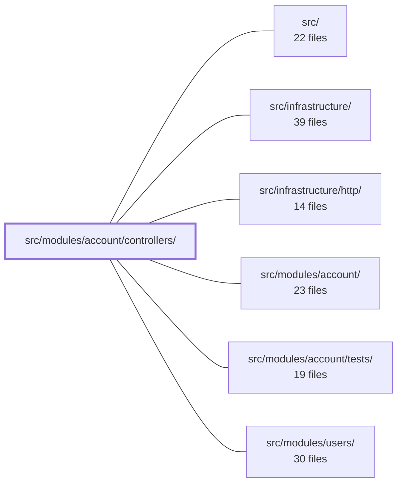

---
tags:
  - 2repo
  - 2repo/module
  - project/boilerplate-node-backend
type: module
module: src/modules/account/controllers/
files: 20
updated: 2026-08-28T11:58:13.191057+00:00
---

# src/modules/account/controllers/

## Purpose

HTTP controller layer for the account module. Every file here is a thin Express route handler that parses/validates incoming requests, delegates the actual business logic to the account service, and shapes the HTTP response (status code, headers, i18n messages). No persistence, token minting, or email dispatch happens at this level.

## Key parts

- **Auth & session lifecycle** — `post-login.ts`, `post-logout.ts`, `post-logout-everywhere.ts`, `get-refresh-token.ts`, `get-sessions.ts`, `delete-session.ts`, `delete-expired-tokens.ts`. Covers the full login → refresh → single/multi-device logout → session listing → stale-token purge flow.
- **Account CRUD** — `get-account.ts`, `put-account.ts`, `delete-account-request.ts`, `delete-account-confirm.ts`. Profile read/edit and the two-step (token-mint → token-consume) account deletion.
- **Password & email verification** — `post-password-change.ts`, `post-reset-request.ts`, `post-reset-confirm.ts`, `post-verify-request.ts`, `post-verify-confirm.ts`. Covers password change, password-reset (request + confirm), and email verification (request + confirm). All "confirm" variants are public and use a one-time token as the sole credential.
- **Signup** — `post-signup.ts`. Registration with avatar upload handling, Prometheus counter, and post-201 verification email.
- **Address book** — `get-addresses.ts`, `write-addresses.ts` (add + edit), `delete-address.ts`. Single round-trip read/mutation for the caller's address list.

## How it connects

- **`src/modules/account/`** — Parent module. Controllers import and call `accountService` (and related service helpers) for all mutations, token minting, and email dispatch. The service layer owns the database writes; controllers never touch the DB directly.
- **`src/infrastructure/http/`** — Supplies shared HTTP utilities (response envelopes, cookie helpers, i18n middleware, schema parsers) that most controllers use for request validation and response shaping.
- **`src/infrastructure/`** — Broader infrastructure (Prometheus metrics, audit/analytics emitters, mail transport) consumed by the controllers for observability side-effects (login counters, reset events).
- **`src/modules/users/`** — The admin-facing user-management routes live there. `put-account.ts` exists specifically because those `/users` write endpoints return 403 to non-admin callers; it is the only self-service profile-edit path.
- **`src/modules/account/tests/`** — Co-located tests that exercise these handlers, typically mocking the account service and infrastructure boundaries.

## Where to start

1. **`post-login.ts`** — It is the most self-contained happy-path handler: one service call, cookie setting, metric/audit emission. Reading it shows the standard controller pattern (parse → delegate → respond) that every other file follows.
2. **`delete-account-request.ts` / `delete-account-confirm.ts`** (together) — They illustrate the two-step token flow that also underpins password-reset and email-verification, and make the "controller mints nothing, service owns tokens" rule concrete.

## Connected modules

[[boilerplate-node-backend_src|src/]] · [[boilerplate-node-backend_src_infrastructure|src/infrastructure/]] · [[boilerplate-node-backend_src_infrastructure_http|src/infrastructure/http/]] · [[boilerplate-node-backend_src_modules_account|src/modules/account/]] · [[boilerplate-node-backend_src_modules_account_tests|src/modules/account/tests/]] · [[boilerplate-node-backend_src_modules_users|src/modules/users/]]

## Files
- `src/modules/account/controllers/delete-account-confirm.ts` — Handler for the `DELETE /account/delete-confirm` endpoint. Validates a one-time account-deletion token, hard-deletes the account via the service layer, destroys session cookies, and returns an i18n-translated success or refusal message.
- `src/modules/account/controllers/delete-account-request.ts` — Express handler for `DELETE /account`. Accepts an authenticated user's account-deletion request and delegates to `accountService.requestAccountDeletion`, which mints a one-time token and sends a confirmation email. The controller itself performs no persistence and never exposes the token.
- `src/modules/account/controllers/delete-address.ts` — Controller handler for `DELETE /account/addresses/:addressId`. Removes a single address entry from the authenticated user's address book and returns the updated book so the caller can see the current state (including any default-promotion) in one round-trip.
- `src/modules/account/controllers/delete-expired-tokens.ts` — Express controller handler for `DELETE /account/tokens/expired`. Performs an admin-only bulk purge of expired tokens (primarily stale refresh tokens) and returns the shared `Success` response. Exists so a scheduler or operator can invoke periodic cleanup of the token store.
- `src/modules/account/controllers/delete-session.ts` — Controller for `DELETE /account/sessions/:sessionId` — revokes a single refresh-token session belonging to the authenticated caller ("log out that device"). It exists to let a user terminate any of their own sessions from the account management UI without affecting the current cookie-based session.
- `src/modules/account/controllers/get-account.ts` — Controller for `GET /account`. Returns the authenticated user's full profile by querying the database, rather than echoing the JWT claims. This exists because the token only carries `id`/`email`/`username`/`admin`, while the API contract's `User` type also requires `verified` and `locale` fields that the frontend's verify-banner and saved-language features depend on.
- `src/modules/account/controllers/get-addresses.ts` — GET controller for `/account/addresses`. Returns the authenticated caller's full address book in a single response. It also serves as the canonical post-mutation view shared by the write and delete address controllers, so clients never need a follow-up read after a change.
- `src/modules/account/controllers/get-refresh-token.ts` — Express route handler for `GET /account/refresh`. It reads a refresh token from the `jwt` HttpOnly cookie, optionally triggers a collection-wide token-cleanup sweep, then exchanges the token for a new short-lived access token via `accountService.refreshAccessToken`. It exists so authenticated clients can rotate their access token without a full re-login.
- `src/modules/account/controllers/get-sessions.ts` — Request handler for `GET /account/sessions`. It extracts the authenticated user's ID and the current `jwt` cookie, delegates to the account service to list live refresh tokens as sessions, and shapes the HTTP response. It exists as the thin controller layer that translates HTTP I/O into a service call.
- `src/modules/account/controllers/post-login.ts` — Controller handler for `POST /account/login`. Authenticates the user's credentials, issues a long-lived refresh cookie and a short-lived access token, and records login observability (metric, audit log, analytics event) for both success and failure paths.
- `src/modules/account/controllers/post-logout-everywhere.ts` — Express controller handler for `POST /account/logout-all`. It performs a full multi-device logout: removes every refresh token for the authenticated user from the database, then clears the session and refresh cookies on the response.
- `src/modules/account/controllers/post-logout.ts` — Handler for `POST /account/logout`. Destroys the **current** session only (identified by its refresh cookie) while leaving sessions on other devices untouched. Treats "not logged in" as success rather than an error, so it always returns 200.
- `src/modules/account/controllers/post-password-change.ts` — Controller for `POST /account/password`. Changes the authenticated user's password by requiring the current password as proof of credential possession — no email token or round-trip. Delegates the actual mutation to the account service and reports the outcome via i18n'd HTTP responses and a Prometheus counter.
- `src/modules/account/controllers/post-reset-confirm.ts` — Controller for `POST /account/reset-confirm`. Validates a one-time password-reset token (delivered via email link), verifies the new-password pair, atomically consumes the token, updates the account's password, and destroys all active session cookies so the user must re-authenticate with the new credentials.
- `src/modules/account/controllers/post-reset-request.ts` — Handler for `POST /account/reset-request`. Accepts an email address, delegates token minting and mail publication to the account service, and returns a single indistinguishable 200 response regardless of whether the account exists — the explicit anti-enumeration design of this endpoint.
- `src/modules/account/controllers/post-signup.ts` — The sole controller for `POST /account/signup`. It accepts a JSON or multipart (file-upload) signup body, delegates registration to `accountService.signup`, handles avatar image cleanup on failure, emits a Prometheus counter, and fires a verification email after a successful 201.
- `src/modules/account/controllers/post-verify-confirm.ts` — Handler for `POST /account/verify-confirm`. It validates a one-time email-verification token from the request body, atomically spends it, and marks the account's email as verified. The endpoint is intentionally public (no session auth) because the token in the body *is* the credential — the visitor following the emailed link is not logged in.
- `src/modules/account/controllers/post-verify-request.ts` — Handler for `POST /account/verify-request`. Re-sends the email-verification link to the already-authenticated user (use case: the original signup email never arrived). Stateless with respect to *whether* verification is allowed — that decision is delegated entirely to the account service.
- `src/modules/account/controllers/put-account.ts` — Handler for `PUT /account` — the self-service endpoint that lets an authenticated user edit their own profile (email, username, locale, avatar image). It exists because admin-only `/users` write routes return 403 to regular users, so this is the sole path for non-admin profile updates.
- `src/modules/account/controllers/write-addresses.ts` — Holds the two address-book mutation handlers — add and edit — in one file because they share an identical three-step shape (schema-parse body → call one service method → branch on `result.success`). The read and delete handlers live elsewhere because they skip the body-parsing step and therefore don't share this shape.

---
[[boilerplate-node-backend_INDEX|← boilerplate-node-backend index]]
