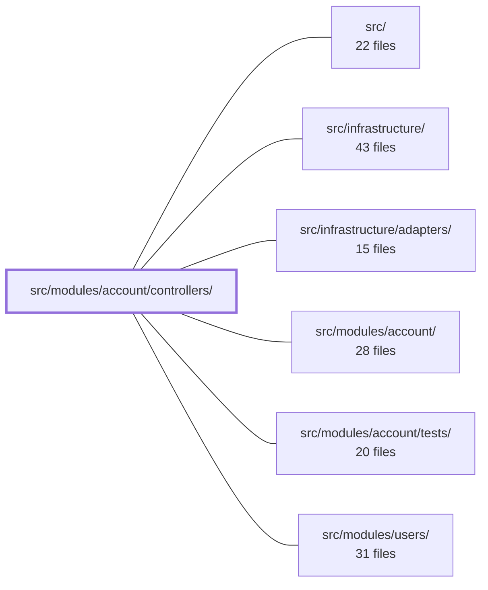

---
tags:
  - 2repo
  - 2repo/module
  - project/boilerplate-node-backend
type: module
module: src/modules/account/controllers/
files: 26
updated: 2026-09-02T18:32:42.530022+00:00
---

# src/modules/account/controllers/

## Purpose

The HTTP controller layer for the account domain. Every file here is a thin Express adapter: it extracts auth context, validates/parses the incoming request, delegates the actual business logic to `accountService`, and shapes the response (status codes, i18n strings, cookies). No rules, queries, or token semantics live in this directory—only transport concerns, cross-cutting side-effects (metrics, upload cleanup, audit logs), and the glue that keeps the route layer declarative.

## Key parts

- **Authentication & session lifecycle** — `post-login`, `post-login-2fa`, `get-refresh-token`, `post-logout`, `post-logout-everywhere`, `post-reauth`. Covers the full login → 2FA challenge → token issuance → refresh-rotation → logout cycle, plus the `REAUTH_REQUIRED` re-verification path.
- **Two-factor auth (post-login)** — `post-2fa-setup`, `post-2fa-confirm`, `delete-2fa`. Enables, confirms, and disables 2FA; each step requires a one-time code or backup code as proof-of-knowledge.
- **Password management** — `post-reset-request`, `post-reset-confirm`, `post-password-change`. The request/confirm pair uses a one-time email token; the change endpoint re-mints the active session so the user stays signed in.
- **Account lifecycle & profile** — `post-signup`, `get-account`, `put-account`, `post-verify-request`, `post-verify-confirm`, `post-account-export`, `delete-account-request`, `delete-account-confirm`. Creation, read, self-service update, email verification, data export, and the two-step hard-delete flow.
- **Address book** — `get-addresses`, `write-addresses`, `delete-address`. CRUD for shipping addresses; the write file handles both add and edit because they share the same parse → delegate → branch shape.
- **Session inspection & admin cleanup** — `get-sessions`, `delete-session`, `delete-expired-tokens`. Read/list active sessions, revoke a specific one, and a bulk expired-token sweep.

## How it connects

- **`src/modules/account/`** (parent) — The `accountService` that every controller delegates to, along with domain models and token utilities, lives in the sibling `services/` and `domain/` areas of the same module. Controllers never import each other; they all fan out to that service.
- **`src/infrastructure/` / `src/infrastructure/adapters/`** — The Express route definitions and shared middleware (`requireFreshAuth`, route guards, cookie parsing) that *call* into these controllers. Controllers depend on that layer for auth context but not vice-versa.
- **`src/modules/account/tests/`** — Unit and integration tests that exercise these controllers directly (or through the route layer), verifying response shapes, status codes, and the side-effects each controller owns.
- **`src/modules/users/`** — The admin-facing user-management module. `put-account` exists as the self-service counterpart to the admin-gated `/users` write routes; the two share the same service but differ in authorization scope.
- **`src/`** (root) — App bootstrap and top-level route registration where the account router (and thus these controllers) is mounted.

## Where to start

1. **`post-login.ts`** — The most feature-rich controller in the directory. It shows the full pattern in one file: body validation, pre-login token cleanup, delegation to the service, 2FA-challenge branching, session minting, and success/failure metric emission.
2. **`get-account.ts`** — The simplest controller (validate → delegate → shape response). Reading it alongside `post-login` makes the "thin adapter" contract and the boundaries with the service layer immediately clear.

## Connected modules

[[boilerplate-node-backend_src|src/]] · [[boilerplate-node-backend_src_infrastructure|src/infrastructure/]] · [[boilerplate-node-backend_src_infrastructure_adapters|src/infrastructure/adapters/]] · [[boilerplate-node-backend_src_modules_account|src/modules/account/]] · [[boilerplate-node-backend_src_modules_account_tests|src/modules/account/tests/]] · [[boilerplate-node-backend_src_modules_users|src/modules/users/]]

## Files
- `src/modules/account/controllers/delete-2fa.ts` — HTTP controller for `DELETE /account/2fa`. It validates the request body (a one-time code or backup code), then delegates to `accountService.disableTwoFactor`. The route guard handles session auth; this controller enforces the additional proof-of-knowledge requirement so a stolen-but-fresh session cannot simply disable 2FA.
- `src/modules/account/controllers/delete-account-confirm.ts` — Handler for `DELETE /account/delete-confirm`. Validates a one-time account-deletion token, spends it atomically, then delegates the hard-delete to the account service. It is the final step in the "confirm deletion" flow (the earlier step only issues the token/link).
- `src/modules/account/controllers/delete-account-request.ts` — Controller handler for `DELETE /account`. Accepts an authenticated user's deletion request, looks up the user by email, and delegates to the account service to mint a one-time confirmation token and send it via email. The token never passes through this layer.
- `src/modules/account/controllers/delete-address.ts` — Thin HTTP adapter for `DELETE /account/addresses/:addressId`. It extracts auth context and the `addressId` param, delegates to `accountService.addressRemove`, and formats the result into an Express response. It exists so the route layer stays declarative while request parsing and response shaping live here.
- `src/modules/account/controllers/delete-expired-tokens.ts` — Thin HTTP adapter for `DELETE /account/tokens/expired`. Wires the Express route to `accountService.adminTokenCleanup`, records a success metric, and formats the response — no business logic lives here.
- `src/modules/account/controllers/delete-session.ts` — Thin HTTP adapter for `DELETE /account/sessions/:sessionId`. It extracts the authenticated caller's id and the target session id from the request, delegates the actual revocation to `accountService.sessionRevoke`, and maps the result to a `200` or `404` HTTP response.
- `src/modules/account/controllers/get-account.ts` — Thin HTTP adapter for the `GET /account` endpoint. It validates the auth context, delegates the actual data fetch to `accountService.getOwnProfile`, and shapes the result into a standard success/reject response. It exists so the route layer stays declarative while the service layer stays transport-agnostic.
- `src/modules/account/controllers/get-addresses.ts` — Thin HTTP adapter for `GET /account/addresses`. It extracts the authenticated user's ID from the request and delegates to `accountService.addressesGet`, returning the caller's full address book. It exists as the read endpoint that write/delete controllers reuse as their "result" shape so clients never need a follow-up read.
- `src/modules/account/controllers/get-refresh-token.ts` — Thin HTTP adapter for `GET /account/refresh`. It reads the refresh token from the `jwt` cookie, optionally runs a collection-wide expired-token sweep, then calls `accountService.refreshAccessToken` to mint a new short-lived access token **and** rotate the refresh cookie in the same response. Cookie-only by design—no token ever appears in the URL, query string, or `Referer` header.
- `src/modules/account/controllers/get-sessions.ts` — Thin Express controller for `GET /account/sessions`. It extracts the authenticated user ID and the current refresh-token cookie, then delegates to `accountService.sessionsList` to return the caller's live refresh tokens as a session list. All token semantics (which types count as a session, hiding raw token values, marking the current session) live in the service layer.
- `src/modules/account/controllers/post-2fa-confirm.ts` — Thin HTTP adapter for `POST /account/2fa/confirm`. It validates the request body, delegates to `accountService.confirmTwoFactor`, and shapes the response. No business logic lives here.
- `src/modules/account/controllers/post-2fa-setup.ts` — Thin HTTP controller for `POST /account/2fa/setup`. It extracts the authenticated user's id, delegates to `accountService.setupTwoFactor`, and maps the service result (or error) onto an HTTP response. It contains no business logic of its own.
- `src/modules/account/controllers/post-account-export.ts` — Thin HTTP adapter that handles `POST /account/export`, delegating all logic to `accountService.exportOwnData`. It exists to bridge the Express request/response cycle to the account service, performing no business logic or authorization checks of its own — `requireFreshAuth` (mounted upstream in the route) is the sole identity gate.
- `src/modules/account/controllers/post-login-2fa.ts` — Controller for `POST /account/login/2fa`, the second step of two-factor authentication. It validates the request body, verifies the login challenge and OTP code against `accountService`, then issues a session with `amr: ['pwd', 'otp']`. It exists so that a login that was interrupted by `mfaRequired: true` can be completed in a single round-trip.
- `src/modules/account/controllers/post-login.ts` — Controller for `POST /account/login`. Receives credentials, validates the optional `remember` tier, runs a pre-login token cleanup, delegates the credential check to the account service, and on success mints a session (refresh cookie + short-lived access token) or returns a 2FA challenge. Success/failure metrics, audit, and analytics are emitted here in the controller rather than in the service.
- `src/modules/account/controllers/post-logout-everywhere.ts` — Thin HTTP adapter for `POST /account/logout-all`. It delegates the actual token invalidation to `accountService.tokenRemoveAll`, then clears the session cookies on the response. No business logic lives here.
- `src/modules/account/controllers/post-logout.ts` — HTTP controller for `POST /account/logout`. It acts as a thin adapter that reads the refresh token from the request cookie, delegates to `accountService.logoutCurrentSession`, clears the session cookies, and returns a localized success message. It exists to keep the route layer free of business logic while providing a single, predictable logout endpoint.
- `src/modules/account/controllers/post-password-change.ts` — HTTP controller for `POST /account/password`. It validates the incoming body, delegates to `accountService.passwordChangeWithCurrent` to verify the current password and set a new one, then re-mints the caller's session token so the user stays signed in. It exists as a thin Express adapter separating HTTP concerns (validation shape, status codes, i18n strings, metrics) from the business logic in the service layer.
- `src/modules/account/controllers/post-reauth.ts` — Thin HTTP adapter for `POST /account/reauth`. Resolves a `401 REAUTH_REQUIRED` challenge (issued by `requireFreshAuth`) by re-verifying the caller's password and re-minting the existing session with a fresh `auth_time`—without terminating it.
- `src/modules/account/controllers/post-reset-confirm.ts` — Handles `POST /account/reset-confirm`: validates a one-time password-reset token (delivered via email link), verifies the new password pair, atomically spends the token, sets the new password, and invalidates all active sessions.
- `src/modules/account/controllers/post-reset-request.ts` — Thin HTTP adapter for `POST /account/reset-request`. It validates the request body, delegates to `accountService.requestPasswordReset`, and returns an identical success response regardless of whether the email corresponds to a real account — the core design goal is preventing user enumeration.
- `src/modules/account/controllers/post-signup.ts` — Thin HTTP adapter for `POST /account/signup`. It extracts form fields and the uploaded-image payload from the Express request, delegates to `accountService.signup`, and owns the cross-cutting concerns that must run on **both** the success and failure paths: uploaded-image cleanup, metrics increment, and the fire-and-forget verification email.
- `src/modules/account/controllers/post-verify-confirm.ts` — Handles `POST /account/verify-confirm`: validates a one-time email-verification token in the request body, atomically spends it, and marks the account's email as verified. It is deliberately public (no auth middleware) because the token itself is the credential, mirroring the pattern used by `reset-confirm` and `delete-confirm`.
- `src/modules/account/controllers/post-verify-request.ts` — Thin HTTP adapter for `POST /account/verify-request`. It re-sends the email verification link for a user whose original signup email never arrived. All business logic (including which account states are eligible for re-verification) lives in the service layer; this file only extracts auth context, delegates, and shapes the HTTP response.
- `src/modules/account/controllers/put-account.ts` — HTTP handler for `PUT /account`: lets an authenticated user update their own profile (email, username, locale, image, phone, website). It is a thin adapter over `accountService.updateProfile`, plus two side-effects that accompany a self-service edit — uploaded-image cleanup on failure and a re-verification email when the address changes. It exists as a separate self-service path because the `/users` write routes are admin-gated.
- `src/modules/account/controllers/write-addresses.ts` — Handles the two write operations for shipping addresses (add and edit) in a single file because they share an identical three-step shape: parse body → call the account service → branch on `result.success`. Read and delete handlers live in separate files because they do not parse a request body.

---
[[boilerplate-node-backend_INDEX|← boilerplate-node-backend index]]
