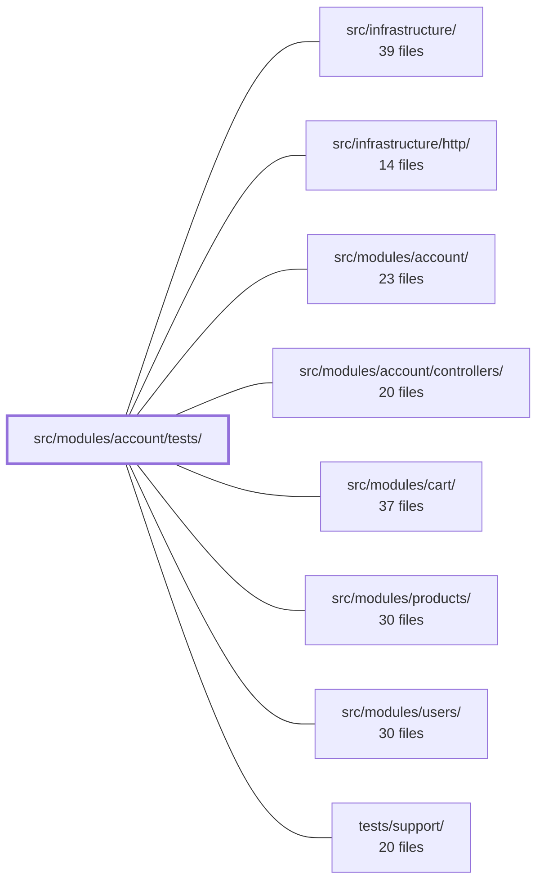

---
tags:
  - 2repo
  - 2repo/module
  - project/boilerplate-node-backend
type: module
module: src/modules/account/tests/
files: 19
updated: 2026-08-28T11:58:29.387522+00:00
---

# src/modules/account/tests/

## Purpose

Test suite for the account module. It spans three tiers—unit, integration, and contract—to pin down security invariants (JWT separation, cookie flags, route middleware, indistinguishable login failures), ordinary user flows (signup, login, token lifecycle), data-shape contracts (address book schema, audit action strings, barrel exports), and the observable outputs of background jobs and email builders. Every test that touches a user document runs against a real test database via `setupTestDb` rather than mocks.

## Key parts

- **`contract/`** – `api.contract.test.ts` exercises multi-step scenarios on the self-service `/account` endpoints (profile update, password change, single-session logout, sessions listing, email verification) that require cross-entity state a generated payload cannot express.
- **`integration/`** – Service-level tests against a live test DB:
  - `service-flows.test.ts` – happy-path flows (signup → login → tokenAdd → passwordChange → refresh).
  - `service.test.ts` – security invariants: indistinguishable login failures, soft-delete exclusion, hashing correctness.
  - `self-service.test.ts` – profile/password/session/verification invariants (no privilege escalation, cross-token-kind revocation, 422-vs-401 semantics).
  - `jwt.test.ts` – verifies the refresh path always performs its DB revocation lookup; guards against logout becoming cosmetic.
  - `addresses.test.ts` – address-book invariants (single default, cross-user 404 parity, checkout resolver three-way answer).
  - `persisted-locale.test.ts` – locale capture at signup, writability, preservation across unrelated updates, and client exposure.
- **`unit/`** – Isolated, fast tests:
  - *Session & auth:* `session-jwt.test.ts` (secret separation, `jti` uniqueness, revocation enforcement), `cookies.test.ts` (flag combinations for `jwt` / `isAuth`), `tokens.test.ts` (env-var → JWT config parsing), `token-cleanup-job.test.ts` + `token-cleanup.test.ts` (log-output contract and ordering guarantee).
  - *API boundary & routing:* `auth-surface.test.ts` (barrel re-export identity + no-bypass import scan), `routes.test.ts` (`noStore`, paired rate-limiters, public token-bearing routes).
  - *Domain data:* `schema-contract.test.ts` (addressBookSchema shape), `audit.test.ts` (audit action string wire contracts), `emails.test.ts` (template names, link URLs, i18n fields), `delete-account.test.ts` (controller arg/metric/response contracts).
  - *Fixtures:* `factory.test.ts` (`makeAddressBook` builder contract).

## How it connects

- **`src/modules/account/`** – The module under test. Tests import its barrel (`@modules/account`) and internal paths (`session/jwt`, `session/cookies`, `session/config`, `services`) to exercise specific units.
- **`src/modules/account/controllers/`** – Several unit tests (`routes.test.ts`, `token-cleanup.test.ts`, `delete-account.test.ts`) drive controller functions directly to verify middleware ordering, invocation guards, and response shapes.
- **`src/modules/users/`** – Integration tests read and write real user documents; the address-book `ref` points into the users collection.
- **`src/modules/cart/`** – `addresses.test.ts` exercises the checkout resolver's three-way answer (named id, default, or none), confirming the account side of the cart hand-off.
- **`tests/support/`** – Provides `setupTestDb` and shared fixture helpers that the integration tier depends on for a clean, isolated database per test run.
- **`src/infrastructure/http/`** – Supplies the HTTP test harness (request/response helpers) used by the contract and integration tiers to hit routes without a live server.

## Where to start

1. **`integration/service-flows.test.ts`** – Shows the canonical signup → login → token → refresh path end-to-end against a real DB, so you understand the data model and service API before reading the narrower invariant tests.
2. **`unit/auth-surface.test.ts`** – Pins exactly what the account module exports and what may import from where, giving you the module's public boundary in one file.

## Connected modules

[[boilerplate-node-backend_src_infrastructure|src/infrastructure/]] · [[boilerplate-node-backend_src_infrastructure_http|src/infrastructure/http/]] · [[boilerplate-node-backend_src_modules_account|src/modules/account/]] · [[boilerplate-node-backend_src_modules_account_controllers|src/modules/account/controllers/]] · [[boilerplate-node-backend_src_modules_cart|src/modules/cart/]] · [[boilerplate-node-backend_src_modules_products|src/modules/products/]] · [[boilerplate-node-backend_src_modules_users|src/modules/users/]] · [[boilerplate-node-backend_tests_support|tests/support/]]

## Files
- `src/modules/account/tests/contract/api.contract.test.ts` — Scenario-level contract tests for the self-service `/account` surface (profile update, password change, single-session logout, sessions listing, email verification). These endpoints require state that a generated payload cannot express—another account holding an email, a revoked cookie, a spent token, a session owned by someone else—so they are tested here as multi-step scenarios rather than in the auto-derived request sweep.
- `src/modules/account/tests/integration/addresses.test.ts` — Integration tests for the user address book. Validates three invariants end-to-end: (1) a non-empty book always has exactly one default, (2) one user's entries are invisible to another (404 parity with a nonexistent id), and (3) the checkout resolver's three-way answer (named id, default, or no address at all).
- `src/modules/account/tests/integration/jwt.test.ts` — Integration tests for the four JWT functions exported by `@modules/account/session/jwt`. They verify the security-critical split between stateless access tokens (signature + expiry only) and stateful refresh tokens (signature **and** a database revocation lookup against the user document). Several tests exist specifically to guard against the refresh path silently dropping its DB lookup, which would make logout cosmetic and let stolen refresh tokens live out their full TTL.
- `src/modules/account/tests/integration/persisted-locale.test.ts` — Integration tests that verify the `locale` field on the user document is (a) captured from the incoming request at signup, (b) writable afterwards via the users service, (c) preserved by unrelated updates, and (d) exposed to the client. The field exists so that stateless background workers (e.g., sending email at 3 a.m.) have a request-independent language source, which `Accept-Language` alone cannot provide.
- `src/modules/account/tests/integration/self-service.test.ts` — Integration tests for the self-service account surface — profile update, authenticated password change, session/token revocation, and email verification — exercised at the service and repository layer against a real test database. Tests are grouped by the security invariant each defends (e.g. no privilege escalation, no cross-token-kind revocation, 422-vs-401 semantics) rather than by individual function.
- `src/modules/account/tests/integration/service-flows.test.ts` — Integration tests for the "ordinary path" flows of the account service: signup, login, tokenAdd, passwordChange, and refreshAccessToken. It is the complement to the sibling `service.test.ts` (which covers security invariants like indistinguishable login failures and soft-delete rejection). Every test drives a real database via `setupTestDb` because the service decisions are made against stored user documents, not mocked ones.
- `src/modules/account/tests/integration/service.test.ts` — Integration tests for `accountService` (the signup, login, password-change, and token-removal service). The tests are organised around security invariants rather than API surface: indistinguishable login failures, soft-delete exclusion, and password hashing. They exist because the controller suites only exercise happy paths and leave these branches at ~53 % mutation coverage.
- `src/modules/account/tests/unit/audit.test.ts` — Pins the exact string values of the account module's audit actions, because those strings are wire contracts consumed by external log queries, dashboards, and alert rules that live outside this repo. Deleting this file does not break the build or the cross-cutting shape test; it silently leaves the values unasserted.
- `src/modules/account/tests/unit/auth-surface.test.ts` — Guards the account module's public API boundary in two ways: (1) asserts that the barrel (`@modules/account`) re-exports exactly the declared names from `@modules/account/services` with object identity (not mere existence), and (2) scans the entire source tree to confirm no file outside `src/modules/account/` imports an internal path (e.g. `@modules/account/session/jwt`) that bypasses the barrel.
- `src/modules/account/tests/unit/cookies.test.ts` — Unit tests for the four cookie functions exported by `src/modules/account/session/cookies.ts`. They verify that the `jwt` refresh-token cookie and the `isAuth` UI-hint cookie are set and cleared with the correct flag combination (httpOnly, secure, sameSite, path, maxAge), because a single wrong flag turns an XSS bug into an account takeover or a logout into a no-op.
- `src/modules/account/tests/unit/delete-account.test.ts` — Unit tests for the two account-deletion controllers (`deleteAccountRequest` and `deleteAccountConfirm`). Verifies that each controller calls the correct service wrapper with the expected arguments, emits the right metric, and returns the appropriate HTTP response for success, "not found / not live," and service-error paths.
- `src/modules/account/tests/unit/emails.test.ts` — Unit tests for the six account email builder functions. They exist because the integration tier only asserts that mail was *sent*, not what it contained, leaving template names, link URLs, i18n interpolation, and structural fields unguarded at a lower cost. This file pins every field to a concrete expected value.
- `src/modules/account/tests/unit/factory.test.ts` — Unit tests for the `makeAddressBook` fixture builder, verifying that it produces Mongoose documents with correct `ObjectId` fields, proper optional-field handling, and passthrough of deliverable address fields — the contract other tests in the account module rely on.
- `src/modules/account/tests/unit/routes.test.ts` — Unit test for the account router that locks down three security-critical, type-invisible arrangements: `noStore` on every route (prevents browser/storage of a caller's own profile), paired credential rate-limiters on identity-sensitive endpoints, and deliberate public access on token-bearing routes. It exists so a refactor that silently reorders middleware, drops a limiter half, or adds `isAuth` to a reset flow is caught at the router level rather than in production.
- `src/modules/account/tests/unit/schema-contract.test.ts` — Schema-contract test for `addressBookSchema`. It pins down the top-level shape (required fields, unique index, defaults, ref, timestamps) and the per-entry sub-schema (required address fields, `_id` retention, `default: false`) so that accidental model drift or a well-intentioned "align with cart/wishlist" cleanup is caught at test time.
- `src/modules/account/tests/unit/session-jwt.test.ts` — Unit-level tests for the JWT token layer in `account/session/jwt.ts`. While integration suites prove the flows work end-to-end, this file pins down the safety properties that fail silently: secret separation between access and refresh tokens, revocation enforcement (a token is only valid while stored), uniqueness of issued tokens via `jti`, and correct algorithm/expiry wiring. It exercises those invariants in isolation with the users module fully replaced.
- `src/modules/account/tests/unit/token-cleanup-job.test.ts` — Unit tests for the `runTokenCleanup` scheduled job and its `adminTokenCleanup` service counterpart. Rather than asserting "the repository method was called" (true in both branches), the tests assert on **log output** — which level, which message — because the log line is the job's only observable contract for an unattended process. The two branches (resolve vs. reject from `tokenRemoveExpired`) are pinned as mutually exclusive: exactly one of "completed at info" or "failure at error" may appear.
- `src/modules/account/tests/unit/token-cleanup.test.ts` — Unit test suite that verifies `runTokenCleanup` is invoked **before** the authentication step in both the login and refresh-token controllers. It does not test the cleanup logic itself or the authentication outcome — only the ordering guarantee and one early-exit case.
- `src/modules/account/tests/unit/tokens.test.ts` — Unit tests for the token-configuration helpers in `@modules/account/session/config`. The module under test is pure env-var parsing whose output directly controls JWT lifetimes and signing secrets, so the tests pin the documented contract (per-tier variable mapping, fallbacks, and numeric coercion) rather than re-deriving behavior from the implementation.

---
[[boilerplate-node-backend_INDEX|← boilerplate-node-backend index]]
