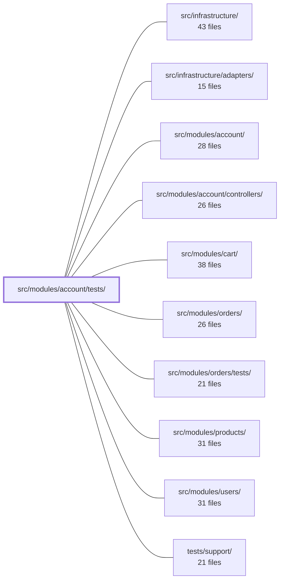

---
tags:
  - 2repo
  - 2repo/module
  - project/boilerplate-node-backend
type: module
module: src/modules/account/tests/
files: 20
updated: 2026-09-02T18:32:57.039908+00:00
---

# src/modules/account/tests/

## Purpose

The complete test suite for the account module, organised into three tiers—contract, integration, and unit—that collectively pin the security invariants, behavioural contracts, and wire-level shapes the module must maintain. Every test targets a specific, named invariant (e.g. "indistinguishable login failures," "single-default address," "secret separation between access and refresh tokens") rather than merely checking happy paths, so that a regression in a cross-cutting rule fails the build even when every functional test still passes.

## Key parts

- **Contract** (`contract/api.contract.test.ts`) — Exercises state-dependent API branches (revoked cookies, spent tokens, foreign sessions) and validates every response through `toSatisfyApiSpec()` against the OpenAPI document.
- **Integration** (`integration/`) — Real-database tests split by concern:
  - `service.test.ts` / `service-flows.test.ts` — Security invariants vs. happy-path and argument-rejection flows for signup, login, token, and password operations.
  - `self-service.test.ts` — Service/repository-level invariants for profile, password, session, and logout mutations.
  - `jwt.test.ts` — Full round-trip of the four `session/jwt.ts` functions against a live DB, covering revocation, multi-device, and tamper resistance.
  - `addresses.test.ts` — Single-default invariant, ownership isolation, and checkout resolver behaviour.
  - `persisted-locale.test.ts` — Locale capture at signup and its availability to background workers.
- **Unit** (`unit/`) — Isolated, fast tests for each leaf concern:
  - *Token & crypto layer*: `session-jwt.test.ts`, `tokens.test.ts`, `two-factor.test.ts`, `cookies.test.ts`.
  - *Controller wiring & routing*: `routes.test.ts` (middleware chains, rate-limit budgets, cache headers), `delete-account.test.ts`, `token-cleanup.test.ts`.
  - *Service-side jobs & audit*: `token-cleanup-job.test.ts`, `audit.test.ts`.
  - *Schema & barrel integrity*: `schema-contract.test.ts`, `auth-surface.test.ts`, `fixtures.test.ts`.
  - *Email builders*: `emails.test.ts` (template, link, and copy assertions).

## How it connects

- **`src/modules/account/`** — The subject under test. Every file here imports (or mocks) modules from this directory; the tests exist to lock down its public behaviour.
- **`src/modules/account/controllers/`** — Several unit files (`delete-account.test.ts`, `token-cleanup.test.ts`) call controller functions directly with fully-mocked collaborators to verify wiring-level invariants.
- **`src/modules/users/`** — Referenced by the JWT/session layer; `unit/session-jwt.test.ts` replaces this dependency with a module-level `jest.mock` to isolate the token crypto from user-store side-effects.
- **`src/infrastructure/` / `src/infrastructure/adapters/`** — Provide the test database (`setupTestDb`), observability ports, and mail transports that integration tests drive and unit tests mock.
- **`tests/support/`** — Shared helpers (e.g. `toSatisfyApiSpec`, `setupTestDb`, fixture builders) consumed across all three tiers.
- **`src/modules/orders/`** — The checkout address resolver tested in `integration/addresses.test.ts` is the boundary the orders module calls into; the test pins the contract that module depends on.

## Where to start

1. **`integration/service.test.ts`** — The most concise statement of what "correct" means for the account service. Its invariant-grouped structure (indistinguishable failures, soft-delete blocking, password hashing) will make the rest of the suite's organisational logic obvious.
2. **`unit/routes.test.ts`** — A short, readable file that shows the route table's security envelope (noStore, dual rate-limit budgets, intentional public token routes) and the "lock what TypeScript can't express" philosophy applied across the whole suite.

## Connected modules

[[boilerplate-node-backend_src_infrastructure|src/infrastructure/]] · [[boilerplate-node-backend_src_infrastructure_adapters|src/infrastructure/adapters/]] · [[boilerplate-node-backend_src_modules_account|src/modules/account/]] · [[boilerplate-node-backend_src_modules_account_controllers|src/modules/account/controllers/]] · [[boilerplate-node-backend_src_modules_cart|src/modules/cart/]] · [[boilerplate-node-backend_src_modules_orders|src/modules/orders/]] · [[boilerplate-node-backend_src_modules_orders_tests|src/modules/orders/tests/]] · [[boilerplate-node-backend_src_modules_products|src/modules/products/]] · [[boilerplate-node-backend_src_modules_users|src/modules/users/]] · [[boilerplate-node-backend_tests_support|tests/support/]]

## Files
- `src/modules/account/tests/contract/api.contract.test.ts` — Contract tests for the self-service `/account` API surface (profile update, password change, re-auth, sessions, email verification, export). Unlike unit suites that sweep generated payloads, these tests target state-dependent contract branches — a second account holding the same email, a revoked cookie, a spent token, someone else's session — that no random payload can produce. Every assertion runs `toSatisfyApiSpec()` to validate the response against the OpenAPI contract.
- `src/modules/account/tests/integration/addresses.test.ts` — Integration tests for the user address book. The file pins three behavioural contracts: the **single-default invariant** (a non-empty book always has exactly one default address, regardless of which write established it), **ownership isolation** (foreign entries are indistinguishable from nonexistent ones — 404, not 403), and the **checkout address resolver** (default fallback, explicit-ID override, and hard-fail on stale/foreign IDs with zero side-effects).
- `src/modules/account/tests/integration/jwt.test.ts` — Integration tests for the JWT session module (`session/jwt.ts`). Validates the four public functions—`createAccessToken`, `verifyAccessToken`, `createRefreshToken`, `verifyRefreshToken`—against a real database, exercising the security-critical split between stateless access tokens and stateful (DB-backed) refresh tokens, including revocation, secret separation, expiry, tamper resistance, and multi-device accumulation.
- `src/modules/account/tests/integration/persisted-locale.test.ts` — Integration tests for the `locale` field persisted on the user document. The field captures the request locale at signup so background jobs (e.g. 3 a.m. email workers) have a stable language to use when no `Accept-Language` header is available. The tests verify capture-at-signup, fallback outside a request, post-signup mutability, non-interference from unrelated updates, and visibility in the client-facing user payload.
- `src/modules/account/tests/integration/self-service.test.ts` — Integration tests for the self-service account surface — profile update, password change, session revocation, token removal, and logout — at the service/repository layer. Each `describe` block is grouped around a specific invariant the surface must defend (e.g., a profile update cannot escalate privileges; a wrong current password yields 422, never 401). Tests run against a real test database with mocked observability ports.
- `src/modules/account/tests/integration/service-flows.test.ts` — Integration tests for the `account` service's ordinary (non-security) flows: signup, login, token addition, password change, and access-token refresh. Drives a real database via `setupTestDb` to verify end-to-end behavior, including persistence side-effects. The sibling `service.test.ts` covers security invariants; this file covers the happy paths and argument-level rejections those invariants sit on.
- `src/modules/account/tests/integration/service.test.ts` — Integration test suite that pins the security invariants of the account service (signup, login, password change, bulk token removal). Tests are grouped by the invariant each defends rather than by function, so that a regression in a cross-cutting rule (indistinguishable login failures, soft-delete blocking, password-at-rest hashing) fails the build even when every happy-path test still passes.
- `src/modules/account/tests/unit/audit.test.ts` — Pins the exact string values of `accountAuditActions` (the account module's audit wire contract). Because these strings are read by external dashboards and alert rules, a silent rename or typo would break tooling with no compile-time signal. This test is the module's owner-of-truth for *which* strings appear; the cross-cutting shape test only checks structural invariants (uniqueness, lower-snake-case) and cannot assert values without naming every domain.
- `src/modules/account/tests/unit/auth-surface.test.ts` — Pins the public surface of the account barrel by verifying that every re-export resolves to the **same object** its source exports (identity, not existence) and that no undeclared names leak out. This catches a class of bug—barrel re-exporting the wrong binding—that compiles cleanly and slips past smoke tests.
- `src/modules/account/tests/unit/cookies.test.ts` — Unit tests for the four cookie helpers in `session/cookies.ts`. They pin down the security-relevant flag combinations (httpOnly, secure, sameSite, path) for both the `jwt` credential cookie and the `isAuth` frontend-hint cookie, and verify that the "destroy" variants emit flag sets that will actually cause the browser to drop the cookie on logout.
- `src/modules/account/tests/unit/delete-account.test.ts` — Unit tests for the two-step account-deletion controllers (`deleteAccountRequest` and `deleteAccountConfirm`) at the wiring level. The primary invariant pinned here is **enumeration prevention**: an unknown email must produce the same 200 as a known one, and a spent token must produce the same 422 as a never-live token, so neither response leaks which case occurred. All collaborators are fully mocked; mail-content assertions live in `emails.test.ts` and `self-service.test.ts`.
- `src/modules/account/tests/unit/emails.test.ts` — Unit tests for the six account email builders (four link-delivery, two action-confirmation). The tests assert the *built output*—template name, link URL, interpolated copy—because the builders fail silently (a wrong template or link doesn't throw), making content-level assertions the only safety net.
- `src/modules/account/tests/unit/fixtures.test.ts` — Unit tests for the `makeAddressBook` fixture builder, verifying that it produces correctly shaped address-book documents (real Mongoose `ObjectId`s for the owner and every entry, pass-through of deliverable fields, and proper handling of optional fields) so that integration tests seeding this fixture behave identically to live Mongoose documents.
- `src/modules/account/tests/unit/routes.test.ts` — Validates the account route table's middleware chains, authorization guards, rate-limit budgets, and cache behavior. It exists to lock down three properties that TypeScript cannot express: every route is `noStore`, credential routes carry *both* rate-limit budgets, and token-bearing routes are intentionally public. A single ordering or omission regression here is an account-takeover vector.
- `src/modules/account/tests/unit/schema-contract.test.ts` — Unit test that pins the Mongoose schema contract for `addressBookSchema`. It asserts the top-level document shape (required fields, unique index, defaults, ref, timestamps) and the `items` sub-schema (required address fields, `_id` presence, `default` field default), so that any refactor that silently changes the contract is caught immediately.
- `src/modules/account/tests/unit/session-jwt.test.ts` — Unit-level security-property tests for the token layer (`src/modules/account/session/jwt.ts`). Asserts the invariants that keep JWTs safe: the access and refresh secrets never cross-verify, a refresh token is only valid while its record is still stored, `jti: randomUUID()` prevents same-second mutual revocation, and HS256 is pinned at signing time. The `@modules/users` dependency is **replaced** (module-level `jest.mock`) rather than driven with real data.
- `src/modules/account/tests/unit/token-cleanup-job.test.ts` — Unit tests for `runTokenCleanup` (the scheduled, unattended job) and `adminTokenCleanup` (its admin-triggered, audited counterpart). Because the job's only observable output is its log line, every test asserts on `logger` calls rather than (or in addition to) repository invocations, and explicitly pins the success and failure branches as mutually exclusive.
- `src/modules/account/tests/unit/token-cleanup.test.ts` — Unit tests that verify the `runTokenCleanup` pre-flight sweep is invoked at the correct point in the `postLogin` and `getRefreshToken` controller flows: before credential checks, and **not** at all when a refresh request arrives with no cookie (since the request cannot succeed and a full-table sweep would be wasted).
- `src/modules/account/tests/unit/tokens.test.ts` — Unit tests for the token-configuration module (`session/config.ts`). Validates that each JWT tier (short/medium/long refresh, access) reads its own dedicated environment variable, that unset or empty variables resolve to `0` (seconds) or `''` (secrets) rather than `NaN`/`undefined`, and that the access-token and refresh-token paths never cross-contaminate.
- `src/modules/account/tests/unit/two-factor.test.ts` — Unit test suite for the pure-crypto two-factor module (`two-factor.ts`). Exercises TOTP secret encryption round-trips, otpauth URI construction, TOTP code verification against a fixed clock (never wall time), and backup-code generation/hashing. Exists to guarantee the crypto layer's correctness and security invariants without any database or network dependency.

---
[[boilerplate-node-backend_INDEX|← boilerplate-node-backend index]]
