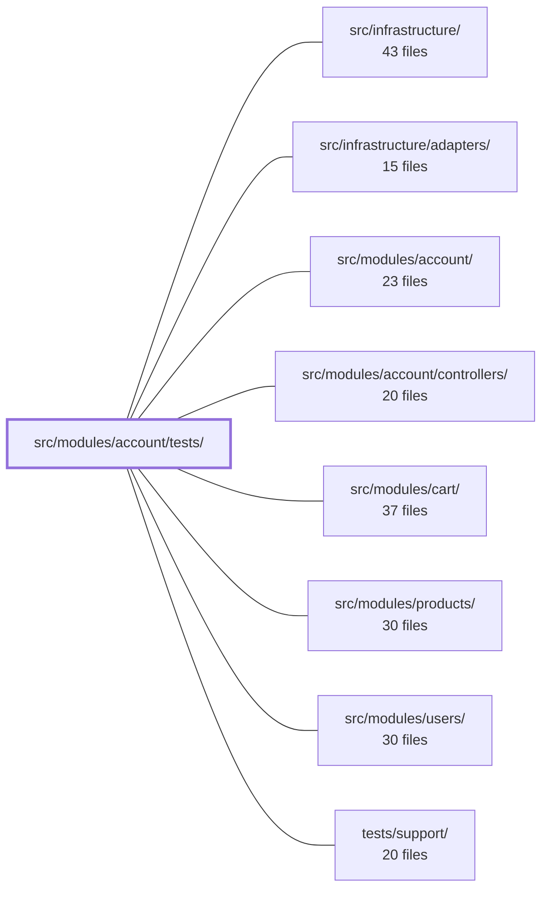

---
tags:
  - 2repo
  - 2repo/module
  - project/boilerplate-node-backend
type: module
module: src/modules/account/tests/
files: 19
updated: 2026-08-31T20:53:00.828572+00:00
---

# src/modules/account/tests/

## Purpose

This module is the complete test suite for the account domain. It exercises every layer of the account feature—from the raw HTTP contract down through the service, repository, session/token, and schema layers—using a deliberate mix of contract, integration, and unit tests that pin security invariants, wire-format stability, and behavioral edge-cases that normal happy-path tests would miss.

## Key parts

- **Contract tests** (`contract/api.contract.test.ts`) — Drives the live `/account` HTTP surface with state-dependent scenarios (duplicate email, revoked cookies, spent tokens, cross-session access) and asserts on concrete IDs and field values.
- **Integration tests** (`integration/`) — Run against a real database via `setupTestDb`. Split into:
  - *Security invariants*: `service.test.ts` (indistinguishable login failures, soft-delete, hashing) and `jwt.test.ts` (refresh-token dual-requirement, logout revocation, secret non-interchangeability).
  - *Happy paths & validation*: `service-flows.test.ts` (signup, login, token add, password change, refresh) and `self-service.test.ts` (profile/password/session/verification at the service-repository boundary).
  - *Domain invariants*: `addresses.test.ts` (single-default, cross-user 404, checkout resolver) and `persisted-locale.test.ts` (locale capture, fallback, mutability).
- **Unit tests** (`unit/`) — Isolated, fully-mocked tests that lock down specific contracts:
  - *Token & session layer*: `session-jwt.test.ts` (HS256 pin, jti uniqueness, secret separation), `tokens.test.ts` (env-var resolution per tier), `token-cleanup.test.ts` / `token-cleanup-job.test.ts` (ordering and log-branch assertions).
  - *Schema & wiring*: `schema-contract.test.ts` (addressBookSchema shape), `routes.test.ts` (middleware order and guards), `cookies.test.ts` (security-flag combos), `auth-surface.test.ts` (barrel identity).
  - *Content & cross-cutting*: `emails.test.ts` (template/link/copy), `audit.test.ts` (wire-contract action strings), `delete-account.test.ts` (enumeration prevention), `fixtures.test.ts` (makeAddressBook shape).

## How it connects

- **`src/modules/account/` and `src/modules/account/controllers/`** — Every file here tests code in these directories; the contract and unit tests target controllers and the service, the integration tests target the service/repository layer.
- **`src/modules/users/`** — `session-jwt.test.ts` explicitly replaces this module with a `jest.mock` because the JWT layer depends on the user document; integration tests that seed a user do so through the same shared schema.
- **`src/modules/cart/`** — `addresses.test.ts` exercises the checkout resolver's three-way answer, which is the contract the cart module relies on when selecting a shipping address.
- **`src/infrastructure/` and `src/infrastructure/adapters/`** — Integration tests hit a real database and the logger; `token-cleanup-job.test.ts` asserts on infrastructure logger calls, and `emails.test.ts` validates output that the mail adapter would deliver.
- **`tests/support/`** — Provides shared helpers such as `setupTestDb` used by the integration suite, and likely the `makeAddressBook` fixture under test in `fixtures.test.ts`.

## Where to start

1. **`integration/service.test.ts`** — It is the shortest file that shows the full testing idiom (real DB, grouped by invariant, security-first) and gives context for what the other integration and unit files are guarding.
2. **`unit/session-jwt.test.ts`** — It isolates the single most security-critical piece of the module (the access/refresh token pair) with clear, self-contained assertions, making it the best entry point for understanding the token layer before reading the higher-level contract and integration tests.

## Connected modules

[[boilerplate-node-backend_src_infrastructure|src/infrastructure/]] · [[boilerplate-node-backend_src_infrastructure_adapters|src/infrastructure/adapters/]] · [[boilerplate-node-backend_src_modules_account|src/modules/account/]] · [[boilerplate-node-backend_src_modules_account_controllers|src/modules/account/controllers/]] · [[boilerplate-node-backend_src_modules_cart|src/modules/cart/]] · [[boilerplate-node-backend_src_modules_products|src/modules/products/]] · [[boilerplate-node-backend_src_modules_users|src/modules/users/]] · [[boilerplate-node-backend_tests_support|tests/support/]]

## Files
- `src/modules/account/tests/contract/api.contract.test.ts` — Contract tests for the self-service `/account` HTTP surface (login, profile update, password change, single-session logout, session listing, email verification). They exist because these endpoints have state-dependent branches—duplicate-email conflicts, revoked cookies, spent tokens, cross-session access—that a generated-payload unit sweep cannot exercise. Assertions check specific IDs and field values, not merely response lengths.
- `src/modules/account/tests/integration/addresses.test.ts` — Integration test suite for the address book. It locks down three invariants: a non-empty book always has exactly one default (regardless of which write set it), a user's entries are invisible to other users (404, not 403), and the checkout resolver's three-way answer (default, named, stale-id rejection).
- `src/modules/account/tests/integration/jwt.test.ts` — Integration test suite for the JWT module (`session/jwt.ts`). It verifies the security-critical contract between stateless access tokens and stateful refresh tokens: that refresh tokens require both a valid signature **and** a matching row on the user document, that logout (token removal) actually revokes sessions, and that the two secret types are never interchangeable.
- `src/modules/account/tests/integration/persisted-locale.test.ts` — Integration tests for the `locale` field persisted on the user document. The field captures the request locale at signup so background jobs (e.g. 3 a.m. email workers) have a stable language to use when no `Accept-Language` header is available. The tests verify capture-at-signup, fallback outside a request, post-signup mutability, non-interference from unrelated updates, and visibility in the client-facing user payload.
- `src/modules/account/tests/integration/self-service.test.ts` — Integration tests for the self-service account surface (profile update, password change, session revocation, email verification) at the service/repository layer. Each `describe` block defends one invariant: profile updates cannot mutate privileged fields, a wrong current password yields 422 (not 401), and token revocation is scoped to the exact token requested.
- `src/modules/account/tests/integration/service-flows.test.ts` — Integration tests for the account service's happy paths and argument-level rejections: signup, login, token add, password change, and refresh-access-token. Complements the sibling `service.test.ts` (which covers security invariants) by exercising the ordinary success and validation-failure flows against a real database via `setupTestDb`.
- `src/modules/account/tests/integration/service.test.ts` — Integration tests for the account service (`accountService`) that pin down **security invariants** rather than happy-path behavior. Tests are grouped by the invariant each defends — indistinguishable login failures, soft-delete enforcement, and password hashing — so that a regression in any of them is caught even when every "normal" flow still passes.
- `src/modules/account/tests/unit/audit.test.ts` — Unit test that pins the account module's audit action strings to their exact wire-contract values. Because these strings are consumed by dashboards and alert rules outside this repo, the test locks them in place so a silent rename surfaces as a test failure rather than a broken downstream pipeline.
- `src/modules/account/tests/unit/auth-surface.test.ts` — Pins the public surface of the account barrel by verifying that every re-export resolves to the **same object** its source exports (identity, not existence) and that no undeclared names leak out. This catches a class of bug—barrel re-exporting the wrong binding—that compiles cleanly and slips past smoke tests.
- `src/modules/account/tests/unit/cookies.test.ts` — Unit tests for the four cookie helpers in `session/cookies.ts`. They pin down the security-relevant flag combinations (httpOnly, secure, sameSite, path) for both the `jwt` credential cookie and the `isAuth` frontend-hint cookie, and verify that the "destroy" variants emit flag sets that will actually cause the browser to drop the cookie on logout.
- `src/modules/account/tests/unit/delete-account.test.ts` — Unit tests for the two-step account-deletion controllers (`deleteAccountRequest` and `deleteAccountConfirm`) at the wiring level. The primary invariant pinned here is **enumeration prevention**: an unknown email must produce the same 200 as a known one, and a spent token must produce the same 422 as a never-live token, so neither response leaks which case occurred. All collaborators are fully mocked; mail-content assertions live in `emails.test.ts` and `self-service.test.ts`.
- `src/modules/account/tests/unit/emails.test.ts` — Unit tests for the six account email builders (four link-delivery, two action-confirmation). The tests assert the *built output*—template name, link URL, interpolated copy—because the builders fail silently (a wrong template or link doesn't throw), making content-level assertions the only safety net.
- `src/modules/account/tests/unit/fixtures.test.ts` — Unit tests for the `makeAddressBook` fixture builder, verifying that it produces correctly shaped address-book documents (real Mongoose `ObjectId`s for the owner and every entry, pass-through of deliverable fields, and proper handling of optional fields) so that integration tests seeding this fixture behave identically to live Mongoose documents.
- `src/modules/account/tests/unit/routes.test.ts` — Structural contract test for the account router. It asserts *what middleware is mounted, in what order, on which routes*—catching regressions a type checker cannot (e.g., a `setCache` silently overriding `noStore`, a missing second rate-limit budget, or a token-bearing route accidentally gaining an `isAuth` guard). It does not test handler logic.
- `src/modules/account/tests/unit/schema-contract.test.ts` — Unit test that pins the Mongoose schema contract for `addressBookSchema`. It asserts the top-level document shape (required fields, unique index, defaults, ref, timestamps) and the `items` sub-schema (required address fields, `_id` presence, `default` field default), so that any refactor that silently changes the contract is caught immediately.
- `src/modules/account/tests/unit/session-jwt.test.ts` — Unit-level security-property tests for the token layer (`src/modules/account/session/jwt.ts`). Asserts the invariants that keep JWTs safe: the access and refresh secrets never cross-verify, a refresh token is only valid while its record is still stored, `jti: randomUUID()` prevents same-second mutual revocation, and HS256 is pinned at signing time. The `@modules/users` dependency is **replaced** (module-level `jest.mock`) rather than driven with real data.
- `src/modules/account/tests/unit/token-cleanup-job.test.ts` — Unit tests for `runTokenCleanup` (the scheduled, unattended job) and `adminTokenCleanup` (its admin-triggered, audited counterpart). Because the job's only observable output is its log line, every test asserts on `logger` calls rather than (or in addition to) repository invocations, and explicitly pins the success and failure branches as mutually exclusive.
- `src/modules/account/tests/unit/token-cleanup.test.ts` — Unit tests that verify the `runTokenCleanup` pre-flight sweep is invoked before credential validation in both `postLogin` and `getRefreshToken`, and is **skipped** when a refresh request carries no token (an anonymous hit that cannot succeed). The ordering assertions are the core contract: cleanup must precede the auth check, not merely co-occur with it.
- `src/modules/account/tests/unit/tokens.test.ts` — Unit tests for the token-configuration module (`session/config.ts`). Validates that each JWT tier (short/medium/long refresh, access) reads its own dedicated environment variable, that unset or empty variables resolve to `0` (seconds) or `''` (secrets) rather than `NaN`/`undefined`, and that the access-token and refresh-token paths never cross-contaminate.

---
[[boilerplate-node-backend_INDEX|← boilerplate-node-backend index]]
