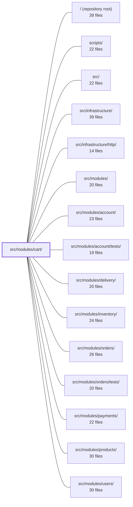

---
tags:
  - 2repo
  - 2repo/module
  - project/boilerplate-node-backend
type: module
module: src/modules/cart/
files: 37
updated: 2026-08-28T11:58:50.502591+00:00
---

# src/modules/cart/

## Purpose

The cart module manages a user's shopping basket end-to-end: reading, adding, updating, and removing line items, producing a lightweight summary for badge UIs, converting the basket into an order at checkout, and re-ordering items from a past order. The cart is a standalone Mongoose document keyed by `userId`, and the module enforces a strict `cart → orders` dependency direction so that only the cart writes to its own collection.

## Key parts

- **Domain layer** (`domain/rules.ts`, `domain/index.ts`) — Pure, framework-free checkout validation (stock availability, reservation checks). Exposed through a single barrel so consumers import from `cart/domain` only.
- **Data layer** (`model.ts`, `repository.ts`, `factory.ts`) — Mongoose schema and model (one document per user, no sub-document `_id`s), the `cartRepository` CRUD + cart-specific write operations, and a deterministic fixture factory for stable demo data.
- **Service layer** (`services/`) — Business logic split across focused files: `items.ts` (add / set / remove + catalogue gate), `checkout.ts` (basket → order + stock reservation + email), `reorder.ts` (copy order lines back into cart), `cleanup.ts` (dangling-reference removal invoked by other modules), and `view.ts` (shared projection that joins cart lines with live product data). `index.ts` re-exports everything as a single `cartService` namespace.
- **HTTP layer** (`controllers/`, `routes.ts`) — Thin Express controllers for each endpoint (GET, POST, PUT, DELETE, checkout, reorder) and the router that maps URLs to those handlers. All routes require authentication.
- **Module wiring & contracts** (`module.ts`, `index.ts`, `openapi.yaml`, `probes.ts`) — `module.ts` is the single registration point (identity, routes, DDD dependency labels, event subscriptions). `index.ts` is the only import surface for sibling modules. `openapi.yaml` is the source-of-truth API spec; `probes.ts` adds negative-test requests the contract cannot express.
- **Observability declarations** (`analytics.ts`, `audit.ts`, `metrics.ts`) — Typed names for analytics events, audit actions, and Prometheus counters, registered into shared infrastructure maps so domain strings live with the code that fires them.
- **Demo data** (`demo.ts`) — Seed fixture documents and upsert logic for the cart collection.
- **Tests** (`tests/`) — Unit, integration (real MongoDB), and contract suites covering domain rules, service semantics, schema invariants, stock reservation pairs, audit string stability, route table shape, and API wire format.

## How it connects

- **`src/modules/orders/`** — Checkout writes a new order document; reorder reads an existing order's line items. The dependency is strictly cart → orders (the cart never lets orders write back into it).
- **`src/modules/products/`** — Every cart line references a product; the catalogue gate in `services/items.ts` rejects lines whose product is not in the active storefront. `services/cleanup.ts` removes cart lines when a product is delisted.
- **`src/modules/users/`** — The cart document is owned by a user. `services/cleanup.ts` deletes the cart when a user is removed, preventing dangling references.
- **`src/modules/inventory/`** — `domain/rules.ts` checks stock availability before checkout proceeds; `services/checkout.ts` reserves units. The stock test suite (`tests/integration/stock.test.ts`) verifies the hold-at-checkout / release-at-payment invariant that spans both modules.
- **`src/modules/wishlist/`** — The business rule "may this product be placed in a cart?" is kept in the cart service deliberately so the same gate applies consistently to cart, wishlist, and the PUT route.
- **`src/infrastructure/`** — `analytics.ts`, `audit.ts`, and `metrics.ts` register their typed names into infrastructure-level shared maps (analytics port, `AuditActionMap`, Prometheus registry) without importing infrastructure code directly into the domain.

## Where to start

Read **`module.ts`** first — it is the single registration point that shows the module's identity, route wiring, declared cross-module dependencies, and event subscriptions in one file, giving you the module's shape before diving into any sub-layer. Then read **`openapi.yaml`** to understand the full public API surface (endpoints, request/response shapes, status codes) that every other file in the module exists to satisfy.

## Connected modules

[[boilerplate-node-backend_ROOT|/ (repository root)]] · [[boilerplate-node-backend_scripts|scripts/]] · [[boilerplate-node-backend_src|src/]] · [[boilerplate-node-backend_src_infrastructure|src/infrastructure/]] · [[boilerplate-node-backend_src_infrastructure_http|src/infrastructure/http/]] · [[boilerplate-node-backend_src_modules|src/modules/]] · [[boilerplate-node-backend_src_modules_account|src/modules/account/]] · [[boilerplate-node-backend_src_modules_account_tests|src/modules/account/tests/]] · [[boilerplate-node-backend_src_modules_delivery|src/modules/delivery/]] · [[boilerplate-node-backend_src_modules_inventory|src/modules/inventory/]] · [[boilerplate-node-backend_src_modules_orders|src/modules/orders/]] · [[boilerplate-node-backend_src_modules_orders_tests|src/modules/orders/tests/]] · [[boilerplate-node-backend_src_modules_payments|src/modules/payments/]] · [[boilerplate-node-backend_src_modules_products|src/modules/products/]] · [[boilerplate-node-backend_src_modules_users|src/modules/users/]] · … and 4 more

## Files
- `src/modules/cart/analytics.ts` — Declares the analytics event names emitted by the cart module and registers them in the analytics port's typed name map. It exists so that the cart's domain events live with the code that fires them, keeping `infrastructure` free of domain knowledge.
- `src/modules/cart/audit.ts` — Declares the cart domain's audit action identifiers and registers them into the shared `AuditActionMap` via TypeScript module augmentation. It exists so that cart-related audit emissions (item removal, bulk reorder) carry stable, typed action names that the observability layer can reference without a centralized enum.
- `src/modules/cart/controllers/delete-cart-item.ts` — Route handler for `DELETE /cart/:productId`. Validates the path parameter and delegates removal to the cart service, returning the updated cart or a structured error.
- `src/modules/cart/controllers/delete-cart.ts` — HTTP handler for `DELETE /cart`. Authenticates the caller, delegates to the cart service to remove **all** items from that user's cart, and returns the resulting cart state (or an error).
- `src/modules/cart/controllers/get-cart-summary.ts` — Express controller handler for `GET /cart/summary`. It retrieves the authenticated user's cart and returns only the lightweight `summary` portion (intended for badge/count UIs), keeping the payload smaller than a full cart fetch.
- `src/modules/cart/controllers/get-cart.ts` — Controller handler for the `GET /cart` endpoint. It extracts the authenticated user's identity and caller context from the request, delegates the cart lookup to the cart service, and writes the result (or error) back to the HTTP response.
- `src/modules/cart/controllers/post-cart.ts` — Controller handler for `POST /cart`. Validates the incoming upsert request body, extracts the authenticated user's ID, and delegates the actual add-or-replace operation to `cartService.cartItemAdd`. It does not enforce any business rules about *whether* a product may be carted — that decision lives in the service so it stays consistent across cart, wishlist, and the PUT route.
- `src/modules/cart/controllers/post-checkout.ts` — Controller for `POST /cart/checkout`. Converts the caller's cart into an order and clears the cart. It exists as a thin orchestrator: extract identity and body params, delegate to `cartService.orderConfirm`, then translate the result into an HTTP response — while guaranteeing the `cartCheckoutTotal` business metric fires on every outcome (success, business refusal, and thrown error).
- `src/modules/cart/controllers/post-reorder.ts` — Handler for `POST /cart/reorder/:orderId`. Copies the line items from one of the caller's own orders back into their cart, skipping any lines whose product has since been delisted. Lives in the cart module (not orders) because its write target is the cart; the source order is read-only.
- `src/modules/cart/controllers/put-cart-item.ts` — HTTP handler for `PUT /cart/:productId`. It validates the request body and `productId`, then delegates to `cartService.cartItemUpdateQuantity` to set (or create) a cart line for the authenticated user, returning the updated cart.
- `src/modules/cart/demo.ts` — Owns the cart module's slice of the demo/seed dataset: defines the fixture documents, the upsert logic that loads them, and a read-back export. It exists so cart seed data lives in the module that owns the collection rather than being nested inside another module's (e.g. user) documents.
- `src/modules/cart/domain/index.ts` — Barrel file for the cart **domain layer**. It re-exports the public API of `./rules` so that consumers can import from `cart/domain` without reaching into submodules. The domain layer is intended to be pure, framework-free logic (enforced by lint rules); this index file is the single entry point for that contract.
- `src/modules/cart/domain/rules.ts` — Pure, side-effect-free validation rules that decide whether a cart may proceed to checkout. It takes already-joined cart lines in and returns a named verdict out—no status codes, no i18n, no I/O. It exists to keep the "can this cart become an order?" question in the domain layer, where it can be tested in isolation and mirrored (but not shared) by the orders domain.
- `src/modules/cart/factory.ts` — Builds a deterministic `CartFixture` object ready for `cartRepository.create`. It exists so that fixtures (especially the committed demo dataset) are stable across runs — pinning the cart `_id` prevents hash-drift in `demo-data.json` that would otherwise go stale against the paired frontend.
- `src/modules/cart/index.ts` — Public barrel (the single import surface) for the cart module. Sibling modules must import only through this file; it exists to enforce the module-boundary rule and to keep the internal repository, model, and document type inaccessible to the rest of the codebase.
- `src/modules/cart/metrics.ts` — Declares the Prometheus counter(s) owned by the cart module—specifically the checkout-attempt metric. Keeping domain counters in the module (rather than in `infrastructure`) preserves ownership boundaries; the module that mutates the metric is the one that declares it.
- `src/modules/cart/model.ts` — Defines the Mongoose schema, document interface, and model for the cart collection. A cart is a standalone document keyed by `userId` (not a subdocument of user) so that reads/writes touch one small document and the serializer never needs to omit fields. Field names mirror the `openapi.yaml` `CartItem` shape so there is no wire↔storage mapper.
- `src/modules/cart/module.ts` — Single registration point for the cart module. Declares the module's identity (`name`, `subdomain`, `basePath`), wires its HTTP routes, declares its cross-module dependencies with DDD relationship labels, and subscribes to domain events that require cart cleanup. Satisfies the `AppModule` contract so the kernel can discover and boot the module.
- `src/modules/cart/openapi.yaml` — OpenAPI 3.0.3 contract (v2.0.0) defining the public HTTP API for the cart module: reading/updating cart lines, computing summaries, checking out into an order, and reordering from a past order. It is the single source of truth for endpoint shapes, status codes, and request/response schemas that the cart implementation must satisfy.
- `src/modules/cart/probes.ts` — Defines API rejection probes for the cart module — requests that prove the API refuses invalid input (empty checkout, dangling product IDs, invisible catalogue items, zero quantities). These exist because an OpenAPI contract declares valid calls and their responses, leaving no place for "this request must fail" cases. The probes are emitted into every generated client collection after the contract-derived requests.
- `src/modules/cart/repository.ts` — Data-access layer for the cart aggregate. Exposes a single `cartRepository` object that combines standard CRUD (via a shared base factory) with the four cart-specific write operations. Every method is addressed by `userId` (unique on the schema) rather than a cart id, so callers never need to fetch before mutating.
- `src/modules/cart/routes.ts` — Defines the Express router for all cart-related HTTP endpoints (list, add, update, remove items, checkout, reorder). Every route is authenticated. The router is the single wiring point that maps URLs to the module's controller functions and applies shared middleware.
- `src/modules/cart/services/checkout.ts` — Implements the cart checkout operation: validates the basket, creates an order, reserves stock, conditionally empties the cart, and sends the confirmation email. It is the only cart service that writes to another module's collection and the only one where a concurrent race can double-charge a customer.
- `src/modules/cart/services/cleanup.ts` — Cleanup entry points that **other** modules invoke when a user or product they own is deleted. A cart holds references to a user and a product but owns neither; without these functions, dangling references would persist in MongoDB. They are not reachable from any cart route — `module.ts` wires them to domain events that fire on user/product deletion.
- `src/modules/cart/services/index.ts` — Barrel file for the cart service folder. Re-exports the individual service functions (item CRUD, checkout, reorder, cleanup) both as named exports and as a single `cartService` namespace object, giving consumers a single import path for all cart operations. The folder exists in place of a single file because the service layer exceeded the project's ~300-line threshold (see `docs/theory/layers.md`).
- `src/modules/cart/services/items.ts` — Service layer for reading a user's cart and mutating its contents (add, set, remove). Every mutating operation follows the same shape: one write to the repository, then the join that prices the result into a `CartView`. It also houses the shared "catalogue gate" that ensures a cart line can only reference a product the storefront actually serves.
- `src/modules/cart/services/reorder.ts` — Implements "reorder": copying the line-items of a past order back into the caller's cart. It lives in the cart module (not orders) so that the only write target is the cart, preserving the declared `cart → orders` dependency direction and avoiding a cycle where orders would reach back into cart.
- `src/modules/cart/services/view.ts` — The shared cart projection layer for the `services/` package. It turns a raw `CartDocument` (keyed by `userId`) into the shapes other services and the OpenAPI contract expect: joined lines with product data, and the `CartResponse` payload. All three sibling services (`checkout`, `items`, `reorder`) import from here; none of them re-implements this logic.
- `src/modules/cart/tests/contract/api.contract.test.ts` — Contract tests for all six `/cart` endpoints. Each test makes a real HTTP call and asserts that the response envelope matches the declared API spec (`toSatisfyApiSpec`). The cart is deliberately built through API calls (not a factory) because `CartResponse` is a computed view over stored lines and live product prices, not a serialization of the cart document. Behavioural logic (whose cart, which products are valid) is covered in the service suites; these tests exist to pin the wire format.
- `src/modules/cart/tests/integration/schema-contract.test.ts` — Verifies the Mongoose schema declarations on the cart model itself—defaults, required fields, unique indexes, subdocument constraints, and timestamps—against a real MongoDB instance. Sibling specs in this folder cover repository behaviour; this file pins down what the schema *says*, which no other test exercises.
- `src/modules/cart/tests/integration/service.test.ts` — Integration test suite for the cart service, executed against a real MongoDB instance (`setupTestDb`). It exists to pin three fragile behavioral contracts that are easy to break silently: the `set` vs `add` quantity semantics (`$set` vs `$inc`), the serialization guard that strips the populated `product` from `cartGetForBadge` responses, and the storage invariants (no placeholder document, no per-line `_id`, one cart per user). Real Mongo is used deliberately because several tests (especially race-condition tests) depend on the server actually serializing writes to a single document.
- `src/modules/cart/tests/integration/stock.test.ts` — Integration suite that pins the reservation model's core invariant: units are **held** (reserved) at checkout and only leave the shelf upon payment. Every assertion checks the **pair** of counters (`onHand`, `reserved`) rather than a single stock number, because a single counter cannot distinguish "reserved" from "destroyed." Runs against real Mongo (`setupTestDb`) because the guarantees under test are conditional writes (`$expr` guards) that a mock would silently swallow.
- `src/modules/cart/tests/unit/audit.test.ts` — Pins the exact string values emitted by the cart module's audit actions. Because these strings are a **wire contract** consumed by external log queries, dashboards, and alert rules (not refactored alongside this repo), a whole-object equality assertion guards against silent drift that would still type-check and pass all other tests while breaking downstream tooling.
- `src/modules/cart/tests/unit/domain-rules.test.ts` — Unit tests for `evaluateCheckout` in the cart domain rules, focused on the stock-availability and reservation logic. Also contains a duplication-guard suite that verifies the availability subtraction copied into `rules.ts` still agrees with the inventory module's `availabilityOf`.
- `src/modules/cart/tests/unit/factory.test.ts` — Unit tests for the `makeCart` factory fixture. They verify that the factory correctly converts string IDs to `mongoose.Types.ObjectId` and that the resulting cart object matches the structural contract the rest of the codebase expects (ownership, item presence/absence semantics, ordering).
- `src/modules/cart/tests/unit/routes.test.ts` — Unit test for the cart router's route table. It verifies that the cart module exposes exactly the expected endpoints in the correct declaration order (critical for Express first-match semantics), that every route is authenticated with `isAuth` but never `isAdmin`, and that no route sets a shared cache while `POST /checkout` does invalidate the orders/products caches.
- `src/modules/cart/tests/unit/schema-contract.test.ts` — Contract tests that pin the structural invariants of `cartSchema` at the Mongoose-definition level: required paths, index specs, defaults, field types, and sub-schema shape. They exist so that the two invariants the rest of the cart module depends on — "one cart per user" (unique index enabling atomic upserts) and "a cart line always has a quantity ≥ 1" — cannot be silently broken by a model edit without a test going red.

---
[[boilerplate-node-backend_INDEX|← boilerplate-node-backend index]]
