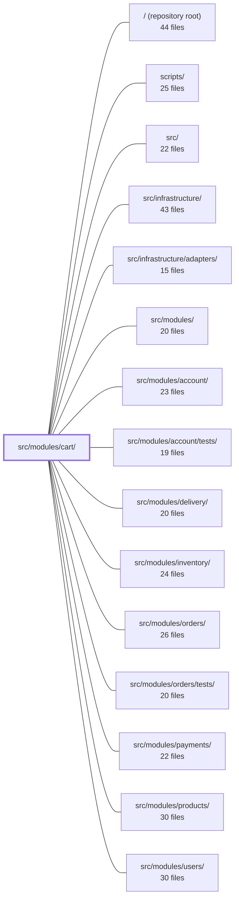

---
tags:
  - 2repo
  - 2repo/module
  - project/boilerplate-node-backend
type: module
module: src/modules/cart/
files: 37
updated: 2026-08-31T20:53:27.536466+00:00
---

# src/modules/cart/

## Purpose

The cart module owns the full lifecycle of a user's shopping basket: reading, adding, updating, removing, and clearing line items, plus the two terminal operations—checkout (cart → order) and reorder (past order → cart). It stores a single per-user cart document in MongoDB, joins it with product data to produce priced views, and coordinates with inventory, orders, delivery, and products modules at the boundaries where cart data crosses into another domain.

## Key parts

- **Domain rules** (`domain/rules.ts`) — Pure, side-effect-free logic that decides whether a cart can proceed to checkout (empty-cart, product-resolution, stock-sufficiency, fail-closed on missing counters). No framework or I/O dependencies.
- **Service layer** (`services/`) — The business-logic tier. `items.ts` handles single-line CRUD; `checkout.ts` performs the cart→order transition (stock reservation, order creation, cart clear, email, analytics); `reorder.ts` copies a past order's lines back into the cart; `view.ts` centralises the join-and-serialize step shared by all reads; `cleanup.ts` removes cart references when a user or product is deleted elsewhere.
- **Controllers & routes** (`controllers/`, `routes.ts`) — Thin Express adapters that translate HTTP into service calls. All routes sit behind authentication; checkout additionally invalidates `orders` and `products` response caches.
- **Data layer** (`model.ts`, `repository.ts`) — Mongoose schema (one document per user, no per-line `_id`) and the six domain-specific write operations (upsert, remove, clear, version-guarded clear, and two cross-module cleanups).
- **Module bootstrap & public API** (`module.ts`, `index.ts`) — Registers routes, events, and seeding with the kernel; the barrel exports only `cartService` so sibling modules never reach past the service layer.
- **Observability** (`analytics.ts`, `audit.ts`, `metrics.ts`) — Typed event/action names and a Prometheus checkout-outcome counter, kept inside the module per the "a name belongs to the code that emits it" rule.
- **Contract & tests** (`openapi.yaml`, `probes.ts`, `tests/`) — OpenAPI 3.0.3 spec, negative-path probe collection, and a layered test suite (unit, integration against real Mongo, contract, stock-lifecycle) covering every status branch and the `set` vs `add` upsert invariant.
- **Demo & fixtures** (`demo.ts`, `fixtures.ts`) — Seed data and a stable-ID factory so `export-demo-dataset.ts` hash-comparisons don't go stale.

## How it connects

- **`src/modules/orders/`** — Checkout is the only cart operation that writes into the orders collection; reorder reads an existing order to copy lines back. The dependency direction is strictly `cart → orders`.
- **`src/modules/inventory/`** — Checkout reserves stock; `domain/rules.ts` calls inventory's `availabilityOf` to verify sufficiency. The stock-lifecycle integration test asserts `onHand`/`reserved` invariants that span both modules.
- **`src/modules/products/`** — Every cart read joins lines with product documents to produce a priced `CartView`; `services/cleanup.ts` removes cart lines when a product is permanently deleted.
- **`src/modules/users/`** — The cart document is keyed by `userId`; cleanup removes the cart when a user is deleted.
- **`src/modules/delivery/`** — Checkout resolves the shipping method and address before creating the order.
- **`src/infrastructure/`** — The cart repository extends the shared repository factory provided by infrastructure.
- **`src/modules/account/`** — `metrics.ts` follows the counter-placement pattern established there.
- **`tests/cross-cutting/`** — Hosts integration scenarios that exercise cart alongside other modules (e.g., the full checkout → stock → order path).

## Where to start

1. **`src/modules/cart/domain/rules.ts`** — ~a few dozen lines of pure logic with zero dependencies. Reading it first shows the module's core decision (can this cart check out?) without any framework noise.
2. **`src/modules/cart/services/items.ts`** — The everyday CRUD path (add, update, remove). It demonstrates the service pattern, the `CartView` join, and the `ResponseSuccess | ResponseReject` envelope that controllers consume—giving you the mental model before tackling checkout or reorder.

## Connected modules

[[boilerplate-node-backend_ROOT|/ (repository root)]] · [[boilerplate-node-backend_scripts|scripts/]] · [[boilerplate-node-backend_src|src/]] · [[boilerplate-node-backend_src_infrastructure|src/infrastructure/]] · [[boilerplate-node-backend_src_infrastructure_adapters|src/infrastructure/adapters/]] · [[boilerplate-node-backend_src_modules|src/modules/]] · [[boilerplate-node-backend_src_modules_account|src/modules/account/]] · [[boilerplate-node-backend_src_modules_account_tests|src/modules/account/tests/]] · [[boilerplate-node-backend_src_modules_delivery|src/modules/delivery/]] · [[boilerplate-node-backend_src_modules_inventory|src/modules/inventory/]] · [[boilerplate-node-backend_src_modules_orders|src/modules/orders/]] · [[boilerplate-node-backend_src_modules_orders_tests|src/modules/orders/tests/]] · [[boilerplate-node-backend_src_modules_payments|src/modules/payments/]] · [[boilerplate-node-backend_src_modules_products|src/modules/products/]] · [[boilerplate-node-backend_src_modules_users|src/modules/users/]] · … and 5 more

## Files
- `src/modules/cart/analytics.ts` — Declares the catalogue of analytics event names that the cart module emits and registers them into the analytics port's app-wide `AnalyticsEventMap` union. It exists so that every cart-related event name is co-located with the module that fires it, following the rule that "a name belongs to the code that emits it."
- `src/modules/cart/audit.ts` — Declares the cart module's audit action names and registers them into the app-wide `AuditActionMap` via TypeScript module augmentation. It exists so that cart-specific audit events have a single, typed source of truth without polluting a shared enum.
- `src/modules/cart/controllers/delete-cart-all.ts` — Thin HTTP adapter that maps `DELETE /cart/all` to `cartService.cartRemove`. It exists as a dedicated, bodyless destructive endpoint so that "clear everything" must be explicitly requested by URL rather than inferred from a missing body on `DELETE /cart` (a pattern that previously allowed a stripped body to silently wipe the cart).
- `src/modules/cart/controllers/delete-cart-item.ts` — Thin HTTP adapter that exposes `DELETE /cart/:productId` (canonical) and `DELETE /cart` (alias) by delegating to `cartService.cartItemRemoveById`. It normalises the two input shapes into a single `productId` string, validates it, and translates the service result into an HTTP response.
- `src/modules/cart/controllers/get-cart-summary.ts` — Thin HTTP adapter for `GET /cart/summary`. Translates an incoming Express request into a call to the cart service's badge-summary method and sends back the summary object. Exists so the route layer never touches business logic directly.
- `src/modules/cart/controllers/get-cart.ts` — Thin HTTP adapter that handles the `GET /cart` endpoint by delegating to the cart service layer and formatting the result into an HTTP response. It exists to keep transport concerns (Express request/response, auth extraction, error catching) separate from business logic.
- `src/modules/cart/controllers/post-cart.ts` — Thin HTTP adapter for `POST /cart`. Parses and validates the request, then delegates all business logic (eligibility, upsert semantics) to `cartService.cartItemAdd`. Exists to keep the Express layer free of domain rules.
- `src/modules/cart/controllers/post-checkout.ts` — Thin HTTP adapter for `POST /cart/checkout`. Extracts the authenticated user and optional body fields, delegates to `cartService.orderConfirm`, maps the result to a 201 or a refused response, and records the `cart_checkout_total` metric on every code path (success, business-refusal, and thrown error).
- `src/modules/cart/controllers/post-reorder.ts` — Thin HTTP adapter for `POST /cart/reorder/:orderId`. It extracts the authenticated user and target order from the request, delegates all business logic to `cartService.reorderIntoCart`, and translates the service result into an Express response (200 or 409). No domain logic lives here.
- `src/modules/cart/controllers/put-cart-item.ts` — Thin HTTP adapter for `PUT /cart/:productId`. Validates the incoming request, extracts the user and product identifiers, and delegates all business logic to `cartService.cartItemUpdateQuantity`. It exists solely to translate between Express's request/response lifecycle and the cart service's domain API.
- `src/modules/cart/demo.ts` — Holds the cart module's slice of the demo/seed dataset. It defines which demo accounts have items in their cart, provides the seeding function for the `carts` collection, and exposes a read-back helper. Only accounts with at least one line-item get a cart document; the absence of a row is itself the fixture for a customer who has never added anything.
- `src/modules/cart/domain/index.ts` — Barrel entry point for the cart **domain layer**. It exists to give consumers a single stable import path while re-exporting the pure, framework-free rules defined in `rules.ts`. No logic lives here.
- `src/modules/cart/domain/rules.ts` — Pure decision logic that determines whether a cart can proceed to checkout. It accepts already-joined cart lines and returns a typed verdict (pass / named refusal reason), with no side effects, no status codes, and no i18n — those concerns belong to the service layer.
- `src/modules/cart/fixtures.ts` — Factory for building cart fixtures that are safe to pass to `cartRepository.create`. It pins a stable `_id` (via `identityOf`) so that `scripts/export-demo-dataset.ts` can hash-compare the committed `demo-data.json` without the artefact going stale on every run, and it converts string ids to `ObjectId` instances so Mongo lookups actually match.
- `src/modules/cart/index.ts` — Public barrel file for the cart module. It is the **only** import surface available to sibling modules, re-exporting a single symbol (`cartService`) to enforce the rule that cross-module access must go through the service layer.
- `src/modules/cart/metrics.ts` — Owns the Prometheus counter(s) for the cart domain—specifically checkout attempt outcomes. Following the pattern established in `modules/account/metrics.ts`, the counter lives in the domain module (not in `infrastructure`) so that the overview endpoint can read its value without a direct import into this file.
- `src/modules/cart/model.ts` — Defines the Mongoose schema, document interfaces, and model for the per-user cart. The document is intentionally one-per-user (not a subdocument on User) so a user response can't accidentally leak a cart it doesn't own. Field names mirror `openapi.yaml`'s `CartItem` to keep stored and wire shapes identical. Persistence lives in Mongo (not Redis) because this is the sole durable copy of a user's cart and Redis here is cache-only / fails open.
- `src/modules/cart/module.ts` — Module manifest for the shopping-cart domain. Registers routes, domain-event subscriptions, demo seeding, and locale paths into the kernel's `AppModule` registry so the cart can be discovered and booted without hard-coding imports elsewhere.
- `src/modules/cart/openapi.yaml` — OpenAPI 3.0.3 contract (v2.0.0) for the cart module. It defines the full HTTP surface a client can use to read, mutate, clear, and act on a user's shopping cart, including checkout and reorder operations. Serves as the machine-readable specification from which client SDKs, server-side validation, and documentation are generated.
- `src/modules/cart/probes.ts` — Provides the cart module's probe collection—concrete API requests that exercise failure paths and boundary conditions the OpenAPI contract cannot express on its own (e.g., "send this body, expect this refusal"). It exists so the runnable-collections runner has cart-specific negative-path scenarios to execute.
- `src/modules/cart/repository.ts` — Cart repository that extends the shared repository factory with the six domain-specific writes a cart requires: line upsert, line removal, cart clearing (plain and version-guarded), and the two cleanup writes owed to product/user deletion. All writes are keyed by `userId` alone, since the schema's `unique: true` constraint makes that a complete document address.
- `src/modules/cart/routes.ts` — Defines the Express router that maps all HTTP endpoints under the cart feature (view, add, update, remove, clear, checkout, reorder) to their controller handlers. The entire router is gated behind authentication, and the checkout route additionally invalidates response caches for `orders` and `products`.
- `src/modules/cart/services/checkout.ts` — Implements the cart→order transition: validates the basket, resolves shipping and address, creates an order, reserves stock, conditionally clears the cart, sends the confirmation email, and emits analytics. It is the only cart operation that writes into another module's collection and the sole path where a race can double-charge a customer.
- `src/modules/cart/services/cleanup.ts` — Provides two cross-module cleanup entry points that remove cart references when a user or product is permanently deleted elsewhere in the system. Neither function is reachable from a cart route; they exist as the only callers that tidy up cart data after the owning entity disappears.
- `src/modules/cart/services/index.ts` — Barrel file for the cart service layer. Re-exports the individual cart operations (read, write, checkout, reorder, cleanup) so that controllers and cross-module callers have a single import path. Also assembles all of them into the `cartService` namespace object, which is the canonical entry point for callers. The cart service lives in a folder rather than one file because it exceeded the ~300-line threshold defined in `docs/theory/layers.md`.
- `src/modules/cart/services/items.ts` — Service layer for reading and mutating cart lines. Every exported operation performs a single write (or read) against `cartRepository` and then joins the result with product data to produce a priced `CartView`. Single-product mutations carry a `ResponseSuccess | ResponseReject` envelope; `cartRemove` and the badge/view reads do not, because they cannot fail.
- `src/modules/cart/services/reorder.ts` — Copies a past order's line items back into the caller's cart. It lives in the **cart** module (not orders) because the write target is the cart; the order is only read. This keeps the `cart → orders` dependency direction that the module manifests declare and avoids the cycle an `/orders/{id}/reorder` route would require.
- `src/modules/cart/services/view.ts` — Read/projection layer for the cart: turns a stored `CartDocument` into the shapes callers actually consume — joined lines (`CartLine`) and the API response (`CartView`). Lives in `services/` and is shared by the sibling service files (`checkout`, `items`, `reorder`) so none of them duplicates join or serialization logic.
- `src/modules/cart/tests/contract/api.contract.test.ts` — Contract tests that assert every `/cart` route's response shape matches the declared OpenAPI spec via `toSatisfyApiSpec()`. The cart is a computed view rather than a serialized document, so these tests build state through the API (not fixtures) and verify each declared status-code branch (200, 401, 404, 422) is reachable and well-shaped.
- `src/modules/cart/tests/integration/schema-contract.test.ts` — Integration tests that assert the **schema declarations** themselves on the cart collection — defaults, `required` fields, `minimum` constraints, the unique `userId` index, subdocument `_id` suppression, and timestamps. These behaviours are owned by Mongoose, not application logic, so the tests run against a real MongoDB instance rather than a mock. Sibling specs cover transforms; this file covers what the client actually receives or rejects at the wire level.
- `src/modules/cart/tests/integration/service.test.ts` — Integration tests for the cart service layer, run against a real MongoDB instance (`setupTestDb`). The primary focus is the `set` vs `add` distinction on the shared `upsertCartItem` code path — a regression that silently multiplies or drops a user's quantity — plus the over-serialization guard on the cart view (no extra keys beyond `productId`/`quantity`) and the invariant that a cart is a single per-user document with no per-line `_id`.
- `src/modules/cart/tests/integration/stock.test.ts` — Integration test suite verifying the reservation model across the full order lifecycle. The core invariant under test: units are *reserved* at checkout (neither sold nor free) and only leave `onHand` upon payment; they are recoverable via cancellation or TTL expiry. Every assertion checks `onHand` and `reserved` together to catch a shop that merely decrements stock. Runs against real MongoDB because the guarantees depend on conditional writes that mocks cannot exercise.
- `src/modules/cart/tests/unit/audit.test.ts` — Locks down the exact string values of cart audit actions. These strings are a **wire contract** consumed by log queries and alert rules, so a rename would type-check cleanly and pass every other test while silently breaking observability tooling. This test asserts the values by their literal strings to catch that class of regression.
- `src/modules/cart/tests/unit/domain-rules.test.ts` — Unit tests for `evaluateCheckout` — the pure, dependency-free rule that decides whether a cart's lines can proceed to checkout. Covers empty-cart rejection, product-resolution failure, reservation-aware stock sufficiency, fail-closed handling of missing counters, and the priority order of failure reasons. Also cross-checks that the cart domain's internal availability arithmetic agrees with the inventory module's `availabilityOf`.
- `src/modules/cart/tests/unit/fixtures.test.ts` — Unit tests for the `makeCart` fixture builder. They verify that the fixture performs its one critical job—converting string product/user IDs into real Mongoose `ObjectId` instances—so that seeded carts actually match catalogue lookups instead of silently appearing empty.
- `src/modules/cart/tests/unit/routes.test.ts` — Unit test for the cart router that pins down three invariants: the exact set and declaration order of endpoints, the authorization posture (authenticated, never admin), and the caching policy (invalidate at checkout, never set a shared cache). It exists so that accidental reordering, guard changes, or cache additions break the build immediately.
- `src/modules/cart/tests/unit/schema-contract.test.ts` — Schema-contract test for the cart Mongoose model. It pins down every structural invariant of `cartSchema` (required fields, types, refs, indexes, defaults, options, sub-schema shape) as explicit assertions, so any unintended schema change fails immediately without needing to spin up a database or instantiate documents.

---
[[boilerplate-node-backend_INDEX|← boilerplate-node-backend index]]
