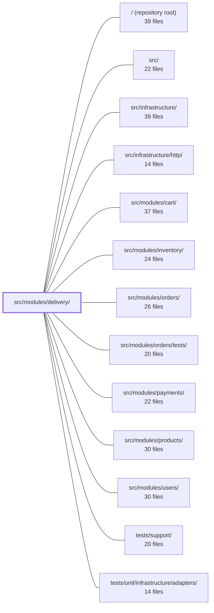

---
tags:
  - 2repo
  - 2repo/module
  - project/boilerplate-node-backend
type: module
module: src/modules/delivery/
files: 20
updated: 2026-08-28T11:59:03.408181+00:00
---

# src/modules/delivery/

## Purpose

The delivery module owns everything that happens after an order reaches `shipped`: creating the parcel (Shipment) record, minting a tracking code, quoting shipping prices against a static rate table, sending the dispatch email, and simulating the courier's "tick" that moves in-transit parcels to delivered. It also exposes those rate/pricing rules as a pure API so the cart/checkout flow can cost a shipping method before the order is even placed.

## Key parts

- **Domain layer** (`domain/rates.ts`, `domain/index.ts`) — the single source of truth for the shipping-rate table and the two pure functions that resolve a method by id and price it against an order total. Deliberately free of HTTP, DB, or framework imports so it can be unit-tested in isolation and swapped if carrier rates change.
- **Service layer** (`service.ts`) — the orchestration brain. Subscribes to `ORDER_STATUS_CHANGED → shipped` to auto-create a parcel, mints the tracking code, fires the dispatch email, and exposes `runCourierAdvance` for the manual tick. This is the only place that touches both the repository and the domain rules.
- **Data access** (`repository.ts`, `model.ts`) — Mongoose schema for the Shipment entity and the four domain-specific queries the service needs: lookup-by-order, idempotent create, list-in-transit, and concurrency-safe status transition.
- **HTTP surface** (`routes.ts`, `controllers/`, `openapi.yaml`) — three endpoints (public methods list, owner shipment read, staff courier-advance) wired with the appropriate auth guards, documented in the OpenAPI contract.
- **Emails** (`emails.ts`) — locale-aware builders that return fully-resolved `EmailContent` objects (e.g. `shipmentShippedEmail`).
- **Module wiring** (`module.ts`, `index.ts`, `audit.ts`) — registers the router and event subscriptions with the kernel, re-exports the two pure pricing functions as the module's public API, and declares the single audit action for type-safe audit logging.
- **Tests** (`tests/`) — split into unit (rates, emails, routes, schema contract), integration (service behaviour, parcel idempotency, courier sequencing), and contract (HTTP shape/authorization against the OpenAPI spec).

## How it connects

- **`src/modules/orders/`** — The delivery service is a *downstream subscriber* to the order state machine. It does not drive the transition to `shipped`; it reacts to `ORDER_STATUS_CHANGED` to create the parcel. Conversely, the order page calls `GET /delivery/order/:orderId` to display tracking info.
- **`src/modules/cart/`** — Checkout imports the two pure pricing functions re-exported through `delivery/index.ts` to cost the selected shipping method. No knowledge of Shipment, Courier, or repository internals is required.
- **`src/infrastructure/`** — The repository wraps the shared base-repository factory; email builders call the i18n translator; the HTTP layer mounts onto the shared Express app.
- **`src/modules/users/`** — The dispatch email needs the customer's name and address, which are resolved through the users module at send time.
- **`tests/support/` / `tests/unit/infrastructure/adapters/`** — Integration and contract tests rely on the shared test harness (in-memory DB, supertest setup) provided by these packages.

## Where to start

1. **`domain/rates.ts`** — 40-ish lines of pure functions over a static table. Reading this first gives you the business rule the rest of the module enforces, with zero framework noise.
2. **`service.ts`** — The only file that glows together domain rules, the repository, and the email builders. Once you understand `shipOrder` and `runCourierAdvance`, the controllers and routes become thin plumbing.

## Connected modules

[[boilerplate-node-backend_ROOT|/ (repository root)]] · [[boilerplate-node-backend_src|src/]] · [[boilerplate-node-backend_src_infrastructure|src/infrastructure/]] · [[boilerplate-node-backend_src_infrastructure_http|src/infrastructure/http/]] · [[boilerplate-node-backend_src_modules_cart|src/modules/cart/]] · [[boilerplate-node-backend_src_modules_inventory|src/modules/inventory/]] · [[boilerplate-node-backend_src_modules_orders|src/modules/orders/]] · [[boilerplate-node-backend_src_modules_orders_tests|src/modules/orders/tests/]] · [[boilerplate-node-backend_src_modules_payments|src/modules/payments/]] · [[boilerplate-node-backend_src_modules_products|src/modules/products/]] · [[boilerplate-node-backend_src_modules_users|src/modules/users/]] · [[boilerplate-node-backend_tests_support|tests/support/]] · [[boilerplate-node-backend_tests_unit_infrastructure_adapters|tests/unit/infrastructure/adapters/]]

## Files
- `src/modules/delivery/audit.ts` — Declares the single audit action used by the delivery module and registers it into the global `AuditActionMap` via a TypeScript module augmentation. It exists so that audit events emitted by delivery code are type-checked against a closed set of allowed action strings, consistent with the pattern established in `modules/account/audit.ts`.
- `src/modules/delivery/controllers/get-shipment-by-order.ts` — Express route handler for `GET /delivery/order/:orderId`. Returns the parcel details (tracking code, arrival status) associated with a given order. It exists so the order page's shipping panel can fetch shipment data once the order status reaches `shipped`.
- `src/modules/delivery/controllers/get-shipping-methods.ts` — Public Express route handler for `GET /delivery/methods`. It exposes the shop's available shipping methods (flat rates and free-above thresholds) to unauthenticated guests so they can see shipping costs before signing up.
- `src/modules/delivery/controllers/post-courier-advance.ts` — Express handler for `POST /delivery/advance`. It triggers a single "courier tick" that causes every parcel currently on a truck to arrive. Because the repository deliberately ships no scheduler, this admin-facing endpoint (or the demo's admin button) serves as the manual cron.
- `src/modules/delivery/domain/index.ts` — Barrel file that exposes the delivery domain's pure business rules (shipping rates, method lookup, pricing) as a single import path, deliberately decoupled from the module's HTTP/service layer.
- `src/modules/delivery/domain/rates.ts` — Single source of truth for the shop's shipping cost table and the two pure functions that resolve a method by id and price it against an order total. Lives in `domain/` (alongside `evaluateCheckout`, `sumLineItems`) so that quoted numbers originate from exactly one place, and so a project with negotiated carrier rates can swap the table or the whole module without touching checkout.
- `src/modules/delivery/emails.ts` — Resolves delivery email copy into finished, render-ready strings. Each exported function takes a locale and domain-specific variables, runs them through the i18n translator, and returns a fully-populated `EmailContent` object so that whatever renders the email later performs zero further string resolution.
- `src/modules/delivery/index.ts` — Public barrel (re-export) for the delivery module. It exposes the module's entire external API as two pure functions so that sibling modules (notably cart/checkout) can price a shipping method without any knowledge of the module's internal entities (shipments, couriers, repositories).
- `src/modules/delivery/model.ts` — Defines the Mongoose schema, document interface, and registered model for the **Shipment** entity. A shipment is the courier-facing record created when an order transitions to `shipped`; it exists to hold tracking-code and delivery-timestamp facts that have no natural home on the Order document. The file is purely declarative — no queries, no business logic.
- `src/modules/delivery/module.ts` — Module registration file for the **delivery** subdomain. Wires together the delivery router, event subscriptions, and cross-module dependencies into a single `AppModule` descriptor so the kernel can boot the shipping-rate, shipment, and fake-courier surface under `/delivery`.
- `src/modules/delivery/openapi.yaml` — OpenAPI 3.0.3 contract for the delivery module. It defines the three endpoints the module exposes (public shipping-method list, per-order shipment lookup, and an admin courier-advance action) plus the request/response schemas that back them. It exists so clients and other modules can discover the delivery API surface without reading implementation code.
- `src/modules/delivery/repository.ts` — Data-access layer for shipment documents. Wraps the shared base-repository factory with standard CRUD, then adds the four domain-specific queries the courier service actually needs: lookup by order, idempotent creation, listing in-transit parcels, and a concurrency-safe status transition.
- `src/modules/delivery/routes.ts` — Defines the Express router for the delivery module, wiring URL paths to their respective controller handlers and applying the appropriate authentication/authorization middleware for each route. It is the single entry point that the module mounts to expose delivery endpoints.
- `src/modules/delivery/service.ts` — Service layer for the delivery module. It reacts to the order status machine (rather than driving it) to create parcels, mint tracking codes, send notification emails, and simulate courier delivery. It is the single handler behind the `ORDER_STATUS_CHANGED` → `shipped` transition and the manual "courier advance" job.
- `src/modules/delivery/tests/contract/api.contract.test.ts` — Contract tests that pin the HTTP-level shape and status codes of the three `/delivery` routes (methods list, owner shipment read, courier advance tick). They verify each authorization branch (public, owner, staff) is reachable over real HTTP and that responses conform to the OpenAPI spec. Business logic like courier ordering rules is deliberately left to the unit suite.
- `src/modules/delivery/tests/integration/service.test.ts` — Integration test suite for the delivery service's public API (`shipOrder`, `runCourierAdvance`, `getForOrder`) and its domain pricing rules. It pins the free-shipping threshold behavior, parcel idempotency, the courier tick's order-then-parcel sequencing, read-side authorization, and the event-driven subscription that auto-creates a parcel when an order reaches `shipped`.
- `src/modules/delivery/tests/unit/emails.test.ts` — Unit tests for the `shipmentShippedEmail` builder. They verify that the dispatch email assembles correctly: the tracking code is interpolated (not echoed as a template token), the customer name appears in the greeting, all copy slots resolve to real text rather than raw keys, and locale is carried through to produce genuinely different output per language.
- `src/modules/delivery/tests/unit/rates.test.ts` — Unit tests for the pure, table-driven shipping-rate functions in `domain/rates.ts`. Because the pricing logic operates over a static in-memory table (no DB, no I/O), it qualifies as a genuine unit test and lives here rather than in `tests/integration/`.
- `src/modules/delivery/tests/unit/routes.test.ts` — Unit test for the delivery route table. It verifies that exactly three endpoints are mounted in the documented order, that each carries the correct authentication guard, and that no route is accidentally left unauthenticated. The file exists to catch the specific drift risk of a new route being added without a guard.
- `src/modules/delivery/tests/unit/schema-contract.test.ts` — Contract tests that pin down the shape, constraints, and options of `shipmentSchema` (the Mongoose schema for a parcel). They exist so that any unintended change to field requirements, index uniqueness, enum values, defaults, or references is caught immediately — without running the full application.

---
[[boilerplate-node-backend_INDEX|← boilerplate-node-backend index]]
