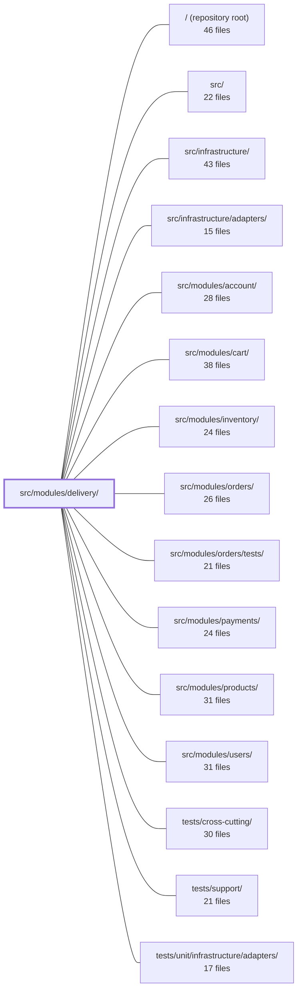

---
tags:
  - 2repo
  - 2repo/module
  - project/boilerplate-node-backend
type: module
module: src/modules/delivery/
files: 20
updated: 2026-09-02T18:33:36.069431+00:00
---

# src/modules/delivery/

## Purpose

The delivery module owns the full shipping lifecycle of an order: quoting shipping costs, creating a Shipment record when an order transitions to `shipped`, and advancing parcels to `delivered`. It exposes a small public HTTP API (shipping-method list, per-order shipment lookup, admin courier tick) and a read-only domain facade that other modules use for cost calculations.

## Key parts

- **Domain layer** (`domain/rates.ts`, `domain/index.ts`) — Static shipping-rate table and two pure pricing helpers (`findShippingMethod`, `priceShipping`). The barrel (`domain/index.ts`) lets callers import these without pulling in HTTP or service code.
- **Model & repository** (`model.ts`, `repository.ts`) — Mongoose `Shipment` schema (one-per-order unique index, `ShipmentStatus` enum, `trackingCode`, `deliveredAt`) and the data-access layer that adds batch export, idempotent creation, and atomic status transitions on top of the shared `createRepository` factory.
- **Service** (`service.ts`) — The business-logic orchestrator: reacts to `ORDER_STATUS_CHANGED` to create shipments, lists methods for checkout, performs ownership-scoped reads, runs the courier "tick," and supplies the batch export for account downloads.
- **HTTP surface** (`routes.ts`, `controllers/`, `openapi.yaml`) — Three endpoints (public methods list, per-order shipment read, admin advance) with per-route auth guards, plus the OpenAPI 3 contract that backs the contract tests.
- **Module wiring** (`module.ts`, `index.ts`, `audit.ts`) — `module.ts` is the declarative manifest (routes, event subscription, locale pointers); `index.ts` is the only facade siblings may import; `audit.ts` augments the global `AuditActionMap` with delivery-specific action types.
- **Emails** (`emails.ts`) — Resolves fully-interpolated, locale-aware dispatch-email copy at call time.
- **Tests** (`tests/`) — Unit (rates, routes, schema, emails), integration (service against real Mongo), and contract (HTTP responses vs. OpenAPI spec) suites.

## How it connects

- **`src/modules/orders/`** — The delivery module subscribes to the `ORDER_STATUS_CHANGED` domain event; when an order reaches `shipped` it creates the Shipment. It never drives the order's status machine itself. Ownership-scoped shipment reads are tied back to the owning order.
- **`src/modules/cart/`** — The cart checkout flow calls the pure pricing helpers in `domain/rates.ts` so that customers see shipping costs before purchase, keeping a single source of truth.
- **`src/modules/account/`** — The account module calls delivery's batch-read for the data-export feature. The `emails.ts` file mirrors the same i18n convention used by `@modules/account/emails`.
- **`src/infrastructure/`** — The repository is built on the shared `createRepository` factory; the mailer adapter (in infrastructure) renders the strings produced by `emails.ts`.
- **`src/modules/products/`** — The barrel-facade convention in `index.ts` (expose only the minimal read-only API to siblings) is the same pattern established by the products module.

## Where to start

1. **`module.ts`** — A short, purely declarative file that shows how the module plugs into the kernel: which routes are registered, which event it listens to, and where locale files live. Reading it first gives the full shape of the module without diving into logic.
2. **`service.ts`** — The core business flow. It ties together the event-driven shipment creation, the pricing lookup, the courier tick, and the ownership-scoped read in one file, making it the natural next step once you understand the wiring.

## Connected modules

[[boilerplate-node-backend_ROOT|/ (repository root)]] · [[boilerplate-node-backend_src|src/]] · [[boilerplate-node-backend_src_infrastructure|src/infrastructure/]] · [[boilerplate-node-backend_src_infrastructure_adapters|src/infrastructure/adapters/]] · [[boilerplate-node-backend_src_modules_account|src/modules/account/]] · [[boilerplate-node-backend_src_modules_cart|src/modules/cart/]] · [[boilerplate-node-backend_src_modules_inventory|src/modules/inventory/]] · [[boilerplate-node-backend_src_modules_orders|src/modules/orders/]] · [[boilerplate-node-backend_src_modules_orders_tests|src/modules/orders/tests/]] · [[boilerplate-node-backend_src_modules_payments|src/modules/payments/]] · [[boilerplate-node-backend_src_modules_products|src/modules/products/]] · [[boilerplate-node-backend_src_modules_users|src/modules/users/]] · [[boilerplate-node-backend_tests_cross-cutting|tests/cross-cutting/]] · [[boilerplate-node-backend_tests_support|tests/support/]] · [[boilerplate-node-backend_tests_unit_infrastructure_adapters|tests/unit/infrastructure/adapters/]]

## Files
- `src/modules/delivery/audit.ts` — Declares the set of audit actions the delivery module is allowed to emit, and registers them into the global `AuditActionMap` via TypeScript declaration merging. It exists as a side-effect module (no runtime import needed beyond the type augmentation) so that audit emissions are statically typed rather than free-form strings.
- `src/modules/delivery/controllers/get-shipment-by-order.ts` — Express route handler for `GET /delivery/order/:orderId`. Resolves the shipment (tracking code, arrival status) tied to a given order ID, intended for the order page's shipping panel once the order status is `shipped`.
- `src/modules/delivery/controllers/get-shipping-methods.ts` — Controller handler for the public `GET /delivery/methods` endpoint. It returns the shop's available shipping methods (flat rates and free-above thresholds) so that guests can see shipping costs before signing up.
- `src/modules/delivery/controllers/post-courier-advance.ts` — Handles the `POST /delivery/advance` admin endpoint. Because this repository deliberately has no scheduler, an operator (or a demo admin button) acts as the cron job: calling this endpoint simulates one courier "tick," advancing every parcel currently on a truck to its destination.
- `src/modules/delivery/domain/index.ts` — Barrel file that exposes the delivery domain's public API (shipping rates) without pulling in the module's HTTP/service surface. It exists so callers can import pure domain rules in isolation, as documented in `docs/theory/domain-layer.md`.
- `src/modules/delivery/domain/rates.ts` — Static shipping-rate table and two pure pricing helpers for the delivery domain. All shipping-cost logic lives here so that both the cart checkout flow and the delivery service derive quotes from a single source.
- `src/modules/delivery/emails.ts` — Resolves the user-facing copy for delivery emails into finished, fully-interpolated strings at call time. The caller passes the locale and variable values; the returned object is ready for the mailer to render without further i18n resolution. Follows the same convention as `@modules/account/emails`.
- `src/modules/delivery/index.ts` — Public barrel (module facade) for the Delivery module. It is the **only** import surface a sibling module is allowed to use (same convention as `modules/products/index.ts`). Its job is to expose the minimal read-only API other modules need while keeping the module's write surface (`shipOrder`, `runCourierAdvance`) and infrastructure (`shipmentRepository`) invisible.
- `src/modules/delivery/model.ts` — Defines the Mongoose schema, document interface, and compiled model for the **Shipment** entity — the per-order record that stores courier-specific facts (`trackingCode`, `deliveredAt`) the Order document has no field for. Enforces one-shipment-per-order via a `unique` index on `orderId`.
- `src/modules/delivery/module.ts` — Module manifest that registers the **delivery** feature with the application kernel. It wires up HTTP routes, subscribes to the `ORDER_STATUS_CHANGED` domain event (triggering shipment when an order transitions to `shipped`), and points to the module's locale files. All business logic lives elsewhere (`./service`, `./routes`, `./domain`); this file is purely declarative wiring.
- `src/modules/delivery/openapi.yaml` — OpenAPI 3.0.3 contract for the delivery module. It defines the three endpoints the module exposes (public shipping-method list, per-order shipment lookup, and an admin courier-advance action) plus the request/response schemas that back them. It exists so clients and other modules can discover the delivery API surface without reading implementation code.
- `src/modules/delivery/repository.ts` — Domain repository for Shipment documents. Wraps the shared `createRepository` factory with the Mongoose model, then layers the courier-specific lookups (order-to-shipment resolution, batch export, idempotent creation, and atomic status transitions) that the delivery service needs beyond plain CRUD.
- `src/modules/delivery/routes.ts` — Defines the Express route table for the delivery module, mapping three HTTP endpoints (shipping-methods lookup, per-order shipment read, courier advance tick) to their respective controllers with per-route authorization guards.
- `src/modules/delivery/service.ts` — Business-logic service for the delivery module. It handles shipment creation on `ORDER_STATUS_CHANGED`, exposes the shipping-methods list for checkout, reads a single shipment for an order (ownership-scoped), runs the "fake courier" tick that advances all shipped parcels to delivered, and provides a batch read for the account data export. The module never moves an order to `shipped` itself — it reacts to the order's status machine.
- `src/modules/delivery/tests/contract/api.contract.test.ts` — Contract tests for the three `/delivery` HTTP routes. Each test exercises one endpoint over real HTTP and asserts the response satisfies the registered OpenAPI spec (`toSatisfyApiSpec`). The file intentionally stops at contract conformance; courier ordering/advance logic is covered by the unit suite, not here.
- `src/modules/delivery/tests/integration/service.test.ts` — Integration test suite for the delivery module. It exercises the four public service functions (`priceShipping`/`findShippingMethod`, `shipOrder`, `runCourierAdvance`, `getForOrder`) against a real Mongo instance, and verifies the event-driven subscription that automatically creates a shipment when an order's status is moved to `shipped`. The mailer is mocked; everything else is live.
- `src/modules/delivery/tests/unit/emails.test.ts` — Unit tests for the `shipmentShippedEmail` builder. They pin down the customer-facing contract of the dispatch email: the tracking code must render as a real string (never an empty value or a `{{…}}` placeholder), the greeting must include the customer's name, every i18n copy slot must resolve to actual text rather than echoing a key, and the locale must drive a visibly different translation.
- `src/modules/delivery/tests/unit/rates.test.ts` — Unit tests for the pure shipping-rate domain functions (`findShippingMethod`, `priceShipping`) and the `SHIPPING_METHODS` table. No database or mocks are needed because the pricing logic is a static lookup plus a threshold check; this file exists to pin that behaviour in isolation from the persistence layer (which lives in `tests/integration/`).
- `src/modules/delivery/tests/unit/routes.test.ts` — Unit-test suite that pins the delivery module's route table: the exact set of endpoints, their order, and the per-route authentication guard on each. It exists to catch drift — especially a new route added without a guard — before it ships open.
- `src/modules/delivery/tests/unit/schema-contract.test.ts` — Contract test that pins the Mongoose `shipmentSchema` to its intended shape: required fields, the exactly-once unique index on `orderId`, the ObjectId reference to `Order`, the `ShipmentStatus` enum with its default, the absence of a default on `deliveredAt`, and the `timestamps` option. It exists so that any future schema change that breaks the one-parcel-per-order guarantee or the status lifecycle is caught in unit tests rather than in production dispatch.

---
[[boilerplate-node-backend_INDEX|← boilerplate-node-backend index]]
