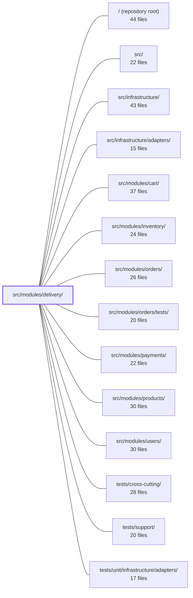

---
tags:
  - 2repo
  - 2repo/module
  - project/boilerplate-node-backend
type: module
module: src/modules/delivery/
files: 20
updated: 2026-08-31T20:53:51.596620+00:00
---

# src/modules/delivery/

## Purpose

The delivery module owns the per-order Shipment entity and all shipping-related logic: pricing shipping methods from a static rate table, creating a shipment record when an order transitions to `shipped`, simulating a courier "tick" that marks parcels as delivered (in lieu of a real scheduler), and sending the dispatch email. It exposes three HTTP endpoints (public method list, per-order shipment lookup, admin courier advance) and a minimal public API so sibling modules can call `priceShipping` / `findShippingMethod` without touching persistence or service internals.

## Key parts

- **Domain (pure logic)** — `domain/rates.ts` holds the `SHIPPING_METHODS` table and the two pure pricing helpers; `domain/index.ts` barrels them so callers import only rules, not HTTP or Mongo.
- **HTTP surface** — `routes.ts` maps the three endpoints to their controllers (`get-shipping-methods`, `get-shipment-by-order`, `post-courier-advance`) with per-route auth guards; `module.ts` is the manifest the kernel reads to register routes, locale files, and the event subscription.
- **Service & data** — `service.ts` orchestrates shipment creation on `ORDER_STATUS_CHANGED`, the courier-advance tick, and the read path; `repository.ts` provides CRUD plus domain lookups (idempotent create, in-transit listing, atomic status transition); `model.ts` defines the Mongoose `Shipment` schema with its unique `orderId` index.
- **Cross-cutting files** — `audit.ts` statically types the module's audit actions; `emails.ts` resolves i18n copy into ready-to-send strings; `openapi.yaml` documents the three endpoints for external consumers.
- **Tests** — Unit suites pin the rate table, email builder, route table, and schema shape; the integration suite exercises the service against real Mongo; the contract suite verifies each HTTP response against the OpenAPI spec.

## How it connects

- **`src/modules/orders/`** — The delivery service subscribes to `ORDER_STATUS_CHANGED`; when an order reaches `shipped` it creates the Shipment and sends the dispatch email, then (after courier advance) emits the event back so the order can progress to `delivered`. The module never mutates order status directly.
- **`src/modules/cart/`** — The cart checkout flow imports `priceShipping` / `findShippingMethod` through the public barrel (`index.ts`) to display shipping costs at the same rate source the delivery service uses.
- **`src/modules/users/`** — `emails.ts` resolves the customer's name and locale at call time; the mailer (lives in `src/infrastructure/`) renders the final string.
- **`src/infrastructure/`** — The shared repository factory underpins `repository.ts`; the mailer adapter consumes the strings `emails.ts` produces.
- **`src/modules/products/`** — Shares the same architectural rule: sibling modules may only import through `index.ts`, never into internal service/repository files.

## Where to start

Read `src/modules/delivery/domain/rates.ts` first — it is short, dependency-free, and shows the single source of truth for shipping pricing that the rest of the module (and cart) builds on. Then move to `src/modules/delivery/service.ts` to see how the event subscription, shipment creation, and courier tick tie the domain rules to the Mongoose repository and the mailer.

## Connected modules

[[boilerplate-node-backend_ROOT|/ (repository root)]] · [[boilerplate-node-backend_src|src/]] · [[boilerplate-node-backend_src_infrastructure|src/infrastructure/]] · [[boilerplate-node-backend_src_infrastructure_adapters|src/infrastructure/adapters/]] · [[boilerplate-node-backend_src_modules_cart|src/modules/cart/]] · [[boilerplate-node-backend_src_modules_inventory|src/modules/inventory/]] · [[boilerplate-node-backend_src_modules_orders|src/modules/orders/]] · [[boilerplate-node-backend_src_modules_orders_tests|src/modules/orders/tests/]] · [[boilerplate-node-backend_src_modules_payments|src/modules/payments/]] · [[boilerplate-node-backend_src_modules_products|src/modules/products/]] · [[boilerplate-node-backend_src_modules_users|src/modules/users/]] · [[boilerplate-node-backend_tests_cross-cutting|tests/cross-cutting/]] · [[boilerplate-node-backend_tests_support|tests/support/]] · [[boilerplate-node-backend_tests_unit_infrastructure_adapters|tests/unit/infrastructure/adapters/]]

## Files
- `src/modules/delivery/audit.ts` — Declares the set of audit actions the delivery module is allowed to emit, and registers them into the global `AuditActionMap` via TypeScript declaration merging. It exists as a side-effect module (no runtime import needed beyond the type augmentation) so that audit emissions are statically typed rather than free-form strings.
- `src/modules/delivery/controllers/get-shipment-by-order.ts` — Express route handler for `GET /delivery/order/:orderId`. Resolves the shipment (tracking code, arrival status) tied to a given order ID, intended for the order page's shipping panel once the order status is `shipped`.
- `src/modules/delivery/controllers/get-shipping-methods.ts` — Controller handler for the public `GET /delivery/methods` endpoint. It returns the shop's available shipping methods (flat rates and free-above thresholds) so that guests can see shipping costs before signing up.
- `src/modules/delivery/controllers/post-courier-advance.ts` — Handles the `POST /delivery/advance` admin endpoint. Because this repository deliberately has no scheduler, an operator (or a demo admin button) acts as the cron job: calling this endpoint simulates one courier "tick," advancing every parcel currently on a truck to its destination.
- `src/modules/delivery/domain/index.ts` — Barrel file that exposes the delivery domain's public API (shipping rates) without pulling in the module's HTTP/service surface. It exists so callers can import pure domain rules in isolation, as documented in `docs/theory/domain-layer.md`.
- `src/modules/delivery/domain/rates.ts` — Static shipping-rate table and two pure pricing helpers for the delivery domain. All shipping-cost logic lives here so that both the cart checkout flow and the delivery service derive quotes from a single source.
- `src/modules/delivery/emails.ts` — Resolves the user-facing copy for delivery emails into finished, fully-interpolated strings at call time. The caller passes the locale and variable values; the returned object is ready for the mailer to render without further i18n resolution. Follows the same convention as `@modules/account/emails`.
- `src/modules/delivery/index.ts` — Public barrel for the delivery module. It is the **only** surface a sibling module may import (same rule as `modules/products/index.ts`), re-exporting exactly two pure functions from `./domain` so that external callers can price a shipping method without learning that shipments, couriers, or a `shipmentRepository` exist.
- `src/modules/delivery/model.ts` — Defines the Mongoose schema, document interface, and compiled model for the **Shipment** entity — the per-order record that stores courier-specific facts (`trackingCode`, `deliveredAt`) the Order document has no field for. Enforces one-shipment-per-order via a `unique` index on `orderId`.
- `src/modules/delivery/module.ts` — Manifest file for the delivery module. Registers the module's HTTP routes, its locale files, and its single domain-event subscription (auto-ship when an order reaches `shipped`) so the kernel can wire it up without the module self-bootstrapping.
- `src/modules/delivery/openapi.yaml` — OpenAPI 3.0.3 contract for the delivery module. It defines the three endpoints the module exposes (public shipping-method list, per-order shipment lookup, and an admin courier-advance action) plus the request/response schemas that back them. It exists so clients and other modules can discover the delivery API surface without reading implementation code.
- `src/modules/delivery/repository.ts` — Defines the shipment repository for the delivery module: the standard CRUD surface provided by the shared repository factory, plus four domain-specific lookups the courier service relies on (order-based retrieval, idempotent creation, listing in-transit parcels, and atomic conditional status transitions).
- `src/modules/delivery/routes.ts` — Defines the Express route table for the delivery module, mapping three HTTP endpoints (shipping-methods lookup, per-order shipment read, courier advance tick) to their respective controllers with per-route authorization guards.
- `src/modules/delivery/service.ts` — Service layer for the delivery module. It owns three responsibilities triggered by the order lifecycle: idempotent parcel creation and email notification when an order transitions to `shipped`, and the "fake courier" tick that moves all shipped parcels to `delivered`. It also exposes a read path for fetching a shipment and a static list of shipping methods. The file never mutates order status itself; it reacts to `ORDER_STATUS_CHANGED` and emits it back after courier delivery.
- `src/modules/delivery/tests/contract/api.contract.test.ts` — Contract (API-spec) tests for the three `/delivery` routes. Each test issues a real HTTP request and asserts the response both matches the OpenAPI-style spec (via `toSatisfyApiSpec`) and hits the expected status/body shape for a specific audience: public (methods list), owner (shipment read), and staff (courier advance). The file exists to pin that every contract branch is reachable over HTTP; the courier's business-logic rules are deliberately left to the unit suite.
- `src/modules/delivery/tests/integration/service.test.ts` — Integration test suite for the delivery module. It exercises the four public service functions (`priceShipping`/`findShippingMethod`, `shipOrder`, `runCourierAdvance`, `getForOrder`) against a real Mongo instance, and verifies the event-driven subscription that automatically creates a shipment when an order's status is moved to `shipped`. The mailer is mocked; everything else is live.
- `src/modules/delivery/tests/unit/emails.test.ts` — Unit tests for the `shipmentShippedEmail` builder. They pin down the customer-facing contract of the dispatch email: the tracking code must render as a real string (never an empty value or a `{{…}}` placeholder), the greeting must include the customer's name, every i18n copy slot must resolve to actual text rather than echoing a key, and the locale must drive a visibly different translation.
- `src/modules/delivery/tests/unit/rates.test.ts` — Unit tests for the pure shipping-rate domain functions (`findShippingMethod`, `priceShipping`) and the `SHIPPING_METHODS` table. No database or mocks are needed because the pricing logic is a static lookup plus a threshold check; this file exists to pin that behaviour in isolation from the persistence layer (which lives in `tests/integration/`).
- `src/modules/delivery/tests/unit/routes.test.ts` — Unit-test suite that pins the delivery module's route table: the exact set of endpoints, their order, and the per-route authentication guard on each. It exists to catch drift — especially a new route added without a guard — before it ships open.
- `src/modules/delivery/tests/unit/schema-contract.test.ts` — Contract test that pins the Mongoose `shipmentSchema` to its intended shape: required fields, the exactly-once unique index on `orderId`, the ObjectId reference to `Order`, the `ShipmentStatus` enum with its default, the absence of a default on `deliveredAt`, and the `timestamps` option. It exists so that any future schema change that breaks the one-parcel-per-order guarantee or the status lifecycle is caught in unit tests rather than in production dispatch.

---
[[boilerplate-node-backend_INDEX|← boilerplate-node-backend index]]
