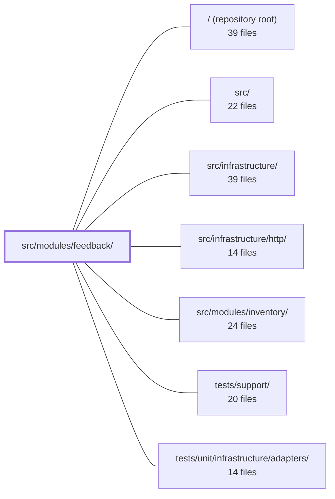

---
tags:
  - 2repo
  - 2repo/module
  - project/boilerplate-node-backend
type: module
module: src/modules/feedback/
files: 19
updated: 2026-08-28T11:59:21.997518+00:00
---

# src/modules/feedback/

## Purpose

The feedback module handles the full lifecycle of customer contact/feedback tickets: a public, unauthenticated submission endpoint for visitors, and a set of admin-only endpoints for operators to search, review, and update ticket status. It also owns the operator notification email that fires when a new contact request arrives. By design it is a leaf in both dependency directions — it neither reads from nor writes to any other module's data — so the public form stays accessible and the module stays decoupled from `users` or other domain modules.

## Key parts

- **Domain core** — `model.ts` (Mongoose schema + serialization transform), `repository.ts` (thin CRUD layer over the shared base-repository factory), and `service.ts` (business rules: status mapping, `respondedAt` stamping, audit emission, email dispatch) form the three-layer stack controllers call into.
- **HTTP layer** — `routes.ts` wires the Express router with the public `POST /contact` route above the auth/admin middleware gate and all operator routes below it. The `controllers/` directory holds three thin handlers: `post-feedback-contact.ts` (validate + create), `get-feedback.ts` (search/paginate), and `put-feedback-status.ts` (admin status update).
- **Module registration & audit** — `module.ts` declares the name, base path, routes, and locales the kernel mounts. `audit.ts` augments the shared `AuditActionMap` with feedback-specific action strings so downstream log tooling and dashboards get a stable, type-safe wire contract.
- **Email** — `emails.ts` assembles the fully-translated `EmailContent` for the operator notification from a `ContactRequest` payload + locale, so the mailer adapter never resolves language.
- **API contract** — `openapi.yaml` is the single source of truth for orval code generation and API validation, covering the public write endpoint and the admin read/search/update endpoints.
- **Tests** — `tests/` contains unit tests (audit strings, email composition, route order, schema shape), integration tests (model serialization, service semantics, schema contract against real MongoDB), and a contract test suite that guards the public/admin security boundary.

## How it connects

- **`src/infrastructure/`** — The module depends on the shared base-repository factory (used by `repository.ts`), the mailer adapter (consumed via the `EmailContent` object from `emails.ts`), and HTTP middleware (cache + auth) attached in `routes.ts`.
- **`src/` (repository-level types)** — `audit.ts` performs a TypeScript module augmentation on the app-wide `AuditAction` union, coupling only at the type level so external tooling can reference the action strings without a runtime import.
- **`src/modules/inventory/`** and **`src/modules/account/`** — These share the same per-module augmentation and base-repository patterns (the audit file explicitly mirrors `modules/account/audit.ts`), but there is no runtime import or data dependency between feedback and sibling domain modules.
- **`tests/support/` & `tests/unit/infrastructure/adapters/`** — Provide the test harness (mock mailer, DB fixtures, `toSatisfyApiSpec` helper) that the feedback test suites consume.

## Where to start

Read **`module.ts`** first — it's a short file that names the module, lists its routes, locales, and the intentional decoupling constraint, giving you the boundary in under a minute. Then move to **`service.ts`**, which holds every business rule (status transitions, `respondedAt` stamping, audit + email side-effects) in one place and is the natural anchor for understanding what the controllers and repository exist to support.

## Connected modules

[[boilerplate-node-backend_ROOT|/ (repository root)]] · [[boilerplate-node-backend_src|src/]] · [[boilerplate-node-backend_src_infrastructure|src/infrastructure/]] · [[boilerplate-node-backend_src_infrastructure_http|src/infrastructure/http/]] · [[boilerplate-node-backend_src_modules_inventory|src/modules/inventory/]] · [[boilerplate-node-backend_tests_support|tests/support/]] · [[boilerplate-node-backend_tests_unit_infrastructure_adapters|tests/unit/infrastructure/adapters/]]

## Files
- `src/modules/feedback/audit.ts` — Declares the audit action strings for the feedback module and registers them into the shared `AuditActionMap` via TypeScript module augmentation. It exists so that feedback-related audit events are type-safe and scoped to this module, following the same per-module augmentation pattern used by `modules/account/audit.ts`.
- `src/modules/feedback/controllers/get-feedback.ts` — Single controller for searching and paginating feedback tickets. Serves both the cacheable query form (`GET /feedback`) and the admin body form (`POST /feedback/search`) through one function, delegating all data access to the feedback service.
- `src/modules/feedback/controllers/post-feedback-contact.ts` — Controller handler for `POST /feedback/contact` (public endpoint). It validates the raw request body against a Zod schema and delegates to the feedback service to create a ticket and dispatch a support-notification email. The controller itself contains no business logic beyond validation and response shaping.
- `src/modules/feedback/controllers/put-feedback-status.ts` — Handles the `PUT /feedback/:id` admin endpoint. It validates the incoming body (status + optional admin notes), delegates to the feedback service to update a ticket, and maps the service result onto an HTTP response.
- `src/modules/feedback/emails.ts` — Provides the resolved email copy for the feedback module's contact-request notification. It turns a `ContactRequest` payload and a locale string into a fully-translated `EmailContent` object that the mailer adapter can render. It exists so the sending worker never resolves language or assembles strings — it just ships what this file produces.
- `src/modules/feedback/model.ts` — Defines the Mongoose schema, document type, and model for the `FeedbackRequest` collection. It exists to bridge the API-generated `FeedbackRequest` type (string dates) with MongoDB's native `Date` handling and to centralize the serialization transform used whenever feedback records are returned to callers.
- `src/modules/feedback/module.ts` — Declares the feedback module's registration metadata (name, base path, routes, locales) so the kernel can mount a generic contact-and-triage endpoint. It is intentionally a leaf in both dependency directions — it neither reads from nor writes to any other module's data — because the form must remain accessible to unauthenticated visitors and must not couple to the `users` module.
- `src/modules/feedback/openapi.yaml` — OpenAPI 3.0.3 contract for the feedback module, defining the public contact-submission endpoint, the authenticated admin review/search/update endpoints, and the module-local schemas they consume. It serves as the single source of truth for code generation (orval) and API validation for this module.
- `src/modules/feedback/repository.ts` — Thin repository layer for `FeedbackRequest` documents. It delegates all CRUD logic to the shared base-repository factory, supplying only the module-specific model, transform, and search configuration. This keeps the feedback module free of raw query code while giving the service a standard repository interface.
- `src/modules/feedback/routes.ts` — Defines the Express route table for the feedback module: one public contact-form endpoint for visitors and a set of admin-only read/update endpoints for operators. It wires each route to its controller and attaches cache / authorization middleware in the correct order.
- `src/modules/feedback/service.ts` — Domain service for feedback-request lifecycle: creating contact submissions, searching/filtering them, and updating their status. It sits between the HTTP controllers and the repository, owning the rules for status mapping, operator notification email, and audit emission so that no controller duplicates that logic.
- `src/modules/feedback/tests/contract/api.contract.test.ts` — Contract tests for every `/feedback` endpoint, verifying that actual HTTP responses satisfy the published API spec (via `toSatisfyApiSpec`). The suite specifically guards the security boundary where a public write endpoint (`POST /feedback/contact`, `security: []`) coexists with admin-only read/write routes, ensuring public responses never leak admin fields and admin routes return 401/403 rather than data.
- `src/modules/feedback/tests/integration/model.test.ts` — Integration test that verifies feedback request documents never expose Mongoose-internal fields (`_id`, `__v`) in serialized output, covering both the hydrated-document path (`toJSON`) and the lean-query path (manually mapped via the service's `search` method).
- `src/modules/feedback/tests/integration/schema-contract.test.ts` — Integration test that pins the **Mongoose schema declarations** for the feedback-request document — defaults, required fields, enum constraints, and serialization shape. Sibling specs in this folder cover repository behavior; this file exists because the schema itself is part of the public API contract and is not exercised anywhere else. It runs against a real MongoDB instance because it asserts Mongoose semantics (default application, `required`, `select: false`, `toJSON`), which a mock would only simulate.
- `src/modules/feedback/tests/integration/service.test.ts` — Integration test suite for the feedback service. Exercises `create`, `search`, `updateStatus`, and `updateStatusById` against a real test database to verify input normalisation, search/filter/pagination semantics, status-transition side-effects (especially `respondedAt` stamping), and the 404 contract of the ID-based update path.
- `src/modules/feedback/tests/unit/audit.test.ts` — Unit test that pins the feedback module's audit action strings to their exact wire-contract values and verifies they are registered in the app-wide `AuditAction` union. It exists because these strings are read by external log tooling, dashboards, and alert rules that do not get refactored alongside this codebase.
- `src/modules/feedback/tests/unit/emails.test.ts` — Unit tests for `contactRequestEmail`, the builder that assembles the notification email an **operator** receives when a customer submits a contact request. The suite pins down decisions that are easy to regress silently: subject-line composition, name fallback semantics, field labeling, and locale propagation.
- `src/modules/feedback/tests/unit/routes.test.ts` — Unit tests that pin the **positional** structure of the feedback router: the single public `POST /contact` route must sit *above* the `router.use(getAuth, isAuth, isAdmin)` gate, and every other route must sit *below* it. The tests also verify the exact route table (signatures and order) and the shared cache configuration between the admin listing and search endpoints.
- `src/modules/feedback/tests/unit/schema-contract.test.ts` — Contract test that locks in the shape of `feedbackRequestSchema` — required fields, defaults, enum bounds, index spec, and Mongoose options. Its role is to make any unintended schema drift (a new required field, a changed default, a missing index) a visible test failure rather than a silent behavior shift.

---
[[boilerplate-node-backend_INDEX|← boilerplate-node-backend index]]
