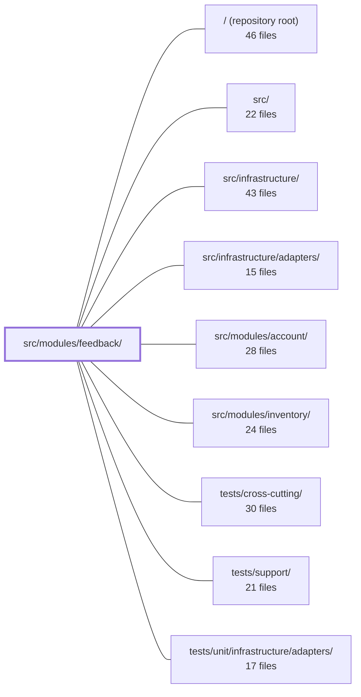

---
tags:
  - 2repo
  - 2repo/module
  - project/boilerplate-node-backend
type: module
module: src/modules/feedback/
files: 21
updated: 2026-09-02T18:33:51.861197+00:00
---

# src/modules/feedback/

## Purpose

The feedback module handles the site's public contact form and the admin-only triage workflow that follows. It is the only module in the application that exposes a write endpoint to unauthenticated visitors (`POST /feedback/contact`); every other route in the module is gated behind admin authorization. Submissions carry a stranger's email address and free-text content, so all admin reads and writes are audit-logged for data-protection compliance.

## Key parts

- **Registration & routing** — `module.ts` registers the module (name, base path, router, locale directory) in the application registry; `routes.ts` defines the route table with a critical positional constraint: the single public route sits *above* a `router.use(getAuth, isAuth, isAdmin)` gate, so everything below that line is automatically admin-only.
- **Domain model & persistence** — `model.ts` defines the Mongoose schema, indexes, serialization contract (`id` exposed, `_id`/`__v` hidden), and TTL retention for the `FeedbackRequest` collection; `repository.ts` wires the model into the shared `createRepository` factory to produce a ready-made CRUD/search interface.
- **Service** — `service.ts` is the single place where business logic lives: ticket creation (with operator email dispatch), paginated search, status/notes transitions, permanent deletion, and `findOwnTickets` for account data-export. All audit emissions originate here.
- **Controllers** — Thin HTTP handlers in `controllers/` (get, put, delete, post-contact). Each parses input, extracts auth context, delegates to the service, and shapes the response. The delete handler is hand-written (no soft-delete tier) rather than produced by the shared factory.
- **Emails & audit** — `emails.ts` resolves i18n strings into a finished `EmailContent` object for the mailer adapter; `audit.ts` declares the feedback-specific audit-action strings and registers them into the application-wide `AuditActionMap`.
- **API contract** — `openapi.yaml` documents all five endpoints and their schemas, serving as the source of truth for code generation (orval) and external documentation.
- **Public barrel** — `index.ts` re-exports only `findOwnTickets` so sibling modules (e.g. account data-export) have a single import path; all other internals stay encapsulated.
- **Tests** — Unit tests pin audit-action string values, email assembly, schema contract, and router mount order; integration tests run against a real Mongo instance to verify serialization, search, status side-effects, and deletion; the contract test suite guards that public responses leak no admin fields and that every endpoint satisfies the published OpenAPI spec.

## How it connects

- **`src/infrastructure/`** — Consumes the shared `createRepository` factory, the `AuditActionMap` augmentation point, i18n string resolution, and the common auth middleware (`getAuth`, `isAuth`, `isAdmin`) used in the route gate.
- **`src/infrastructure/adapters/`** — `emails.ts` produces the `EmailContent` payload that the mailer adapter dispatches to the support mailbox on new submissions.
- **`src/modules/account/`** — Imports `findOwnTickets` from the feedback barrel (`index.ts`) to include a visitor's feedback tickets in an account data-export request.
- **`tests/support/` & `tests/cross-cutting/`** — Provides shared test utilities (`setupTestDb`, fixture helpers) used by the module's integration and contract suites.

## Where to start

1. **`routes.ts`** — Five lines of middleware ordering explain the module's entire security model (public vs. admin) and the "mount above the gate" rule that future route additions must respect.
2. **`service.ts`** — Reading the create/search/update/delete flows here gives the full business picture (email dispatch, audit emission, status semantics) before diving into the thin controllers or the schema.

## Connected modules

[[boilerplate-node-backend_ROOT|/ (repository root)]] · [[boilerplate-node-backend_src|src/]] · [[boilerplate-node-backend_src_infrastructure|src/infrastructure/]] · [[boilerplate-node-backend_src_infrastructure_adapters|src/infrastructure/adapters/]] · [[boilerplate-node-backend_src_modules_account|src/modules/account/]] · [[boilerplate-node-backend_src_modules_inventory|src/modules/inventory/]] · [[boilerplate-node-backend_tests_cross-cutting|tests/cross-cutting/]] · [[boilerplate-node-backend_tests_support|tests/support/]] · [[boilerplate-node-backend_tests_unit_infrastructure_adapters|tests/unit/infrastructure/adapters/]]

## Files
- `src/modules/feedback/audit.ts` — Declares the feedback module's audit-action vocabulary and registers those actions into the application-wide `AuditActionMap` via TypeScript module augmentation. The file exists so that every admin read and write of feedback (which carries a stranger's email and free-text content) is recorded for data-protection compliance — a requirement the public product catalogue does not have.
- `src/modules/feedback/controllers/delete-feedback.ts` — Express handler for `DELETE /feedback/:id` (admin-only, permanent deletion of a feedback ticket). It is hand-written rather than produced by the shared `createDeleteController` factory because the feedback module has no soft-delete tier, so the triplet abstraction would be misleading.
- `src/modules/feedback/controllers/get-feedback.ts` — Controller for the admin feedback-triage queue. Handles two transports for the same search — `GET /feedback` (cacheable query-string form) and `POST /feedback/search` (body form for filters too broad for a URL) — by reading a unified input, validating pagination, and delegating to the feedback service.
- `src/modules/feedback/controllers/post-feedback-contact.ts` — Handler for `POST /feedback/contact`, the module's sole public write endpoint. It validates the incoming body with a Zod schema, delegates ticket creation and support-notification to the feedback service, and returns a `201` with the created record. It is mounted above (not exempted from) the admin gate in `../routes`.
- `src/modules/feedback/controllers/put-feedback-status.ts` — Admin-facing handler for `PUT /feedback/:id` that validates the request body, delegates the status/notes update to the feedback service, and shapes the HTTP response. Exists to keep route-level parsing, authorization context extraction, and error handling in one thin layer separate from business logic.
- `src/modules/feedback/emails.ts` — Defines the operator-facing email copy for new contact-form submissions in the feedback module. It resolves i18n strings into a fully-rendered `EmailContent` object that the mailer adapter can dispatch to the support mailbox. Language is an argument; the output is finished text.
- `src/modules/feedback/index.ts` — Public barrel for the feedback module. It exposes the module's sole cross-module API (`findOwnTickets`) so that sibling modules can import from this single file, while all other internal logic (triage, staff search, status transitions) remains encapsulated in `./service`.
- `src/modules/feedback/model.ts` — Defines the Mongoose schema, model, and document interface for the `FeedbackRequest` collection. Exists as the single source of truth for the collection's shape, indexes, and serialization contract, bridging the API-generated `FeedbackRequest` type (ISO-string dates) to Mongoose's native `Date` fields.
- `src/modules/feedback/module.ts` — Module manifest for the **feedback** (contact-form) module. It registers the module's name, base path, Express router, and locale directory into the application's module registry. The module handles open contact requests (filed by anyone with or without an account) and admin-only triage.
- `src/modules/feedback/openapi.yaml` — OpenAPI 3.0.3 contract for the feedback module. Defines the five endpoints (submit, list, search, update-status, delete) and all module-local schemas that govern the feedback/contact-request workflow. Serves as the single source of truth for code generation (orval) and API documentation for this module.
- `src/modules/feedback/repository.ts` — Declares the feedback-request repository instance using the shared `createRepository` factory. It wires the domain model, document transform, and searchable-field spec together so that the service layer gets a ready-made CRUD/search interface without reimplementing persistence logic.
- `src/modules/feedback/routes.ts` — Express route table for the feedback/contact module. Defines one public endpoint (visitor contact form) and a set of admin-only endpoints for reading, updating, and deleting feedback submissions. The critical architectural constraint is positional: the single public route is mounted *above* a `router.use(getAuth, isAuth, isAdmin)` gate, so any route added below that line is automatically admin-only.
- `src/modules/feedback/service.ts` — Domain service for feedback tickets: creates contact requests (with an operator notification email), searches them with pagination, triages status, and supports deletion and account data-export retrieval. It is the single place where the feedback write-path, read-path, and audit emissions live, so controllers stay thin.
- `src/modules/feedback/tests/contract/api.contract.test.ts` — Contract test suite for the `/feedback` API — the only resource with a genuinely public write endpoint (`POST /feedback/contact`, `security: []`) alongside admin-only routes. Guards that public responses carry no admin fields, that admin routes return 401/403 rather than leaking data, and that every endpoint's response shape satisfies the published API spec. Records are created through the public endpoint itself (no fixture builder exists) so the payload under assertion is what the app actually produces.
- `src/modules/feedback/tests/integration/model.test.ts` — Integration test that verifies feedback-request documents never expose internal MongoDB fields (`_id`, `__v`) to consumers. It covers both serialization paths: a hydrated Mongoose document (via `toJSON`) and a `.lean()` list result (via the service's `search` method, which maps results through a manual transform).
- `src/modules/feedback/tests/integration/schema-contract.test.ts` — Integration test that verifies the Mongoose schema's **serialization contract** for feedback requests (e.g. `toJSON` exposes `id` and omits `_id`/`__v`). It runs against a real Mongo instance because these guarantees come from Mongoose's schema definitions, not application logic—a mocked model would only assert the mock's interpretation of `default` or `toJSON`.
- `src/modules/feedback/tests/integration/service.test.ts` — Integration test suite for the feedback request service. It runs against a real database (`setupTestDb`) to pin contract-level behaviours that unit tests with in-memory fakes cannot catch: input normalisation on `create`, honeypot spam disposition, `search` filtering/pagination/meta coherence, `updateStatus` side-effects (persistence, `adminNotes` clear, `respondedAt` stamp-once semantics), and `remove`.
- `src/modules/feedback/tests/unit/audit.test.ts` — Pins the exact string values of the `feedbackAuditActions` object exported by the feedback audit module. These strings are a wire contract consumed by external log queries and alert rules; a rename would pass type-checking but silently stop alerts firing. This test acts as the single source-of-truth assertion on the *values*, not just the shape.
- `src/modules/feedback/tests/unit/emails.test.ts` — Unit tests for `contactRequestEmail`, verifying that the operator-facing notification email is assembled correctly: the right template is chosen, the subject embeds the ticket's own subject after a translated prefix, all sender fields pass through unchanged, missing/blank names fall back to translated copy, every field carries a translated label, and locale drives the translation.
- `src/modules/feedback/tests/unit/routes.test.ts` — Unit tests that pin the feedback router's mount order, positional auth gate, shared cache key, and rate-limit placement. The file exists because `router.use(getAuth, isAuth, isAdmin)` is a positional guard — nothing in the per-route middleware would reveal a misplacement — so assertions must verify *order + guards* together.
- `src/modules/feedback/tests/unit/schema-contract.test.ts` — Contract tests for `feedbackRequestSchema`. Encodes the business rule that a stranger may reach operators only if the schema captures enough to reply (email, subject, message) while keeping the name optional. Verifies required/optional fields, operator-side defaults (or lack thereof), the status enum, index layout, and the TTL retention policy so that schema drift is caught at the unit level.

---
[[boilerplate-node-backend_INDEX|← boilerplate-node-backend index]]
