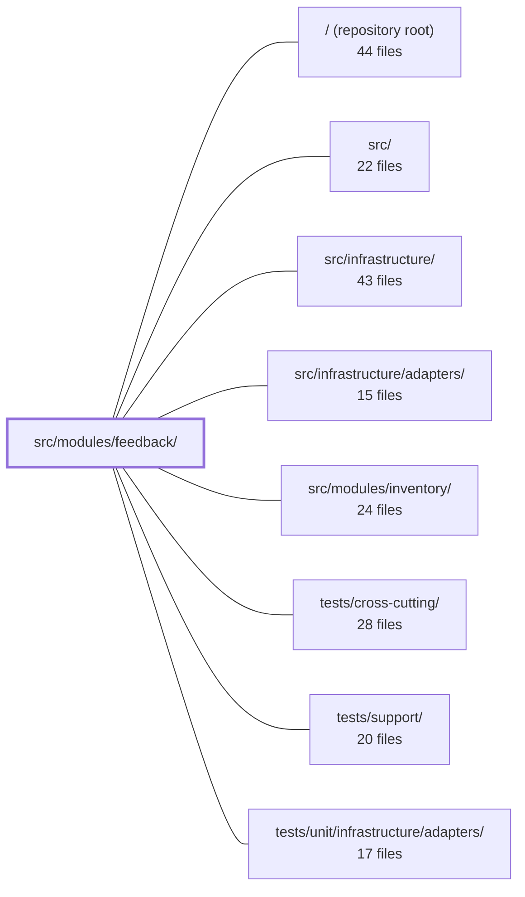

---
tags:
  - 2repo
  - 2repo/module
  - project/boilerplate-node-backend
type: module
module: src/modules/feedback/
files: 19
updated: 2026-08-31T20:54:14.415012+00:00
---

# src/modules/feedback/

## Purpose

The feedback module implements an open contact-form workflow: any visitor (account optional) can submit a request, and authenticated admins can search, read, and triage those tickets. It owns the domain model, the "create + notify operator" pairing, the audit-action vocabulary, and the published API contract for this resource.

## Key parts

- **Domain & persistence** — `model.ts` (Mongoose schema, `FeedbackRequest` document, and serialization transform), `repository.ts` (wires the shared `createRepository` factory to expose CRUD/search to the service), `service.ts` (business rules: ticket creation with email dispatch, paginated search with status filtering, one-shot status triage).
- **HTTP layer** — `routes.ts` (Express route table; a single positional `router.use` auth gate separates the one public route from the admin-only routes), `controllers/` (three thin handlers: `get-feedback.ts` for the triage queue, `post-feedback-contact.ts` for the public write, `put-feedback-status.ts` for status/notes updates).
- **Cross-cutting concerns** — `audit.ts` (declares the module's audit-action strings and registers them into the app-wide `AuditActionMap`), `emails.ts` (resolves i18n templates into a ready-to-send `EmailContent` object for the support mailbox).
- **Module wiring & contract** — `module.ts` (the `AppModule` manifest: name, route table, locale path), `openapi.yaml` (OpenAPI 3.0.3 spec for all four endpoints; source of truth for orval code generation and API docs).
- **Tests** — `tests/` contains unit, integration, and contract specs covering the schema, service, routes, audit strings, email assembly, and the public-vs-admin response boundary.

## How it connects

- **`src/infrastructure/` & `src/infrastructure/adapters/`** — the repository uses the shared `createRepository` factory from infrastructure; `emails.ts` produces an `EmailContent` object that the mailer adapter (in `infrastructure/adapters/`) dispatches to the support mailbox.
- **`tests/cross-cutting/`** — the audit-action strings declared in `audit.ts` are also asserted at the application level by the cross-cutting shape-only suite; the module's own `tests/unit/audit.test.ts` pins the exact string values that external log queries depend on.
- **`tests/support/` / `tests/unit/infrastructure/adapters/`** — test helpers and adapter-level tests underpin the integration and contract suites in `tests/`.

## Where to start

1. **`module.ts`** — a short file that names the module, points to its route table, and shows how the kernel registers it. Reading it first gives you the "what and where" before diving into logic.
2. **`service.ts`** — the single place where the three business operations (create + notify, search, status update) live. Understanding its input/output shapes makes the controllers, repository, and tests much easier to follow.

## Connected modules

[[boilerplate-node-backend_ROOT|/ (repository root)]] · [[boilerplate-node-backend_src|src/]] · [[boilerplate-node-backend_src_infrastructure|src/infrastructure/]] · [[boilerplate-node-backend_src_infrastructure_adapters|src/infrastructure/adapters/]] · [[boilerplate-node-backend_src_modules_inventory|src/modules/inventory/]] · [[boilerplate-node-backend_tests_cross-cutting|tests/cross-cutting/]] · [[boilerplate-node-backend_tests_support|tests/support/]] · [[boilerplate-node-backend_tests_unit_infrastructure_adapters|tests/unit/infrastructure/adapters/]]

## Files
- `src/modules/feedback/audit.ts` — Declares the audit-action vocabulary owned by the feedback module and registers it into the application-wide `AuditActionMap` via TypeScript module augmentation. Both reads and writes are audited because feedback rows contain a third party's email and free text, making "who viewed this" a data-protection concern that does not apply to, e.g., public product catalogue reads.
- `src/modules/feedback/controllers/get-feedback.ts` — Controller for the admin feedback-triage queue. Handles two transports for the same search — `GET /feedback` (cacheable query-string form) and `POST /feedback/search` (body form for filters too broad for a URL) — by reading a unified input, validating pagination, and delegating to the feedback service.
- `src/modules/feedback/controllers/post-feedback-contact.ts` — Handler for `POST /feedback/contact`, the module's sole public write endpoint. It validates the incoming body with a Zod schema, delegates ticket creation and support-notification to the feedback service, and returns a `201` with the created record. It is mounted above (not exempted from) the admin gate in `../routes`.
- `src/modules/feedback/controllers/put-feedback-status.ts` — Admin-facing handler for `PUT /feedback/:id` that validates the request body, delegates the status/notes update to the feedback service, and shapes the HTTP response. Exists to keep route-level parsing, authorization context extraction, and error handling in one thin layer separate from business logic.
- `src/modules/feedback/emails.ts` — Defines the operator-facing email copy for new contact-form submissions in the feedback module. It resolves i18n strings into a fully-rendered `EmailContent` object that the mailer adapter can dispatch to the support mailbox. Language is an argument; the output is finished text.
- `src/modules/feedback/model.ts` — Defines the Mongoose schema, document type, and model for the `FeedbackRequest` collection. It bridges the API-generated TypeScript type (which uses ISO strings for timestamps) and Mongoose's native `Date` storage, and exposes a serialization transform so lean query results can be shaped identically to hydrated documents.
- `src/modules/feedback/module.ts` — Declares the manifest for the **feedback** module — an open contact form where anyone (with or without an account) can file a request and admins triage it. This file wires together the module's name, route table, and locale path into a single `AppModule`-shaped export so the kernel can register it.
- `src/modules/feedback/openapi.yaml` — OpenAPI 3.0.3 contract for the feedback module. Defines the four endpoints (submit, list, search, update) and all request/response schemas for the feedback & contact-request workflow, serving as the single source of truth for code generation (orval) and API documentation.
- `src/modules/feedback/repository.ts` — Declares the feedback-request repository instance using the shared `createRepository` factory. It wires the domain model, document transform, and searchable-field spec together so that the service layer gets a ready-made CRUD/search interface without reimplementing persistence logic.
- `src/modules/feedback/routes.ts` — Defines the Express route table for the feedback/contact module. It exposes one public visitor route (the contact form) and a set of admin-only routes for reading and updating submitted feedback. The single positional auth gate (`router.use`) separates the two halves.
- `src/modules/feedback/service.ts` — Domain service for feedback (contact) tickets: creating a ticket with operator notification, paginated search, and status triage. Sits between the thin HTTP controllers and the repository, owning the one non-trivial mapping rule (raw string → closed `FeedbackRequestStatus` enum) and the "create + notify" pairing that used to be split across layers.
- `src/modules/feedback/tests/contract/api.contract.test.ts` — Contract tests for all `/feedback` endpoints. The feedback module is the only resource with a genuinely public write endpoint (`POST /feedback/contact`, `security: []`) alongside admin-only routes. These tests guard that the public response carries no admin fields, that admin routes return 401/403 rather than leaking data, and that every response (success and error) satisfies the published API spec. Records are created through the public endpoint itself because no fixture builder exists for this resource.
- `src/modules/feedback/tests/integration/model.test.ts` — Integration test that verifies feedback-request documents never expose internal MongoDB fields (`_id`, `__v`) to consumers. It covers both serialization paths: a hydrated Mongoose document (via `toJSON`) and a `.lean()` list result (via the service's `search` method, which maps results through a manual transform).
- `src/modules/feedback/tests/integration/schema-contract.test.ts` — Integration tests that verify what the Mongoose schema itself declares at the database level — field defaults, `required` constraints, enum boundaries, and JSON serialization shape — as distinct from the transform/validation logic covered by sibling specs. Runs against a real MongoDB instance because these are Mongoose runtime behaviours that a mocked model would only parrot back.
- `src/modules/feedback/tests/integration/service.test.ts` — Integration tests for the feedback request service (`create`, `search`, `updateStatus`, `updateStatusById`). The file pins three contractual behaviours: input normalisation on create, strict status-enum filtering on search, and the one-shot `respondedAt` timestamp. It runs against a real test database to verify persistence, not just in-memory mutation.
- `src/modules/feedback/tests/unit/audit.test.ts` — Pins the exact string values of the feedback module's audit action constants. Because these strings are a **wire contract** consumed by external log queries and alerts, a rename would type-check cleanly but silently break alerting. This test is the value-level guard that the cross-cutting (shape-only) suite does not provide.
- `src/modules/feedback/tests/unit/emails.test.ts` — Unit tests for `contactRequestEmail`, verifying that the operator-facing notification email is assembled correctly: the right template is chosen, the subject embeds the ticket's own subject after a translated prefix, all sender fields pass through unchanged, missing/blank names fall back to translated copy, every field carries a translated label, and locale drives the translation.
- `src/modules/feedback/tests/unit/routes.test.ts` — Unit tests that pin the structural contract of the feedback router: the exact endpoint list and order, the positional auth guard (`router.use(getAuth, isAuth, isAdmin)`) that makes every route below it admin-only, and the shared cache key/TTL/tag for the read-and-write pair. The file exists because the auth gate is purely positional—per-route middleware alone would not catch a misplaced `router.use`—so these assertions act as a combined positional + guard check.
- `src/modules/feedback/tests/unit/schema-contract.test.ts` — Contract test for `feedbackRequestSchema`. Because the feedback form is the sole path by which an external user writes to the database, this test pins down the exact required/optional field set, enum constraints, defaults, index, and timestamp settings so that any schema change that would alter who can reach operators or how the operator queue is queried is caught immediately.

---
[[boilerplate-node-backend_INDEX|← boilerplate-node-backend index]]
