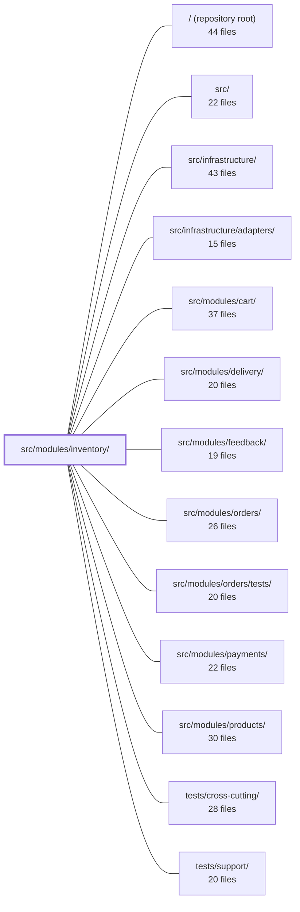

---
tags:
  - 2repo
  - 2repo/module
  - project/boilerplate-node-backend
type: module
module: src/modules/inventory/
files: 24
updated: 2026-08-31T20:54:38.804053+00:00
---

# src/modules/inventory/

## Purpose

The inventory module is the sole writer of `Product.onHand` and `Product.reserved` counters. It owns the full stock-counter lifecycle—receipts, stocktake adjustments, reservation holds (reserve → commit / release / expire), and the append-only stock-movement ledger that records every delta. Customer-facing availability is not a route here; it is a derived field on the product object. Everything in this module is admin-gated and exists to keep a truthful, replayable record of why a counter changed.

## Key parts

- **Domain rules** (`domain/transitions.ts`, `domain/index.ts`) — Pure, I/O-free definitions of how each of the six transitions mutates `onHand`/`reserved`, plus the single canonical availability formula. The barrel enforces the lint boundary so consumers never reach into Express or Mongoose.
- **Service layer** (`service.ts`) — The single application-level chokepoint for every counter change. Guarantees a counter move and its ledger row are inseparable via conditional writes, implements the reserve/commit/release lifecycle, and runs the externally-triggered expiry sweep.
- **Persistence** (`model.ts`, `repository.ts`) — Mongoose schemas for the two inventory-owned collections (StockMovement ledger, Reservation holds) and the repository built on the shared `createRepository` factory.
- **HTTP surface** (`routes.ts`, `controllers/`, `openapi.yaml`) — Express route table (all admin-only), thin controllers that validate and delegate, and the OpenAPI contract pinning the wire format.
- **Module wiring** (`module.ts`, `index.ts`, `config.ts`, `audit.ts`, `events.ts`, `metrics.ts`) — Kernel registration, the public import surface, the two deployment knobs (reservation TTL, low-stock threshold), the audit-action vocabulary, the single `inventory.reservation_expired` domain event, and two Prometheus gauges.
- **Tests** (`tests/`) — Contract tests against the OpenAPI spec, a property-based ledger-replay test over random operation sequences, integration tests for exactly-once semantics, and unit tests for the transition table, schema shapes, and route guard coverage.

## How it connects

- **products** — Stock counters are columns on the product document; inventory is the *only* writer of those columns. Catalogue reads never join into inventory.
- **orders / payments / cart** — The reserve → commit / release lifecycle is driven by the originating domain (checkout, payment confirmation, cancellation). Each of those domains writes its own audit row; inventory writes the ledger row and mutates the counter. The `inventory.reservation_expired` event is consumed by the orders module to trigger its own cancellation path. Cart's stock tests exercise the cross-module reserve/release flow.
- **delivery** — Shares the same "external caller ticks a sweep" pattern (cron/CI hits `POST /inventory/reservations/sweep` the same way it hits `POST /delivery/advance`); no internal scheduler exists.
- **infrastructure / adapters** — Repositories are built on the shared `createRepository` factory; the module registers itself with the kernel and augments the kernel's `DomainEventMap` and `AuditActionMap`.
- **tests/support, tests/cross-cutting** — Shared test harnesses and cross-module scenario suites that this module's tests build on (e.g., the real-MongoDB integration setup, API-spec assertion helpers).

## Where to start

1. **`domain/transitions.ts`** — ~60 lines of pure functions defining what each of the six transitions does to `onHand` and `reserved` and the availability formula. No imports beyond types; reading it gives you the entire business rule in one pass.
2. **`service.ts`** — Shows how those pure transitions are wired to conditional Mongo writes, the ledger, the reservation lifecycle, and the sweep. Tracing one function (e.g. `reserve`) from input to the final `applyTransition` call is the fastest way to see the module's core guarantee: *a counter move and its ledger row are inseparable*.

## Connected modules

[[boilerplate-node-backend_ROOT|/ (repository root)]] · [[boilerplate-node-backend_src|src/]] · [[boilerplate-node-backend_src_infrastructure|src/infrastructure/]] · [[boilerplate-node-backend_src_infrastructure_adapters|src/infrastructure/adapters/]] · [[boilerplate-node-backend_src_modules_cart|src/modules/cart/]] · [[boilerplate-node-backend_src_modules_delivery|src/modules/delivery/]] · [[boilerplate-node-backend_src_modules_feedback|src/modules/feedback/]] · [[boilerplate-node-backend_src_modules_orders|src/modules/orders/]] · [[boilerplate-node-backend_src_modules_orders_tests|src/modules/orders/tests/]] · [[boilerplate-node-backend_src_modules_payments|src/modules/payments/]] · [[boilerplate-node-backend_src_modules_products|src/modules/products/]] · [[boilerplate-node-backend_tests_cross-cutting|tests/cross-cutting/]] · [[boilerplate-node-backend_tests_support|tests/support/]]

## Files
- `src/modules/inventory/audit.ts` — Declares the inventory module's audit-action vocabulary and registers it into the app-wide `AuditActionMap` via TypeScript module augmentation. Only three admin-initiated actions are defined here because lifecycle transitions (reserve, commit, release, expire) are audited by the originating domain (checkout, payment, cancellation), each of which leaves its own ledger row.
- `src/modules/inventory/config.ts` — Single source of truth for the two inventory deployment knobs (reservation TTL and low-stock threshold). Exists to eliminate the transcription risk of duplicating a default value across consumers — a problem that actually occurred before this file was extracted. Both values are read per call (not captured at import) so an operator env-var change takes effect on the next request and tests can vary them case-by-case.
- `src/modules/inventory/controllers/get-inventory-levels.ts` — Thin HTTP controller for `GET /inventory/levels`. It validates and parses the query string (including pagination and a boolean filter), then delegates to the inventory service to return a paginated list of stock levels ordered scarcest-first.
- `src/modules/inventory/controllers/get-stock-movements.ts` — Builds the `GET /inventory/movements` list controller, returning a paginated, newest-first page of stock-movement ledger entries that can be narrowed by `productId` and `reason`. It is a thin adapter between the HTTP layer and the inventory service.
- `src/modules/inventory/controllers/post-adjustment.ts` — Controller handler for `POST /inventory/adjustments` — a stocktake correction. This is the module's primary audited endpoint: an unexplained stock correction is indistinguishable from shrinkage, so the handler enforces a non-zero signed delta and a human-written reason before delegating to the inventory service.
- `src/modules/inventory/controllers/post-receipt.ts` — HTTP controller for `POST /inventory/receipts`. Validates the inbound request body, delegates to the inventory service to record a stock receipt, and shapes the HTTP response. Exists as a thin layer between Express routing and domain logic so the service stays transport-agnostic.
- `src/modules/inventory/controllers/post-reservations-sweep.ts` — HTTP handler for `POST /inventory/reservations/sweep`. It triggers the reservation-expiry sweep on demand. The app ships no internal scheduler, so an external caller (cron, CI, operator) invokes this endpoint to tick expirations — the same arrangement as `POST /delivery/advance`. A single audit record is written per sweep run rather than per individual order (each order's own cancellation path records its own audit).
- `src/modules/inventory/domain/index.ts` — Barrel file that defines the public API surface of the inventory **domain layer**. It re-exports two pure functions from `./transitions` so consumers can import domain rules from a single stable path without reaching into implementation files. It also serves as the lint-enforced boundary: anything imported through this path is guaranteed to be free of Express, Mongoose, and application-tier dependencies.
- `src/modules/inventory/domain/transitions.ts` — Pure domain rules for inventory stock counters. Defines what each of the six stock-movement transitions does to a product's `onHand` and `reserved` counters, and provides the single canonical definition of customer-facing availability. No I/O, no status codes, no i18n — data in, verdict out.
- `src/modules/inventory/events.ts` — Declares the single domain event the inventory module emits (`inventory.reservation_expired`) by augmenting the kernel's `DomainEventMap`. It exists to give emitters and listeners a shared, type-safe spelling for the event name and its payload, while avoiding a circular import between `inventory` and `orders`.
- `src/modules/inventory/index.ts` — Public barrel for the Inventory module. It is the **only** import surface allowed for sibling modules (lint forbids reaching `./service` or `./domain` directly). Its job is to expose a minimal, transition-by-name API while keeping repositories, models, and all counter internals private.
- `src/modules/inventory/metrics.ts` — Defines two Prometheus `Gauge` metrics that the inventory module owns: one tracking low-availability product count and one tracking total reserved units. The file is imported purely for its side effect of registering the gauges; no consumer reads the exported (underscore-prefixed) variables.
- `src/modules/inventory/model.ts` — Defines the Mongoose schemas, interfaces, and model instances for the two inventory-owned collections: **StockMovement** (the append-only ledger) and **Reservation** (per-order holds). This module is the sole writer of stock counters on the product document; it stores *deltas* and *claims*, never a stock level itself, so that catalogue reads never require a join.
- `src/modules/inventory/module.ts` — Module manifest and registration entry point for the inventory domain. It wires together the routes, event handlers, and domain gauges into a single `AppModule` descriptor and registers the module with the kernel. The file also carries the authoritative design note: stock counters are columns on the product document, and inventory is the **only** writer of those counters.
- `src/modules/inventory/openapi.yaml` — OpenAPI 3.0.3 contract (v2.0.0) defining the inventory module's REST surface: stock levels, the append-only movement ledger, inbound receipts, stocktake adjustments, and the reservation-sweep tick. It is the single source of truth for what the inventory module exposes and is the only writer of the `Product.onHand` and `Product.reserved` counters.
- `src/modules/inventory/repository.ts` — Defines the data-access layer for the inventory module: an append-only stock-movement ledger and a reservation (hold) collection with lifecycle operations. Each repository is built on the shared `createRepository` factory and the module's Mongoose models, adding only the domain-specific queries the service layer needs.
- `src/modules/inventory/routes.ts` — Defines the Express route table for all staff-facing inventory endpoints. Every route in this module sits behind an admin-only auth gate because the customer-facing half of inventory (how much stock a shopper can buy) is intentionally not exposed as a route at all — it is surfaced as an `available` field on the product object.
- `src/modules/inventory/service.ts` — The single application-level chokepoint for every stock counter change. It implements the reserve → commit / release lifecycle for order holds, guarantees that a counter move and its ledger row are inseparable (via `applyTransition`), and provides the externally-driven expiry sweep. No Mongo transactions are used; atomicity comes from conditional writes in mongod plus the reservation's unique `orderId` for idempotency.
- `src/modules/inventory/tests/contract/api.contract.test.ts` — HTTP contract tests for every `/inventory` endpoint. Each test asserts the status code, response envelope, and key field shapes against the registered API spec (via `toSatisfyApiSpec()`), pinning the wire contract independent of internal business-logic rules. Covers both read endpoints (levels, movements) and write transitions (receipts, adjustments, reservations/sweep), including their 401/403/404/409/422 error branches.
- `src/modules/inventory/tests/integration/ledger.property.test.ts` — Property-based integration test that verifies a product's stock-movement ledger is a complete and faithful record of its stored counters. Using `fast-check` to generate random sequences of caller-visible operations (receive, adjust, reserve/commit/release/expire), it replays the ledger rows against a **real** MongoDB instance and asserts the sums match the stored `onHand` and `reserved` values exactly. It exists because the correctness guarantee—"a row is written by the same conditional write that moves the counter"—is best proven over an unbounded space of sequences rather than a fixed table of examples.
- `src/modules/inventory/tests/integration/service.test.ts` — Integration tests for the inventory service's module-internal guarantees: exactly-once reserve/commit/release semantics, admin transitions (receive, adjust) and their refusal paths, and the reservation sweep. Deliberately scoped to the module's own edges—cross-module lifecycle is covered by `cart/tests/unit/stock.test.ts` and replay invariants by `ledger.property.test.ts`. Runs against a real MongoDB instance because every guarantee under test is a conditional write.
- `src/modules/inventory/tests/unit/routes.test.ts` — Unit test that locks down the inventory router's surface area: it asserts the exact set and order of mounted endpoints, confirms every route sits behind the full admin guard chain (`getAuth` → `isAuth` → `isAdmin`), and guarantees no unguarded (public) route exists. It exists as a regression tripwire so that accidentally mounting a route above the guard or dropping `isAdmin` would fail CI rather than silently expose stock counters and the ledger.
- `src/modules/inventory/tests/unit/schema-contract.test.ts` — Schema-contract tests for the two inventory collections (`stockMovementSchema` and `reservationSchema`). They assert the *shape* of the MongoDB schemas—required fields, defaults, enums, index specs, and referential types—so that guarantees like exactly-once reservation, replayable deltas, and correct index coverage are enforced by CI rather than discovered in production.
- `src/modules/inventory/tests/unit/transitions.test.ts` — Unit tests for the inventory transition table. Rather than asserting "output equals input," the suite pins down three invariants: only receipt or adjustment changes the unit count, a commit shifts both counters equally so availability is untouched, and reserve / release / expire are exact inverses. No mocks, no database—pure function calls.

---
[[boilerplate-node-backend_INDEX|← boilerplate-node-backend index]]
