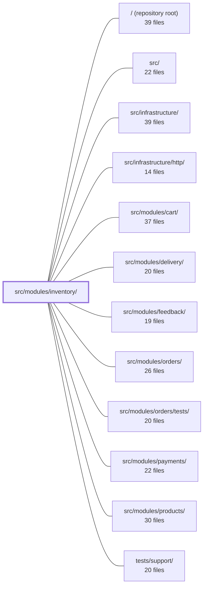

---
tags:
  - 2repo
  - 2repo/module
  - project/boilerplate-node-backend
type: module
module: src/modules/inventory/
files: 24
updated: 2026-08-28T11:59:35.981914+00:00
---

# src/modules/inventory/

## Purpose

The inventory module owns every stock mutation in the application. It manages two counters on the product document (`onHand` and `reserved`), enforces the invariant that each counter change is accompanied by exactly one ledger row, drives the reservation lifecycle (reserve → commit / release / expire), and exposes an admin-only REST surface for viewing stock, recording receipts, applying stocktake adjustments, and triggering the reservation-expiry sweep.

## Key parts

- **Domain layer** (`domain/transitions.ts`, `domain/index.ts`) — Pure, dependency-free rules mapping each of the six stock transitions to counter deltas and defining the single availability calculation. No I/O, no framework imports.
- **Service** (`service.ts`) — The single chokepoint (`applyTransition`) through which every public operation (reserve, commit, release, expire, sweep, adjust, receive) must pass. Guarantees the ledger-and-counter invariant.
- **Persistence** (`model.ts`, `repository.ts`) — Mongoose schemas for the append-only StockMovement ledger and the Reservation hold; a thin repository that exposes only the operations the service needs.
- **HTTP surface** (`routes.ts`, `controllers/*`) — Five admin-guarded endpoints: stock levels, stock movements, receipts, adjustments, and the reservation-sweep tick. `openapi.yaml` is the authoritative contract for all of them.
- **Cross-cutting** (`events.ts`, `metrics.ts`, `audit.ts`, `config.ts`) — Domain event declaration, two Prometheus gauges (low-stock count, reserved units), the typed audit-action catalogue, and the two deployment tunables (TTL, low-stock threshold).
- **Module plumbing** (`module.ts`, `index.ts`) — Registration, route table, dependency declaration, and the minimal public barrel that sibling modules are allowed to import.
- **Tests** (`tests/unit/`, `tests/integration/`, `tests/contract/`) — Pure-function unit tests, real-MongoDB integration and property-based ledger-replay tests, and HTTP contract tests that pin status codes and response shapes.

## How it connects

- **`src/modules/products/`** — The stock counters live on the product document; inventory is the sole writer of `Product.onHand` and `Product.reserved`.
- **`src/modules/cart/`** — Calls the inventory service's `reserveForOrder` when a customer confirms a cart, creating a reservation hold.
- **`src/modules/orders/`** — Calls `commitForOrder` or `releaseForOrder` as an order transitions through its lifecycle, finalising or undoing the hold.
- **`src/modules/delivery/`** — The reservation-sweep endpoint follows the same "external-trigger, no internal scheduler" pattern as `POST /delivery/advance`.
- **`src/infrastructure/http/`** — Provides the Express plumbing (app, middleware, error handling) under which the inventory router is mounted at `/inventory`.
- **`/` (repository root) / `src/`** — The module augments the kernel's `DomainEventMap` and the global audit type map via TypeScript module augmentation, linking per-module declarations back to shared type registries.

## Where to start

Read **`domain/transitions.ts`** first: it is short, pure, and lays out the six transitions and the availability rule in plain TypeScript with zero dependencies, so you can grasp the business intent in minutes. Then read **`service.ts`** to see how those transitions are applied through the single `applyTransition` chokepoint and how the ledger invariant is enforced in practice.

## Connected modules

[[boilerplate-node-backend_ROOT|/ (repository root)]] · [[boilerplate-node-backend_src|src/]] · [[boilerplate-node-backend_src_infrastructure|src/infrastructure/]] · [[boilerplate-node-backend_src_infrastructure_http|src/infrastructure/http/]] · [[boilerplate-node-backend_src_modules_cart|src/modules/cart/]] · [[boilerplate-node-backend_src_modules_delivery|src/modules/delivery/]] · [[boilerplate-node-backend_src_modules_feedback|src/modules/feedback/]] · [[boilerplate-node-backend_src_modules_orders|src/modules/orders/]] · [[boilerplate-node-backend_src_modules_orders_tests|src/modules/orders/tests/]] · [[boilerplate-node-backend_src_modules_payments|src/modules/payments/]] · [[boilerplate-node-backend_src_modules_products|src/modules/products/]] · [[boilerplate-node-backend_tests_support|tests/support/]]

## Files
- `src/modules/inventory/audit.ts` — Declares the set of auditable admin actions for the inventory module and registers them in the global audit type map via module augmentation. It exists so that every human-initiated stock change is recorded with a stable, typed action name, while deliberately excluding system-driven lifecycle transitions (reserve, commit, release, expire) that are already audited at their originating request.
- `src/modules/inventory/config.ts` — Centralizes the two deployment-tunable numbers (reservation TTL and low-stock threshold) into a single import point. Both values are read as functions rather than module-level constants so that environment-variable changes take effect on the next call and tests can vary them per case.
- `src/modules/inventory/controllers/get-inventory-levels.ts` — Route handler for `GET /inventory/levels`. Reads a paginated, optionally-filtered query string, validates it, and delegates to the inventory service to return a page of stock levels (counters + availability, scarcest first).
- `src/modules/inventory/controllers/get-stock-movements.ts` — HTTP controller for `GET /inventory/movements`. It reads and validates query-string parameters (pagination, `productId`, `reason`), delegates to the inventory service, and returns a single page of stock-movement records (newest first).
- `src/modules/inventory/controllers/post-adjustment.ts` — Express handler for `POST /inventory/adjustments` — the audited stocktake-correction endpoint. It validates the request body, rejects zero-delta no-ops, and delegates to `inventoryService.adjust`, recording the caller, the signed quantity change, and a free-text reason in the ledger.
- `src/modules/inventory/controllers/post-receipt.ts` — Express controller for `POST /inventory/receipts`. Handles the arrival of units from a supplier by validating the request body, delegating to the inventory service, and returning a structured HTTP response. It is one of only two entry points for stock to enter the shop and is audited (the receipt row records which admin added how many).
- `src/modules/inventory/controllers/post-reservations-sweep.ts` — Handler for `POST /inventory/reservations/sweep`. Triggers the reservation-expiry tick by delegating to `inventoryService.runReservationSweep`, then returns the count of expired holds. The app ships no internal scheduler, so this endpoint is the external trigger (cron, platform job, or operator), following the same pattern as `POST /delivery/advance`.
- `src/modules/inventory/domain/index.ts` — Barrel (re-export) file for the inventory **domain layer**. It exposes the pure business rules — specifically the reason→delta table and availability logic — to the rest of the codebase while keeping the domain free of Express, Mongoose, and any other tier. Consumers import from this file rather than reaching into `./transitions` directly.
- `src/modules/inventory/domain/transitions.ts` — Pure domain rules for inventory stock movements. Defines what each of the six stock transitions does to a product's two counters (`onHand`, `reserved`) and provides the single definition of customer-facing availability. No I/O, no status codes, no database — data in, verdict out.
- `src/modules/inventory/events.ts` — Declares the inventory module's domain event(s) by augmenting the kernel's `DomainEventMap`, so the event catalogue grows per-module without a shared enumeration file. Currently contains a single event, `inventory.reservation_expired`, plus its shared string-constant export.
- `src/modules/inventory/index.ts` — Public barrel for the inventory module. It is the **only** surface sibling modules may import (enforced by lint), and it exposes a deliberately minimal API: one service handle, one pure availability function, and one event constant. Repositories, models, and counter primitives are intentionally absent so that no external module can mutate a stock number directly.
- `src/modules/inventory/metrics.ts` — Defines the two Prometheus gauges the inventory module owns: `products_low_stock_total` and `inventory_reserved_units_total`. Both are scrape-time-computed (via `collect`) so they always reflect the current DB state rather than accumulating events. They live in the module (not infrastructure) so the observability layer never needs to import domain logic back in — the same pattern as `modules/account/metrics.ts`.
- `src/modules/inventory/model.ts` — Defines the two Mongoose collections the inventory module owns — the **StockMovement ledger** and the **Reservation hold** — including their schemas, indexes, document interfaces, and serialization transforms. Stock levels themselves live on the product document; this file records *why* a count changed (ledger) and *what is temporarily claimed* (hold).
- `src/modules/inventory/module.ts` — Module registration file for the **inventory** domain. It declares the module's identity, subdomain classification, route table, and upstream dependencies, and triggers side-effect imports (events, metrics) so they self-register at load time. The inventory module owns the reservation lifecycle (`reserveForOrder` → `commitForOrder` / `releaseForOrder`) over two stock counters that live on the product document.
- `src/modules/inventory/openapi.yaml` — OpenAPI 3.0.3 contract (v2.0.0) defining the inventory module's REST surface: stock levels, the append-only movement ledger, inbound receipts, stocktake adjustments, and the reservation-sweep tick. It is the single source of truth for what the inventory module exposes and is the only writer of the `Product.onHand` and `Product.reserved` counters.
- `src/modules/inventory/repository.ts` — Defines the persistence surface for the inventory module: an append-only stock-movement ledger and a reservation (hold) store. It sits between the Mongoose models (`./model`) and the domain rules (`./service`), exposing only the operations the service actually needs.
- `src/modules/inventory/routes.ts` — Defines the Express router for the inventory module. It wires the five inventory endpoints (stock levels, stock movements, receipts, adjustments, reservations sweep) to their respective controllers and enforces admin-only access at the router level. It exists so the inventory module exposes a single `router` that the app mounts under `/inventory`.
- `src/modules/inventory/service.ts` — The single module responsible for every stock mutation in the application. Enforces one invariant through a shared chokepoint (`applyTransition`): a product's counters never move without a corresponding ledger row, and a ledger row is never written for a counter that did not move. All public operations (reserve, commit, release, expire, sweep) funnel through this path.
- `src/modules/inventory/tests/contract/api.contract.test.ts` — HTTP contract-test suite for the `/inventory` routes. It pins the observable API contract — status codes, response shapes, error codes, pagination metadata — as reached over the wire, for both reads (levels, movements) and writes (receipts, adjustments, reservation sweep). Transition logic itself is covered by the unit suite; this file only verifies that each branch is reachable and correctly shaped at the HTTP boundary.
- `src/modules/inventory/tests/integration/ledger.property.test.ts` — Property-based integration tests that verify the stock-movement ledger is a faithful, gap-free account of every counter change. By generating random sequences of caller-facing inventory operations against a real MongoDB and asserting that replaying ledger rows exactly reproduces the stored `onHand` and `reserved` counters, the file pins down the invariant that a row is written if and only if a conditional write succeeds.
- `src/modules/inventory/tests/integration/service.test.ts` — Integration test suite for the inventory service, exercising its own edges—exactly-once reservation claims, admin receive/adjust transitions, and their refusal paths—against a real MongoDB instance. It deliberately does not duplicate the cross-module lifecycle covered by cart unit tests or the replay invariants covered by ledger property tests; every guarantee here is a conditional (atomic) write, which is why a real database is required.
- `src/modules/inventory/tests/unit/routes.test.ts` — Unit test suite that pins the inventory route table to its documented contract: exactly five endpoints in a fixed order, each guarded by the full `getAuth → isAuth → isAdmin` chain, and zero public routes. It exists to catch the specific, severe regression where a route is accidentally mounted above the guard or a guard is dropped, which would expose inventory counters and movement ledgers to non-staff clients.
- `src/modules/inventory/tests/unit/schema-contract.test.ts` — Asserts the **database-level contracts** of the inventory schemas — unique indexes, defaults, enum values, required paths, and index specs. These guarantees are enforced by MongoDB, not by any service code path, so weakening them would not cause a test in the integration suite to fail. This file is the only place that pins those structural invariants.
- `src/modules/inventory/tests/unit/transitions.test.ts` — Unit tests for the inventory transition table (`counterDeltaFor`) and the derived availability read (`availabilityOf`). Rather than restating each table row, the tests assert the three invariants the table encodes: only receipts/adjustments change unit counts, commits shift both columns equally, and reserve is exactly inverted by release/expire. No mocks or database are used — the functions under test are pure.

---
[[boilerplate-node-backend_INDEX|← boilerplate-node-backend index]]
