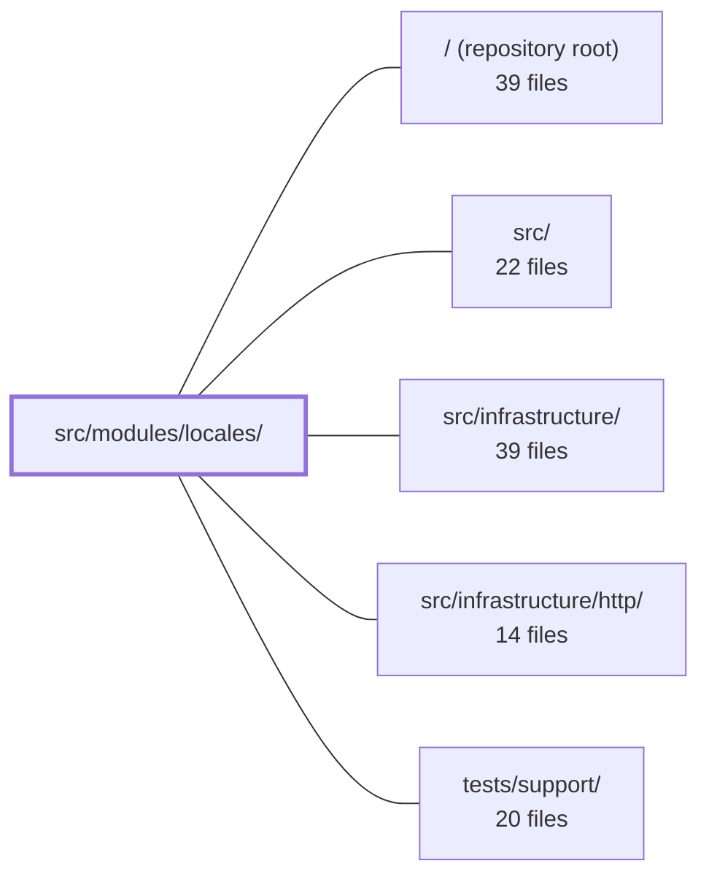

---
tags:
  - 2repo
  - 2repo/module
  - project/boilerplate-node-backend
type: module
module: src/modules/locales/
files: 32
updated: 2026-08-28T11:59:50.414632+00:00
---

# src/modules/locales/

## Purpose

The locales module owns the application's two-tier i18n system: a file-based static dictionary for the API's own copy, and a database-backed dynamic tier of per-tenant translation overrides that frontend clients can download at runtime. It provides the full admin CRUD surface for languages and their translation entries, the read endpoints that serve those dictionaries, the tenant-registry that scopes every translation key, and the audit trail for every write.

## Key parts

- **Domain & persistence** — `model.ts` (Mongoose schemas, uniqueness, derived fields), `repository.ts` (all Mongo reads/writes, atomic revision bumps), `tenants.ts` (env-driven tenant registry, the single source of truth for valid keyspace IDs).
- **Service layer** — `services/` split into `languages.ts` (locale lifecycle), `entries.ts` (per-key CRUD & bulk import), `messages.ts` (flat-row → nested-tree read paths), `capabilities.ts` (merged manifest for `GET /locales` and `/locales/tenants`), and `keys.ts` (shared key-validation rules). `services/index.ts` re-exports everything as a single `localeService` object.
- **HTTP controllers & routing** — `controllers/` (one file per route group: reads, writes, deletes for locales and entries), `routes.ts` (mounts all routes, attaches auth guards and Redis cache-invalidation tags), `audit.ts` (audit-action constants registered via module augmentation).
- **Module wiring & contract** — `module.ts` (connective tissue: registers the override reader into i18n infrastructure, declares the manifest consumed by the kernel), `openapi.yaml` (normative OpenAPI 3.0.3 description of the public and admin surface).
- **Demo & test fixtures** — `demo.ts` (seeds four languages, each exercising a distinct code path), `factory.ts` (byte-stable fixture builders).
- **Tests** — `tests/contract/` (OpenAPI shape + tier-boundary invariant), `tests/integration/` (real-Mongo schema, repository, and service behaviour), `tests/unit/` (audit strings, route guards, schema metadata, pure service functions, tenant parsing).

## How it connects

- **`src/infrastructure/`** — `module.ts` wires the database-backed override reader into the shared i18n infrastructure at import time; the infrastructure then calls back into the locales service for per-request lookups.
- **`src/infrastructure/http/`** — Controllers are plain Express handlers mounted by `routes.ts`; the HTTP layer supplies the router, middleware chain (auth guards, Zod validation), Redis cache with tag invalidation, and response shaping.
- **`tests/support/`** — Integration tests (`model.test.ts`, `repository.test.ts`) spin up a real MongoDB instance and use shared fixtures/utilities from the test-support harness to exercise persistence guarantees that in-memory fakes cannot meaningfully validate.
- **Repository root / `src/`** — The module registers itself through the kernel via its manifest in `module.ts`; the kernel's boot sequence is what makes `localeService` available to other modules and to the i18n reader.

## Where to start

1. **`openapi.yaml`** — Reading the contract first gives you the full vocabulary of endpoints, the two-tier model, and the tenant-keyspace concept before you encounter any implementation detail.
2. **`module.ts`** — A short file that shows exactly how the locales module plugs into the app's kernel and i18n infrastructure, making it the natural next step to understand the runtime wiring.

## Connected modules

[[boilerplate-node-backend_ROOT|/ (repository root)]] · [[boilerplate-node-backend_src|src/]] · [[boilerplate-node-backend_src_infrastructure|src/infrastructure/]] · [[boilerplate-node-backend_src_infrastructure_http|src/infrastructure/http/]] · [[boilerplate-node-backend_tests_support|tests/support/]]

## Files
- `src/modules/locales/audit.ts` — Defines the audit action constants for all locale-management write operations (locale CRUD and locale-entry CRUD/import) and registers them in the shared audit type map via module augmentation. The file exists because the dictionary stores no edit history and copy has left the repository, so these rows are the sole record of who changed what translation text.
- `src/modules/locales/controllers/delete-locale-entry.ts` — Admin-only DELETE handler for `DELETE /locales/:locale/entries/:entryId`. Removes a single key from a single language, then invalidates the local i18n override cache so the deleted string stops being served on this worker immediately.
- `src/modules/locales/controllers/delete-locale.ts` — Admin-facing DELETE handler for `/locales/:locale`. It removes a language and all strings translated into it, delegates the actual work (and the active-language guard) to the locale service, and refreshes the in-process i18n override cache so the deleted locale stops answering on the current worker.
- `src/modules/locales/controllers/get-locale-entries.ts` — Controller handler for the admin endpoint `GET /locales/:locale/entries`. It serves the flat, paginated row list that a translation editing screen displays. It exists separately from the nested `messages` endpoint so each route answers exactly one shape of data and the two are named for what they are.
- `src/modules/locales/controllers/get-locale-messages.ts` — HTTP handler for `GET /locales/:locale/messages`. Returns the nested translation dictionary for a given language (and optional tenant) so that a frontend can lazy-load messages it was not bundled with at build time. This is the primary read endpoint the locales module exists to serve.
- `src/modules/locales/controllers/get-locale-tenants.ts` — Express controller for `GET /locales/tenants`. Returns the list of tenant keyspaces this deployment accepts for locale entries, so an admin UI or client can discover valid tenant IDs without hardcoding them. Sourced from deployment configuration rather than a database.
- `src/modules/locales/controllers/get-locales.ts` — HTTP controllers for the two locale endpoints (`GET /locales` and `GET /locales/:locale`). They expose which languages the deployment actually supports (a runtime fact that cannot be a static OpenAPI enum) and serve the API's own fallback message dictionary, reading from the filesystem so the copy remains available even when the database is down.
- `src/modules/locales/controllers/write-locale-entries.ts` — HTTP controller handlers for the four mutation routes on a locale's entries: create one key, update one key's value, bulk-replace the entire set (PUT), and bulk-merge/upsert a subset (PATCH). It exists to translate validated request bodies into `localeService` calls and shape the responses, keeping the semantic split between replace and merge explicit at the method level rather than a boolean flag.
- `src/modules/locales/controllers/write-locales.ts` — Admin-only HTTP controllers for creating (POST /locales) and updating (PUT /locales/:locale) language records. They validate the request body with Zod, delegate the write to `localeService`, and shape the HTTP response. They do **not** register a language for use by the API at runtime — i18next reads supported locales once per worker at boot, so a row written here only becomes resolvable after a file is deployed.
- `src/modules/locales/demo.ts` — Seeds the demo dataset for the dynamic (database-backed) locale tier. Each of the four languages (`es`, `it`, `fr`, `ja`) is chosen to exercise a specific branch of the locale module — downloadable-only, file+row merge, inactive-but-populated, and registered-empty — so that every code path the module owns has at least one fixture driving it.
- `src/modules/locales/factory.ts` — Builds fixture objects for the two locale collections (language records and translated entries) used by demo seeding and integration tests. The factories pin ids for byte-stable output and deliberately omit any field the schema can derive, so the resulting dataset records what the schema *does* rather than what a fixture assumed it should.
- `src/modules/locales/model.ts` — Defines the Mongoose schemas, model instances, document types, and serialization transforms for the two Mongo collections backing the OVERRIDE tier of i18n: registered languages and their per-tenant translated string entries. Every persistence-level rule (uniqueness, derived fields, index shape) is declared here so that all write and read paths share a single source of truth.
- `src/modules/locales/module.ts` — Module registration for the translations/locales feature. Wires the backend-tenant override reader into the i18n infrastructure at import time and declares the module manifest (routes, locale files, seeds, demo shapes) consumed by the kernel. It owns no request-handling logic itself; it is the connective tissue that tells the infrastructure where translations live and how to read runtime overrides.
- `src/modules/locales/openapi.yaml` — OpenAPI 3.0.3 contract for the locales module, defining the public and admin HTTP surface for language management. It encodes the two-tier locale model (deployed API dictionary vs. database-backed client dictionary), the tenant keyspace concept, and the CRUD endpoints for languages and their translation entries. It exists so that clients, admin UIs, and AI agents share a single normative description of what the service exposes.
- `src/modules/locales/repository.ts` — Data-access layer for the locales module. It owns all MongoDB reads and writes against the `locales` and `localemessages` collections, and — critically — couples every entry-level write to an atomic `revision` bump so that no caller can mutate translations without invalidating client caches.
- `src/modules/locales/routes.ts` — Defines all HTTP routes for the locales module: three public (unauthenticated) GETs that serve translation dictionaries and tenant lists, and a set of admin-only CRUD routes for managing locales and their entries. Every write route invalidates the shared `locales` cache tag in Redis.
- `src/modules/locales/services/capabilities.ts` — Builds the locale capability manifest — the unified, sorted list of every language a deployment offers (file-based "static" and row-based "dynamic") along with what each can do, which tenants serve it, and its direction. It also exposes the tenant list and the visibility scope, making this file the single read-side surface for `GET /locales` and `GET /locales/tenants`.
- `src/modules/locales/services/entries.ts` — Service layer for the CRUD and bulk-import operations on individual translated key-value rows (entries) within a language. It sits between the HTTP controller and the repositories, enforcing tenant-scoped key uniqueness, validating key structure, and emitting audit events. All writes are narrowed to a single tenant because a key is only unique within one keyspace.
- `src/modules/locales/services/index.ts` — Barrel (namespace) file that re-exports every public function from the five locale-service sub-modules into a single `localeService` object. It exists so that the seven controllers, `module.ts`, and the integration test suite all import one name rather than a list of twenty-four scattered exports, keeping the re-export surface trivially in sync with the folder.
- `src/modules/locales/services/keys.ts` — Defines all validation rules that determine whether a translation key is storable and renderable. It is a pure, database-free shared utility within `services/` — owned by neither `entries.ts` nor `messages.ts`, but consumed by both. Its subdomain is `generic`, which is why it lives here rather than under `domain/`.
- `src/modules/locales/services/languages.ts` — Service layer for the language (locale) lifecycle — creating, updating, and cascade-deleting a registered language — plus the two shared tenant-validation helpers (strict for writes, lenient for reads) that every other route in the locales module reuses.
- `src/modules/locales/services/messages.ts` — Provides the two read paths that deliver stored translation copy: one for a frontend client to download a language's overrides, and one for the API's own i18n overlay. Both expand flat database rows into nested message trees via `buildMessageTree`; they differ only in which tenant's keyspace they serve.
- `src/modules/locales/tenants.ts` — Defines the set of tenants (consumers of the translation service) that exist in a deployment. Tenants are configuration facts driven entirely by environment variables — not rows in a database — so that a typo cannot silently create an unserved keyspace. Every stored translation row is keyed by `(language, tenant, key)`, making this module the single source of truth for which tenants are valid.
- `src/modules/locales/tests/contract/api.contract.test.ts` — Contract tests for every `/locales` endpoint (manifest, dictionary, tenant messages, registration). Beyond shape-checking against the OpenAPI spec, the suite pins the **tier boundary**: a language registered in the database is downloadable as a tenant dictionary but must *not* make the API's own copy endpoint answer in that language. That invariant is the property the design rests on, and these tests are written to fail the moment the two keyspaces collapse.
- `src/modules/locales/tests/integration/model.test.ts` — Integration tests that pin the **schema-level** guarantees for the locale and locale-message models: serialization (no `_id`/`__v` on either the `toJSON` or `.lean()` path), default values, tag normalization, and the derived `baseLanguage` field. They target the schema hooks and defaults directly rather than a single service, because seeds and migrations write documents through paths that bypass the service layer.
- `src/modules/locales/tests/integration/repository.test.ts` — Integration tests for the locales module that exercise every write path against a real MongoDB instance. They exist because the properties under test—atomic revision-counter increments, cross-collection cascade deletes, and import side-effects on rows *not* included in the request body—would all pass trivially against an in-memory fake and therefore need a real database to be meaningful.
- `src/modules/locales/tests/unit/audit.test.ts` — Unit test that pins the exact string values of the locales module's audit-action vocabulary. Because these strings are a wire contract consumed by log queries, dashboards, and alert rules outside this repo, this file asserts them by value rather than relying on the cross-cutting shape-only sweep. It also verifies the underscore-naming convention and that the actions land in the global `AuditAction` union.
- `src/modules/locales/tests/unit/routes.test.ts` — Unit test for the locales Express router. It locks in three invariants that are easy to break during refactoring: the exact set and order of mounted routes, the per-route authorization guard chain (public reads carry no auth guard; admin writes carry all three in order), and the caching contract (shared Redis cache with 1-hour TTL and `browserRevalidate` on public reads, no cache on the editing screen, tag invalidation on every write). The file header explains *why* the two design choices it guards exist, so a future "cleanup" that inverts them fails loudly.
- `src/modules/locales/tests/unit/schema-contract.test.ts` — Asserts the declarative contracts (required paths, unique indexes, normalisation options, defaults, enum constraints) of the `localeSchema` and `localeMessageSchema` Mongoose schemas, and verifies the `deriveBaseLanguage` subtag-extraction helper. The tests inspect schema metadata only — no database, no runtime behaviour — so they act as a guard against accidental schema drift that would break tag uniqueness, translation upsert semantics, or language negotiation.
- `src/modules/locales/tests/unit/service.test.ts` — Unit tests for the pure, stateless functions in `localeService` — the message-tree builder, key-collision detectors, and the capability-manifest merge. These functions make decisions (not I/O) and fail silently when wrong, so they are asserted here directly rather than through the repository or HTTP layers.
- `src/modules/locales/tests/unit/tenants.fixture.ts` — Provides shared tenant-id constants for unit tests in the locales module. It re-exports the demo-default tenant IDs obtained at runtime from the production registry (`../../tenants`) rather than hard-coding string literals, ensuring tests always reference the same values the service will accept.
- `src/modules/locales/tests/unit/tenants.test.ts` — Unit tests for the tenant-registry API in `tenants.ts`. Each test sets `NODE_LOCALE_TENANT_*` environment variables, calls the lazy reader functions, and asserts the parsed tenant list or membership result. The suite exists to pin down the parsing rules (defaults, extra frontends, labels, deduplication) and the frontend/backend/unknown discrimination logic.

---
[[boilerplate-node-backend_INDEX|← boilerplate-node-backend index]]
