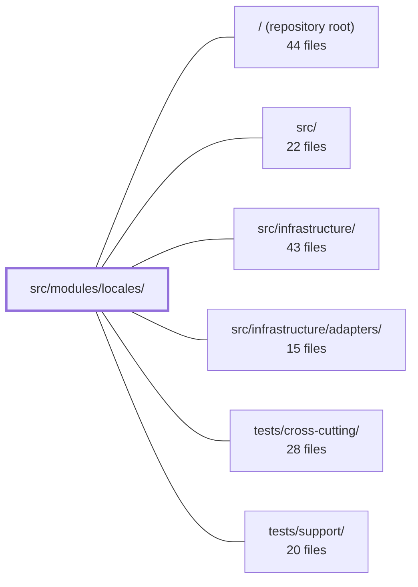

---
tags:
  - 2repo
  - 2repo/module
  - project/boilerplate-node-backend
type: module
module: src/modules/locales/
files: 32
updated: 2026-08-31T20:55:02.116707+00:00
---

# src/modules/locales/

## Purpose

The locales module manages the application's two-tier translation system: a static, deploy-time API dictionary and a dynamic, database-backed client dictionary. It exposes REST endpoints for language registration, per-tenant entry CRUD, and bulk import; it serves localized message trees to both the API itself (via an i18n overlay) and to frontend clients (via download endpoints); and it enforces tenant keyspaces, key-naming rules, and audit logging on every mutation.

## Key parts

- **Data layer** — `model.ts` defines the two Mongoose schemas (languages, entries); `repository.ts` wraps them behind repository objects and enforces the revision-counter invariant; `tenants.ts` declares the supported keyspace set from environment variables.
- **Service layer** — `services/index.ts` is the single `localeService` import target. Inside it, `languages.ts` handles CRUD on language records, `entries.ts` handles per-tenant entry CRUD and bulk import, `capabilities.ts` merges both tiers into the manifest list, `messages.ts` builds the nested message trees for download and API overlay, and `keys.ts` provides pure key-validation and tree-building utilities.
- **HTTP layer** — `routes.ts` is the single Express router mounted at `/locales`, wiring public reads (with Redis caching) and admin-gated writes to their respective controllers in `controllers/`. Each controller is a thin adapter that parses the request, calls `localeService`, and shapes the response.
- **Module bootstrap & audit** — `module.ts` is the `AppModule` manifest that registers the locale-override provider with `@infrastructure/i18n` and declares routes, i18n resource path, and seeding hooks. `audit.ts` declares the locale-specific audit action strings and merges them into the app-wide `AuditActionMap` type.
- **Seed & contract** — `demo.ts` and `fixtures.ts` provide stable, byte-reproducible seed data; `openapi.yaml` is the normative OpenAPI 3.0.3 contract for the public and admin HTTP surface.
- **Tests** — `tests/unit/` covers pure logic (schema contracts, key collisions, tenant parsing, audit strings, route wiring); `tests/integration/` exercises the repository and service write paths against real MongoDB; `tests/contract/` validates the HTTP surface against the OpenAPI spec and guards the two-tier invariant.

## How it connects

- **`src/infrastructure/`** — This module registers a locale-override provider with the i18n infrastructure at import time (`module.ts`). The `messages.ts` service's `readApiOverrides` function is the callback the i18n layer invokes to rebuild its runtime overlay. A Mongo outage degrades to a stale overlay rather than a failed `t()` call.
- **`src/infrastructure/adapters/`** — The HTTP controllers depend on the shared adapter utilities (e.g., `catchAs` for error formatting, Redis cache helpers used by `routes.ts`) that live in the infrastructure adapter tier.
- **`src/`** — The top-level `src/modules.ts` aggregates this module's `AppModule` export (from `module.ts`) alongside other modules; no consumer imports this module's internals directly.
- **`tests/support/` & `tests/cross-cutting/`** — Shared test fixtures and cross-cutting helpers (e.g., tenant fixture values, audit-string helpers) are consumed by the locale test suites to keep assertions DRY across modules.

## Where to start

Read `module.ts` first — in roughly 60 lines it shows every registration this module performs (routes, i18n provider, seeding hooks, demo metadata) and the single `AppModule` shape that the rest of the app consumes. Then read `model.ts` to lock in the two collections (languages, entries) and their indexes before diving into any service or controller. Together they give you the module's data shape and its external surface without touching HTTP or business logic.

## Connected modules

[[boilerplate-node-backend_ROOT|/ (repository root)]] · [[boilerplate-node-backend_src|src/]] · [[boilerplate-node-backend_src_infrastructure|src/infrastructure/]] · [[boilerplate-node-backend_src_infrastructure_adapters|src/infrastructure/adapters/]] · [[boilerplate-node-backend_tests_cross-cutting|tests/cross-cutting/]] · [[boilerplate-node-backend_tests_support|tests/support/]]

## Files
- `src/modules/locales/audit.ts` — Declares the audit action strings that the locales module emits when an admin mutates locale or locale-entry records, and merges them into the app-wide `AuditActionMap` type via module augmentation. This gives call sites in the locale services a typed, centralized source of action identifiers while keeping the naming convention (`noun.noun.verb`) enforced cross-cuttingly.
- `src/modules/locales/controllers/delete-locale-entry.ts` — Thin HTTP adapter for the admin endpoint `DELETE /locales/:locale/entries/:entryId`. It translates the Express request into a `localeService.deleteEntry` call, handles the response, and triggers a locale-override cache refresh. It exists to keep HTTP concerns (param extraction, response shaping, error mapping) out of the service layer.
- `src/modules/locales/controllers/delete-locale.ts` — Thin HTTP adapter for `DELETE /locales/:locale` (admin). Translates the Express request into a `localeService.deleteLanguage` call, handles the 409 guard response, triggers a locale-overrides refresh, and formats the success/error replies.
- `src/modules/locales/controllers/get-locale-entries.ts` — Thin Express controller for `GET /locales/:locale/entries`. It reads and validates query parameters, then delegates to `localeService.searchEntries` to return a flat, paginated list of dictionary entries for one language — the data shape an in-app translation editor works with. It exists to keep HTTP concerns (parsing, validation, response shaping) separate from the domain service.
- `src/modules/locales/controllers/get-locale-messages.ts` — Thin HTTP adapter for `GET /locales/:locale/messages`. It translates the Express request into a `localeService.readMessages` call, maps the result onto a standard success/reject response shape, and delegates error formatting to `catchAs`. No business logic lives here.
- `src/modules/locales/controllers/get-locale-tenants.ts` — A thin Express HTTP adapter that exposes `GET /locales/tenants`. It delegates all logic to `localeService.listTenants()` and wraps the result in a standard success envelope, keeping the controller a pure pass-through between the route and the service layer.
- `src/modules/locales/controllers/get-locales.ts` — HTTP controller layer for the two locale endpoints (`GET /locales` and `GET /locales/:locale`). It bridges the Express request/response cycle to the locale service and the i18n filesystem dictionary, so the API can report which languages it supports and serve its own ~60-key message catalog.
- `src/modules/locales/controllers/write-locale-entries.ts` — Implements the four write HTTP handlers for a locale's entries: create one key, update one value, bulk-replace the entire set (PUT), and bulk-merge a subset (PATCH). The bulk operations are split into two distinct routes rather than a single route with a mode flag so that a mis-set boolean cannot silently empty a dictionary.
- `src/modules/locales/controllers/write-locales.ts` — Admin-only controllers for the two mutating locale endpoints: `POST /locales` (register a new language in the dynamic tier) and `PUT /locales/:locale` (edit a language's display names, direction, or visibility). They validate the request body with Zod, delegate the actual work to `localeService`, and shape the HTTP response.
- `src/modules/locales/demo.ts` — Static seed data for the dynamic locale tier in the demo dataset. Four languages are chosen to cover every distinct state a language and its entries can occupy (downloadable-only, overridable, draft, empty), giving tests and the local demo a realistic but minimal dataset to work against.
- `src/modules/locales/fixtures.ts` — Factory functions that build fully-shaped `Language` and `LocaleEntry` documents for seeding, testing, and the `demo-data.json` export. Two separate factories exist because the collections are addressed differently (language by pinned `_id`; entry by `(locale, key)`), but both pin an id for byte-stable output. Any field a fixture omits falls through to the model's `default:` values, keeping the exported dataset a record of the schema rather than of fixture guesses.
- `src/modules/locales/model.ts` — Defines the two Mongoose schemas, indexes, and model exports for the locale OVERRIDE tier: the **languages** collection (registered BCP 47 tags) and the **entries** collection (one row per language/tenant/key translation). This tier is read exclusively through a boot-time overlay rebuilt by `@infrastructure/i18n`; a Mongo outage degrades to a stale overlay, never a failed `t()` call.
- `src/modules/locales/module.ts` — Module manifest and import-time bootstrap for the **locales** module. It registers the runtime locale-override provider with `@infrastructure/i18n` and declares the module's routes, i18n resource path, seeding hooks, and demo shape metadata in a single `AppModule` object. The file exists so that `src/modules.ts` can collect it and the i18n layer can call back for overrides, without any module needing to import this file directly.
- `src/modules/locales/openapi.yaml` — OpenAPI 3.0.3 contract for the locales module, defining the public and admin HTTP surface for language management. It encodes the two-tier locale model (deployed API dictionary vs. database-backed client dictionary), the tenant keyspace concept, and the CRUD endpoints for languages and their translation entries. It exists so that clients, admin UIs, and AI agents share a single normative description of what the service exposes.
- `src/modules/locales/repository.ts` — Data-access layer for the locales module. Wraps two Mongoose collections—languages and translated entries—behind two exported repository objects, and enforces one invariant that callers must not be trusted to maintain: every write to `localemessages` atomically bumps the parent language's `revision` counter so clients know when to re-download.
- `src/modules/locales/routes.ts` — Defines the Express router mounted at `/locales`. It wires public (unauthenticated) locale reads to their controllers with a shared Redis cache, and admin-gated CRUD writes to the dynamic translation tier. It exists as the single mount point that the locales module registers, keeping route ordering, guard stacking, and cache invalidation in one place.
- `src/modules/locales/services/capabilities.ts` — The locale manifest service. It merges two tiers of languages — those deployed as static files and those registered as database rows — into a single sorted `LocaleCapabilities` list, and exposes the query surface (`listCapabilities`, `listTenants`) that `GET /locales` and related endpoints consume.
- `src/modules/locales/services/entries.ts` — Service layer for CRUD and bulk-import of locale entries (translated key-value rows) scoped to a single language and tenant. Sits between the HTTP handlers and the repository, enforcing tenant-scoped key uniqueness, key-naming rules, and audit logging on every write.
- `src/modules/locales/services/index.ts` — Barrel file for the locales service tier. It aggregates functions from five sub-modules (`keys`, `capabilities`, `languages`, `entries`, `messages`) into a single `localeService` namespace object, which is the **only** name anything outside `services/` imports. It exists so consumers get one stable import target instead of 24 individual re-exports that would drift out of sync with the folder.
- `src/modules/locales/services/keys.ts` — Defines the validation rules and tree-building logic for translation keys. It decides whether a key is safe to store, detectable as a collision or duplicate, and renders it into the nested object shape the API serves. All functions are pure and database-free; the file is shared by `entries.ts` and `messages.ts` within the `services/` folder.
- `src/modules/locales/services/languages.ts` — Service-layer CRUD for language records: registering a new language, editing its display/visibility fields, and deleting it with a cascade. Also the single home for the module's shared tenant-validation rules — strict rejection on writes (422) versus silent drop on reads (treat as "no filter").
- `src/modules/locales/services/messages.ts` — Provides the two read paths that hand out stored locale copy: `readMessages` for a frontend client downloading a single language's overrides, and `readApiOverrides` for the API to rebuild its own i18n overlay. Both expand flat key-value rows into nested trees via `buildMessageTree`; they differ in which tenant's keyspace is served and how errors are surfaced.
- `src/modules/locales/tenants.ts` — Defines the set of tenants (keyspaces) a deployment of the translation service supports. Tenants are pure **configuration** read from environment variables at call time — they are never stored in the database, so a typo in an import cannot silently create an orphan keyspace. The file also exposes the predicates and lookups other modules need to validate or enumerate tenants.
- `src/modules/locales/tests/contract/api.contract.test.ts` — Contract tests for the `/locales` REST endpoints across all four routes (`GET /locales`, `GET /locales/:locale`, `GET /locales/:locale/messages`, `POST /locales`). Beyond standard OpenAPI shape validation, the file explicitly guards the two-tier locale model: a language that exists only in the database must be *downloadable* (its message tree is served) but **not answerable** (the API's own copy must still 404). The assertions are written so that a future change collapsing those two tiers fails here before it reaches a client.
- `src/modules/locales/tests/integration/model.test.ts` — Integration tests that pin the **schema-level** serialization and defaulting guarantees for the two locale collections (language and message/entry). They exist because the OpenAPI contract marks 95 schemas as `additionalProperties: false`, and the `.lean()` read path bypasses Mongoose `toJSON` entirely — so the tests assert per-model that `_id`/`__v` never leak and that schema hooks/defaults behave correctly regardless of caller.
- `src/modules/locales/tests/integration/repository.test.ts` — Integration tests for the locale repository and service write paths, run against a real MongoDB instance. They verify behaviors that an in-memory fake would satisfy by construction: the revision counter moving (and moving exactly once) on each write path, cascade deletion across two collections, import semantics (replace vs. merge), and key-collision rules. No HTTP or auth is involved.
- `src/modules/locales/tests/unit/audit.test.ts` — Unit tests that pin the exact string values of the locales audit-action vocabulary. The strings are a wire contract consumed by external log queries, dashboards, and alert rules, so any accidental rename or reformat would break tooling outside the repo. The tests also guard the underscore-in-two-word-nouns convention and confirm the TypeScript module augmentation actually registers the actions into the app-wide `AuditAction` union.
- `src/modules/locales/tests/unit/routes.test.ts` — Unit test that pins the locale router's contract: which endpoints exist and in what order, which middleware guards each carries, and how caching is configured. It exists so that accidental "simplifications" (adding a router-level auth gate, reordering paths, dropping `browserRevalidate`, caching the editor screen) fail loudly rather than degrading silently in production.
- `src/modules/locales/tests/unit/schema-contract.test.ts` — Unit tests that pin down the schema contracts for the two locale collections (`localeSchema`, `localeMessageSchema`) and the `deriveBaseLanguage` helper. They assert required fields, unique indexes, normalisation flags, defaults, enum restrictions, and case/whitespace handling so that a regression in any of those contracts is caught before it reaches the database.
- `src/modules/locales/tests/unit/service.test.ts` — Unit tests for the pure, decision-making half of `localeService`: the message-tree builder, key-collision detectors, and the capability-manifest merge. These functions fail silently when wrong (dropped keys, mis-claimed capabilities), so they are asserted directly here rather than through integration paths (Mongo in `repository.test.ts`, HTTP in the contract suite).
- `src/modules/locales/tests/unit/tenants.fixture.ts` — A shared test fixture that resolves the two demo tenant IDs once, so unit and integration tests reference the same values the service actually accepts instead of hardcoding literals that could drift.
- `src/modules/locales/tests/unit/tenants.test.ts` — Unit tests for the tenant registry in `../../tenants`. Because every reader is lazy (reads `process.env` on call), each test case sets the relevant environment variables itself, then asserts on the returned data. The suite locks in the demo pair as the floor, verifies env-driven overrides, extra-tenant parsing, and the frontend/backend/unknown classification predicates.

---
[[boilerplate-node-backend_INDEX|← boilerplate-node-backend index]]
