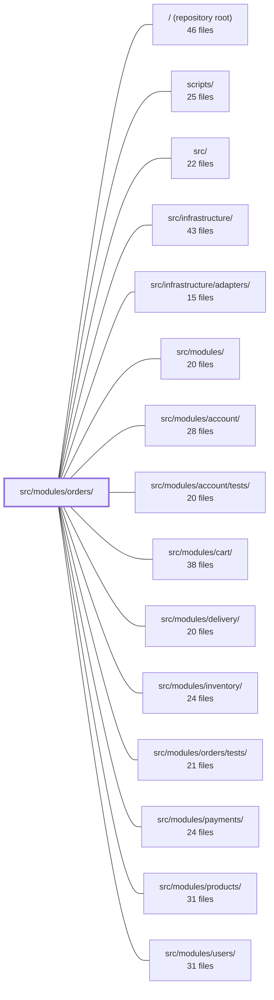

---
tags:
  - 2repo
  - 2repo/module
  - project/boilerplate-node-backend
type: module
module: src/modules/orders/
files: 26
updated: 2026-09-02T18:34:38.156848+00:00
---

# src/modules/orders/

## Purpose

The orders module owns the complete order lifecycle: creation (by admin or checkout), viewing, updating, cancellation, deletion, invoicing, and the status transitions that govern all of them. It stores orders with snapshot-embedded product data so catalogue edits never rewrite purchase history, enforces a role-based state machine for status changes, and communicates outward exclusively through domain events that downstream modules (payments, delivery, inventory) subscribe to.

## Key parts

- **Domain rules** (`domain/lifecycle.ts`, `domain/money.ts`, `domain/rules.ts`, `domain/totals.ts`, `domain/index.ts`) — Pure, dependency-free logic: the status state machine with per-edge actor authorization, integer-based money arithmetic, line-item validation, and the single cost-calculation function. `domain/index.ts` is the public barrel that exposes only these curated rules.
- **Service & persistence** (`service.ts`, `repository.ts`, `model.ts`) — `service.ts` orchestrates domain rules, inventory holds, audit/analytics emission, and confirmation mail. `repository.ts` handles data access (with aggregation-pipeline search for embedded product IDs, GDPR anonymization primitives, and atomic conditional status transitions). `model.ts` defines the Mongoose schema and the serialization transform that derives totals at a single choke-point.
- **HTTP surface** (`routes.ts`, `controllers/*`) — `routes.ts` layers auth, authorization, and cache-invalidation middleware around thin controllers. Controllers delegate all logic to `orderService`; the invoice controller additionally renders an EJS template to PDF via the shared adapter.
- **Module wiring & cross-cutting** (`module.ts`, `index.ts`, `events.ts`, `analytics.ts`, `audit.ts`, `metrics.ts`) — `module.ts` is the `AppModule` manifest consumed by the kernel registry (router, event subscriptions, reactive handlers, demo seeding). `events.ts` and `analytics.ts` register event names into app-wide TypeScript maps. `index.ts` is the sole import surface for sibling modules.
- **Emails & fixtures** (`emails.ts`, `fixtures.ts`) — `emails.ts` resolves i18n copy for the confirmation email and invoice. `fixtures.ts` translates contract-level data into MongoDB-ready documents for tests and seeding.
- **Contract & tooling** (`openapi.yaml`, `probes.ts`, `demo.ts`) — OpenAPI spec for all endpoints, authorization-scoping probes for collection tooling, and a deterministic demo dataset.

## How it connects

- **`cart/`** — The cart module depends on orders: checkout creates an order document through this module's service and repository.
- **`payments/`** — Payments depend on orders to read the order total and status when creating a payment intent.
- **`delivery/`** — Delivery depends on orders to pick up orders in a deliverable state and to write back a delivery-completed status.
- **`inventory/`** — Orders place inventory holds during creation and release them on cancellation or expiry (reactive handler in `module.ts`).
- **`account/`** — Shared "language is an argument, output is finished text" email-resolution pattern; user-deletion triggers `detachUserId` in this module's repository.
- **`products/`** — Orders embed a product snapshot (id, name, price) at purchase time; no runtime `populate` is ever performed.
- **`users/`** — When a user is deleted, this module's reactive handler scrubs the `userId` from all their orders.
- **`infrastructure/` & `infrastructure/adapters/`** — The PDF adapter (Puppeteer worker) re-invokes the invoice controller's render logic; the mailer queue consumes the resolved email copy.
- **`tests/unit/`**, **`tests/cross-cutting/`**, **`src/modules/orders/tests/`** — Unit tests for domain rules and service logic; cross-cutting integration tests exercise the full HTTP → service → repository path.

## Where to start

1. **`domain/lifecycle.ts`** — The status state machine and actor-authorization rules are the conceptual heart of the module; every controller action and reactive handler derives from it.
2. **`service.ts`** — The orchestration layer that shows how domain rules, repository calls, inventory holds, event emission, and email sending fit together for each operation (create, cancel, update, delete). Reading it alongside `domain/lifecycle.ts` gives a complete picture of one full request lifecycle.

## Connected modules

[[boilerplate-node-backend_ROOT|/ (repository root)]] · [[boilerplate-node-backend_scripts|scripts/]] · [[boilerplate-node-backend_src|src/]] · [[boilerplate-node-backend_src_infrastructure|src/infrastructure/]] · [[boilerplate-node-backend_src_infrastructure_adapters|src/infrastructure/adapters/]] · [[boilerplate-node-backend_src_modules|src/modules/]] · [[boilerplate-node-backend_src_modules_account|src/modules/account/]] · [[boilerplate-node-backend_src_modules_account_tests|src/modules/account/tests/]] · [[boilerplate-node-backend_src_modules_cart|src/modules/cart/]] · [[boilerplate-node-backend_src_modules_delivery|src/modules/delivery/]] · [[boilerplate-node-backend_src_modules_inventory|src/modules/inventory/]] · [[boilerplate-node-backend_src_modules_orders_tests|src/modules/orders/tests/]] · [[boilerplate-node-backend_src_modules_payments|src/modules/payments/]] · [[boilerplate-node-backend_src_modules_products|src/modules/products/]] · [[boilerplate-node-backend_src_modules_users|src/modules/users/]] · … and 4 more

## Files
- `src/modules/orders/analytics.ts` — Declares the analytics event names emitted by the orders module and registers them into the analytics port's application-wide event-name union via TypeScript module augmentation. It exists so every order-lifecycle event has a single canonical name and so the analytics type system enforces valid event strings at compile time.
- `src/modules/orders/audit.ts` — Declares the audit-action vocabulary for the orders module and registers it into the app-wide `AuditActionMap` via TypeScript module augmentation. It contains no runtime logic — only the constant string values that other modules emit as structured audit events.
- `src/modules/orders/controllers/delete-orders.ts` — Thin wiring module that instantiates the orders delete controller via the shared `createDeleteController` factory. It exists to bind the generic delete surface (auth guard, 404 handling, audit logging) to the order-specific service call and audit action, keeping the domain logic in the service layer.
- `src/modules/orders/controllers/get-order-invoice.ts` — Handles `GET /orders/:id/invoice`. Resolves the order (with caller-scoped access), renders its localized copy into an EJS template, converts the resulting HTML to a PDF, and streams the file back as an attachment. The i18n strings are resolved *in the controller* rather than in the template so the identical render can be re-invoked from `adapters/pdf.worker.ts` where no request context exists.
- `src/modules/orders/controllers/get-order-item.ts` — Single-order read controller for `GET /orders/:id`. It scopes the result by caller role (admin sees any order; non-admins only their own) and attaches the set of actions the current caller is allowed to perform, so the client can render its controls from the server's answer rather than duplicating lifecycle logic.
- `src/modules/orders/controllers/get-orders.ts` — Thin wiring layer that exposes a `GET /orders` search/list endpoint. It delegates all search logic to `orderService.search` through the shared `createSearchController` factory, while enforcing caller visibility: non-admin users are scoped to their own orders and cannot filter by an arbitrary `userId`.
- `src/modules/orders/controllers/post-cancel-order.ts` — HTTP handler for `POST /orders/:id/cancel`. Thin wiring that forwards the request to `orderService.cancelById`, passing the caller's auth scope and an optional `refund` flag, then shapes the result into a standard success or refusal response.
- `src/modules/orders/controllers/write-orders.ts` — Admin controller that handles order creation (POST) and update (PUT) in a single exported handler. It exists to give administrators a direct way to create or modify orders by supplying the full item list in the request body, bypassing the cart/checkout flow used by end users.
- `src/modules/orders/demo.ts` — Builds and seeds the `orders` collection's demo dataset. It constructs a set of deterministic order documents (snapshots of products, varied customer tiers, a soft-deleted order, a shipping-bearing order) and exposes functions to upsert them into the collection and to re-read the serialized result for frontend consumption.
- `src/modules/orders/domain/index.ts` — Barrel (public API) for the **orders domain layer**. It exposes a curated, minimal set of pure rules—no Express, Mongoose, HTTP, or DB dependencies—so that consumers import a single entry point instead of reaching into individual rule files. It also encodes *what is off-limits* by intentionally omitting internal helpers.
- `src/modules/orders/domain/lifecycle.ts` — Defines the order-status state machine: which status may follow which, and which actor (`customer`, `admin`, `system`) is permitted to make each move. The status *set* is generated from a shared contract; this file adds the directed edges and per-edge actor authorization, producing a single source of truth that the service layer, repository helpers, and client-facing action queries all consult.
- `src/modules/orders/domain/money.ts` — Defines a compile-time-branded `Money` type (whole minor units) plus the small set of integer arithmetic operations the orders domain needs. It exists to keep order totals exact and order-independent by doing all math in integers, converting to/from the contract's decimal `number` only at the boundaries.
- `src/modules/orders/domain/rules.ts` — Pure validation rules for order lines. Given a set of candidate lines, it produces a typed verdict (`ok` or a specific refusal reason) with no side effects, no HTTP status codes, and no i18n strings. The separation ensures business logic stays testable in isolation while `service.ts` handles presentation concerns.
- `src/modules/orders/domain/totals.ts` — Single source of truth for "what does this order cost." Sums priced line items and adds the frozen shipping cost so that the cart preview, the order aggregate, the payment intent, and the confirmation email all derive the same number from one function rather than each re-deriving it.
- `src/modules/orders/emails.ts` — Resolves the copy for the two documents the orders module produces — the customer-facing confirmation email and the invoice PDF — into finished, locale-resolved strings. By the time the mailer queue or Puppeteer renders the template, no i18n key lookup remains. Follows the same "language is an argument, output is finished text" rule as `@modules/account/emails`.
- `src/modules/orders/events.ts` — Declares the `orders` module's domain events by augmenting the kernel's `DomainEventMap` interface, and exports the event-name constants so emitters and listeners share a single source of truth. Because `orders` sits low in the dependency graph (payments and delivery depend on it, not vice-versa), emitting these events is the module's only outward communication channel.
- `src/modules/orders/fixtures.ts` — Builder and type definitions for constructing order fixtures ready to be passed to `orderRepository.create`. It translates contract-level order data (flat product ids, ISO date strings, wire-shaped items) into the shape MongoDB expects (embedded product snapshots with `ObjectId`s, real `Date` values), filling in identity and safe defaults for anything the caller leaves unstated.
- `src/modules/orders/index.ts` — Public barrel for the **orders** module. It is the *only* import surface available to sibling modules (cart, delivery, payments). Internal types (`Money`, `ORDER_LIFECYCLE`, `OrderDocumentItem`) and the raw schema/transform are deliberately excluded so external code can never reach past the intended API.
- `src/modules/orders/metrics.ts` — Defines the Prometheus counter(s) for the orders domain. Counters live here (in the module) rather than in `infrastructure` so the overview endpoint can read them without a direct import into this file. This file owns the `order_created_total` metric for admin-created orders.
- `src/modules/orders/model.ts` — Defines the Mongoose schema, document interface, and serialization transform for order documents. The central design choice is **snapshot embedding**: products and the shipping address are stored inline (no `ref`, no `populate`) so that later catalogue or address-book edits cannot rewrite purchase history. The three totals (`totalItems`, `totalQuantity`, `totalPrice`) are never persisted; they are derived at the single serialization choke-point so every response path (list, get, create, update, aggregates) computes them identically.
- `src/modules/orders/module.ts` — Module manifest (entry point) for the **orders** module. Wires together the HTTP router, domain-event subscriptions, demo seeding, and locale path into a single `AppModule` object that the kernel registry consumes. Also installs the module's two reactive event handlers: cancelling an order when its inventory reservation expires, and detaching a user ID from all their orders when that user is deleted.
- `src/modules/orders/openapi.yaml` — OpenAPI 3.0.3 contract for the Orders module. It defines every HTTP endpoint the module exposes (list, search, create, read, update, delete), their request/response shapes, security requirements, and the error vocabulary clients must handle. It exists so that both human consumers and codegen tooling have a single authoritative source for the order API surface.
- `src/modules/orders/probes.ts` — Defines a small set of authorization-scoping probes for the orders module — requests whose correct behavior (allow vs. refuse) depends on the caller's role and the order's deletion state, details the OpenAPI contract alone cannot express. The probes are consumed by the runnable-collections tooling to augment generated client collections.
- `src/modules/orders/repository.ts` — Order data access layer built on top of the shared `createRepository` factory, but with `search` overridden to use Mongoose aggregation pipelines. This is necessary because orders embed a product snapshot (`items.product._id`) that plain `find()` cannot filter on, and because `$match` does not auto-cast ObjectIds the way `find()` does. The file also houses GDPR/anonymization primitives (`detachUserId`, `scrubDueForAnonymization`) and an atomic conditional status transition used by checkout and delivery flows.
- `src/modules/orders/routes.ts` — Express router that defines every HTTP endpoint for the orders module. It layers authentication, authorization, cache invalidation, and route-flag middleware around thin controller handlers so that callers never need to know those concerns.
- `src/modules/orders/service.ts` — Business-logic layer for the Order entity. Controllers call into this file exclusively; it orchestrates domain rules, inventory holds, audit/analytics emission, and confirmation mail, delegating all raw database access to `orderRepository`.

---
[[boilerplate-node-backend_INDEX|← boilerplate-node-backend index]]
