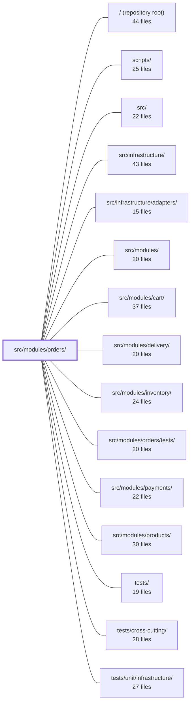

---
tags:
  - 2repo
  - 2repo/module
  - project/boilerplate-node-backend
type: module
module: src/modules/orders/
files: 26
updated: 2026-08-31T20:55:25.797482+00:00
---

# src/modules/orders/

## Purpose

The orders module owns the full lifecycle of a purchase: creation (by admin or via the cart/checkout flow), reading, status transitions, cancellation, deletion, and invoice/confirmation document generation. It sits low in the dependency graph—payments, delivery, and cart all consume its events and public API—making it the authoritative source of truth for "what did the customer buy and what is the current state of that purchase."

## Key parts

- **Domain rules (`domain/`)** — Pure, dependency-free logic: the state machine and actor permissions (`lifecycle.ts`), exact integer money arithmetic (`money.ts`), line-item validation (`rules.ts`), and the single totals calculation shared by cart preview, payment intents, and confirmation emails (`totals.ts`).
- **Service & repository (`service.ts`, `repository.ts`, `model.ts`)** — `service.ts` is the one place controllers call; it enforces domain rules, coordinates inventory holds, and emits side-effects. `repository.ts` adds scoped authorization, atomic status transitions, and aggregation-pipeline search on top of the shared CRUD factory. `model.ts` defines the Mongoose schema with embedded product/address snapshots so purchase history is immutable.
- **HTTP layer (`controllers/`, `routes.ts`)** — Thin Express handlers for list, read, create/update, cancel, delete, and invoice-PDF streaming. `routes.ts` layers auth, cache-invalidation, and route-flag middleware around them.
- **Module wiring (`module.ts`, `index.ts`, `openapi.yaml`)** — `module.ts` is the manifest the kernel loads (routes, event subscriptions, demo seeding). `index.ts` is the only import surface exposed to sibling modules. `openapi.yaml` is the authoritative HTTP contract.
- **Cross-cutting output (`events.ts`, `analytics.ts`, `audit.ts`, `metrics.ts`, `emails.ts`)** — Domain events are the module's primary outward channel; analytics/audit names and Prometheus counters are registered via TypeScript module augmentation so the rest of the app gets compile-time safety. `emails.ts` resolves all i18n copy into finished strings before hand-off to the mailer or PDF worker.
- **Test & demo support (`fixtures.ts`, `demo.ts`, `probes.ts`)** — Deterministic order builders for tests, a seed dataset covering edge cases, and authorization-scoping probes for the runnable-collections tooling.

## How it connects

- **cart / payments / delivery** — These modules depend on orders (not vice-versa). They subscribe to the domain events declared in `events.ts` (e.g., order created, order cancelled) to trigger downstream work. The public barrel in `index.ts` is the only import path they use.
- **inventory** — `module.ts` declares a cross-module subscription: when an inventory reservation times out, orders auto-cancels the affected order.
- **products** — Order line items store embedded product snapshots at purchase time (no Mongoose `ref`). The demo dataset looks up live catalogue rows via `seedProductById` so fixtures track the current product data unless explicitly overridden.
- **infrastructure / adapters** — Invoice PDF rendering is offloaded to `adapters/pdf.worker.ts` (Puppeteer), and confirmation emails are handed to the mailer queue. `emails.ts` and `get-order-invoice.ts` resolve all i18n before calling into those adapters so no request-context lookup is needed downstream.

## Where to start

1. **`service.ts`** — Every controller funnels through this one file. Reading it gives you the full picture of what an order *is* operationally: how rules are enforced, how inventory is held, and what side-effects fire on each action.
2. **`domain/lifecycle.ts`** — The state machine (which transitions are legal and who may initiate them) is the conceptual backbone of the module. Once you understand it, the service methods, controller guards, and event emissions all fall into place.

## Connected modules

[[boilerplate-node-backend_ROOT|/ (repository root)]] · [[boilerplate-node-backend_scripts|scripts/]] · [[boilerplate-node-backend_src|src/]] · [[boilerplate-node-backend_src_infrastructure|src/infrastructure/]] · [[boilerplate-node-backend_src_infrastructure_adapters|src/infrastructure/adapters/]] · [[boilerplate-node-backend_src_modules|src/modules/]] · [[boilerplate-node-backend_src_modules_cart|src/modules/cart/]] · [[boilerplate-node-backend_src_modules_delivery|src/modules/delivery/]] · [[boilerplate-node-backend_src_modules_inventory|src/modules/inventory/]] · [[boilerplate-node-backend_src_modules_orders_tests|src/modules/orders/tests/]] · [[boilerplate-node-backend_src_modules_payments|src/modules/payments/]] · [[boilerplate-node-backend_src_modules_products|src/modules/products/]] · [[boilerplate-node-backend_tests|tests/]] · [[boilerplate-node-backend_tests_cross-cutting|tests/cross-cutting/]] · [[boilerplate-node-backend_tests_unit_infrastructure|tests/unit/infrastructure/]] · … and 1 more

## Files
- `src/modules/orders/analytics.ts` — Declares the analytics event names emitted by the orders module and registers them into the analytics port's application-wide event-name union via TypeScript module augmentation. It exists so every order-lifecycle event has a single canonical name and so the analytics type system enforces valid event strings at compile time.
- `src/modules/orders/audit.ts` — Declares the audit-action vocabulary for the orders module and registers it into the app-wide `AuditActionMap` via TypeScript module augmentation. It contains no runtime logic — only the constant string values that other modules emit as structured audit events.
- `src/modules/orders/controllers/delete-orders.ts` — Thin wiring module that instantiates the orders delete controller via the shared `createDeleteController` factory. It exists to bind the generic delete surface (auth guard, 404 handling, audit logging) to the order-specific service call and audit action, keeping the domain logic in the service layer.
- `src/modules/orders/controllers/get-order-invoice.ts` — Handles `GET /orders/:id/invoice`. Resolves the order (with caller-scoped access), renders its localized copy into an EJS template, converts the resulting HTML to a PDF, and streams the file back as an attachment. The i18n strings are resolved *in the controller* rather than in the template so the identical render can be re-invoked from `adapters/pdf.worker.ts` where no request context exists.
- `src/modules/orders/controllers/get-order-item.ts` — Single-order read controller for `GET /orders/:id`. It scopes the result by caller role (admin sees any order; non-admins only their own) and attaches the set of actions the current caller is allowed to perform, so the client can render its controls from the server's answer rather than duplicating lifecycle logic.
- `src/modules/orders/controllers/get-orders.ts` — Thin wiring layer that exposes a `GET /orders` search/list endpoint. It delegates all search logic to `orderService.search` through the shared `createSearchController` factory, while enforcing caller visibility: non-admin users are scoped to their own orders and cannot filter by an arbitrary `userId`.
- `src/modules/orders/controllers/post-cancel-order.ts` — HTTP handler for `POST /orders/:id/cancel`. Thin wiring that forwards the request to `orderService.cancelById`, passing the caller's auth scope and an optional `refund` flag, then shapes the result into a standard success or refusal response.
- `src/modules/orders/controllers/write-orders.ts` — Admin controller that handles order creation (POST) and update (PUT) in a single exported handler. It exists to give administrators a direct way to create or modify orders by supplying the full item list in the request body, bypassing the cart/checkout flow used by end users.
- `src/modules/orders/demo.ts` — Provides the demo (seed) dataset for the orders collection. Each fixture is a concrete order that demonstrates a specific real-world case (stale email, free shipping, soft-deletion on a non-admin). Product data is looked up live from the catalogue via `seedProductById` rather than restated, so the snapshot always mirrors the current product row unless a fixture explicitly overrides a field.
- `src/modules/orders/domain/index.ts` — Barrel (public API) for the **orders domain layer**. It exposes a curated, minimal set of pure rules—no Express, Mongoose, HTTP, or DB dependencies—so that consumers import a single entry point instead of reaching into individual rule files. It also encodes *what is off-limits* by intentionally omitting internal helpers.
- `src/modules/orders/domain/lifecycle.ts` — Defines the order state machine: which status transitions are legal, and which actor (`customer`, `admin`, or `system`) may initiate each one. It does not execute transitions—`updateStatusIfIn` in the repository does that—but supplies the `from`-set and actor checks that make the write safe and correct.
- `src/modules/orders/domain/money.ts` — Defines a compile-time-branded `Money` type (whole minor units) plus the small set of integer arithmetic operations the orders domain needs. It exists to keep order totals exact and order-independent by doing all math in integers, converting to/from the contract's decimal `number` only at the boundaries.
- `src/modules/orders/domain/rules.ts` — Pure validation rules for order lines. Given a set of candidate lines, it produces a typed verdict (`ok` or a specific refusal reason) with no side effects, no HTTP status codes, and no i18n strings. The separation ensures business logic stays testable in isolation while `service.ts` handles presentation concerns.
- `src/modules/orders/domain/totals.ts` — Single source of truth for "what does this order cost." Sums priced line items and adds the frozen shipping cost so that the cart preview, the order aggregate, the payment intent, and the confirmation email all derive the same number from one function rather than each re-deriving it.
- `src/modules/orders/emails.ts` — Resolves the copy for the two documents the orders module produces — the customer-facing confirmation email and the invoice PDF — into finished, locale-resolved strings. By the time the mailer queue or Puppeteer renders the template, no i18n key lookup remains. Follows the same "language is an argument, output is finished text" rule as `@modules/account/emails`.
- `src/modules/orders/events.ts` — Declares the `orders` module's domain events by augmenting the kernel's `DomainEventMap` interface, and exports the event-name constants so emitters and listeners share a single source of truth. Because `orders` sits low in the dependency graph (payments and delivery depend on it, not vice-versa), emitting these events is the module's only outward communication channel.
- `src/modules/orders/fixtures.ts` — Builder and type definitions for constructing order fixtures that are ready to pass to `orderRepository.create`. It exists so that tests, demo scripts, and other fixture layers can generate realistic, deterministic order documents without manually assembling Mongo `_id`s, converting ISO dates, or worrying about which fields are stored vs. derived.
- `src/modules/orders/index.ts` — Public barrel for the **orders** module. It is the *only* import surface available to sibling modules (cart, delivery, payments). Internal types (`Money`, `ORDER_LIFECYCLE`, `OrderDocumentItem`) and the raw schema/transform are deliberately excluded so external code can never reach past the intended API.
- `src/modules/orders/metrics.ts` — Defines the Prometheus counter(s) for the orders domain. Counters live here (in the module) rather than in `infrastructure` so the overview endpoint can read them without a direct import into this file. This file owns the `order_created_total` metric for admin-created orders.
- `src/modules/orders/model.ts` — Defines the Mongoose schema and model for persisted order documents, plus the serialization transform that derives wire-only totals (`totalItems`, `totalQuantity`, `totalPrice`) from embedded line items. Products and shipping addresses are stored as embedded snapshots (no `ref`) so that later catalogue or address-book edits never rewrite purchase history.
- `src/modules/orders/module.ts` — Module manifest for the **orders** domain: wires routes, event subscriptions, demo seeding, and locale paths into a single `AppModule` object the kernel registry can load. It also declares the one cross-module subscription the order lifecycle needs (auto-cancelling an order when its inventory reservation times out).
- `src/modules/orders/openapi.yaml` — OpenAPI 3.0.3 contract for the Orders module. It defines every HTTP endpoint the module exposes (list, search, create, read, update, delete), their request/response shapes, security requirements, and the error vocabulary clients must handle. It exists so that both human consumers and codegen tooling have a single authoritative source for the order API surface.
- `src/modules/orders/probes.ts` — Defines a small set of authorization-scoping probes for the orders module — requests whose correct behavior (allow vs. refuse) depends on the caller's role and the order's deletion state, details the OpenAPI contract alone cannot express. The probes are consumed by the runnable-collections tooling to augment generated client collections.
- `src/modules/orders/repository.ts` — Repository for the Order collection. Orders are read through the MongoDB aggregation pipeline (because embedded product snapshots make `find()` insufficient for cross-field filtering) while still inheriting plain CRUD from the shared repository factory. It adds scoped authorization, atomic status transitions, and pipeline-based search on top of that base.
- `src/modules/orders/routes.ts` — Express router that defines every HTTP endpoint for the orders module. It layers authentication, authorization, cache invalidation, and route-flag middleware around thin controller handlers so that callers never need to know those concerns.
- `src/modules/orders/service.ts` — The order-service layer: all business logic for the Order entity. Controllers call exclusively into this file; it delegates raw database access to `orderRepository`, enforces domain rules (status transitions, line-item validation), coordinates inventory holds, and emits audit/analytics/confirmation side-effects. It is the single seam between HTTP handlers and the order domain.

---
[[boilerplate-node-backend_INDEX|← boilerplate-node-backend index]]
