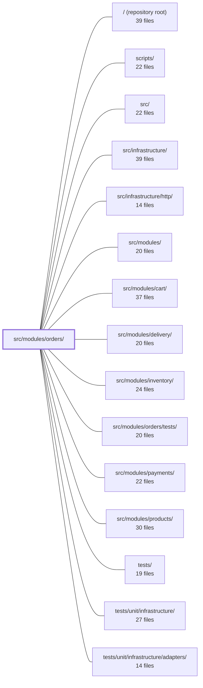

---
tags:
  - 2repo
  - 2repo/module
  - project/boilerplate-node-backend
type: module
module: src/modules/orders/
files: 26
updated: 2026-08-28T12:00:06.288286+00:00
---

# src/modules/orders/

## Purpose

The orders module owns the full order lifecycle: creating, reading, updating, deleting, and cancelling orders; enforcing legal status transitions and who may make them; computing exact monetary totals from product snapshots; generating customer-facing documents (confirmation email, invoice PDF); and emitting the observability signals (audit, analytics, domain events, metrics) that the rest of the system depends on. It is a self-contained DDD module that other modules (cart, payments, delivery, inventory) interact with through its curated public barrel rather than reaching into its internals.

## Key parts

- **Domain layer (`domain/`)** — Pure, framework-free logic: `lifecycle.ts` (status transition graph and actor permissions), `totals.ts` (pricing arithmetic in integer minor units), `rules.ts` (line-item validation returning discriminated-union verdicts), and `money.ts` (branded cent type with a single conversion point to the API's number shape). `domain/index.ts` re-exports only the public surface.
- **Data & persistence** — `model.ts` (Mongoose schema, document interface, serialization transform) and `repository.ts` (aggregation-pipeline search, scope-aware reads, atomic conditional status transition). Orders embed a **product snapshot** as a value, which drives both the schema shape and the need for aggregation-based queries.
- **Service** — `service.ts` is the single business-logic coordinator: it validates transitions, calls into inventory for stock reservation, persists via the repository, and fans out audit / analytics / domain events / mail. Controllers and cross-module callers go through this layer, never the repository directly.
- **HTTP controllers (`controllers/`)** — Thin, one-file-per-endpoint handlers (`get-orders`, `get-order-item`, `get-order-invoice`, `post-cancel-order`, `write-orders`, `delete-orders`). Each validates input, delegates to `service.ts`, and shapes the HTTP response. `routes.ts` wires them to Express with auth, role checks, caching, and cache invalidation.
- **Customer-facing output** — `emails.ts` builds fully-interpolated i18n copy for the confirmation email and invoice; `controllers/get-order-invoice.ts` renders the same template to a downloadable PDF via `renderHtmlToPdf`.
- **Observability & contracts** — `analytics.ts`, `audit.ts`, `events.ts`, and `metrics.ts` each register their names into a shared kernel map via TypeScript module augmentation, keeping ownership local while remaining type-safe. `openapi.yaml` is the authoritative REST contract; `probes.ts` adds the negative (must-reject) cases the contract cannot express.
- **Wiring & public surface** — `module.ts` is the `AppModule` manifest the kernel registry consumes at startup. `index.ts` is the sole import path other modules should use.
- **Seed & fixtures** — `demo.ts` supplies three realistic orders for the demo database; `factory.ts` builds order fixtures that respect the snapshot rule and exclude derived fields.

## How it connects

- **`src/modules/products/`** — Orders store a *snapshot* of product data at purchase time; they do not hold a live reference. The factory and model encode this, and the OpenAPI contract documents the embedded shape.
- **`src/modules/cart/`** — The cart summary reads the same `totals.ts` arithmetic so the amount the customer sees at checkout matches the persisted order total and the payment intent.
- **`src/modules/payments/`** — The payment intent reports totals computed by `domain/totals.ts`, ensuring a single source of truth for "what the customer owes."
- **`src/modules/delivery/`** — Delivery is a cross-module caller of `service.ts` (e.g., to advance status after a shipment is confirmed), relying on the `lifecycle.ts` transition graph for legality.
- **`src/modules/inventory/`** — `service.ts` coordinates stock reservation through the inventory module during order creation and release on cancellation.
- **`src/infrastructure/`** — The module consumes the shared analytics port, the audit-action registry, the base Mongoose repository, and HTTP utilities (response caching, PDF rendering) defined there.
- **`src/modules/orders/tests/`** — Unit and integration tests exercise the domain rules, service logic, and HTTP endpoints defined in this module.
- **`scripts/`** — Seed scripts call into `demo.ts` / `factory.ts` to populate the database with realistic order rows.

## Where to start

1. **`domain/lifecycle.ts`** — The status transition graph (which status follows which, who is allowed) is the single most important domain concept in the module. Reading it first gives you the vocabulary and constraints every other file enforces.
2. **`service.ts`** — Once you understand the legal transitions, the service shows how they are actually enforced: validation → stock coordination → persistence → event fan-out. It is the join point between the pure domain layer and the infrastructure, and the file you will most often need to modify when order behavior changes.

## Connected modules

[[boilerplate-node-backend_ROOT|/ (repository root)]] · [[boilerplate-node-backend_scripts|scripts/]] · [[boilerplate-node-backend_src|src/]] · [[boilerplate-node-backend_src_infrastructure|src/infrastructure/]] · [[boilerplate-node-backend_src_infrastructure_http|src/infrastructure/http/]] · [[boilerplate-node-backend_src_modules|src/modules/]] · [[boilerplate-node-backend_src_modules_cart|src/modules/cart/]] · [[boilerplate-node-backend_src_modules_delivery|src/modules/delivery/]] · [[boilerplate-node-backend_src_modules_inventory|src/modules/inventory/]] · [[boilerplate-node-backend_src_modules_orders_tests|src/modules/orders/tests/]] · [[boilerplate-node-backend_src_modules_payments|src/modules/payments/]] · [[boilerplate-node-backend_src_modules_products|src/modules/products/]] · [[boilerplate-node-backend_tests|tests/]] · [[boilerplate-node-backend_tests_unit_infrastructure|tests/unit/infrastructure/]] · [[boilerplate-node-backend_tests_unit_infrastructure_adapters|tests/unit/infrastructure/adapters/]]

## Files
- `src/modules/orders/analytics.ts` — Defines the analytics event names emitted by the orders module and registers them into the shared analytics event map via a TypeScript module augmentation. This keeps event-name ownership local to the domain that fires each event while remaining type-safe against the infrastructure analytics port.
- `src/modules/orders/audit.ts` — Declares the set of audit action names for the orders module and registers them into the global `AuditActionMap` via TypeScript module augmentation. It exists so that every order-related write can be tagged with a well-known, type-safe action string in audit records.
- `src/modules/orders/controllers/delete-orders.ts` — Thin controller factory for the admin-only "delete order" endpoints. It wires the generic `createDeleteController` infrastructure to the order domain, delegating the actual removal to `orderService` and recording the action in the audit log. The file exists so that route registration (in `routes.ts`) only needs to import a ready-made handler rather than assembling delete logic inline.
- `src/modules/orders/controllers/get-order-invoice.ts` — Express controller handler for `GET /orders/:id/invoice`. It fetches an order (scoped to the caller's role), renders the shared EJS invoice template with localized copy, converts the HTML to a PDF via `renderHtmlToPdf`, and streams the PDF back as a download. It exists so the invoice can be generated on demand in the requesting user's locale, reusing the same template and copy logic as the email path.
- `src/modules/orders/controllers/get-order-item.ts` — Handler for `GET /orders/:id`. Validates the path parameter, fetches the order through the order service with a role-scoped caller context, and returns it (or a 404) with a set of actions the requesting caller may perform.
- `src/modules/orders/controllers/get-orders.ts` — HTTP handler for `GET /orders`. Validates and normalises the search query (or body) parameters, enforces admin vs. non-admin scoping, then delegates to `orderService.search` and returns a standard success/error response. It exists as the thin controller layer between the Express route and the orders domain service.
- `src/modules/orders/controllers/post-cancel-order.ts` — Single-route controller for `POST /orders/:id/cancel` — the only order-write action a customer can perform. It delegates to `orderService.cancelById`, passing the caller's auth context and scope so the service's conditional write enforces who may cancel (customer: own, non-soft-deleted, allowed statuses; admin: any) and whether a refund applies.
- `src/modules/orders/controllers/write-orders.ts` — Single-entry HTTP controller for admin-side order mutations: creating a new order from an explicit payload or updating an existing order by ID. It validates the request body against Zod schemas, delegates to `orderService`, and shapes the HTTP response. It exists as a thin translation layer between Express routing and the order domain service.
- `src/modules/orders/demo.ts` — Provides the order book's slice of the demo dataset: three seed orders (pickup, shipped, soft-deleted) plus the functions to write them into the collection and export them in serialized form. Exists so the demo database contains realistic order rows without any of them having gone through a live checkout.
- `src/modules/orders/domain/index.ts` — Selective re-export (barrel) for the orders domain layer. It curates the public API surface of the three domain modules—`totals`, `rules`, and `lifecycle`—while deliberately omitting internal helpers that should not be consumed by outside code. It exists so callers import from a single entry point and the domain layer stays free of Express, Mongoose, and any upper-tier concerns.
- `src/modules/orders/domain/lifecycle.ts` — Defines the order status transition graph: which status may follow which, and which actor (`customer`, `admin`, `system`) is permitted to make each move. It separates the *decision* (which transitions are legal) from the *enforcement* (the repository's atomic write), and provides a single source of truth for both server-side validation and the `OrderActions` shape a client renders from.
- `src/modules/orders/domain/money.ts` — A branded-type money representation for the orders domain. All monetary arithmetic runs in integer minor units (cents) so totals are exact and order-independent; the single conversion to/from the `number`/`double` shape required by `openapi.yaml` is isolated in this file. It is a type + function module, not a class.
- `src/modules/orders/domain/rules.ts` — Pure domain-rule module for order-line validation. It takes candidate lines as data in and returns a discriminated-union verdict out — no HTTP status codes, no i18n strings. The caller (`service.ts`) is responsible for mapping verdicts to user-facing responses.
- `src/modules/orders/domain/totals.ts` — Pure arithmetic for order pricing: given a list of priced line items (and an optional frozen shipping cost), it produces the count, total quantity, and grand total that the customer owes. It exists as a single source of truth so that the order aggregate, the cart summary, and the payment intent all report the same numbers without each reimplementing the sum.
- `src/modules/orders/emails.ts` — Builds the finished, language-resolved copy for the two customer-facing order documents: the confirmation email and the invoice PDF. Each function returns fully-interpolated strings (via i18n) so that the downstream renderer—mail queue or Puppeteer—never resolves a translation key.
- `src/modules/orders/events.ts` — Declares the domain events emitted by the orders module by augmenting the kernel's `DomainEventMap` interface, and exports typed event-name constants. This keeps the event catalogue distributed (each module augments the map itself) and gives emitters and listeners a single shared spelling for each event name.
- `src/modules/orders/factory.ts` — Factory for building order fixtures (seed/test data). It encodes the key domain rule that an order embeds a **product snapshot** as a value rather than a reference, and it deliberately excludes fields that are derived at serialization time (`totalItems`, `totalQuantity`, `totalPrice`, `status`) or semantically irrelevant to a historical line item (`deletedAt`).
- `src/modules/orders/index.ts` — Public barrel (single import surface) for the Orders module. It curates *what* sibling modules are allowed to pull in and documents *why* each export is published or withheld. By convention (mirroring `modules/products/index.ts`), this is the only path another module should use to import order functionality.
- `src/modules/orders/metrics.ts` — Defines and exports the Prometheus `Counter` for tracking total orders created (admin/staff-initiated). Lives in the orders module rather than in infrastructure so that the metric is owned by the domain it measures; the overview endpoint reads registered metrics without needing a direct import of this file.
- `src/modules/orders/model.ts` — Defines the Mongoose schema, document interface, and serialization transform for order documents. It is the single source of truth for what an order persists (product snapshots, shipping snapshot, status, soft-delete flag) and how it is shaped for the API (derived totals, `_id` cleanup) before every response leaves the module.
- `src/modules/orders/module.ts` — Module manifest for the **orders** domain. Wires together the router, domain-event subscription, declared dependencies, seed data, and locale path into a single `AppModule` object that the kernel registry consumes at startup. It is the one place where the orders module's cross-cutting wiring (events, dependency metadata, DDD classification) lives.
- `src/modules/orders/openapi.yaml` — OpenAPI 3.0.3 contract for the Orders module. It defines every HTTP endpoint the module exposes (list, search, create, read, update, delete), their request/response shapes, security requirements, and the error vocabulary clients must handle. It exists so that both human consumers and codegen tooling have a single authoritative source for the order API surface.
- `src/modules/orders/probes.ts` — Exports a fixed set of **negative probes** (requests the API must *reject*) for the orders module. Because a contract declares valid calls and their expected answers, there is no place in it for "this URL should 403"; this file fills that gap and is appended to every client collection after the contract-derived requests.
- `src/modules/orders/repository.ts` — Order data access layer. Orders embed a product snapshot (not a reference), so filtering and searching go through Mongoose's aggregation pipeline rather than the base repository's `find()`-based path. This file extends the shared base repository with an aggregation-powered `search`, a scope-aware single-document read, a composite visibility scope, and an atomic conditional status transition.
- `src/modules/orders/routes.ts` — Express router that wires all HTTP endpoints for order CRUD and cancellation to their controllers, applying shared authentication, role-based authorization, response caching, and cache invalidation in the correct order.
- `src/modules/orders/service.ts` — Business-logic layer for the Order entity. It validates state transitions, coordinates stock reservation, persists via the order repository, and fans out observability events (audit, analytics, domain events, mail). Controllers and cross-module callers (checkout, delivery) invoke these exports instead of touching the repository directly.

---
[[boilerplate-node-backend_INDEX|← boilerplate-node-backend index]]
