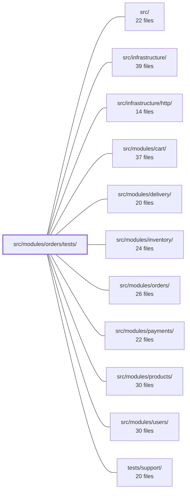

---
tags:
  - 2repo
  - 2repo/module
  - project/boilerplate-node-backend
type: module
module: src/modules/orders/tests/
files: 20
updated: 2026-08-28T12:00:20.120213+00:00
---

# src/modules/orders/tests/

## Purpose

The test suite for the orders module. It layers unit tests (pure domain logic, schema declarations, serialization guards), integration tests (repository, service, and model behaviour against a real in-memory MongoDB), and HTTP contract tests (OpenAPI spec compliance) to pin the module's public API, authorization boundaries, and data-shape guarantees that TypeScript alone cannot express.

## Key parts

- **`unit/`** — Fast, dependency-free tests. `lifecycle.test.ts` and `domain-rules.test.ts` cover the state machine and order-line validation; `money.property.test.ts` and `totals.property.test.ts` use `fast-check` to prove arithmetic totality and cent-exactness; `service-scope.test.ts` locks the admin-vs-scoped authorization boundary; `schema-contract.test.ts` and `serialization-guards.test.ts` pin schema declarations and defensive transform branches; `routes.test.ts` guards endpoint structure, auth guards, and cache keys; `emails.test.ts`, `invoice-locale.test.ts`, `audit.test.ts`, and `factory.test.ts` cover the remaining leaf functions.
- **`integration/`** — Runs against a real MongoDB instance. `repository.test.ts` pins the split return shapes of `findByIdScoped`; `service-crud.test.ts` and `service-search.test.ts` cover the service's write and read paths; `cancel.test.ts` verifies cancellation invariants and audit emissions; `model.test.ts` asserts that no Mongoose internals leak into any response; `schema-contract.test.ts` confirms defaults, required flags, and timestamps as stored.
- **`contract/api.contract.test.ts`** — Asserts every `/orders` response (success and error, all roles) satisfies the OpenAPI spec via `toSatisfyApiSpec()`, catching shape drift that unit tests miss.
- **`factory.ts`** — Adapts the production order builder to accept persisted Mongoose documents, giving all higher-level tests a single realistic fixture source.

## How it connects

- **`src/modules/orders/`** — Every test file targets production code in this sibling directory: domain functions, service methods, repository, schema, router, and email/invoice builders.
- **`src/infrastructure/http/`** — Contract tests exercise the HTTP surface (routing, serialisation, status codes) that this infrastructure layer provides.
- **`tests/support/`** — Supplies shared test infrastructure (in-memory MongoDB harness, `toSatisfyApiSpec` helper) used across the integration and contract suites.
- **`src/modules/products/`** and **`src/modules/users/`** — The test factory constructs orders with persisted product and user documents; integration and scope tests verify correct scoping against those entities.

## Where to start

Read **`unit/lifecycle.test.ts`** first — it is pure, dependency-free, and its invariant-style assertions (totality, terminality, actor permissions) give you the mental model of the order state machine before touching anything else. Then open **`contract/api.contract.test.ts`** to see the external shape the module must present over HTTP, which frames *why* the integration and unit layers exist.

## Connected modules

[[boilerplate-node-backend_src|src/]] · [[boilerplate-node-backend_src_infrastructure|src/infrastructure/]] · [[boilerplate-node-backend_src_infrastructure_http|src/infrastructure/http/]] · [[boilerplate-node-backend_src_modules_cart|src/modules/cart/]] · [[boilerplate-node-backend_src_modules_delivery|src/modules/delivery/]] · [[boilerplate-node-backend_src_modules_inventory|src/modules/inventory/]] · [[boilerplate-node-backend_src_modules_orders|src/modules/orders/]] · [[boilerplate-node-backend_src_modules_payments|src/modules/payments/]] · [[boilerplate-node-backend_src_modules_products|src/modules/products/]] · [[boilerplate-node-backend_src_modules_users|src/modules/users/]] · [[boilerplate-node-backend_tests_support|tests/support/]]

## Files
- `src/modules/orders/tests/contract/api.contract.test.ts` — Contract tests for the `/orders` HTTP surface. They assert that every response (success and error) satisfies the OpenAPI spec via `toSatisfyApiSpec()`, and that role-specific code paths (admin `findById` vs. scoped aggregate) return the *same* shape. The file exists because prior unit tests never crossed HTTP, leaving two production bugs undetected: the list endpoint emitting `totalItems`/`totalQuantity`/`totalPrice` where the spec demanded a single `total`, and `GET /orders/{id}` returning different bodies depending on caller role.
- `src/modules/orders/tests/factory.ts` — Test-only factory for the orders module. It adapts the production order builder (`src/modules/orders/factory.ts`) to accept persisted Mongoose documents (user, product) instead of raw data snapshots, so integration and contract tests can build realistic orders without manually mapping every field.
- `src/modules/orders/tests/integration/cancel.test.ts` — Integration tests for `orderService.cancelById` and `orderService.withActions`. They verify the cancellation invariants (atomic status gate + scope in one statement), the 404-vs-409 refusal contract, refund semantics enforced by role, the audit/analytics emissions, and the action-availability surface — all against a real test database.
- `src/modules/orders/tests/integration/model.test.ts` — Integration tests that guarantee order serialization never leaks Mongoose internals (`_id`, `__v`) across every response path — hydrated documents (`toJSON`), `.aggregate()` results (mapped via `applyOrderTransform`), and scoped lookups — and that embedded product snapshots are normalized the same way. Also asserts that `productSchema` indexes do not bleed into the order collection via Mongoose's nested-schema index inheritance.
- `src/modules/orders/tests/integration/repository.test.ts` — Integration tests for `orderRepository` covering the three public methods — `create`, `aggregate`, and `findByIdScoped` — against a real (in-memory) MongoDB instance. The suite pins runtime contract details that TypeScript cannot express, most notably the split shape between the unscoped (hydrated Mongoose doc) and scoped (aggregate row) return paths of `findByIdScoped`.
- `src/modules/orders/tests/integration/schema-contract.test.ts` — Asserts the Mongoose **schema declarations** of the `order` model — defaults, `required` flags, serialization shape, and timestamps — against a real MongoDB instance. Sibling tests in this folder cover behaviour/transforms; this file pins what the schema *says*, which is equally part of the public API and is not exercised elsewhere.
- `src/modules/orders/tests/integration/service-crud.test.ts` — Integration tests covering the write/CRUD operations of the orders service (`create`, `getById`, `update`, `updateById`, `remove`, `removeById`). These complement `orders.test.ts`, which handles the read/aggregation path (`search`). The file exists because mutation coverage showed the entire CRUD half as a block of uncovered mutants.
- `src/modules/orders/tests/integration/service-search.test.ts` — Integration tests for `orderService.search`, verifying that the derived fields (`totalItems`, `totalQuantity`, `totalPrice`) are present on every result and that all filter, pagination, and scope parameters work correctly against a real database.
- `src/modules/orders/tests/unit/audit.test.ts` — Pins the exact string values of the orders audit action constants (`order.created`, `order.updated`, `order.deleted`, `order.cancelled`) as a wire-contract guard. These strings are consumed by log queries, dashboards, and alert rules outside this repository; a rename of the constant is a safe refactor, but a changed string silently breaks external tooling while the build still passes.
- `src/modules/orders/tests/unit/domain-rules.test.ts` — Unit tests for the `checkOrderLines` domain rule. Exercises the function as a pure argument→verdict mapper (no mocks, no database, no fake timers) to lock down its contract: what input shapes are accepted, what rejection reasons are returned, and the atomicity guarantee that a single bad line invalidates the entire set.
- `src/modules/orders/tests/unit/emails.test.ts` — Unit tests for the order-confirmation email builder and the invoice document builder in `@modules/orders/emails`. The assertions are shaped around specific billing-error failure modes (wrong item fields, total that omits shipping, lines built off the wrong array) and verify that the builder delegates to `orderTotal` rather than recomputing a divergent sum.
- `src/modules/orders/tests/unit/factory.test.ts` — Unit tests for `makeOrder`, the order fixture builder. They verify the builder's identity/defaults behavior (real ObjectIds, empty arrays, omitted optionals) and the semantics of the embedded product snapshot that `orderItemSchema` stores.
- `src/modules/orders/tests/unit/invoice-locale.test.ts` — Verifies two locale-related invariants of the order-invoice pipeline: (1) the generic PDF worker renders only the copy it was handed at production time and never re-resolves locale at render time, and (2) every multer upload method re-enters the request locale after the stream is consumed. The test lives here (in the orders module) rather than in the PDF-worker module so that deleting `orders` removes the template, its dictionaries, and this spec together.
- `src/modules/orders/tests/unit/lifecycle.test.ts` — Unit tests for the order lifecycle state machine in `src/modules/orders/domain/lifecycle.ts`. They assert the invariants (sentences) the transition table encodes—totality, direction, terminality, actor permissions—rather than restating individual rows. Pure and synchronous: no mocks, no database.
- `src/modules/orders/tests/unit/money.property.test.ts` — Property-based tests (via `fast-check`) for the `Money` domain module. They verify the module's total invariant — that no arithmetic path can produce `NaN`, `Infinity`, or a sub-cent fraction — against both hostile and realistic inputs. The file exists because these guarantees hold for *every* input, not just hand-picked examples.
- `src/modules/orders/tests/unit/routes.test.ts` — Unit test for the orders router that pins down three structural invariants: the exact endpoint list and ordering, the auth-guard split (router-level `isAuth` + per-route `isAdmin`), and the caching/invalidation strategy. It exists to prevent silent regressions where an omitted guard, reordered path, or wrong cache key would change authorization or invalidate scope without a visible logic change.
- `src/modules/orders/tests/unit/schema-contract.test.ts` — Unit test that asserts the **declarations** of `orderSchema` directly (required fields, types, defaults, enum values, sub-schema shapes, index names/directions/options, and `timestamps`). It exists because the integration suite (`tests/integration/model.test.ts`) only exercises valid documents and therefore cannot detect declaration drift — a removed `required`, a flipped `_id: false`, a reversed index direction, or disabled `timestamps` would all let integration fixtures pass while silently breaking production behaviour.
- `src/modules/orders/tests/unit/serialization-guards.test.ts` — Unit tests for the defensive guard branches in the order serialization transform. These tests exercise the "cannot happen" paths (missing `items`, non-array `items`, unpopulated `product`, legacy `_id`) that the happy-path flow never hits, ensuring the transform never throws at the single serialization choke-point through which every order response passes.
- `src/modules/orders/tests/unit/service-scope.test.ts` — Unit tests for `orderService.callerScope`, the authorization boundary that determines which orders a caller can read. It verifies three invariants: admins get an unrestricted scope (`undefined`), non-admins get a filter scoped to their own `userId` excluding soft-deleted rows, and an absent/invalid auth context throws rather than silently widening access.
- `src/modules/orders/tests/unit/totals.property.test.ts` — Property-based tests (via `fast-check`) for `sumLineItems` and `orderTotal` in `totals.ts`. They lock in two guarantees: the functions are **total** (any input, including garbage types, yields a finite number without throwing) and **arithmetically exact in cents** (additivity, scaling, and order-independence hold with integer equality, not float tolerance). A regression to decimal accumulation or a lost `|| 0` guard would be caught.

---
[[boilerplate-node-backend_INDEX|← boilerplate-node-backend index]]
