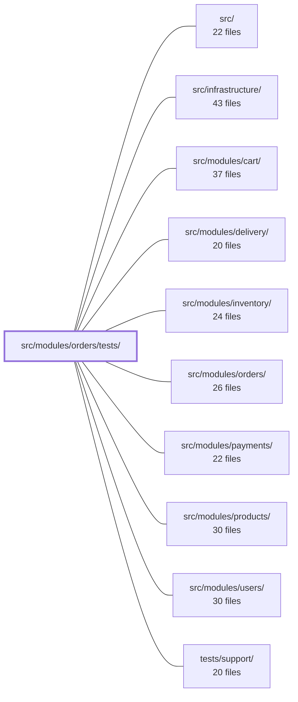

---
tags:
  - 2repo
  - 2repo/module
  - project/boilerplate-node-backend
type: module
module: src/modules/orders/tests/
files: 20
updated: 2026-08-31T20:55:50.924936+00:00
---

# src/modules/orders/tests/

## Purpose

This directory contains the complete test suite for the orders module, organized by test layer (unit, integration, contract). It covers domain rules, the Mongoose schema, the service and repository layers, route wiring, serialization guards, customer-facing output (emails, invoices), and the HTTP API contract against the OpenAPI spec.

## Key parts

- **Contract layer** — `contract/api.contract.test.ts` asserts that every `/orders` HTTP response (list, single-fetch, cancel) conforms to the OpenAPI spec via `toSatisfyApiSpec()`.
- **Fixtures** — `fixtures.ts` wraps the pure in-memory `makeOrder` builder with DB-aware helpers (converting real product documents into embedded line items, assembling valid payloads, persisting via the repository). `unit/fixtures.test.ts` unit-tests that builder itself.
- **Integration tests** (`integration/`) — Exercise the service, repository, and schema against a real MongoDB instance:
  - `service-crud.test.ts` / `service-search.test.ts` — write and read halves of the orders service, including snapshot embedding, authorization scoping, pagination, and computed totals.
  - `cancel.test.ts` — Atomicity of the status gate + ownership check, refusal-to-HTTP-status mapping, and audit/analytics side-effects.
  - `repository.test.ts` — `create`, `aggregate` passthrough fidelity, and `findByIdScoped` authorization.
  - `model.test.ts` — Serialization hygiene (no `_id`/`__v` leakage) and protection against Mongoose index cross-contamination from the product schema.
  - `schema-contract.test.ts` — Mongoose-internal declaration behaviour (defaults, `required`, timestamps) that only manifests with a live database.
- **Unit tests — domain & arithmetic** (`unit/`) — `domain-rules.test.ts` (order-line validation), `lifecycle.test.ts` (state-machine invariants), `money.property.test.ts` and `totals.property.test.ts` (property-based, hostile-input proofs that monetary arithmetic is total and exact).
- **Unit tests — service, routes, serialization** (`unit/`) — `service-scope.test.ts` (authorization boundary), `routes.test.ts` (endpoint table, auth guards, cache middleware), `serialization-guards.test.ts` (defensive branches in `applyOrderTransform`).
- **Unit tests — schema & audit** (`unit/`) — `schema-contract.test.ts` (declaration-by-declaration inspection without a DB), `audit.test.ts` (wire-contract strings pinned to the app-wide `AuditAction` union).
- **Unit tests — customer output** (`unit/`) — `emails.test.ts` (order-confirmation and invoice text builders) and `invoice-locale.test.ts` (PDF worker + multer re-entry locale correctness).

## How it connects

- **`src/modules/orders/`** — The primary subject under test: service, repository, schema, domain rules, routes, serialization transform, and email/invoice builders all live there.
- **`src/modules/products/`** — Test fixtures build embedded product snapshots from real product documents, and `integration/model.test.ts` explicitly guards against Mongoose copying product-schema index definitions onto the order schema.
- **`src/infrastructure/`** — `unit/invoice-locale.test.ts` exercises the generic PDF worker and the `upload.single` middleware chain, both infrastructure concerns scoped here because the scenario is orders-specific.
- **`src/`** (root) — `unit/audit.test.ts` asserts that the module's audit action strings are members of the app-wide `AuditAction` type union defined at the root.
- **`tests/support/`** — Shared test-database setup and helpers that the integration and fixture files rely on to spin up and tear down MongoDB instances.

## Where to start

1. **`fixtures.ts`** — Read this first to understand how every test in the directory constructs its order and product data; once you can follow `makeOrder` and the DB-aware helpers, the integration tests become straightforward.
2. **`unit/domain-rules.test.ts`** — The most self-contained test in the suite: no database, no mocks, just a pure function and its rejection reasons. It captures the "all-or-nothing" contract of an order in under a hundred lines and gives you the vocabulary the rest of the suite reuses.

## Connected modules

[[boilerplate-node-backend_src|src/]] · [[boilerplate-node-backend_src_infrastructure|src/infrastructure/]] · [[boilerplate-node-backend_src_modules_cart|src/modules/cart/]] · [[boilerplate-node-backend_src_modules_delivery|src/modules/delivery/]] · [[boilerplate-node-backend_src_modules_inventory|src/modules/inventory/]] · [[boilerplate-node-backend_src_modules_orders|src/modules/orders/]] · [[boilerplate-node-backend_src_modules_payments|src/modules/payments/]] · [[boilerplate-node-backend_src_modules_products|src/modules/products/]] · [[boilerplate-node-backend_src_modules_users|src/modules/users/]] · [[boilerplate-node-backend_tests_support|tests/support/]]

## Files
- `src/modules/orders/tests/contract/api.contract.test.ts` — Contract tests that assert every `/orders` HTTP response (list, single-fetch, cancel) satisfies the OpenAPI spec via `toSatisfyApiSpec()`. The file exists because the list endpoint historically returned `totalItems`/`totalQuantity`/`totalPrice` while the spec declared a single `total`, and `GET /orders/{id}` returned a different shape per caller role — neither was caught because no prior test exercised the HTTP boundary.
- `src/modules/orders/tests/fixtures.ts` — Provides test fixtures that interact with the test database for the orders module. While `../fixtures.ts` offers a pure in-memory order builder (used when seeds build orders from catalogue snapshots that were never persisted), this module wraps that builder with DB-aware helpers: converting real product documents into embedded line items, assembling valid order payloads, and persisting orders via the repository.
- `src/modules/orders/tests/integration/cancel.test.ts` — Integration tests for `orderService.cancelById` (and the related `withActions` projection) against a real database. They pin down the invariants that make the single-statement cancel safe: the status gate and ownership check are atomic, refusal reasons map to distinct HTTP statuses (404 vs 409), the refund flag is caller-scoped, and audit/analytics side-effects fire with the correct actor identity and event name.
- `src/modules/orders/tests/integration/model.test.ts` — Integration tests verifying that orders never leak `_id` or `__v` in any serialization path—hydrated `toJSON`, `.aggregate()` results, and scoped lookups—and that embedded product snapshots are normalized (id → `_id` stripped, items carry no `_id`). Also guards against Mongoose silently copying product-schema indexes onto the order schema.
- `src/modules/orders/tests/integration/repository.test.ts` — Integration tests for `orderRepository` that verify three contracts against a real MongoDB instance: (1) `create` persists correct order data with embedded product snapshots, (2) `aggregate` is a faithful passthrough that does not reshape Mongo pipeline stages, and (3) `findByIdScoped` returns a usable `id` on both its unscoped and scoped branches while enforcing authorization.
- `src/modules/orders/tests/integration/schema-contract.test.ts` — Verifies the Mongoose schema *declarations* themselves (defaults, `required` fields, serialization shape, timestamps) rather than the domain transforms covered by sibling integration specs. Uses a real MongoDB instance because the behaviours under test are Mongoose-internal (e.g. what `default` actually does) and would be meaningless against a mock.
- `src/modules/orders/tests/integration/service-crud.test.ts` — Integration tests for the **write half** of the orders service (`create`, `getById`, `update`, `updateById`, `remove`, `removeById`). The read/aggregation half (`search`) is covered separately in `orders.test.ts`. Two behaviours carry the most weight: `create` embeds a full product snapshot (title + price) rather than a reference, so later repricing cannot rewrite historical orders; and `getById`'s optional `scope` argument is an authorization boundary where a mismatched owner must yield `undefined`, not the order.
- `src/modules/orders/tests/integration/service-search.test.ts` — Integration tests for the read half of `orderService.search`: filtering, pagination, and the three computed totals (`totalItems`, `totalQuantity`, `totalPrice`). The write half (`create`, `update`, `remove`) is covered in `service-crud.test.ts`. This file exists to guarantee that every search result passes through the repository's `normalize` step, which is the only mechanism that attaches the derived totals.
- `src/modules/orders/tests/unit/audit.test.ts` — Unit test that pins the orders module's audit action strings to their exact wire-contract values and verifies they are registered in the app-wide `AuditAction` type union. It exists because these strings are read by log queries and alert rules outside this repo — a silent rename or omission breaks downstream tooling.
- `src/modules/orders/tests/unit/domain-rules.test.ts` — Unit tests for the `checkOrderLines` domain rule. The tests are intentionally pure — no mocks, no database, no fake timers — because the rule is a simple function that takes candidate order lines and returns a verdict. The file exists to pin down the exact rejection reasons and the "all-or-nothing" contract of an order.
- `src/modules/orders/tests/unit/emails.test.ts` — Unit tests for the two customer-facing money-rendering builders in the orders module — `orderConfirmEmail` and `invoiceDocument`. The file exists to catch the specific failure mode where a formatting slip (swapped fields, missing line, recomputed total, untranslated key) is read as a billing error by the end customer. It explicitly does **not** re-derive the total; it only asserts the builder defers to `orderTotal`.
- `src/modules/orders/tests/unit/fixtures.test.ts` — Unit tests for the `makeOrder` fixture builder. They verify that the builder produces schema-valid documents with correct types (real `ObjectId` instances, not strings), that required fields are always populated, that the embedded product snapshot uses `_id` rather than `id`, and that the builder correctly distinguishes between "field omitted" and "field set to a falsy value" (e.g. `shippingCost: 0`).
- `src/modules/orders/tests/unit/invoice-locale.test.ts` — Verifies that the invoice PDF pipeline renders copy in the locale it was produced in, independent of any ambient locale scope. It covers two units: the generic PDF worker (which only interpolates pre-resolved strings from `invoiceDocument`) and the `upload.single` middleware chain (which re-enters the request locale after multer consumes the stream). The test lives under `modules/orders` rather than under the infrastructure worker because the scenario is orders-specific and should disappear with the module.
- `src/modules/orders/tests/unit/lifecycle.test.ts` — Unit tests for the order-lifecycle state machine (`ORDER_LIFECYCLE` table and its query helpers). Instead of asserting individual rows, the suite encodes *sentences*—invariant properties over the whole table—so that a table copied with the same mistake in both the fixture and the expectation still fails.
- `src/modules/orders/tests/unit/money.property.test.ts` — Property-based tests (via `fast-check`) for the `Money` domain module. The invariant under test is that no monetary arithmetic produces `NaN`, `Infinity`, or a sub-cent fraction **for every possible input**, so the generators are deliberately hostile (garbage strings, booleans, overflow values) rather than just realistic. The file exists to give the team a single reproducible, seeded proof surface for those invariants.
- `src/modules/orders/tests/unit/routes.test.ts` — Unit test for the orders router's route table. It verifies the exact set and order of mounted endpoints, that auth guards (`isAuth`, `isAdmin`) are applied where expected (and intentionally absent where a customer-facing write must remain open), and that caching and invalidation middleware match the documented behavior.
- `src/modules/orders/tests/unit/schema-contract.test.ts` — Unit test that inspects the Mongoose `orderSchema` object **declaration-by-declaration** (required flags, types, defaults, embedded options, index specs) without a database. It exists because the integration suite (`tests/integration/model.test.ts`) exercises the schema only through valid-document saves, which cannot surface declaration defects like a dropped `required`, a flipped `_id: false`, or a reversed index direction.
- `src/modules/orders/tests/unit/serialization-guards.test.ts` — Unit tests for the defensive guard branches in `applyOrderTransform`. The transform sits on the single path every order response passes through, so an unguarded throw converts a successful read into a 500 for the whole collection. These tests pin the "cannot happen" halves of the guards—missing `items`, non-array `items`, unpopulated product refs, legacy `_id`—that only surface on projected queries or legacy documents and are therefore the hardest regressions to notice in integration tests.
- `src/modules/orders/tests/unit/service-scope.test.ts` — Unit tests for `orderService.callerScope`, the authorization boundary that determines which orders a caller can read. Covers the three outcomes — admin (no restriction), non-admin (scoped to own `userId` excluding soft-deleted rows), and no-auth (throws) — plus the type-safety requirement that the scope carries a BSON `ObjectId`, not a string.
- `src/modules/orders/tests/unit/totals.property.test.ts` — Property-based tests for the order-total arithmetic in `domain/totals.ts`. Guarantees that `sumLineItems` and `orderTotal` are total (never NaN, never throw) even against hostile or nullish input, and that their numeric results satisfy exact arithmetic invariants (additivity, scaling, order-independence) at cent precision.

---
[[boilerplate-node-backend_INDEX|← boilerplate-node-backend index]]
