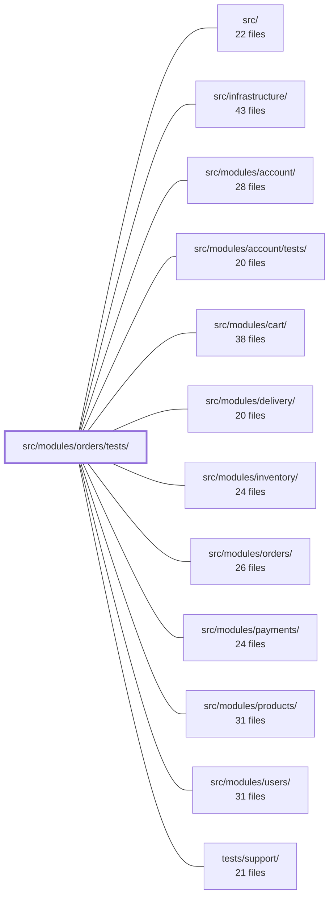

---
tags:
  - 2repo
  - 2repo/module
  - project/boilerplate-node-backend
type: module
module: src/modules/orders/tests/
files: 21
updated: 2026-09-02T18:35:01.907808+00:00
---

# src/modules/orders/tests/

## Purpose

This module is the full test suite for the orders domain. It spans every testing tier—contract, integration, and unit—and exists to pin down the behavioral contracts of the orders module: the HTTP API shape, the repository and service logic, the domain rules, and the cross-cutting concerns (PII retention, serialization safety, locale rendering) that live at the seams between orders and the rest of the system.

## Key parts

- **`contract/`** — A single HTTP contract test file (`api.contract.test.ts`) that validates every `/orders` route response against the published OpenAPI spec and asserts role-specific (admin vs. scoped-user) response differences that only surface at the transform layer.

- **`fixtures.ts`** — DB-aware test-fixture helpers that wrap the pure in-memory `makeOrder` builder: they convert real product documents into embedded line items, assemble valid order payloads, and persist orders through the repository. Nearly every integration test builds its preconditions through this file.

- **`integration/`** — Seven suites that run against a real test database:
  - *Service CRUD & search* (`service-crud.test.ts`, `service-search.test.ts`) cover the write and read halves of `orderService`, pinning the product-snapshot-on-create invariant and the `scope` authorization boundary.
  - *Cancel & retention* (`cancel.test.ts`, `retention.test.ts`) verify the atomic cancel invariants and the two-phase PII-erasure flow triggered by account deletion.
  - *Repository & schema* (`repository.test.ts`, `schema-contract.test.ts`, `model.test.ts`) confirm aggregate-passthrough, Mongoose runtime behaviour, and that no serialization path leaks `_id`/`__v`.

- **`unit/`** — Twelve focused suites (no database, no network):
  - *Domain logic* — `lifecycle.test.ts` (state-machine properties), `domain-rules.test.ts` (`checkOrderLines`), `money.property.test.ts` and `totals.property.test.ts` (property-based arithmetic invariants via `fast-check`).
  - *Serialization & guards* — `serialization-guards.test.ts`, `schema-contract.test.ts` (declaration-level), `audit.test.ts` (action-vocabulary pin).
  - *Presentation & routing* — `emails.test.ts`, `invoice-locale.test.ts`, `routes.test.ts`.
  - *Authorization* — `service-scope.test.ts` (the `callerScope` boundary).
  - *Fixture hygiene* — `fixtures.test.ts` validates the builder itself.

## How it connects

- **`src/modules/orders/`** — Every test in this directory exercises code in that module: services, repository, domain rules, Mongoose schema, transform layer, and module wiring. This is the module under test.
- **`src/modules/account/`** — The retention integration test subscribes to the real account-hard-delete event and asserts the resulting `anonymizeAfter` stamp, so a broken event subscription between the two modules fails here.
- **`src/modules/products/`** — Fixtures and integration tests read real product documents from the test database to build embedded line-item snapshots, and the model tests verify that product-schema indexes are not silently copied onto orders.
- **`src/modules/users/`** — The `callerScope` unit tests and the service CRUD/search integration tests assert that orders are scoped to a `userId` `ObjectId`; the no-auth and mismatched-scope paths are explicit assertions.
- **`src/modules/payments/`** — The cancel integration test asserts that the refund flag is caller-scoped and that refusal reasons map to distinct HTTP statuses, coupling orders' cancel contract to the payment/refund boundary.
- **`tests/support/`** — Shared test-database lifecycle, connection pooling, and teardown utilities that every integration suite depends on.
- **`src/infrastructure/`** — The Mongoose driver, the PDF-rendering worker used by the invoice-locale test, and the multer middleware chain all originate here.

## Where to start

1. **`fixtures.ts`** — Read this first because almost every integration test constructs its preconditions through these helpers. Understanding how an order document is assembled (product snapshot shape, required fields, ObjectId types) makes the rest of the suite legible.

2. **`unit/lifecycle.test.ts`** — A short, fully self-contained property-based test of the `ORDER_LIFECYCLE` state machine. No mocks, no database. It reveals the status vocabulary, actor gating, and terminal states that the cancel, retention, and service tests all depend on, giving you the domain's backbone in under two minutes of reading.

## Connected modules

[[boilerplate-node-backend_src|src/]] · [[boilerplate-node-backend_src_infrastructure|src/infrastructure/]] · [[boilerplate-node-backend_src_modules_account|src/modules/account/]] · [[boilerplate-node-backend_src_modules_account_tests|src/modules/account/tests/]] · [[boilerplate-node-backend_src_modules_cart|src/modules/cart/]] · [[boilerplate-node-backend_src_modules_delivery|src/modules/delivery/]] · [[boilerplate-node-backend_src_modules_inventory|src/modules/inventory/]] · [[boilerplate-node-backend_src_modules_orders|src/modules/orders/]] · [[boilerplate-node-backend_src_modules_payments|src/modules/payments/]] · [[boilerplate-node-backend_src_modules_products|src/modules/products/]] · [[boilerplate-node-backend_src_modules_users|src/modules/users/]] · [[boilerplate-node-backend_tests_support|tests/support/]]

## Files
- `src/modules/orders/tests/contract/api.contract.test.ts` — HTTP-level contract tests for every `/orders` route. Each response is validated against the OpenAPI spec via the `toSatisfyApiSpec()` matcher, so any drift between what the server actually returns and what the published contract promises is caught here. The file also asserts role-specific behavior (admin vs. scoped user) that unit-level repository tests cannot see, because the divergence lived in the transform layer between the two code paths.
- `src/modules/orders/tests/fixtures.ts` — Provides test fixtures that interact with the test database for the orders module. While `../fixtures.ts` offers a pure in-memory order builder (used when seeds build orders from catalogue snapshots that were never persisted), this module wraps that builder with DB-aware helpers: converting real product documents into embedded line items, assembling valid order payloads, and persisting orders via the repository.
- `src/modules/orders/tests/integration/cancel.test.ts` — Integration tests for `orderService.cancelById` (and the related `withActions` projection) against a real database. They pin down the invariants that make the single-statement cancel safe: the status gate and ownership check are atomic, refusal reasons map to distinct HTTP statuses (404 vs 409), the refund flag is caller-scoped, and audit/analytics side-effects fire with the correct actor identity and event name.
- `src/modules/orders/tests/integration/model.test.ts` — Integration tests verifying that orders never leak `_id` or `__v` in any serialization path—hydrated `toJSON`, `.aggregate()` results, and scoped lookups—and that embedded product snapshots are normalized (id → `_id` stripped, items carry no `_id`). Also guards against Mongoose silently copying product-schema indexes onto the order schema.
- `src/modules/orders/tests/integration/repository.test.ts` — Integration test suite for `orderRepository`. It verifies three contract areas against a real (test) database: `create` (insert + return a Mongoose document), `aggregate` (raw pipeline passthrough — the repository must *not* reshape Mongo stages), and `findByIdScoped` (two structurally different resolution branches: unscoped/admin hydrated doc vs. scoped/owner transformed aggregate row). The aggregate cases pin the passthrough guarantee so that `$match`/`$count`/`$addFields`/pagination remain a deliberate, tested design rather than an implicit assumption.
- `src/modules/orders/tests/integration/retention.test.ts` — Integration suite proving the two-phase PII-erasure flow for orders: (1) detaching `userId` and stamping `anonymizeAfter` when an account is hard-deleted, and (2) the `anonymizeDueOrders` sweep that scrubs residual PII once the retention window elapses. The tests register **real** module wiring (not a bare service call) so a missing event subscription in `orders/module.ts` would be caught.
- `src/modules/orders/tests/integration/schema-contract.test.ts` — Integration test that verifies the Mongoose schema declarations on the order model — defaults, `required` constraints, `select: false` on credentials — rather than any application-level transforms. It runs against a real Mongo instance because the assertions target Mongoose's own runtime behaviour, which a mock would only re-implement opaquely.
- `src/modules/orders/tests/integration/service-crud.test.ts` — Integration tests for the **write/CRUD** half of the orders service (`create`, `getById`, `update`, `updateById`, `remove`, `removeById`). The read/aggregation half (`search`) lives in a sibling `orders.test.ts`. The file pins two load-bearing invariants: (1) `create` embeds a full product snapshot so later repricing cannot rewrite historical charges, and (2) `getById`'s `scope` argument is an authorization boundary where a mismatched scope must return `undefined` indistinguishably from a missing id.
- `src/modules/orders/tests/integration/service-search.test.ts` — Integration tests for the read half of `orderService.search`: filtering, pagination, and the three computed totals (`totalItems`, `totalQuantity`, `totalPrice`). The write half (`create`, `update`, `remove`) is covered in `service-crud.test.ts`. This file exists to guarantee that every search result passes through the repository's `normalize` step, which is the only mechanism that attaches the derived totals.
- `src/modules/orders/tests/unit/audit.test.ts` — Single-test guard that pins the exact key-and-value shape of the `ordersAuditActions` vocabulary to the string literals expected by downstream log-query and alert-rule tooling outside this repository. It exists so that a value rename, a new action, or a removed action all fail CI loudly rather than silently breaking external consumers.
- `src/modules/orders/tests/unit/domain-rules.test.ts` — Unit tests for the `checkOrderLines` domain rule. The tests are intentionally pure — no mocks, no database, no fake timers — because the rule is a simple function that takes candidate order lines and returns a verdict. The file exists to pin down the exact rejection reasons and the "all-or-nothing" contract of an order.
- `src/modules/orders/tests/unit/emails.test.ts` — Unit tests for the two customer-facing money-rendering builders in the orders module — `orderConfirmEmail` and `invoiceDocument`. The file exists to catch the specific failure mode where a formatting slip (swapped fields, missing line, recomputed total, untranslated key) is read as a billing error by the end customer. It explicitly does **not** re-derive the total; it only asserts the builder defers to `orderTotal`.
- `src/modules/orders/tests/unit/fixtures.test.ts` — Unit tests for the `makeOrder` fixture builder. They verify that the builder produces schema-valid documents with correct types (real `ObjectId` instances, not strings), that required fields are always populated, that the embedded product snapshot uses `_id` rather than `id`, and that the builder correctly distinguishes between "field omitted" and "field set to a falsy value" (e.g. `shippingCost: 0`).
- `src/modules/orders/tests/unit/invoice-locale.test.ts` — Verifies that the invoice PDF pipeline renders copy in the locale it was produced in, independent of any ambient locale scope. It covers two units: the generic PDF worker (which only interpolates pre-resolved strings from `invoiceDocument`) and the `upload.single` middleware chain (which re-enters the request locale after multer consumes the stream). The test lives under `modules/orders` rather than under the infrastructure worker because the scenario is orders-specific and should disappear with the module.
- `src/modules/orders/tests/unit/lifecycle.test.ts` — Unit tests for the order-lifecycle state machine in `src/modules/orders/domain/lifecycle.ts`. The suite asserts *properties* of the `ORDER_LIFECYCLE` table (totality, direction, actor-gating, terminal immutability) rather than restating individual rows, so that a table copied wrong in both the module and its expectations is still caught. No mocks, no database — pure logic verification.
- `src/modules/orders/tests/unit/money.property.test.ts` — Property-based tests (via `fast-check`) for the `Money` domain module. The invariant under test is that no monetary arithmetic produces `NaN`, `Infinity`, or a sub-cent fraction **for every possible input**, so the generators are deliberately hostile (garbage strings, booleans, overflow values) rather than just realistic. The file exists to give the team a single reproducible, seeded proof surface for those invariants.
- `src/modules/orders/tests/unit/routes.test.ts` — Unit test for the orders router's route table. It verifies the exact set and order of mounted endpoints, that auth guards (`isAuth`, `isAdmin`) are applied where expected (and intentionally absent where a customer-facing write must remain open), and that caching and invalidation middleware match the documented behavior.
- `src/modules/orders/tests/unit/schema-contract.test.ts` — Asserts the **declarations** of `orderSchema` — required paths, types, defaults, enums, embedded-subschema options, index specs, and schema-level options — by inspecting the Mongoose schema object directly. This catches declaration defects (a dropped `required`, a flipped `_id: false`, a reversed index direction) that would not change what a valid document looks like and are therefore invisible to integration tests that only drive real saves.
- `src/modules/orders/tests/unit/serialization-guards.test.ts` — Unit tests for the defensive guard branches in `applyOrderTransform`. The transform sits on the single path every order response passes through, so an unguarded throw converts a successful read into a 500 for the whole collection. These tests pin the "cannot happen" halves of the guards—missing `items`, non-array `items`, unpopulated product refs, legacy `_id`—that only surface on projected queries or legacy documents and are therefore the hardest regressions to notice in integration tests.
- `src/modules/orders/tests/unit/service-scope.test.ts` — Unit tests for `orderService.callerScope`, the authorization boundary that determines which orders a caller can read. Covers the three outcomes — admin (no restriction), non-admin (scoped to own `userId` excluding soft-deleted rows), and no-auth (throws) — plus the type-safety requirement that the scope carries a BSON `ObjectId`, not a string.
- `src/modules/orders/tests/unit/totals.property.test.ts` — Property-based tests for the order-total arithmetic in `domain/totals.ts`. Guarantees that `sumLineItems` and `orderTotal` are total (never NaN, never throw) even against hostile or nullish input, and that their numeric results satisfy exact arithmetic invariants (additivity, scaling, order-independence) at cent precision.

---
[[boilerplate-node-backend_INDEX|← boilerplate-node-backend index]]
