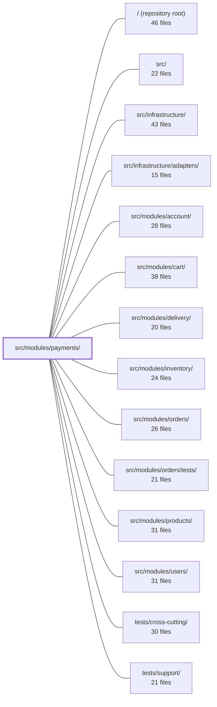

---
tags:
  - 2repo
  - 2repo/module
  - project/boilerplate-node-backend
type: module
module: src/modules/payments/
files: 24
updated: 2026-09-02T18:35:16.708776+00:00
---

# src/modules/payments/

## Purpose

The payments module owns the end-to-end lifecycle of a charge tied to an order: freezing an order's price into a payment intent, attempting the actual card charge (confirm), and issuing a standalone refund. It enforces the module's financial invariants—exactly one payment per order, order-status gating before a charge is finalised, and at-most-once refunds—behind a single service boundary that sibling modules can reach without touching internals.

## Key parts

- **Domain core** — `service.ts` (intent creation, confirm/charge, refund logic and the three invariants), `model.ts` (Mongoose schema, `PaymentStatus` enum, unique `orderId` index), and `repository.ts` (scoped reads, intent upsert, status-transition write, account-erasure detachment).
- **HTTP surface** — `routes.ts` (Express route table with layered auth: universal auth, fresh re-auth on money routes, admin-only refund), `controllers/` (thin handlers for intent, confirm, lookup-by-order, refund), and `module.ts` (the `AppModule` manifest the kernel loader picks up: route registration, domain-event subscriptions, locale directory).
- **Provider port** — `providers/index.ts` (the `PaymentProvider` interface, `ChargeOutcome` type, env-driven resolver), `providers/card.ts` (shared card types at the boundary), and `providers/fake.ts` (deterministic in-process PSP stub for tests and demos).
- **Observability & config** — `analytics.ts` and `audit.ts` (typed event/action vocabulary via module augmentation), `metrics.ts` (PromQL counters), and `config.ts` (single deployment-tunable: default ISO-4217 currency code).
- **API contract** — `openapi.yaml` (OpenAPI 3.0.3 spec for all four endpoints and the `Payment` schema; source of truth for client codegen).
- **Public entry** — `index.ts` (barrel that re-exports only `paymentService`, keeping internals private).
- **Tests** — `tests/unit/` (schema contract, route-table shape, provider port), `tests/integration/` (service invariants against real Mongo with the fake PSP; retention/erasure contract), and `tests/contract/` (HTTP-level OpenAPI conformance per branch).

## How it connects

- **Orders** — The tightest coupling. Payment intents reference an `orderId`; confirmation conditionally transitions the order `pending → paid` *before* the payment row becomes `succeeded`; the `ORDER_CANCELLED` domain event (subscribed in `module.ts`) triggers the at-most-once refund path. The get-by-order controller exists so the order page can recover payment state on reload.
- **Users / Account** — Every payment route requires authentication; money-moving routes require a fresh re-authentication session. The retention integration test verifies that hard-deleting a user *detaches* (nulls `userId` on) the payment rather than deleting it. Repository scoping keeps a caller's payments isolated.
- **Inventory** — `config.ts` deliberately mirrors `@modules/inventory`'s `config.ts` pattern so each module reads its deployment tunables in exactly one place.
- **Infrastructure / Adapters** — The `PaymentProvider` port in `providers/index.ts` is the seam where a real PSP adapter (e.g., a Stripe adapter under `infrastructure/adapters/`) plugs in without the module importing a concrete implementation. Metrics counters are read by the infrastructure overview endpoint without a reverse import.
- **Cross-cutting tests** (`tests/cross-cutting/`, `tests/support/`) — Provide the shared test-server harness and OpenAPI conformance utilities (`toSatisfyApiSpec`) that the contract suite relies on.

## Where to start

Read **`service.ts`** first: it is roughly the whole business logic in one file—intent freezing, the pending-order gate, the conditional charge-and-order-transition, the decline-retry rule, and the at-most-once refund. Understanding those five flows makes every controller, route guard, and test in the module fall into place. Then skim **`model.ts`** to see the schema invariants (unique index, enum anchoring) that the service's invariants depend on at the database level.

## Connected modules

[[boilerplate-node-backend_ROOT|/ (repository root)]] · [[boilerplate-node-backend_src|src/]] · [[boilerplate-node-backend_src_infrastructure|src/infrastructure/]] · [[boilerplate-node-backend_src_infrastructure_adapters|src/infrastructure/adapters/]] · [[boilerplate-node-backend_src_modules_account|src/modules/account/]] · [[boilerplate-node-backend_src_modules_cart|src/modules/cart/]] · [[boilerplate-node-backend_src_modules_delivery|src/modules/delivery/]] · [[boilerplate-node-backend_src_modules_inventory|src/modules/inventory/]] · [[boilerplate-node-backend_src_modules_orders|src/modules/orders/]] · [[boilerplate-node-backend_src_modules_orders_tests|src/modules/orders/tests/]] · [[boilerplate-node-backend_src_modules_products|src/modules/products/]] · [[boilerplate-node-backend_src_modules_users|src/modules/users/]] · [[boilerplate-node-backend_tests_cross-cutting|tests/cross-cutting/]] · [[boilerplate-node-backend_tests_support|tests/support/]]

## Files
- `src/modules/payments/analytics.ts` — Declares the analytics event names emitted by the payments module and registers them in the shared analytics port's type map. Controllers import this file directly (rather than a published copy) to get typed event names, following the same augmentation pattern as `./audit.ts`.
- `src/modules/payments/audit.ts` — Declares the set of audit action identifiers emitted by the payments module and registers them in the shared `AuditActionMap` via TypeScript module augmentation, giving the observability layer a typed vocabulary of payment-related audit events.
- `src/modules/payments/config.ts` — Provides the single deployment-tunable money setting — the default ISO-4217 currency code. It exists as a dedicated module (mirroring `@modules/inventory`'s `config.ts`) so the value is read in exactly one place, per call, rather than transcribed into each consumer's own fallback.
- `src/modules/payments/controllers/get-payment-by-order.ts` — Thin Express controller for `GET /payments/order/:orderId`. It delegates to `paymentService.getForOrder` and returns the payment (intent, status, etc.) so the order page's payment panel can recover its state on a mid-flow reload rather than restarting.
- `src/modules/payments/controllers/post-payment-confirm.ts` — HTTP controller handler for `POST /payments/:id/confirm`. Receives a card confirmation from the dialog, delegates to the payment service, records the outcome metric, and returns a success or refusal response. This is the endpoint where the actual charge is attempted and where decline/success events are audited.
- `src/modules/payments/controllers/post-payment-intent.ts` — HTTP handler for `POST /payments/intent`. It validates the request body, delegates to the payment service to freeze an order's price into a payment intent, and returns `201`. It is intentionally a thin pass-through: ownership checks, the `pending` gate, and amount logic all live in the service layer. No audit or analytics events are emitted here—intent creation is a preparation step, not a business event (those fire on confirm).
- `src/modules/payments/controllers/post-payment-refund.ts` — HTTP handler for `POST /payments/order/:orderId/refund`. It performs a standalone monetary refund on an order **without altering the order's status**. It exists as a separate endpoint so an admin/operator can refund or cancel independently; "cancel and refund" is simply the client calling this endpoint plus the order-cancel endpoint.
- `src/modules/payments/index.ts` — Barrel (public entry) for the Payments module. It re-exports a single curated surface—`paymentService`—so that sibling modules import from this one path instead of reaching into internal files. This enforces a stable API boundary and keeps the payments module's internals private to itself.
- `src/modules/payments/metrics.ts` — Defines the PromQL counters owned by the payments module. It keeps domain-level metrics colocated with the module that produces them (rather than in `infrastructure`) so ownership is obvious and the overview endpoint can read them without creating a reverse import.
- `src/modules/payments/model.ts` — Defines the Mongoose schema, document interface, and registered model for the **Payment** collection. Enforces the one-payment-per-order invariant via a `unique` index on `orderId`, so a retry after a decline re-confirms the same document. Anchors the provider-facing lifecycle (`PaymentStatus` enum from `@types`) to the schema so the wire and the enum cannot drift.
- `src/modules/payments/module.ts` — Module manifest (entry point) for the **payments** module. It registers the module's HTTP routes, subscribes to two cross-module domain events, and declares the locale directory — all in a single object typed against the kernel's `AppModule` contract. This file is what the kernel's module loader picks up when bootstrapping the app.
- `src/modules/payments/openapi.yaml` — OpenAPI 3.0.3 module contract for the Payments service (v2.0.0). Defines the four HTTP endpoints that manage the lifecycle of a payment (create intent → confirm → refund) tied to an order, along with the `Payment` schema and caller-specific `PaymentActions`. Serves as the single source of truth for client code generation and API documentation.
- `src/modules/payments/providers/card.ts` — Shared type and utility module for card data at the provider boundary. It exists as a standalone file so the port definition and every concrete provider can consume the same types without creating circular imports between them.
- `src/modules/payments/providers/fake.ts` — A deterministic payment-provider stub that implements the `PaymentProvider` interface without any network calls. It mimics real PSP test-mode behavior (including Stripe's well-known decline card number) so that demos, e2e suites, and unit tests can exercise both the success and decline paths identically to production code.
- `src/modules/payments/providers/index.ts` — Defines the `PaymentProvider` port (interface), the `ChargeOutcome` type, and a memoised, env-driven resolver that selects which concrete provider implementation answers at runtime. It is the single seam a real PSP (e.g. Stripe) plugs into without touching the rest of the payments module.
- `src/modules/payments/repository.ts` — Payment data-access layer: standard CRUD (via a shared factory) plus the payment-specific lookups and guarded writes that the payments service needs. It owns scoping to a caller's rows, the intent upsert, the status-machine transition primitive, and account-erasure detachment — all as a single exported object.
- `src/modules/payments/routes.ts` — Defines the Express route table for all payment endpoints (intent creation, confirmation, order lookup, refund). Enforces a layered auth model at the router level: every route requires authentication, all money-moving routes additionally require a fresh re-authentication session, and the refund route is admin-only.
- `src/modules/payments/service.ts` — Implements the payment domain service: creating payment intents, confirming (charging) them, and reading them back for the order page. It enforces three invariants — only a `pending` order's owner can start paying; the order's transition to `paid` is the gate, not the charge (a slipped order triggers an immediate refund); and a post-payment refund is at-most-once via a conditional `succeeded → refunded` move.
- `src/modules/payments/tests/contract/api.contract.test.ts` — Contract tests for the `/payments` HTTP API. Each test sends a real request over HTTP (via the test server) and asserts both the specific status code and that the response body satisfies the OpenAPI spec (`toSatisfyApiSpec()`). The goal is to pin that every contract branch — 201 intent, 200 confirm, the distinguishable 409s, 404s, 422s — is actually reachable and well-shaped. Business/money rules are intentionally out of scope here (they live in the unit suite).
- `src/modules/payments/tests/integration/retention.test.ts` — Integration tests verifying the **erasure retention contract** for payments: when a user account is hard-deleted, the associated payment is *detached* (its `userId` is unset) rather than deleted, preserving the record as a receipt. Also pins that the one live path that can still hit a detached order — an admin `createIntent` — records no payer (`undefined`) instead of the literal string `"undefined"`. Tests run against real module wiring (no service-level mocks) to prove the cascade works end-to-end.
- `src/modules/payments/tests/integration/service.test.ts` — Integration tests for the payments service (`src/modules/payments/service.ts`) that pin its core invariants against a real MongoDB: the intent freezes the order's published total (shipping included), confirmation conditionally moves the order `pending → paid` before the payment row becomes `succeeded`, a decline is retryable, and the `ORDER_CANCELLED` refund path is at-most-once. Real Mongo is used throughout because the guarantees under test *are* the conditional writes; the payment provider is the in-process `fake` implementation.
- `src/modules/payments/tests/unit/providers.test.ts` — Unit tests for the payment-provider port: the `cardLastFour` utility, the fake PSP's charge/refund behavior, and the `resolvePaymentProvider` registry. These live here (rather than in `tests/integration/`) because none of the paths under test touch a database—only in-memory logic and provider selection.
- `src/modules/payments/tests/unit/routes.test.ts` — Unit tests that pin down the shape of the payments route table: the exact set of endpoints and their order, universal authentication, the single admin-only refund route, and the path-length ordering convention. It exists so that any future route addition or reordering that would silently break these invariants fails immediately.
- `src/modules/payments/tests/unit/schema-contract.test.ts` — Contract test that pins down the `paymentSchema` declaration at the schema level—required fields, the unique index on `orderId`, reference targets, validation bounds, enum/default for `status`, and timestamps. It encodes the module's idempotence guarantee (one payment per order, enforced by the DB) as an executable assertion so that removing `unique: true` or loosening constraints fails CI rather than silently allowing double-charges.

---
[[boilerplate-node-backend_INDEX|← boilerplate-node-backend index]]
