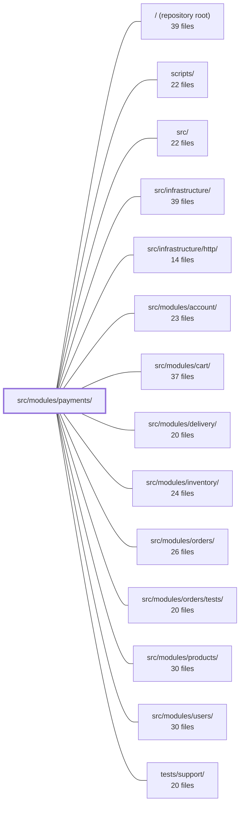

---
tags:
  - 2repo
  - 2repo/module
  - project/boilerplate-node-backend
type: module
module: src/modules/payments/
files: 22
updated: 2026-08-28T12:00:36.700982+00:00
---

# src/modules/payments/

## Purpose

The payments module owns the money-side of the order lifecycle: creating a payment intent, confirming (charging) a card, and issuing a refund. It encapsulates the payment document, the provider (PSP) boundary, the HTTP endpoints, and all domain rules that keep money movement safe—idempotency, single-charge, at-most-once refund—while keeping the rest of the system free of raw provider calls.

## Key parts

- **Domain core** — `service.ts` holds the business rules (intent creation, charge, refund, inventory commit); `model.ts` defines the Mongoose schema with the one-payment-per-order invariant; `repository.ts` wraps that model with scoped reads, an atomic upsert, and a guarded status transition so the service never issues raw queries.
- **HTTP layer** — `routes.ts` declares the four endpoints with auth; `controllers/` (four thin handlers) validates input, delegates to the service, and shapes the response. The module stays deliberately thin here: no ownership checks, amount math, or status gates live in controllers.
- **Provider boundary** — `providers/index.ts` defines the `PaymentProvider` port and the env-driven factory; `providers/card.ts` is the shared minimal card shape; `providers/fake.ts` is a zero-network test provider with a hard-coded decline number. Swapping in a real PSP is a one-line registry addition.
- **Cross-cutting declarations** — `analytics.ts`, `audit.ts`, and `metrics.ts` register type-safe event names, audit actions, and Prometheus counters via module augmentation, keeping the vocabulary co-located with the logic that emits it. `config.ts` is the single source for the default ISO-4217 currency code.
- **Wiring & contract** — `module.ts` is the single `AppModule` entry the kernel uses to mount the module (identity, dependencies, routes, event subscriptions). `openapi.yaml` (v2.0.0) is the published API contract that the orders module and external clients code against.
- **Tests** — split by level: `tests/contract/` (HTTP + OpenAPI conformance), `tests/integration/` (service against real Mongo with the fake provider), `tests/unit/` (provider logic, route-table security pin, schema-contract guard).

## How it connects

- **`src/modules/orders/`** — Tightest coupling. Payments enforces one-payment-per-order, transitions the order `pending → paid` before marking the payment `succeeded`, and offers a refund endpoint that is deliberately separate from order cancellation. The OpenAPI spec is the shared contract the orders module and clients consume.
- **`src/modules/inventory/`** — The service commits held inventory only after the order has conditionally moved to `paid`, so a declined charge never releases stock.
- **`src/infrastructure/` & `src/infrastructure/http/`** — The module augments the infrastructure analytics port's type map (`analytics.ts`), registers audit actions into the global `AuditActionMap` (`audit.ts`), and declares Prometheus counters (`metrics.ts`) that the infrastructure layer exposes. HTTP transport (Express, session auth) is provided by the infrastructure layer and consumed by `routes.ts`.
- **`src/modules/account/`** — Follows the same convention: domain-owned `metrics.ts` co-located in the module rather than in infrastructure, keeping counter ownership next to the incrementing logic.
- **`src/modules/users/`** — Authentication is enforced at the router level (session middleware), and the repository scopes all reads to the authenticated user's ownership.
- **`tests/support/`** — Shared test fixtures and helpers (e.g., app boot, session tokens) used across the payments test suites.

## Where to start

1. **`service.ts`** — Read this first. It is the only place the money-movement rules live, and every controller, provider, and test ultimately reduces to the three operations defined here (`createIntent`, `confirmPayment`, `refundByOrder`). Understanding the ordering invariants (order total → intent amount; order `paid` before payment `succeeded`) makes the rest of the module predictable.
2. **`providers/index.ts`** — Next, read the port definition and factory. It is the single seam between domain and external PSP, and understanding the `PaymentProvider` contract plus the `CardDetails` shape in `providers/card.ts` tells you exactly what the outside world looks like from this module's perspective.

## Connected modules

[[boilerplate-node-backend_ROOT|/ (repository root)]] · [[boilerplate-node-backend_scripts|scripts/]] · [[boilerplate-node-backend_src|src/]] · [[boilerplate-node-backend_src_infrastructure|src/infrastructure/]] · [[boilerplate-node-backend_src_infrastructure_http|src/infrastructure/http/]] · [[boilerplate-node-backend_src_modules_account|src/modules/account/]] · [[boilerplate-node-backend_src_modules_cart|src/modules/cart/]] · [[boilerplate-node-backend_src_modules_delivery|src/modules/delivery/]] · [[boilerplate-node-backend_src_modules_inventory|src/modules/inventory/]] · [[boilerplate-node-backend_src_modules_orders|src/modules/orders/]] · [[boilerplate-node-backend_src_modules_orders_tests|src/modules/orders/tests/]] · [[boilerplate-node-backend_src_modules_products|src/modules/products/]] · [[boilerplate-node-backend_src_modules_users|src/modules/users/]] · [[boilerplate-node-backend_tests_support|tests/support/]]

## Files
- `src/modules/payments/analytics.ts` — Declares the analytics event names owned by the payments module and augments the infrastructure analytics port's type map so the names are available to the whole project without the infrastructure layer knowing about payments. This file contains no logic—only a name registry and a `declare module` type extension.
- `src/modules/payments/audit.ts` — Declares the audit action vocabulary for the payments module and registers it into the global `AuditActionMap` via TypeScript module augmentation. It exists so that every way money moves in the system has a named, type-safe audit action, even when the action is emitted through logging rather than a structured audit event.
- `src/modules/payments/config.ts` — Single-source-of-truth for the deployment-level default currency (ISO-4217 code) stamped onto new payment documents. Extracted into its own module so that any future second consumer (price formatter, report, etc.) reads the same value instead of transcribing a second copy of the fallback.
- `src/modules/payments/controllers/get-payment-by-order.ts` — Controller handler for `GET /payments/order/:orderId`. It retrieves the payment intent (and its current status) associated with a given order so that the order page's payment panel can restore in-flight state on reload instead of forcing the user to start over.
- `src/modules/payments/controllers/post-payment-confirm.ts` — HTTP handler for `POST /payments/:id/confirm`. It validates the card-number body, delegates to the payment service to actually move money, records the outcome in a Prometheus counter, and translates the service result into either a success (200) or refusal (409) response. It exists as the thin HTTP-to-service boundary so that routing, validation, metrics, and error-shaping are separate from the domain logic in `service.ts`.
- `src/modules/payments/controllers/post-payment-intent.ts` — Express controller handler for `POST /payments/intent`. Validates the incoming body, delegates to `paymentService.createIntent`, and returns the created intent with a `201`. Intentionally thin: ownership checks, the `pending` status gate, and amount calculation all live in the service layer.
- `src/modules/payments/controllers/post-payment-refund.ts` — Controller handler for `POST /payments/order/:orderId/refund`. It triggers a standalone monetary refund for an order **without** altering the order's status. The separation from order-cancellation is deliberate: it lets an operator refund money alone, while a client-side "cancel and refund" is expressed as two separate calls (this endpoint + the cancel endpoint).
- `src/modules/payments/metrics.ts` — Declares the Prometheus domain counters owned by the payments module. By living here (in the module) rather than in infrastructure, the counter co-locates with the business logic that increments it, following the same convention as `modules/account/metrics.ts`.
- `src/modules/payments/model.ts` — Defines the Mongoose schema, document interface, and model for the `Payment` collection. Enforces a one-payment-per-order invariant (via `unique` on `orderId`) so that retries after a decline re-confirm the same document rather than creating duplicates. The status field tracks the provider-facing money lifecycle, distinct from the order's customer-facing status.
- `src/modules/payments/module.ts` — Module registration file for the **payments** module. Declares the module's identity (name, base path, subdomain), its inter-module dependencies in DDD terms, its HTTP routes, and its domain-event subscriptions, then hands the whole thing to the kernel via the `AppModule` contract. It is the single entry point the rest of the system uses to wire payments in.
- `src/modules/payments/openapi.yaml` — OpenAPI 3.0.3 contract (v2.0.0) for the Payments module. Defines the four endpoints that manage the money-side of an order lifecycle — creating a payment intent, looking up a payment by order, confirming a charge, and issuing a refund — plus the `Payment` schema and its supporting types. Serves as the single source of truth for the API surface that the orders module and clients depend on.
- `src/modules/payments/providers/card.ts` — Shared contract for card data crossing the provider boundary. It defines the minimal `CardDetails` shape a provider receives and exposes `cardLastFour` as the sole safe projection of a card number. Keeping it in its own file lets the port and every provider import it independently without creating circular imports between them.
- `src/modules/payments/providers/fake.ts` — A test/demo payment provider that never makes external calls. It mirrors the behavioral contract of a real PSP (charge → success or decline, refund → success) using a single hard-coded decline card number, so demos and e2e tests can exercise both the happy and decline paths without any network dependency.
- `src/modules/payments/providers/index.ts` — Defines the `PaymentProvider` port (interface) and the env-driven factory that resolves which concrete implementation the payments service talks to. This file is the single seam between the domain service and any real payment service provider (PSP); swapping implementations is a one-line registry addition plus an env var change, with no service- or frontend-facing changes.
- `src/modules/payments/repository.ts` — Data-access layer for the payments domain. Wraps the Mongoose `paymentModel` with ownership-scoped reads, an atomic intent upsert, and a guarded status transition, so the service layer never issues raw Mongoose queries. Built on the shared `createBaseRepository` factory and extended with the four operations specific to the payment lifecycle.
- `src/modules/payments/routes.ts` — Defines the Express router that wires all HTTP payment endpoints (intent creation, confirmation, lookup by order, and refund) to their respective controllers, with authentication enforced at the router level.
- `src/modules/payments/service.ts` — Owns the money-movement rules for an order's payment lifecycle: creating a payment intent, confirming (charging) a payment, and handling the charge-to-refund rollback when the order is no longer payable. Delegates actual charging/refunding to a resolved payment provider and commits held inventory only after the order has conditionally transitioned to `paid`.
- `src/modules/payments/tests/contract/api.contract.test.ts` — Contract tests for the three `/payments` routes (`POST /intent`, `POST /{id}/confirm`, `GET /order/{orderId}`). Each test drives a real HTTP request through the app and asserts both the status code and that the response body matches the published API spec (`toSatisfyApiSpec`). The focus is on proving every contract branch is reachable over HTTP; business-logic (money) rules are covered in the unit suite.
- `src/modules/payments/tests/integration/service.test.ts` — Integration tests for the payments service (`createIntent`, `confirmPayment`, `getForOrder`, `refundByOrder`) run against a real Mongo instance. They pin the two ordering invariants (order total → intent amount; order `pending→paid` before payment `→succeeded`) and the four guards: idempotent intent, no double-confirm, decline-is-retryable, and at-most-once refund. The provider is the in-repo `fake` one, whose magic cards define the contract.
- `src/modules/payments/tests/unit/providers.test.ts` — Unit tests for the payment-provider layer that exercise pure logic with no database or network: the `cardLastFour` utility, the fake provider's charge/refund outcomes, and the environment-driven provider resolver. It lives at the unit level (not `tests/integration/`) precisely because none of these paths persist a document or hit Mongo.
- `src/modules/payments/tests/unit/routes.test.ts` — Unit tests that pin down the payments router's route table as a security contract: the exact set and order of endpoints, universal session authentication, and the single admin-only route (refund). The file exists so that a future edit accidentally opening or closing a route, or reordering them into a shadowing collision, is caught immediately.
- `src/modules/payments/tests/unit/schema-contract.test.ts` — Unit test that pins the **contract** of `paymentSchema`—its required fields, indexes, references, numeric bounds, enum, default, and timestamps. It exists so that any silent change to the schema (a dropped index, a new required field, a loosened constraint) is caught immediately, and so the file itself documents *why* each constraint matters.

---
[[boilerplate-node-backend_INDEX|← boilerplate-node-backend index]]
