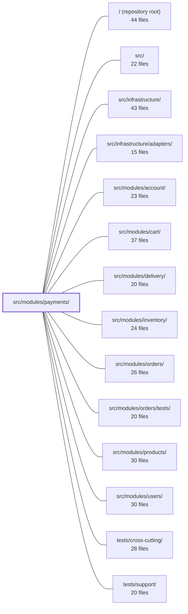

---
tags:
  - 2repo
  - 2repo/module
  - project/boilerplate-node-backend
type: module
module: src/modules/payments/
files: 22
updated: 2026-08-31T20:56:09.302681+00:00
---

# src/modules/payments/

## Purpose

The payments module owns the money-side of an order lifecycle: freezing an order's price into a payment intent, confirming a card charge, reading payment state back for a mid-flow reload, and issuing a standalone refund. It enforces three domain invariants (only a pending order's owner may start paying; the order's `pending → paid` transition gates the charge; refunds fire at-most-once on order cancellation) behind a provider port so the rest of the codebase never talks to a PSP directly.

## Key parts

- **Domain core** — `service.ts` (orchestration and invariants), `model.ts` (Mongoose schema, 1:1 `orderId` unique index, status enum), `repository.ts` (guarded writes for intent upsert and status transition), `config.ts` (default ISO-4217 currency code).
- **HTTP surface** — `routes.ts` (auth/authorization boundary, single `router` export) and `controllers/` (thin handlers for intent, confirm, read-by-order, refund).
- **Provider boundary** — `providers/index.ts` (the `PaymentProvider` port, `ChargeOutcome` type, env-driven resolver), `providers/card.ts` (shared card types), `providers/fake.ts` (deterministic stub for tests and demos).
- **Observability** — `analytics.ts` and `audit.ts` (typed event-name registration via module augmentation), `metrics.ts` (PromQL counters colocated to avoid reverse imports into `infrastructure`).
- **Module wiring & contract** — `module.ts` (mounts routes, subscribes the `ORDER_CANCELLED` refund listener, loads locales), `openapi.yaml` (API spec as single source of truth).
- **Tests** — `tests/unit/` (provider port, route table shape, schema invariants), `tests/integration/` (service invariants against real MongoDB + fake provider), `tests/contract/` (HTTP status-code and response-shape pins).

## How it connects

- **`src/modules/orders/`** — The strongest relationship. The payment is 1:1 with an order (enforced by the unique index). The service gates intent creation on order `pending` status, performs the `pending → paid` conditional move on successful charge, and subscribes to the order module's `ORDER_CANCELLED` domain event to trigger an at-most-once refund. The refund endpoint is also a standalone admin action that does *not* alter order status.
- **`src/modules/inventory/`** — `config.ts` here deliberately mirrors the inventory module's config pattern: a single, deployment-tunable value read in one place rather than transcribed per consumer.
- **`src/infrastructure/`** — The repository spreads the shared repository factory provided by infrastructure for standard CRUD. Conversely, `metrics.ts` keeps its counters *inside* the payments module (rather than in infrastructure) so ownership is obvious and the overview endpoint doesn't create a reverse import.
- **`src/` (shared type maps)** — `analytics.ts` and `audit.ts` both use TypeScript module augmentation to register their event identifiers in shared type maps (`AuditActionMap`, the analytics port's type map) that live at the repository root / shared layer.

## Where to start

1. **`service.ts`** — Read this first. It contains the three invariants, the conditional-write logic, and the `ORDER_CANCELLED` refund listener in ~200 lines. Everything else (controllers, routes, repository) exists to feed or serve this file.
2. **`providers/index.ts`** — Understand the port and the resolver. This is the single seam where a real PSP plugs in; once you see how `fake.ts` satisfies the same interface, the module's testability and extensibility become obvious.

## Connected modules

[[boilerplate-node-backend_ROOT|/ (repository root)]] · [[boilerplate-node-backend_src|src/]] · [[boilerplate-node-backend_src_infrastructure|src/infrastructure/]] · [[boilerplate-node-backend_src_infrastructure_adapters|src/infrastructure/adapters/]] · [[boilerplate-node-backend_src_modules_account|src/modules/account/]] · [[boilerplate-node-backend_src_modules_cart|src/modules/cart/]] · [[boilerplate-node-backend_src_modules_delivery|src/modules/delivery/]] · [[boilerplate-node-backend_src_modules_inventory|src/modules/inventory/]] · [[boilerplate-node-backend_src_modules_orders|src/modules/orders/]] · [[boilerplate-node-backend_src_modules_orders_tests|src/modules/orders/tests/]] · [[boilerplate-node-backend_src_modules_products|src/modules/products/]] · [[boilerplate-node-backend_src_modules_users|src/modules/users/]] · [[boilerplate-node-backend_tests_cross-cutting|tests/cross-cutting/]] · [[boilerplate-node-backend_tests_support|tests/support/]]

## Files
- `src/modules/payments/analytics.ts` — Declares the analytics event names emitted by the payments module and registers them in the shared analytics port's type map. Controllers import this file directly (rather than a published copy) to get typed event names, following the same augmentation pattern as `./audit.ts`.
- `src/modules/payments/audit.ts` — Declares the set of audit action identifiers emitted by the payments module and registers them in the shared `AuditActionMap` via TypeScript module augmentation, giving the observability layer a typed vocabulary of payment-related audit events.
- `src/modules/payments/config.ts` — Provides the single deployment-tunable money setting — the default ISO-4217 currency code. It exists as a dedicated module (mirroring `@modules/inventory`'s `config.ts`) so the value is read in exactly one place, per call, rather than transcribed into each consumer's own fallback.
- `src/modules/payments/controllers/get-payment-by-order.ts` — Thin Express controller for `GET /payments/order/:orderId`. It delegates to `paymentService.getForOrder` and returns the payment (intent, status, etc.) so the order page's payment panel can recover its state on a mid-flow reload rather than restarting.
- `src/modules/payments/controllers/post-payment-confirm.ts` — HTTP controller handler for `POST /payments/:id/confirm`. Receives a card confirmation from the dialog, delegates to the payment service, records the outcome metric, and returns a success or refusal response. This is the endpoint where the actual charge is attempted and where decline/success events are audited.
- `src/modules/payments/controllers/post-payment-intent.ts` — HTTP handler for `POST /payments/intent`. It validates the request body, delegates to the payment service to freeze an order's price into a payment intent, and returns `201`. It is intentionally a thin pass-through: ownership checks, the `pending` gate, and amount logic all live in the service layer. No audit or analytics events are emitted here—intent creation is a preparation step, not a business event (those fire on confirm).
- `src/modules/payments/controllers/post-payment-refund.ts` — HTTP handler for `POST /payments/order/:orderId/refund`. It performs a standalone monetary refund on an order **without altering the order's status**. It exists as a separate endpoint so an admin/operator can refund or cancel independently; "cancel and refund" is simply the client calling this endpoint plus the order-cancel endpoint.
- `src/modules/payments/metrics.ts` — Defines the PromQL counters owned by the payments module. It keeps domain-level metrics colocated with the module that produces them (rather than in `infrastructure`) so ownership is obvious and the overview endpoint can read them without creating a reverse import.
- `src/modules/payments/model.ts` — Defines the Mongoose schema, document interface, and model for the Payment collection. It enforces a 1:1 relationship between a payment and its order (via `unique` on `orderId`), captures the provider-facing lifecycle status, and exposes a lean-read serialization transform for the repository layer.
- `src/modules/payments/module.ts` — Module manifest for the **payments** domain. Wires the module's HTTP routes, a domain-event subscription (refund on order cancellation), and locale files into the application shell so the kernel can mount and start it. Exists purely as the composition root for the payments feature; it contains no business logic.
- `src/modules/payments/openapi.yaml` — OpenAPI 3.0.3 contract (v2.0.0) for the Payments module. Defines the four endpoints that manage the money-side of an order lifecycle — creating a payment intent, looking up a payment by order, confirming a charge, and issuing a refund — plus the `Payment` schema and its supporting types. Serves as the single source of truth for the API surface that the orders module and clients depend on.
- `src/modules/payments/providers/card.ts` — Shared type and utility module for card data at the provider boundary. It exists as a standalone file so the port definition and every concrete provider can consume the same types without creating circular imports between them.
- `src/modules/payments/providers/fake.ts` — A deterministic payment-provider stub that implements the `PaymentProvider` interface without any network calls. It mimics real PSP test-mode behavior (including Stripe's well-known decline card number) so that demos, e2e suites, and unit tests can exercise both the success and decline paths identically to production code.
- `src/modules/payments/providers/index.ts` — Defines the `PaymentProvider` port (interface), the `ChargeOutcome` type, and a memoised, env-driven resolver that selects which concrete provider implementation answers at runtime. It is the single seam a real PSP (e.g. Stripe) plugs into without touching the rest of the payments module.
- `src/modules/payments/repository.ts` — Data-access layer for the payments module. Spreads the shared repository factory for standard CRUD, then adds two domain-specific reads (by order, by id) and two guarded writes (intent upsert, status transition) that the payment service depends on. All ownership scoping is enforced inside the query filter rather than checked after retrieval.
- `src/modules/payments/routes.ts` — Express router that defines the four payment endpoints (intent, confirm, read-by-order, refund) and enforces the authentication/authorization boundary for all of them. It exists so the module's public surface is a single `router` export that `module.ts` can mount, while keeping auth policy in one visible place.
- `src/modules/payments/service.ts` — Orchestrates the money flow for an order behind a provider port. Implements three invariants: only a `pending` order's owner may start paying; the order's `pending → paid` conditional move (not the charge) is the gate, so a charge whose order has slipped away is refunded on the spot; a refund is the `ORDER_CANCELLED` listener, made at-most-once by the conditional `succeeded → refunded` move. Exposes the three HTTP-facing operations: create intent, confirm payment, and read-for-order.
- `src/modules/payments/tests/contract/api.contract.test.ts` — Contract tests for the `/payments` HTTP surface. Each test pins that a specific status-code branch (201, 200, 409, 404, 422, 401) is reachable over HTTP and that the response body satisfies the declared API spec. Business/money logic is intentionally excluded here and lives in the unit suite.
- `src/modules/payments/tests/integration/service.test.ts` — Integration tests for the payments service that pin its core invariants: intent creation freezes the order's published total (shipping included), confirmation atomically transitions order → paid and payment → succeeded, a decline is retryable, and the `ORDER_CANCELLED` refund listener fires at-most-once. Runs against real MongoDB (`setupTestDb`) with the `fake` payment provider, because the guarantees under test are the conditional writes themselves.
- `src/modules/payments/tests/unit/providers.test.ts` — Unit tests for the payment-provider port: the `cardLastFour` utility, the fake PSP's charge/refund behavior, and the `resolvePaymentProvider` registry. These live here (rather than in `tests/integration/`) because none of the paths under test touch a database—only in-memory logic and provider selection.
- `src/modules/payments/tests/unit/routes.test.ts` — Unit tests that pin down the shape of the payments route table: the exact set of endpoints and their order, universal authentication, the single admin-only refund route, and the path-length ordering convention. It exists so that any future route addition or reordering that would silently break these invariants fails immediately.
- `src/modules/payments/tests/unit/schema-contract.test.ts` — Contract test that pins the exact invariants of `paymentSchema`—required fields, the unique index on `orderId`, ObjectId references, validation bounds, enum/default values, and timestamps—so that the schema's shape is enforced by the test suite rather than by convention. It exists primarily to guard the `unique: true` constraint on `orderId`, which is the module's sole idempotence guarantee against double-charging.

---
[[boilerplate-node-backend_INDEX|← boilerplate-node-backend index]]
