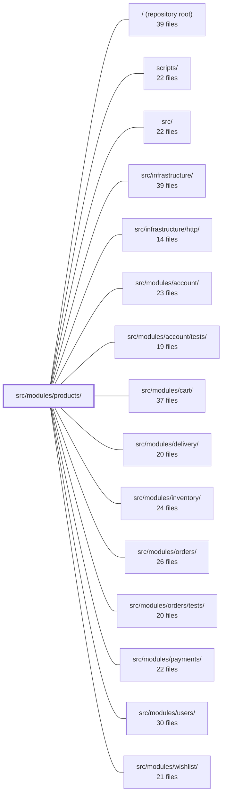

---
tags:
  - 2repo
  - 2repo/module
  - project/boilerplate-node-backend
type: module
module: src/modules/products/
files: 30
updated: 2026-08-28T12:00:54.245974+00:00
---

# src/modules/products/

## Purpose

The products module owns the Product entity end-to-end: its schema, validation, persistence, catalogue search, facet aggregation, admin CRUD, and the public read endpoints that feed the storefront. It also declares the module's domain vocabulary (events, audit actions, analytics event names) so that the shared infrastructure stays domain-agnostic.

## Key parts

- **Model & validation** — `model.ts` is the single source of truth: Mongoose schema, Zod input schema, TypeScript interfaces, and the `toJSON` serialization transform. `tests/unit/schema-contract.test.ts` and `tests/integration/schema-contract.test.ts` pin every default, required flag, index, and serialization rule.
- **Data access** — `repository.ts` wraps the base repository with catalogue-specific query rules (public-visibility scoping, facet aggregation, stock-counter transitions) so callers never touch the Mongoose model directly.
- **Business logic** — `service.ts` translates high-level operations (search, CRUD, facets) into repository calls and orchestrates side-effects (analytics, audit, domain events, image-file cleanup). Controllers and sibling modules call this layer, never the repository directly.
- **HTTP layer** — `routes.ts` declares all endpoints and middleware chains. The `controllers/` directory holds thin handlers: `get-products.ts` (list + search), `get-product-item.ts` (single product), `get-catalogue-facets.ts` (filter-chip data), `write-products.ts` (create/update with multipart upload), `delete-products.ts` (soft & hard delete).
- **Domain vocabulary** — `events.ts`, `audit.ts`, and `analytics.ts` each use a TypeScript `declare module` augmentation to register product-specific keys into shared infrastructure maps, keeping the catalogue's event vocabulary co-located here.
- **Module wiring** — `module.ts` is the `AppModule` manifest the kernel consumes; `index.ts` is the barrel that defines the only importable surface (enforced by `eslint-plugin-boundaries`).
- **Demo & fixtures** — `demo.ts` seeds six fixture rows; `factory.ts` (`makeProduct`) builds a minimal, correct create-payload used by the demo, tests, and `scripts/export-demo-dataset.ts`.
- **API contract & probes** — `openapi.yaml` (v2.0.0) defines the full REST surface for code generation; `probes.ts` adds negative/edge-state requests that a contract alone cannot express.
- **Tests** — `tests/unit/` covers schema, routes, audit strings, factory, and validation messages; `tests/integration/` covers repository, service, model serialization, and facet queries; `tests/contract/` asserts wire shapes against the OpenAPI spec.

## How it connects

- **`src/infrastructure/`** — Products augments the shared `AnalyticsEventMap`, `AuditActionMap`, and `@kernel/events` via TypeScript module augmentation. Infrastructure provides the generic mechanisms (event bus, audit logger, HTTP server); products supplies the domain-specific keys and payloads.
- **`src/infrastructure/http/`** — The Express app, shared error handler, cache middleware, and file-upload utility that `routes.ts` and the controllers rely on.
- **`src/modules/users/`** — Role-based visibility (guest vs. logged-in vs. admin) is enforced in `service.ts` and the controllers; the users module supplies the authentication/authorization context.
- **`src/modules/cart/`, `src/modules/wishlist/`, `src/modules/orders/`** — Downstream consumers that read product data (price, availability, stock) through the narrow `index.ts` barrel.
- **`src/modules/inventory/`** — Stock-counter transitions referenced in `repository.ts` interact with the inventory module's data.
- **`scripts/`** — `scripts/export-demo-dataset.ts` imports `makeProduct` from `factory.ts` to generate the published `db/demo/demo-data.json` snapshot consumed by the frontend.
- **`tests/support/` and `tests/unit/infrastructure/`** — Shared test harness (test DB setup, infrastructure stubs) used by the products test suites.

## Where to start

1. **`model.ts`** — Read first because it defines the entire product shape: what fields exist, their defaults, validation rules, and how a document is serialized to the API. Every other file in the module is downstream of this contract.
2. **`service.ts`** — Read second to see how the module's public operations (search, CRUD, facets) are composed from repository calls plus side-effects, and where role-based visibility and error handling are applied. Together these two files give you the entity definition and the business rules in about 300 lines.

## Connected modules

[[boilerplate-node-backend_ROOT|/ (repository root)]] · [[boilerplate-node-backend_scripts|scripts/]] · [[boilerplate-node-backend_src|src/]] · [[boilerplate-node-backend_src_infrastructure|src/infrastructure/]] · [[boilerplate-node-backend_src_infrastructure_http|src/infrastructure/http/]] · [[boilerplate-node-backend_src_modules_account|src/modules/account/]] · [[boilerplate-node-backend_src_modules_account_tests|src/modules/account/tests/]] · [[boilerplate-node-backend_src_modules_cart|src/modules/cart/]] · [[boilerplate-node-backend_src_modules_delivery|src/modules/delivery/]] · [[boilerplate-node-backend_src_modules_inventory|src/modules/inventory/]] · [[boilerplate-node-backend_src_modules_orders|src/modules/orders/]] · [[boilerplate-node-backend_src_modules_orders_tests|src/modules/orders/tests/]] · [[boilerplate-node-backend_src_modules_payments|src/modules/payments/]] · [[boilerplate-node-backend_src_modules_users|src/modules/users/]] · [[boilerplate-node-backend_src_modules_wishlist|src/modules/wishlist/]] · … and 3 more

## Files
- `src/modules/products/analytics.ts` — Declares the analytics event names emitted by the products module (`products_searched`, `product_viewed`) and registers them into the shared `AnalyticsEventMap` via a TypeScript module augmentation. This keeps the catalogue's event vocabulary co-located with the module that owns it, while `infrastructure` stays domain-agnostic.
- `src/modules/products/audit.ts` — Declares the set of audit actions that the products module emits for admin write operations (create, update, delete). It uses a TypeScript module augmentation to register those action keys into the shared `AuditActionMap` interface, providing compile-time safety without a central enum. Read operations are intentionally excluded because catalogue reads are public and unauthenticated, so there is no actor to record.
- `src/modules/products/controllers/delete-products.ts` — Exposes the `DELETE /products/:id` admin endpoint for removing a product. Supports soft-delete by default and a permanent (hard) delete when `?hardDelete=true` is passed. The hard path also emits a `PRODUCT_DELETED` event and removes the associated image file so no orphaned resources remain.
- `src/modules/products/controllers/get-catalogue-facets.ts` — Thin Express controller that exposes `GET /products/categories`, returning every category and tag in the public catalogue with counts. It exists to give the storefront its filter-chip data and is intentionally as thin as possible: delegate to the service, format the response, and funnel errors through a shared handler.
- `src/modules/products/controllers/get-product-item.ts` — Express handler for `GET /products/:id`. Resolves a single product by path parameter, applying role-based visibility so that only admins can view inactive or deleted items. Delegates all data access to `productService` and normalises success / error responses.
- `src/modules/products/controllers/get-products.ts` — Express controller that handles `GET /products` and `POST /products/search`. It validates incoming query-string or body parameters through a zod schema, coerces string-typed query values into their proper types, then delegates the actual lookup to `productService.searchViewed` with the caller's scope and context.
- `src/modules/products/controllers/write-products.ts` — Single controller handler for the three product write endpoints (`POST /products`, `PUT /products`, `PUT /products/:id`). It parses the request (including multipart uploads), validates the payload via the product service, then delegates to `create` or `updateById` depending on whether an id is present. It also owns the lifecycle of an uploaded image file: if validation or persistence fails, the file this request just stored is removed.
- `src/modules/products/demo.ts` — Declares the products module's demo dataset — six fixtures chosen to exercise the branches the storefront and repositories actually have — and provides the seed/export functions that populate and publish those rows. The data lives here (in the owning module) rather than in a shared cross-repo fragment; the frontend receives a JSON snapshot via `scripts/export-demo-dataset.ts` instead of importing TypeScript source directly.
- `src/modules/products/events.ts` — Declares the domain events owned by the products module. Uses TypeScript module augmentation (`declare module '@kernel/events'`) so the event catalogue grows organically with each module rather than being centralized in a shared file. Also exports the canonical string constant for the event name.
- `src/modules/products/factory.ts` — Builds product fixtures for the demo dataset (`./demo`) and for tests that need a catalogue row. It exists to give callers a minimal, correct `productRepository.create` payload while deliberately **omitting** every field that has a `default:` in the Mongoose schema, so that downstream serialization records what the schema actually produces rather than a hand-guessed value.
- `src/modules/products/index.ts` — Public barrel (single entry point) for the products module. It defines the only API surface that sibling modules may import, keeping the production interface deliberately narrow so that each export represents a stable contract. Lint (`eslint-plugin-boundaries`) enforces this: importing deeper paths like `@modules/products/service` from outside is a compile-time error.
- `src/modules/products/model.ts` — Defines the Mongoose schema, Zod validation schema, TypeScript interfaces, and serialization transform for the Product collection. It is the single source of truth for what a product stores, how it is validated on input, and how it is shaped on output.
- `src/modules/products/module.ts` — Module manifest for the product catalogue. Declares the `products` app module (routes, seeds, locales, demo shapes) as a single default export satisfying `AppModule`, and side-effect-imports the event registrations. It exists so the kernel can register the catalogue without needing to know its internals.
- `src/modules/products/openapi.yaml` — OpenAPI 3.0.3 contract for the Products module (v2.0.0). Defines the full REST surface for product CRUD, catalogue facet listing, and the dual-route pattern (body-id vs path-id) that the shared controller serves. Clients and code generators consume this file to type requests/responses; the shared contract file supplies reusable parameters, error responses, and the `HardDeleteRequest` schema.
- `src/modules/products/probes.ts` — Holds the product-module probe requests that an OpenAPI contract cannot express—negative validation checks, cross-cutting headers, optional-only query params, and dataset-specific state fixtures. These probes are appended to generated client collections after the contract-derived requests so the API's *rejection* and *edge-state* behavior is exercised alongside the happy path.
- `src/modules/products/repository.ts` — Product data-access layer. Wraps `createBaseRepository` for standard CRUD and adds the catalogue's own query rules: public-visibility scoping, facet aggregation, and the five conditional stock-counter transitions. It exists so callers never touch the Mongoose model directly and so the "which rows are visible to whom" logic lives in exactly one place.
- `src/modules/products/routes.ts` — Defines the Express router for all product-catalogue HTTP endpoints. It declares route paths, attaches the correct middleware chain (auth, caching, file-upload, route-flag), and delegates to the product controllers. Public read operations and admin-gated write operations share this single router.
- `src/modules/products/service.ts` — Business-logic layer for the Product entity. Translates high-level operations (search, CRUD, facet counts) into repository calls and orchestrates side-effects (analytics, audit, domain events, image-file cleanup). Controllers and other modules call this service rather than the repository directly.
- `src/modules/products/tests/contract/api.contract.test.ts` — Contract tests for the `/products` REST surface. They assert the wire-response shape against `openapi.yaml` (including `additionalProperties: false`) so that a field leaking into a payload is caught immediately. A small number of behavioural assertions are included solely to guarantee that each contract branch (scope, pagination, delete modes) is actually exercised — the behavioural "why" lives in unit/service suites.
- `src/modules/products/tests/factory.ts` — Test-only persistence layer for product fixtures. It re-exports the pure `makeProduct` builder and adds `createProduct`, which writes a product to the test database via the real `productRepository`. This separation lets contract/integration tests in every other module obtain a valid `ProductDocument` with a single import.
- `src/modules/products/tests/integration/facets.test.ts` — Integration tests for `productRepository.facets`, the query behind the storefront's filter chips. The file verifies three invariants that unit-level or listing tests would miss: counts respect public visibility (inactive and soft-deleted products are excluded), results are deterministically ordered, and an empty catalogue returns empty arrays rather than an error.
- `src/modules/products/tests/integration/model.test.ts` — Integration tests that verify a single invariant: product responses must never expose Mongoose internals (`_id`, `__v`) on any serialization path — both hydrated documents (via `toJSON`) and `.lean()` list results (mapped manually by the service).
- `src/modules/products/tests/integration/repository.test.ts` — Integration test suite for the `productRepository` CRUD interface and its aggregate queries. It exercises the full stack (repository → Mongoose model → MongoDB) against a real test database, verifying both the happy-path behaviors and the empty-collection edge cases that calling code guards against.
- `src/modules/products/tests/integration/schema-contract.test.ts` — Asserts the Mongoose **schema declarations** for the Product model — defaults, `required` flags, `select: false`-driven exclusion, auto-timestamps, and `toJSON` serialization. Sibling specs in this folder test behaviour/transforms; this file pins the schema itself as part of the public API contract.
- `src/modules/products/tests/integration/service.test.ts` — Integration tests for the products service (`productService`), exercising `validateData`, `search`, and ` getById` against a real test database with all domain modules registered. The file guards the service's public contract: input validation rules (type, range, i18n message shape), role-based visibility (guest / logged / admin), filtering, pagination, and soft-delete exclusion.
- `src/modules/products/tests/unit/audit.test.ts` — Unit test that pins the exact string values emitted by the products module's audit vocabulary. It exists because the action strings are a **wire contract** consumed by external log queries, dashboards, and alert rules — not an internal identifier safe to refactor. This file is the owner-level assertion that any change to a string (or the addition/removal of an action) is deliberate and documented.
- `src/modules/products/tests/unit/factory.test.ts` — Unit tests for `makeProduct`, the product catalogue fixture builder. The function under test is **not** test-only: `demo.ts` and `scripts/export-demo-dataset.ts` use it to generate the published `db/demo/demo-data.json`, so a regression here corrupts a shipped artifact, not just a test run.
- `src/modules/products/tests/unit/routes.test.ts` — Unit test for the product catalogue's Express router. It guards against three silent regressions: an admin guard disappearing from a write route (making mutations public), static paths like `/search` being shadowed by `/:id` due to mount order, and a cache-tag rename that breaks invalidation. It asserts on middleware *arguments* rather than HTTP behaviour, because Express only retains closures and the substance lives in the factory calls.
- `src/modules/products/tests/unit/schema-contract.test.ts` — Unit tests that pin down the product schema's contract: which fields are required, what defaults each field carries, what constraints guard stock counters, which indexes are declared, and how `applyProductTransform` derives the shopper-facing `available` value. The inline comments document the *reason* each default exists so future changes to `model.ts` are made with full awareness of downstream impact.
- `src/modules/products/tests/unit/validation-messages.test.ts` — Verifies that the products module's Zod schema emits validation messages from the active locale's translation copy (Italian) rather than falling back to Zod's built-in English defaults. It is the catalogue-schema counterpart to the analogous test documented in `modules/users`.

---
[[boilerplate-node-backend_INDEX|← boilerplate-node-backend index]]
