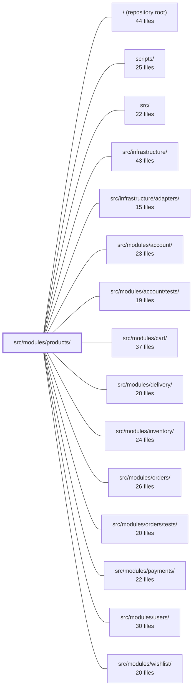

---
tags:
  - 2repo
  - 2repo/module
  - project/boilerplate-node-backend
type: module
module: src/modules/products/
files: 30
updated: 2026-08-31T20:56:30.114906+00:00
---

# src/modules/products/

## Purpose

The products module owns the product catalogue entity end-to-end: its Mongoose schema, Zod validation, serialization, search, facet counting, CRUD, visibility scoping, and the HTTP surface that both the public storefront and the admin console consume. It is a **leaf node** in the dependency graph — cart, inventory, orders, and wishlist all read from or react to this module, but it imports none of them, communicating downstream solely through domain events.

## Key parts

- **Domain core** — `model.ts` (schema, Zod validator, serialization transform), `service.ts` (all business logic: validation, access control, CRUD orchestration, event emission), and `repository.ts` (data-access layer wrapping the shared factory with search config, facet counting, and atomic `onHand`/`reserved` transitions).
- **HTTP layer** — `routes.ts` mounts the Express router; `controllers/` holds one thin file per endpoint group (list/search, item, facets, create/update, delete), each delegating to a shared controller factory and the product service.
- **Cross-cutting contracts** — `analytics.ts` (funnel event names), `audit.ts` (write-action audit strings), and `events.ts` (domain event names) each augment a kernel-wide type map via module augmentation so emitters stay typed and discoverable.
- **Module wiring & public surface** — `module.ts` assembles the `AppModule` manifest (routes, seed, locales, image config); `index.ts` is the sole barrel that sibling modules may import from (enforced by `eslint-plugin-boundaries`).
- **API contract & probes** — `openapi.yaml` (OpenAPI 3.0.3 spec consumed by clients and code generators) and `probes.ts` (edge-case requests the spec can't express).
- **Demo & fixtures** — `demo.ts` (products slice of the demo dataset + seed/export helpers) and `fixtures.ts` (pure `makeProduct` builder reused by tests and the demo exporter).
- **Tests** — `tests/unit/` (schema contract, routes table, audit strings, validation i18n, fixture builder), `tests/integration/` (repository, service, facets, model serialization against real MongoDB), `tests/contract/` (wire-shape assertions against `openapi.yaml`), and `tests/fixtures.ts` (DB-persisting helper wrapping the pure builder).

## How it connects

- **Downstream consumers** (`cart`, `inventory`, `orders`, `wishlist`) import only from `index.ts` and listen for the domain events declared in `events.ts`; they never reach into `service.ts` or `repository.ts` directly.
- **`account` / `users`** supply the authenticated caller context that `service.ts` uses to scope visibility (active-only for non-admins, full catalogue for admins).
- **`infrastructure` / `infrastructure/adapters`** provide the shared `createRepository`, `createSearchController`, `createItemController`, `createDeleteController` factories and the kernel type maps (`AnalyticsEventMap`, `AuditActionMap`, `DomainEventMap`) that the products module augments.
- **`scripts/export-demo-dataset.ts`** reads `demo.ts` and `fixtures.ts` to publish `db/demo/demo-data.json` for the paired frontend, keeping the data co-located with the module so deleting the directory removes it cleanly.
- **`tests/cross-cutting/` and `tests/support/`** import the products fixture and schema to build multi-module integration scenarios (e.g., a cart referencing a product, an order flowing through inventory adjustments).

## Where to start

1. **`service.ts`** — it is the single entry point every controller calls into and the place where validation, visibility rules, CRUD orchestration, and event emission all converge; reading it gives you the full business picture in one file.
2. **`model.ts`** — read it alongside the service to understand the schema shape, the `available` derivation, and the Zod ↔ Mongoose contract that the rest of the module (and its consumers) rely on.

## Connected modules

[[boilerplate-node-backend_ROOT|/ (repository root)]] · [[boilerplate-node-backend_scripts|scripts/]] · [[boilerplate-node-backend_src|src/]] · [[boilerplate-node-backend_src_infrastructure|src/infrastructure/]] · [[boilerplate-node-backend_src_infrastructure_adapters|src/infrastructure/adapters/]] · [[boilerplate-node-backend_src_modules_account|src/modules/account/]] · [[boilerplate-node-backend_src_modules_account_tests|src/modules/account/tests/]] · [[boilerplate-node-backend_src_modules_cart|src/modules/cart/]] · [[boilerplate-node-backend_src_modules_delivery|src/modules/delivery/]] · [[boilerplate-node-backend_src_modules_inventory|src/modules/inventory/]] · [[boilerplate-node-backend_src_modules_orders|src/modules/orders/]] · [[boilerplate-node-backend_src_modules_orders_tests|src/modules/orders/tests/]] · [[boilerplate-node-backend_src_modules_payments|src/modules/payments/]] · [[boilerplate-node-backend_src_modules_users|src/modules/users/]] · [[boilerplate-node-backend_src_modules_wishlist|src/modules/wishlist/]] · … and 4 more

## Files
- `src/modules/products/analytics.ts` — Declares the analytics event names for the products module and merges them into the app-wide `AnalyticsEventMap` type via module augmentation. It exists so the products service can emit typed, discoverable funnel events (`products_searched`, `product_viewed`) without hard-coding string literals at call sites.
- `src/modules/products/audit.ts` — Defines the set of audit action strings that the products module emits and registers them into the app-wide `AuditActionMap` via TypeScript module augmentation. Only write operations (create, update, delete) are represented because catalogue reads are public and unauthenticated, so there is no actor to record.
- `src/modules/products/controllers/delete-products.ts` — Thin admin controller for deleting a product by path ID. It delegates all real work to the shared `createDeleteController` factory and the product service, exposing only the wiring (entity name, removal function, audit action, and i18n key).
- `src/modules/products/controllers/get-catalogue-facets.ts` — A thin HTTP controller that exposes the product service's `facets()` method as a `GET /products/categories` endpoint. It translates the service result into the standard success/error response shapes so the storefront can render its category/tag filter chips.
- `src/modules/products/controllers/get-product-item.ts` — Thin HTTP handler for `GET /products/:id`. Wires the shared `createItemController` factory to `productService.getByIdViewed`, passing a caller-scoped visibility filter so that non-admin callers only ever see active products.
- `src/modules/products/controllers/get-products.ts` — Builds the validation schema and cache-key parameter list for the products list/search endpoints, then hands both to the shared `createSearchController` factory to produce the single controller that serves `GET /products` and `POST /products/search`.
- `src/modules/products/controllers/write-products.ts` — Single admin controller handling product creation (POST /products) and update (PUT /products, PUT /products/:id). Both paths share validation, image bookkeeping, and upload-cleanup-on-failure logic, so they are consolidated into one handler that branches on the presence of an `id` in the request body.
- `src/modules/products/demo.ts` — Defines the products slice of the demo dataset and the seed/export utilities for it. Keeping the data here (rather than in a standalone seed file) means `rm -rf src/modules/products` removes it cleanly, and `scripts/export-demo-dataset.ts` can read it back to publish `db/demo/demo-data.json` for the paired frontend without sharing source code.
- `src/modules/products/events.ts` — Declares the products module's domain events by augmenting the kernel's `DomainEventMap` interface, so the event catalogue grows per-module without a shared enumeration file. Also exports the single event-name constant to keep emitters and listeners in agreement on the spelling.
- `src/modules/products/fixtures.ts` — Builds a single product fixture intended for the demo dataset (`./demo`) and any test that needs a catalogue row. It intentionally leaves schema defaults unset, pinning only the required `title` and `price` placeholders, so that `scripts/export-demo-dataset.ts` reads seeded rows back through the real serializer rather than a hand-built guess.
- `src/modules/products/index.ts` — Public barrel (entry point) for the products module. It is the **only** surface a sibling module may import from; `eslint-plugin-boundaries` makes reaching internal paths like `@modules/products/service` a lint error. Keeping the surface narrow is a deliberate contract: every re-export here is a promise that the internal implementation can move without breaking consumers.
- `src/modules/products/model.ts` — Declares the Mongoose schema, Zod validation schema, and serialization transform for the Product collection. It owns the column declarations (including `onHand`/`reserved`) and the single-point derivation of `available`, while delegating all business logic to `./service` and queries to `./repository`.
- `src/modules/products/module.ts` — Entry-point manifest for the **products** module. It wires together the module's routes, seed data, locale files, and image writeback into a single `AppModule` object that the kernel registry can discover. It also documents the module's position in the dependency graph: a leaf node that everything else (cart, inventory, orders, wishlist) depends on, communicating downstream via events rather than direct imports.
- `src/modules/products/openapi.yaml` — OpenAPI 3.0.3 contract for the Products module (v2.0.0). Defines the full REST surface for product CRUD, catalogue facet listing, and the dual-route pattern (body-id vs path-id) that the shared controller serves. Clients and code generators consume this file to type requests/responses; the shared contract file supplies reusable parameters, error responses, and the `HardDeleteRequest` schema.
- `src/modules/products/probes.ts` — Holds the products module's ad-hoc probe requests — edge-case scenarios that the OpenAPI contract cannot express on its own (validation failures, `Accept-Language` diffs, optional-filter combinations, and visibility-branch fixtures). It complements the generated collection rather than replacing it.
- `src/modules/products/repository.ts` — The catalogue's data-access layer. It wraps the shared `createRepository` factory with product-specific search config, public-visibility scoping, facet counting, and the atomic counter transitions (`onHand` / `reserved`) that back the inventory module. It is the single write-path for stock counters and the read-path for the public product API.
- `src/modules/products/routes.ts` — Defines the Express router for the product catalogue. It wires public read endpoints and admin-gated write endpoints to their controllers, applies caching where the response is caller-independent, and ensures route ordering so static segments (`/search`, `/categories`) are not swallowed by the `/:id` parameter pattern.
- `src/modules/products/service.ts` — The product service layer: all business logic for the catalogue entity. It is the single entry point controllers call into, sitting between HTTP handlers and the repository. It owns validation, search/read access control, CRUD orchestration, image-lifecycle side-effects, and the emission of analytics/audit/domain events.
- `src/modules/products/tests/contract/api.contract.test.ts` — Contract tests for the `/products` REST surface. Every assertion calls `toSatisfyApiSpec()` to validate the wire response shape against `openapi.yaml` (including `additionalProperties: false`), and a smaller set of behavioural assertions verify that filter-scoping and delete-semantics invariants hold regardless of how the backend implements them.
- `src/modules/products/tests/fixtures.ts` — Provides the database-persisting product fixture for tests. It is a thin wrapper around the pure builder `makeProduct` (defined in `../fixtures.ts`) that actually writes a document to the test database via `productRepository.create`, returning the populated Mongoose document. It exists so that integration and contract tests across modules can seed a product with a single call rather than managing repository plumbing inline.
- `src/modules/products/tests/integration/facets.test.ts` — Integration tests for `productRepository.facets()`, the query behind the storefront's filter chips. The suite verifies that facet counts, visibility filtering, sort order, and empty-state behavior all match the contract the UI depends on.
- `src/modules/products/tests/integration/model.test.ts` — Integration test that verifies the serialization invariant: product responses must never expose Mongoose's `_id` or `__v` fields, regardless of whether the data path goes through a hydrated document (`toJSON`) or a `.lean()` query (plain-object list). It exists to guard against a regression where either path leaks internal MongoDB fields to the API consumer.
- `src/modules/products/tests/integration/repository.test.ts` — Integration tests for `productRepository` executed against a real MongoDB instance. Covers CRUD operations (create, find, count, save, delete) and pins the empty-catalogue contract for the aggregate reads (`facets`, `sumReserved`, `availabilityPage`), where a `$group`/`$facet` pipeline returns no row at all rather than a zeroed one.
- `src/modules/products/tests/integration/schema-contract.test.ts` — Integration tests that verify Mongoose schema **declarations** — defaults, `required`, `select: false` — against a real MongoDB instance. These behaviors belong to Mongoose, not the application, so a mocked model would only assert the mock's own interpretation. Sibling specs in this folder cover the transforms; this file covers the raw contract.
- `src/modules/products/tests/integration/service.test.ts` — Integration test suite for `productService`, exercising validation (`validateData`), caller-scoped visibility (`search` / `getById`), and the create/update/remove flows against a real test database. It verifies business rules that depend on the full module graph (inventory, cart, delivery, etc.) rather than isolated unit behavior.
- `src/modules/products/tests/unit/audit.test.ts` — Pins the products module's audit action strings to their exact wire-format values and verifies they are registered in the app-wide `AuditAction` union. These strings are a cross-repo contract consumed by external log queries and alerts, so this test acts as a change-detector: any added, removed, or re-spelled action breaks CI immediately.
- `src/modules/products/tests/unit/fixtures.test.ts` — Unit tests for the `makeProduct` catalogue fixture builder. They verify that the builder produces valid, insertable documents, respects the omit-unset-field convention, preserves falsy overrides, performs type coercion on date strings, and derives timestamps from the ObjectId — protecting both the test suite and the published demo dataset that reuses the same function.
- `src/modules/products/tests/unit/routes.test.ts` — Route-table contract test for the product catalogue router. It asserts the full set of mounted endpoints, their order, middleware chains, cache configuration, upload handling, and flag-gating — catching silent regressions (dropped guards, path shadowing, cache-tag drift, ignored upload fields) that TypeScript's type system cannot express.
- `src/modules/products/tests/unit/schema-contract.test.ts` — Locks down the product schema's public contract and the derived `available` field produced by `applyProductTransform`. It ensures that defaults, required-ness, min-bounds, indexes, and the availability computation behave exactly as the storefront and catalogue APIs assume, catching regressions before they surface as broken product listings.
- `src/modules/products/tests/unit/validation-messages.test.ts` — Unit test that verifies the product catalogue's Zod schema emits **locale-specific** validation messages (Italian) rather than Zod's built-in English defaults. It guards the i18n wiring between the schema in `@modules/products/model` and the product translation namespace.

---
[[boilerplate-node-backend_INDEX|← boilerplate-node-backend index]]
