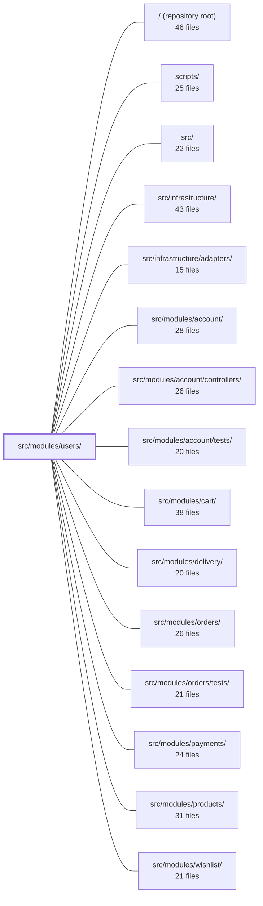

---
tags:
  - 2repo
  - 2repo/module
  - project/boilerplate-node-backend
type: module
module: src/modules/users/
files: 31
updated: 2026-09-02T18:35:52.221791+00:00
---

# src/modules/users/

## Purpose

The users module owns the **admin-facing** half of the user account lifecycle: operator-initiated creation, read, update, soft/hard deletion, 2FA removal, and search over user records. It defines the user record schema (Mongoose + Zod wire validation), the persistence layer, and the HTTP endpoints under `/users`, all gated behind authentication and an admin role. Self-service authentication (signup, login, password reset, token issuance) lives in the sibling `account` module; users is the record-keeping and management side that `account` and every other domain module depend on for identity data.

## Key parts

- **Domain core** — `model.ts` (Mongoose schema, document/service types, token subdocument methods, Zod wire schema, `pre-save` bcrypt hook, `select: false` on credentials), `repository.ts` (CRUD via the shared repository factory plus credential reads and atomic token mutations), and `service.ts` (admin CRUD/search orchestration, domain-event emission, audit/analytics signals, image-digest side effects).
- **HTTP layer** — `routes.ts` (single Express router wiring auth, admin-role, caching, rate-limit, and upload middleware around all endpoints) and `controllers/` (thin adapters for list/search, single-get, create/update, delete, and 2FA removal).
- **Cross-cutting type registries** — `events.ts`, `audit.ts`, `analytics.ts` each register typed constants into app-wide maps via TypeScript module augmentation, so emitters and subscribers never repeat a raw string literal.
- **Module plumbing** — `module.ts` (the `AppModule` manifest the kernel registry consumes at startup), `index.ts` (the **only** public barrel; sibling modules may not reach into internals—enforced by lint), `fixtures.ts` (minimal schema-respecting user object for demo/tests), `demo.ts` (seed accounts + filler customers for the demo-data tooling), `openapi.yaml` (OpenAPI 3.0.3 contract for codegen and docs).
- **Tests** — `tests/unit/` (schema contract, token-method ordering, route wiring, audit-string pinning, validation-message locale guards, fixture-builder contract), `tests/integration/` (repository CRUD + token lifecycle against in-memory MongoDB, service CRUD flows, credential-leak guards, schema-level invariants), and `tests/contract/` (OpenAPI conformance + `additionalProperties: false` credential-leak checks).

## How it connects

- **`account` module** is the primary consumer. It reaches into users (through `index.ts`) to perform credential reads, token lookups, and token-consumption operations that the users repository exposes on the far side of the shared-kernel edge. The split is deliberate: `account` owns the auth flow; `users` owns the record.
- **`cart`, `delivery`, `orders`, `payments`, `wishlist`** all reach the users module for identity data (e.g., the acting user's id, email, or profile fields) but never write to user records themselves.
- **`src/infrastructure/`** provides the shared kernel primitives this module builds on: the generic repository factory used by `repository.ts`, the `DomainEventMap` / `AuditActionMap` / `AnalyticsEventMap` interfaces that `events.ts` / `audit.ts` / `analytics.ts` augment, and the `AppModule` shape that `module.ts` exports.
- **`scripts/`** and the root-level tooling consume `openapi.yaml` and the demo seed data from `demo.ts`.

The module is a **leaf** in the dependency graph: it imports nothing from other feature modules, only from infrastructure and the kernel.

## Where to start

1. **`model.ts`** — Read this first to internalise the user record's shape, the two credential-leak guards (`select: false` + serialisation allowlist), the `pre-save` bcrypt hook, and the token subdocument API. Nearly every security test in the module exists to protect invariants declared right here.
2. **`service.ts`** — Next, walk the admin create → read → update → soft-delete → hard-delete flow to see how the module composes repository calls, event emission, audit logging, and image side effects into a single cohesive write path.

## Connected modules

[[boilerplate-node-backend_ROOT|/ (repository root)]] · [[boilerplate-node-backend_scripts|scripts/]] · [[boilerplate-node-backend_src|src/]] · [[boilerplate-node-backend_src_infrastructure|src/infrastructure/]] · [[boilerplate-node-backend_src_infrastructure_adapters|src/infrastructure/adapters/]] · [[boilerplate-node-backend_src_modules_account|src/modules/account/]] · [[boilerplate-node-backend_src_modules_account_controllers|src/modules/account/controllers/]] · [[boilerplate-node-backend_src_modules_account_tests|src/modules/account/tests/]] · [[boilerplate-node-backend_src_modules_cart|src/modules/cart/]] · [[boilerplate-node-backend_src_modules_delivery|src/modules/delivery/]] · [[boilerplate-node-backend_src_modules_orders|src/modules/orders/]] · [[boilerplate-node-backend_src_modules_orders_tests|src/modules/orders/tests/]] · [[boilerplate-node-backend_src_modules_payments|src/modules/payments/]] · [[boilerplate-node-backend_src_modules_products|src/modules/products/]] · [[boilerplate-node-backend_src_modules_wishlist|src/modules/wishlist/]] · … and 3 more

## Files
- `src/modules/users/analytics.ts` — Declares the analytics event names for the admin-facing half of the user account lifecycle (operator-initiated creation and deactivation) and registers them into the app-wide `AnalyticsEventMap` via module augmentation, giving the users module a type-safe, self-documenting set of event keys distinct from the self-signup events in the `account` module.
- `src/modules/users/audit.ts` — Declares the user-module audit action vocabulary and registers it into the app-wide `AuditActionMap` via TypeScript module augmentation. It exists so that every admin-facing write to a user record (create, update, soft-delete, erase, 2FA strip) emits a typed, discoverable action string rather than a raw string literal scattered across service and controller code.
- `src/modules/users/controllers/delete-user-two-factor.ts` — Thin HTTP adapter for the `DELETE /users/:id/2fa` admin endpoint. It extracts the target user's id from the URL, delegates to `userService.adminDisableTwoFactor`, and maps the service result to an HTTP response. Its existence is to provide an admin-assisted 2FA removal path that deliberately bypasses the "prove the factor to remove it" requirement of the self-service and login-challenge flows.
- `src/modules/users/controllers/delete-users.ts` — Thin controller layer for the two admin user-deletion endpoints (`DELETE /users` and `DELETE /users/:id`). It delegates to the user service and selects the correct audit action, differentiating soft delete from a permanent (GDPR Art. 17) hard delete.
- `src/modules/users/controllers/get-user-item.ts` — Defines the `GET /users/:id` endpoint controller, which retrieves a single user by its path parameter. Restricted to admin roles.
- `src/modules/users/controllers/get-users.ts` — Controller layer for the admin user-listing endpoint (`GET /users`) and the search endpoint (`POST /users/search`). It defines the query-parameter validation schema, wires it into the shared search-controller factory, and delegates the actual data fetch to `userService.search`.
- `src/modules/users/controllers/write-users.ts` — Single Express handler that serves both user creation (`POST /users`) and user updates (`PUT /users`, `PUT /users/:id`). The create-vs-update branch is decided at runtime by the presence of an `id` (in the path or body), so one function covers all three routes. It validates input, manages uploaded-image lifecycle, and delegates persistence to `userService`.
- `src/modules/users/demo.ts` — Defines the user-directory slice of the demo seed dataset: two login-capable accounts (`root` admin, `ginopinoshow` customer) plus ten filler customers that give `cart/demo.ts` and `orders/demo.ts` varied shoppers. Exposes the fixtures, a collection seeder, and a read-back export used by the demo-data tooling.
- `src/modules/users/events.ts` — Declares the domain events the users module emits by augmenting the kernel's `DomainEventMap` interface (module augmentation, not a shared edit), and exports typed event-name constants so emitters and subscribers reference a single spelling instead of independent string literals.
- `src/modules/users/fixtures.ts` — Builds a minimal, schema-respecting user object for demo data and tests. It deliberately omits every field the Mongoose schema defaults (`imageUrl`, `locale`, `admin`, `active`, `verified`, `tokens`) so that `demo-data.json` reflects actual schema behavior rather than a restated copy. The password is always plaintext here; hashing is delegated to the model's pre-save hook.
- `src/modules/users/index.ts` — Public barrel for the `users` module. It is the **only** entry point a sibling module may import from (enforced by lint); reaching into `@modules/users/service` or other internals is a compile-time error. It re-exports the subset of the module's API that other modules legitimately need, and importing it also installs the event-payload type declarations.
- `src/modules/users/model.ts` — Defines the Mongoose schema, TypeScript document/service types, token subdocument methods, and the Zod wire-validation schema for the user record. Kept as a single file so the `pre-save` bcrypt hook and the `select: false` flag on `password` stay co-located—splitting them would risk a `.lean()` read leaking the hash.
- `src/modules/users/module.ts` — Module manifest for the **users** module. Wires together the user record's routes, demo seeding, locale files, and image writeback into a single `AppModule` export that the kernel registry consumes at startup. It also documents the module's position in the dependency graph: it reaches nothing, and is reached by `account`, `cart`, `delivery`, `payments`, and `wishlist`.
- `src/modules/users/openapi.yaml` — OpenAPI 3.0.3 contract for the Users module (v2.0.0). It defines the REST endpoints for listing, creating, reading, updating, and deleting user accounts, and serves as the machine-readable API specification consumed by codegen, tooling, and documentation pipelines.
- `src/modules/users/repository.ts` — Persistence layer for the `users` collection. Exposes standard CRUD (via the shared repository factory) plus the credential reads and token-lifecycle operations that the `account` module needs on the far side of the shared-kernel edge. Keeps all re-selection of `select: false` fields and atomic token mutations in one place so they aren't scattered across services.
- `src/modules/users/routes.ts` — Defines the Express router for all `/users` admin endpoints (search, read, create, update, delete, and 2FA recovery). Every route is gated behind authentication and the admin role. This file is the single wiring point that composes authorization, caching, rate-limiting, file-upload, and flag middleware around the module's five controllers.
- `src/modules/users/service.ts` — Admin-facing user CRUD and search service. Owns the operator-side lifecycle (create, read, update, soft/hard delete) for user documents, while the `account` module handles self-service auth (signup, login, password reset, tokens). Emits domain events, audit/analytics signals, and fire-and-forget image-digest jobs as side effects of each write.
- `src/modules/users/tests/contract/api.contract.test.ts` — Contract tests for the `/users` and `/account` endpoints that enforce the OpenAPI schema (via `toSatisfyApiSpec()`) and, critically, guarantee that no credential material—passwords, tokens, bcrypt hashes—ever appears in a response body. The `additionalProperties: false` constraint on the `User` schema is the primary guard; these tests make that constraint executable.
- `src/modules/users/tests/fixtures.ts` — Database-backed user fixtures for tests. Wraps the plain-payload builder in `../fixtures` to insert real `UserDocument` records via `userRepository`, giving integration and contract tests a persisted user instead of an in-memory object.
- `src/modules/users/tests/integration/model.test.ts` — Integration test that verifies user credentials (bcrypt password hash, live tokens) can never leak into a serialized API response. It asserts two independent guards: Mongoose `select: false` prevents the fields from loading in normal queries, and `applyUserTransform`'s allowlist strips them again at serialization time — including on `.lean()` results that bypass `toJSON`.
- `src/modules/users/tests/integration/repository.test.ts` — Integration test suite for `userRepository`, run against an in-memory MongoDB (wired up by `setupTestDb`). It verifies the full CRUD surface of the repository factory (`create`, `findById`, `findOne`, `findAll`, `count`, `save`, `deleteOne`, `updateMany`) plus the token-lifecycle methods the users module adds (`tokenRemoveAll`, `tokenRemoveExpired`, and related). The file exists so that repository behavior is validated end-to-end (including Mongoose hooks and lean-query semantics) rather than in isolation.
- `src/modules/users/tests/integration/schema-contract.test.ts` — Integration tests that verify Mongoose **schema-level** behaviours (`select: false`, password hashing, serialisation shape, and the `unique` index) against a real MongoDB instance. They exist to pin down guarantees that live in the model declaration itself—not in application code—so a schema edit can't silently remove a security or data-integrity invariant.
- `src/modules/users/tests/integration/service-tokens.test.ts` — Integration tests for the two token-facing service methods on `userService` — `findByEmail` and `consumeToken`. They verify that `findByEmail` returns a populated `tokens` array (not `undefined`) and that `consumeToken` permanently removes a single token while leaving the rest intact, including confirming the removal is persisted rather than just in-memory.
- `src/modules/users/tests/integration/service.test.ts` — Integration test suite for `userService` that exercises validation, search, `getById`, and the admin create/update/delete flows against an in-memory MongoDB spun up by `setupTestDb`. It exists to catch contract-level bugs (wrong status codes, leaked i18n keys, incorrect filter semantics) that unit tests on individual functions would miss.
- `src/modules/users/tests/unit/audit.test.ts` — Unit test that pins the exact string values of `usersAuditActions` by asserting whole-object equality. These strings are wire contracts consumed by external log queries, dashboards, and alerting rules, so any addition, removal, or rename must fail CI before reaching production.
- `src/modules/users/tests/unit/fixtures.test.ts` — Unit tests for the `makeUser` account-fixture builder. They pin down the contract that downstream feature tests rely on: what defaults are produced, which fields can be overridden, how falsy values are handled, and how ID/date fields are derived.
- `src/modules/users/tests/unit/routes.test.ts` — Unit test for the users routes router. It asserts that every endpoint is present, correctly ordered, guarded by the full admin middleware chain, and wired with the expected caching and upload behavior. Its job is to catch regressions where a new route is added without the `isAdmin` guard, a cache tag is dropped, or a mutating endpoint forgets to invalidate the shared profile cache.
- `src/modules/users/tests/unit/schema-contract.test.ts` — Contract test for `userSchema`, the most security-sensitive schema in the codebase. It pins down required fields, email validation anchoring, credential-hiding guarantees (`select: false` + transform `omit`), token sub-schema shape, index declarations, and the pre-save password-hashing hook—without ever opening a database connection.
- `src/modules/users/tests/unit/token-methods.test.ts` — Unit tests for the `tokenAdd` and `tokenRemoveAll` instance methods on the user schema. They verify the critical ordering guarantee: the database write (`updateOne`) happens first, and the in-memory `tokens` array is updated only if it was loaded. This protects against a scenario where a failed in-memory push throws *after* tokens have already been revoked in the database.
- `src/modules/users/tests/unit/validation-messages.test.ts` — Unit tests that verify `zodUserSchema`'s validation messages resolve against the **active** i18next locale at parse time, not against whatever locale happened to be set (or unset) when the module was first imported. The tests assert the exact shipped strings per locale so that a silent fallback to Zod's built-in English defaults — the failure mode produced by calling `t()` before `i18next.init()` — is caught immediately rather than masked by a generic "key looks valid" check.
- `src/modules/users/tests/unit/validation.test.ts` — Guards the ten i18n message thunks in `zodUserSchema` against two failure modes that import-time coverage cannot detect: (1) messages resolved eagerly at import (before `i18next.init()`) instead of lazily, and (2) a message attached to the wrong Zod rule. It does this by asserting the exact English copy string that each rejection path should produce, read directly from the same locale dictionary the thunks resolve against.

---
[[boilerplate-node-backend_INDEX|← boilerplate-node-backend index]]
