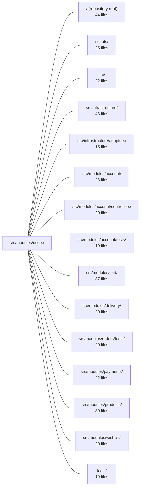

---
tags:
  - 2repo
  - 2repo/module
  - project/boilerplate-node-backend
type: module
module: src/modules/users/
files: 30
updated: 2026-08-31T20:56:50.613205+00:00
---

# src/modules/users/

## Purpose

The users module owns the admin-facing lifecycle of user records: creating, reading, updating, searching, and deleting (soft or hard) user documents on behalf of an operator. It is deliberately scoped *away* from authentication—signup, login, password reset, and token issuance all live in the `account` module. This module is a leaf in the dependency graph: it reaches nothing itself, but is consumed by `account`, `cart`, `delivery`, `payments`, and `wishlist`.

## Key parts

- **Domain core** — `model.ts` (Mongoose schema + Zod validation twin + token subdocument methods, kept together so the bcrypt pre-save hook and `select: false` credential-hiding stay colocated), `service.ts` (admin CRUD and paginated search logic), `repository.ts` (persistence wrapper over the shared `createRepository` factory, centralising re-selection of the two `select: false` fields).
- **HTTP layer** — `routes.ts` (admin-only Express router composing auth, cache, upload, and feature-flag middleware), `controllers/` (thin handlers for list/search, single-read, create/update, and delete that delegate to the service).
- **Cross-cutting contracts** — `analytics.ts`, `audit.ts`, and `events.ts` each register typed constants into app-wide maps via TypeScript module augmentation, giving the module a self-documenting, type-safe vocabulary for analytics events, audit-log actions, and domain events. `openapi.yaml` is the OpenAPI 3.0.3 source of truth for the module's HTTP surface.
- **Module wiring** — `module.ts` is the `AppModule` manifest consumed by the kernel registry; `index.ts` is the **only** public barrel that sibling modules may import (lint rules reject direct paths into internal files).
- **Fixtures & demo** — `fixtures.ts` (payload builder omitting schema-defaulted fields) and `demo.ts` (two seeded accounts + seed routine for development).
- **Tests** — `tests/` is split into unit (schema, routes, validation messages, token methods, audit strings, fixture builder), integration (model, repository, service, token flows, schema contract against a real in-memory MongoDB), and contract (OpenAPI spec compliance + credential-leak guards).

## How it connects

- **`account` module** — the primary consumer. It reads user credentials and manages the token lifecycle through the `users` repository's sanctioned helpers (`findByEmail`, `consumeToken`, etc.), always importing via `users/index.ts`.
- **`cart`, `delivery`, `payments`, `wishlist`** — each looks up a user record (ID, locale, active flag) through the users barrel during their own operations.
- **`infrastructure/`** — provides the shared kernel primitives this module extends: `createRepository`, the `DomainEventMap` / `AuditActionMap` / `AnalyticsEventMap` interfaces, and the `AppModule` contract that `module.ts` fulfils.
- **`tests/cross-cutting/` and `tests/support/`** — supply shared test harnesses (in-memory DB setup, assertion helpers) that the users test suites depend on.

## Where to start

1. **`module.ts`** — a short manifest that lists every route, the demo-seed hook, and the module's position in the dependency graph; it orients you to the module's surface in under a minute.
2. **`model.ts`** — the single most security-sensitive file in the codebase. Reading the Mongoose schema (especially the `select: false` fields, the pre-save bcrypt hook, and the token subdocument) together with the Zod twin gives you the data contract and the credential-leak guards that every downstream module depends on.

## Connected modules

[[boilerplate-node-backend_ROOT|/ (repository root)]] · [[boilerplate-node-backend_scripts|scripts/]] · [[boilerplate-node-backend_src|src/]] · [[boilerplate-node-backend_src_infrastructure|src/infrastructure/]] · [[boilerplate-node-backend_src_infrastructure_adapters|src/infrastructure/adapters/]] · [[boilerplate-node-backend_src_modules_account|src/modules/account/]] · [[boilerplate-node-backend_src_modules_account_controllers|src/modules/account/controllers/]] · [[boilerplate-node-backend_src_modules_account_tests|src/modules/account/tests/]] · [[boilerplate-node-backend_src_modules_cart|src/modules/cart/]] · [[boilerplate-node-backend_src_modules_delivery|src/modules/delivery/]] · [[boilerplate-node-backend_src_modules_orders_tests|src/modules/orders/tests/]] · [[boilerplate-node-backend_src_modules_payments|src/modules/payments/]] · [[boilerplate-node-backend_src_modules_products|src/modules/products/]] · [[boilerplate-node-backend_src_modules_wishlist|src/modules/wishlist/]] · [[boilerplate-node-backend_tests|tests/]] · … and 2 more

## Files
- `src/modules/users/analytics.ts` — Declares the analytics event names for the admin-facing half of the user account lifecycle (operator-initiated creation and deactivation) and registers them into the app-wide `AnalyticsEventMap` via module augmentation, giving the users module a type-safe, self-documenting set of event keys distinct from the self-signup events in the `account` module.
- `src/modules/users/audit.ts` — Declares the audit-action vocabulary for the users module and registers it into the app-wide `AuditActionMap` via TypeScript module augmentation. It exists so that every admin-facing write to a user record emits a typed, centrally-known action string.
- `src/modules/users/controllers/delete-users.ts` — Single-purpose controller module that wires up the `DELETE /users` and `DELETE /users/:id` admin endpoints (soft delete by default, hard delete via `?hardDelete=true`). It delegates all business logic to the user service and exists so that route definitions and audit policy stay decoupled from the controller shape.
- `src/modules/users/controllers/get-user-item.ts` — Defines the `GET /users/:id` endpoint controller, which retrieves a single user by its path parameter. Restricted to admin roles.
- `src/modules/users/controllers/get-users.ts` — Controller layer for the admin user-listing endpoint (`GET /users`) and the search endpoint (`POST /users/search`). It defines the query-parameter validation schema, wires it into the shared search-controller factory, and delegates the actual data fetch to `userService.search`.
- `src/modules/users/controllers/write-users.ts` — Single Express handler that serves both user creation (`POST /users`) and user updates (`PUT /users`, `PUT /users/:id`). The create-vs-update branch is decided at runtime by the presence of an `id` (in the path or body), so one function covers all three routes. It validates input, manages uploaded-image lifecycle, and delegates persistence to `userService`.
- `src/modules/users/demo.ts` — Defines the users module's slice of the demo dataset: two seeded accounts (one admin, one customer) that other modules and routes reference during development. Provides the fixtures, the seed routine, and a read-back export used by the demo-dataset publishing script.
- `src/modules/users/events.ts` — Declares the domain events the users module emits by augmenting the kernel's `DomainEventMap` interface (module augmentation, not a shared edit), and exports typed event-name constants so emitters and subscribers reference a single spelling instead of independent string literals.
- `src/modules/users/fixtures.ts` — Builder for user fixtures used by `./demo` and any test that needs a person. It deliberately omits schema-managed fields (`imageUrl`, `locale`, `admin`, `active`, `verified`, `tokens`) so that `demo-data.json` records what the Mongoose schema actually defaults, rather than baking those values in at fixture time.
- `src/modules/users/index.ts` — Public barrel for the `users` module. It is the **only** import surface permitted for sibling modules—lint rules reject direct paths into `./service`, `./repository`, etc. It re-exports the handful of symbols other modules (primarily `account`) are allowed to consume.
- `src/modules/users/model.ts` — Defines the Mongoose schema, Zod wire-validation twin, and token subdocument methods for the user record. Kept as a single file deliberately: splitting it would separate the bcrypt pre-save hook from the `select: false` that prevents the password hash from leaking on any read.
- `src/modules/users/module.ts` — Module manifest for the **users** module. Wires together the user record's routes, demo seeding, locale files, and image writeback into a single `AppModule` export that the kernel registry consumes at startup. It also documents the module's position in the dependency graph: it reaches nothing, and is reached by `account`, `cart`, `delivery`, `payments`, and `wishlist`.
- `src/modules/users/openapi.yaml` — OpenAPI 3.0.3 contract defining the HTTP surface of the **users** module (v2.0.0). It declares the CRUD endpoints for user accounts — list, create, read, update, delete — including a "hard delete" variant, and serves as the single source of truth for API documentation and client code generation for this module.
- `src/modules/users/repository.ts` — Persistence layer for the `users` collection. Wraps the standard CRUD provided by the shared `createRepository` factory with the credential reads and token-lifecycle operations that the `account` module needs across the shared-kernel boundary. Centralises the two `select: false` fields (`password`, `tokens`) into sanctioned helpers so that re-selection logic lives in one place.
- `src/modules/users/routes.ts` — Defines the admin-only Express router for the `/users` resource. It composes authorization, response-caching, file-upload, and route-flag middlewares with the user controllers to expose search, read, create, update, and delete (soft + hard) operations.
- `src/modules/users/service.ts` — Admin-facing user CRUD and search service. Handles creating, reading, updating, and deleting user documents on behalf of an operator, plus paginated search for the admin panel. Explicitly scoped *away* from authentication (signup, login, password reset, token lifecycle) which lives in the `account` module.
- `src/modules/users/tests/contract/api.contract.test.ts` — Contract tests for the `/users` and `/account` endpoints. Each successful response is validated against the OpenAPI spec (`toSatisfyApiSpec`) and, via a custom `assertNoCredentials` guard, checked that no credential material (password strings, token fields, bcrypt hashes) leaks into the serialized body. The suite also pins down role-filter query parameters, the password-provisioning rules on admin create, and a few error-status contracts (401, 409, 422).
- `src/modules/users/tests/fixtures.ts` — Database-backed user fixtures for tests. Wraps the plain-payload builder in `../fixtures` to insert real `UserDocument` records via `userRepository`, giving integration and contract tests a persisted user instead of an in-memory object.
- `src/modules/users/tests/integration/model.test.ts` — Integration test that verifies user credentials (bcrypt password hash, live tokens) can never leak into a serialized API response. It asserts two independent guards: Mongoose `select: false` prevents the fields from loading in normal queries, and `applyUserTransform`'s allowlist strips them again at serialization time — including on `.lean()` results that bypass `toJSON`.
- `src/modules/users/tests/integration/repository.test.ts` — Integration test suite for `userRepository`, exercising every public method (CRUD + token operations) against a real in-memory MongoDB instance wired up by `setupTestDb`. It exists to verify that the repository's Mongoose interactions behave correctly end-to-end—pre-save hooks, lean queries, pagination options, and token sweeps—without relying on mocks for the database layer.
- `src/modules/users/tests/integration/schema-contract.test.ts` — Integration tests that pin Mongoose schema-level guarantees — `select: false` on credentials, `default` values, the bcrypt hash, the `unique` email index, and `toJSON` serialization shape. They run against a real MongoDB instance because these are Mongoose's own runtime behaviors; a mocked model would only re-assert the mock's opinion, not the actual schema.
- `src/modules/users/tests/integration/service-tokens.test.ts` — Integration tests for the two token-facing methods on the users service — `findByEmail` and `consumeToken`. It verifies that `findByEmail` returns a populated tokens array (not `undefined`) and that `consumeToken` enforces one-time-use semantics with the change persisted to the database.
- `src/modules/users/tests/integration/service.test.ts` — Integration test suite for `userService` that exercises validation, search, `getById`, and the admin create/update/delete flows against an in-memory MongoDB spun up by `setupTestDb`. It exists to catch contract-level bugs (wrong status codes, leaked i18n keys, incorrect filter semantics) that unit tests on individual functions would miss.
- `src/modules/users/tests/unit/audit.test.ts` — Pins the exact string values of the users audit action constants so they match the wire contract consumed by external log queries, dashboards, and alerts. Uses whole-object equality to catch any added, removed, or reworded action.
- `src/modules/users/tests/unit/fixtures.test.ts` — Unit tests for the `makeUser` account-fixture builder. They pin down the contract that downstream feature tests rely on: what defaults are produced, which fields can be overridden, how falsy values are handled, and how ID/date fields are derived.
- `src/modules/users/tests/unit/routes.test.ts` — Unit tests for the user-administration router that verify three invariants without spinning up a server: (1) the exact set and order of mounted endpoints, (2) that every endpoint carries the `getAuth → isAuth → isAdmin` guard chain in that order with no public endpoints leaking through, and (3) correct cache tagging, upload validation, and feature-flag gating. The file exists so that a route accidentally mounted above the shared `isAdmin` middleware, a removed cache tag, or a broken ordering is caught at test time rather than in production.
- `src/modules/users/tests/unit/schema-contract.test.ts` — Contract test for `userSchema`, the most security-sensitive schema in the codebase. It pins down required fields, email validation anchoring, credential-hiding guarantees (`select: false` + transform `omit`), token sub-schema shape, index declarations, and the pre-save password-hashing hook—without ever opening a database connection.
- `src/modules/users/tests/unit/token-methods.test.ts` — Unit tests for the `tokenAdd` and `tokenRemoveAll` instance methods on the user Mongoose schema. The tests exercise the DB-first-then-mirror write order that these methods require (because `tokens` is `select: false`), using a hand-rolled document double instead of a real database.
- `src/modules/users/tests/unit/validation-messages.test.ts` — Unit tests that verify `zodUserSchema`'s validation messages resolve against the **active** i18next locale at parse time, not against whatever locale happened to be set (or unset) when the module was first imported. The tests assert the exact shipped strings per locale so that a silent fallback to Zod's built-in English defaults — the failure mode produced by calling `t()` before `i18next.init()` — is caught immediately rather than masked by a generic "key looks valid" check.
- `src/modules/users/tests/unit/validation.test.ts` — Unit tests that verify `zodUserSchema`'s i18n error-message thunks resolve to the correct English copy at validation time. They exist because import-time coverage tools report 100 % on the schema declaration regardless of whether the `() => t('…')` thunks ever execute; these tests force each thunk to run and confirm the message matches the shipped `en.json` entry, catching regressions like eager `t('…')` calls (which resolve before `i18next.init()` and silently fall back to English) or a message attached to the wrong rule.

---
[[boilerplate-node-backend_INDEX|← boilerplate-node-backend index]]
