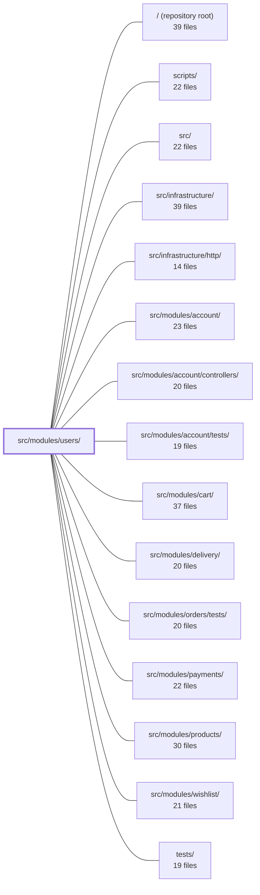

---
tags:
  - 2repo
  - 2repo/module
  - project/boilerplate-node-backend
type: module
module: src/modules/users/
files: 30
updated: 2026-08-28T12:01:09.625559+00:00
---

# src/modules/users/

## Purpose

The `users` module owns the **User record** and its admin-facing CRUD surface: listing/searching, creating, updating, and soft-deleting user accounts operated on by operators. It is deliberately a **leaf** in the domain graph—other modules (cart, orders, payments, etc.) read user data from it, but it never imports them. Self-service flows (signup, login, password reset) live in the sibling `account` module; this module is the complementary administrative half.

## Key parts

- **`model.ts`** — Single-file User definition: Mongoose schema, Zod wire-validation schema, token subdocument shape, `select: false` guards on `password`/`tokens`, `pre('save')` bcrypt hook, and `tokenAdd`/`tokenRemoveAll` instance methods. Storage contract, wire contract, and credential-protection invariant all live here.
- **`repository.ts`** — Data-access layer wrapping `userModel`. Centralises the one sanctioned re-selection of `select: false` fields (needed by token lookups) and expresses every token mutation as an atomic positional update.
- **`service.ts`** — Admin CRUD + search logic (create, update, soft/hard delete, paginated search). Also exposes the four token-based lookups (`findByEmail`, `findByPasswordResetToken`, `findByAccountDeleteToken`, `consumeToken`) that the `account` module consumes.
- **`routes.ts` + `controllers/`** — Express route table (all admin-gated) and five thin controller handlers (`get-users`, `get-user-item`, `write-users`, `delete-users`) that delegate to the service. `write-users` unifies create/update behind one handler to share validation and error paths.
- **`events.ts`, `audit.ts`, `analytics.ts`** — Domain-event declarations, audit-action string constants (`admin.user.*`), and analytics event names, each registered via module augmentation so the shared infrastructure layer stays domain-agnostic.
- **`module.ts` + `index.ts`** — `AppModule` registration manifest (router mount at `/users`, seed wiring) and the sole public import surface; lint forbids sibling modules from reaching past the barrel.
- **`openapi.yaml`** — OpenAPI 3.0.3 contract for the full user CRUD surface, consumed by code generators, contract tests, and documentation tooling.
- **`demo.ts` + `factory.ts`** — Local-dev seed accounts and a `makeUser` fixture builder used by both the demo dataset and the test suite.
- **`tests/`** — Layered suite: unit tests (schema contract, validation messages, token methods, audit strings, route-guard ordering), integration tests (model serialization, repository, service, token lookups), and API contract tests that validate responses against the OpenAPI spec with an explicit credential-leak guard.

## How it connects

- **`src/modules/account/`** — Operates as a second service over the same User collection (signup, login, password reset). It imports the repository and the token-based lookups from this module's service. The `admin.user.*` audit vocabulary here is intentionally distinct from account's `account.*` vocabulary.
- **`src/infrastructure/`** — The observability/audit layer is domain-agnostic; this module registers its event and audit names into shared maps via module augmentation declared in `events.ts`, `audit.ts`, and `analytics.ts`.
- **`src/modules/cart/`, `src/modules/orders/`, `src/modules/payments/`, `src/modules/products/`, `src/modules/wishlist/`, `src/modules/delivery/`** — Downstream modules that read user data (e.g. resolving an order's owner). They depend on this module; the dependency never flows back.
- **`tests/support/` / `tests/`** — Shared test harnesses and the root-level integration suite exercise endpoints defined here.

## Where to start

1. **`model.ts`** — Read this first. It is the single source of truth for what a User document looks like, which fields are hidden, how passwords are hashed, and what the Zod wire schema enforces. Everything else in the module is built around this contract.
2. **`service.ts`** — The admin business logic (create, update, delete, search, token lookups) is here. Reading it after the model gives you the full picture of what the module does and how it hands data to both the HTTP controllers and the `account` module.

## Connected modules

[[boilerplate-node-backend_ROOT|/ (repository root)]] · [[boilerplate-node-backend_scripts|scripts/]] · [[boilerplate-node-backend_src|src/]] · [[boilerplate-node-backend_src_infrastructure|src/infrastructure/]] · [[boilerplate-node-backend_src_infrastructure_http|src/infrastructure/http/]] · [[boilerplate-node-backend_src_modules_account|src/modules/account/]] · [[boilerplate-node-backend_src_modules_account_controllers|src/modules/account/controllers/]] · [[boilerplate-node-backend_src_modules_account_tests|src/modules/account/tests/]] · [[boilerplate-node-backend_src_modules_cart|src/modules/cart/]] · [[boilerplate-node-backend_src_modules_delivery|src/modules/delivery/]] · [[boilerplate-node-backend_src_modules_orders_tests|src/modules/orders/tests/]] · [[boilerplate-node-backend_src_modules_payments|src/modules/payments/]] · [[boilerplate-node-backend_src_modules_products|src/modules/products/]] · [[boilerplate-node-backend_src_modules_wishlist|src/modules/wishlist/]] · [[boilerplate-node-backend_tests|tests/]] · … and 1 more

## Files
- `src/modules/users/analytics.ts` — Defines the analytics event names emitted by the users module for **administrative** account-lifecycle actions (operator creating or deactivating an account, as opposed to a self-service sign-up). It declares those names locally via module augmentation so the infrastructure observability layer remains domain-agnostic.
- `src/modules/users/audit.ts` — Defines the audit-action string constants for admin-initiated user-record writes (create, update, delete) and registers them in the shared `AuditActionMap` via module augmentation. This file exists so that audit events emitted by the users module are type-safe and use a consistent `admin.user.*` vocabulary, distinct from the `account.*` vocabulary used for self-service actions in `modules/account`.
- `src/modules/users/controllers/delete-users.ts` — Defines the admin-facing HTTP controller for deleting users. It wires the two `DELETE /users` endpoints (id in body or in path) to the user service via a shared delete-controller factory, and attaches audit logging for every deletion.
- `src/modules/users/controllers/get-user-item.ts` — Express route handler for `GET /users/:id` (admin endpoint). Resolves a single user by its path parameter ID, returning the user object on success or a 404 with a localized message when the user doesn't exist or the ID isn't a valid ObjectId.
- `src/modules/users/controllers/get-users.ts` — Handler for `GET /users`: an admin-only endpoint that searches/lists users by query parameters (pagination, `active`, `admin`, `verified`). It validates the query string against a zod schema, delegates to `userService.search`, and writes a standard success/error response.
- `src/modules/users/controllers/write-users.ts` — Single controller handler that unifies user creation and editing behind one function. Dispatches on the presence of an `id` (from path param or body) and the HTTP method: no id + POST creates a user; id present updates one; PUT without id returns 422. Exists so the three admin write routes (`POST /users`, `PUT /users`, `PUT /users/:id`) share one validation, upload-cleanup, and error-handling code path.
- `src/modules/users/demo.ts` — Holds the user module's slice of the demo/seed dataset: two pre-built accounts (one admin, one customer) used to populate the database for local development and to export a reference dataset. It exists so the user directory owns its own seed rows rather than reaching into shared fixtures.
- `src/modules/users/events.ts` — Declares the domain events the `users` module emits by augmenting the kernel's `DomainEventMap` interface. This keeps event definitions colocated with the owning module rather than in a shared catalogue, so the event registry grows organically as modules are added.
- `src/modules/users/factory.ts` — Builds user fixtures for demo data (`./demo`) and test setups. It deliberately omits any field whose value is supplied by the schema (e.g. `locale`, `admin`, `active`, `verified`), so that `demo-data.json` and test records reflect what the model actually produces rather than a hand-repeated subset of the contract.
- `src/modules/users/index.ts` — Public barrel for the `users` module. It is the **only** import surface a sibling module is allowed to use; lint rejects any path that reaches into `@modules/users/service`, `./repository`, etc. directly. The surface is deliberately wider than typical because `account` operates as a second service over the same User collection (signup, login, password reset) and needs the repository, not just the service.
- `src/modules/users/model.ts` — Single-file definition of the user record: Mongoose schema, Zod wire validation, token subdocument shape, and document-level methods. It deliberately keeps the password-hash hook, `select: false` guards, token methods, and Zod schema co-located so that the storage contract, the wire contract, and the credential-protection invariant live in one readable unit.
- `src/modules/users/module.ts` — Registration manifest for the **users** module. It declares the module's identity, mounts the router at `/users`, wires in seed helpers and demo shapes, and satisfies the `AppModule` contract consumed by the kernel registry. The module owns the user *record* (admin search, read, write, soft-delete) and is deliberately a **leaf** in the domain graph: other modules (e.g. cart) depend on it, never the reverse.
- `src/modules/users/openapi.yaml` — OpenAPI 3.0.3 module contract for the **Users** domain (v2.0.0). Defines the full CRUD surface for user accounts — list, create, read, update, soft-delete, and hard-delete — so that API clients, code generators, and documentation tools can consume a single source of truth for this module's endpoints.
- `src/modules/users/repository.ts` — Data-access layer for user documents. Wraps the Mongoose `userModel` with standard CRUD (delegated to a base factory) plus the credential-specific reads and token-lifecycle writes that the account services need. It exists to centralise the one sanctioned re-selection of `select: false` fields (`password`, `tokens`) and to express every token mutation as an atomic positional update rather than a read-modify-write.
- `src/modules/users/routes.ts` — Defines all HTTP endpoints for user management (list, search, create, update, delete) on an Express `Router`. Every route is gated behind authentication and the admin role. This file is the sole wiring point between the HTTP layer and the user-module controllers.
- `src/modules/users/service.ts` — Admin-facing user CRUD and search service. It owns the write path for user documents created or modified by operators (create, update, soft/hard delete) and provides token-based lookups consumed by the `account` module. Authentication flows (signup, login, password reset) live in the `account` module; this file is the complementary admin surface.
- `src/modules/users/tests/contract/api.contract.test.ts` — Contract tests that validate user-facing API responses (`/users`, `/users/{id}`, `/account`, `/account/signup`) against the OpenAPI spec via `toSatisfyApiSpec()`, with an explicit credential-leak guard (`password`, `tokens`, bcrypt hashes) layered on top. The contract check catches *any* undeclared field; the explicit assertions document intent for the known historical leak.
- `src/modules/users/tests/factory.ts` — Test-only persistence layer for user fixtures. It wraps the pure `makeUser` builder (defined one level up in `src/modules/users/factory.ts`) with a database write, so tests across the codebase can create real user documents without duplicating defaults. The split between builder and persister is deliberate: previously two separate `makeUser` functions with diverging defaults caused confusion; now there is one canonical source for the payload and one for the insert.
- `src/modules/users/tests/integration/model.test.ts` — Integration test that verifies user credentials (bcrypt hash, refresh tokens) can never appear in any API response body. It exercises two independent safeguard mechanisms—`select: false` on the Mongoose schema and the `applyUserTransform` (`toJSON`) allowlist—and asserts that the serialized output matches the OpenAPI `User` contract exactly. Both mechanisms are tested because a regression in one could be masked by the other.
- `src/modules/users/tests/integration/repository.test.ts` — Integration test suite for `userRepository`, exercising every public method (`create`, `findById`, `findOne`, `findAll`, `count`, `save`, `deleteOne`, `updateMany`, and the token helpers) against a real database. It verifies persistence-level contracts: default values, password hashing, lean-object return shapes, pagination options, filter semantics, and token-lifecycle behaviour.
- `src/modules/users/tests/integration/schema-contract.test.ts` — Integration test that pins the **declarative schema contract** of the User Mongoose model — defaults, `select: false`, `required`, unique index, and `toJSON` shape — against a real MongoDB instance. It exists because these guarantees live in schema options, not in repository logic, and no other spec asserts them.
- `src/modules/users/tests/integration/service-tokens.test.ts` — Integration tests for the four token-facing lookups in `userService` (`findByEmail`, `findByPasswordResetToken`, `findByAccountDeleteToken`, `consumeToken`). These functions use `findOneWithCredentials` instead of the ordinary finder because the schema marks `tokens` with `select: false`; the tests pin the invariant that the returned document actually carries a populated `tokens` array and that each lookup is filtered by the correct `tokens.type`.
- `src/modules/users/tests/integration/service.test.ts` — Integration test suite for the user service (`src/modules/users/service.ts`), exercised against a real (in-memory) database. It validates the public service API — input validation, search/filter/pagination, single-user fetch, creation, and update — confirming both happy paths and boundary conditions (wrong types, soft-delete vs. active, i18n message integrity, password hashing).
- `src/modules/users/tests/unit/audit.test.ts` — Pins the exact string values of the users module's audit-action constants. These strings are wire contracts consumed by external log queries, dashboards, and alert rules; a silent rename or reword would break those consumers without any type error or test failure in other modules. This file is the owner-level guard that catches such drift.
- `src/modules/users/tests/unit/factory.test.ts` — Unit tests for the `makeUser` account-fixture builder. They lock in the contract that downstream tests (auth, authorization, soft-delete flows) rely on: correct defaults, safe override semantics, and the plaintext-password invariant that makes the model's pre-save hashing hook work.
- `src/modules/users/tests/unit/routes.test.ts` — Verifies the user-administration route table for three properties: that the exact set and order of endpoints is correct, that every endpoint carries the full `getAuth → isAuth → isAdmin` guard chain in that order, and that caching/upload/flag middleware is attached where expected. It exists because a single misplaced or missing line in `routes.ts` (e.g. a route mounted above the admin `use`, a dropped `isAdmin`, a forgotten cache-invalidation tag) would silently expose every user's email to non-admins or serve stale data.
- `src/modules/users/tests/unit/schema-contract.test.ts` — Unit tests that pin down the user schema's contract: which paths are required, what defaults a new document gets, the email pattern's anchoring, the token sub-schema shape, declared indexes, and—most critically—that `password` and `tokens` are both `select: false` at the schema level and `omit`-ed by `applyUserTransform` at serialization. It also exercises the `pre('save')` bcrypt hook in isolation. The file exists because a silent change to any of these declarations (removing a `select` flag, dropping an anchor from the email regex, flipping an `admin` default) would be a security regression with no compile-time or runtime error.
- `src/modules/users/tests/unit/token-methods.test.ts` — Unit tests for the two instance methods on `userSchema` that create or destroy session tokens (`tokenAdd`, `tokenRemoveAll`). They exist in isolation because both methods operate on a `select: false` field, meaning the in-memory `tokens` array is usually `undefined`; the tests verify the database-first write order, the optional-chain guard, and the `{ timestamps: false }` write option without a real database.
- `src/modules/users/tests/unit/validation-messages.test.ts` — Guards against **PROBLEM 01**: `t()` being called at module scope before `i18next.init()`, causing Zod to silently fall back to its built-in English defaults. Instead of merely checking that a message "isn't a dotted key" (which Zod defaults pass), these tests assert the **exact shipped i18n strings** for both `en` and `it`, and verify the schema resolves messages lazily per parse.
- `src/modules/users/tests/unit/validation.test.ts` — Exercises the six i18n message thunks in `zodUserSchema` to guarantee two things that "happy-path parse" suites never verify: (1) each thunk is evaluated lazily (so it never resolves to `undefined` before `i18next.init()`), and (2) each message is attached to the correct rule rather than a sibling with a similar constraint.

---
[[boilerplate-node-backend_INDEX|← boilerplate-node-backend index]]
