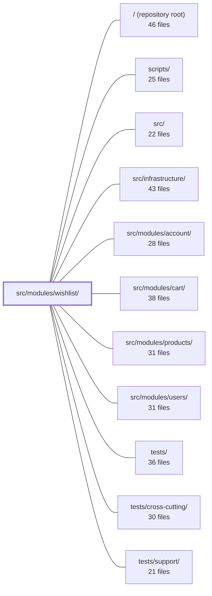

---
tags:
  - 2repo
  - 2repo/module
  - project/boilerplate-node-backend
type: module
module: src/modules/wishlist/
files: 21
updated: 2026-09-02T18:36:08.519388+00:00
---

# src/modules/wishlist/

## Purpose

The wishlist module manages a per-user collection of saved product IDs. It answers a single question—*"do I want this product?"*—and deliberately stops there, leaving quantity and purchase concerns to the cart. Operations are limited to saving, listing, removing, and moving a saved item into the cart. Mutations are idempotent upserts via `$addToSet` on a single Mongoose document keyed by user, so re-saving a product is a no-op rather than an error.

## Key parts

- **API surface** — `openapi.yaml` (the four-endpoint contract), `routes.ts` (auth-gated Express router), and the four files under `controllers/` (thin HTTP adapters that delegate to the service).
- **Business logic** — `service.ts`: resolves each operation (get, add, remove, move-to-cart, cascade cleanup) into a uniform response shape by orchestrating the repository, product lookups, and the cart service. Bare functions are module-private; consumers import only via the barrel.
- **Data layer** — `model.ts` (Mongoose schema: one document per user, flat `[{ productId }]` array, no sub-documents, no quantities) and `repository.ts` (typed data-access wrapper that keeps Mongoose out of the service).
- **Module wiring** — `module.ts` (assembles the `AppModule` manifest: routes, event subscriptions, demo seed, locale path) and `index.ts` (public barrel exposing `wishlistService` as the single import surface).
- **Analytics** — `analytics.ts`: a const map of event names plus a `declare module` augmentation of the app-wide `AnalyticsEventMap`; no runtime logic.
- **Test suites** — `tests/contract/` (live HTTP assertions against the OpenAPI spec), `tests/integration/` (service-layer behaviour against a real DB), and `tests/unit/` (schema contract, route table, analytics constants, fixture builder).
- **Demo & fixtures** — `demo.ts` (seed data per demo account) and `fixtures.ts` (`makeWishlist` factory for repo-level tests).
- **Probes** — `probes.ts`: edge-case requests (stale refs, malformed IDs, foreign-row access) that a standard OpenAPI contract cannot express.

## How it connects

- **Cart** — `service.ts` delegates the *move-to-cart* operation to the cart service, writing the cart line *before* dropping the wishlist entry to guarantee ordering. The module docblock and `openapi.yaml` both state that quantity is the cart's concern, not the wishlist's.
- **Products** — The service performs product lookups to enforce the public-catalogue gate on add, and subscribes to product-deletion events to cascade-remove stale product IDs from users' wishlists.
- **Users** — Every route is behind authentication middleware (the wishlist is inherently per-user). The service also subscribes to user-deletion events to clean up the wishlist document.
- **Infrastructure** — `repository.ts` builds on a shared `createRepository` helper; `routes.ts` relies on the shared authentication middleware.
- **Cross-cutting tests** — `tests/cross-cutting/` and `tests/support/` provide shared test utilities and multi-module scenarios that exercise the wishlist alongside cart and product flows.

## Where to start

1. **`openapi.yaml`** — a newcomer can read the four endpoints, their request/response schemas, and the explicit "no quantities" design note in under two minutes, gaining a complete external view of the module.
2. **`service.ts`** — once the API shape is clear, this file shows *how* each operation is implemented: the idempotent add, the catalogue gate, the cart-first ordering in move-to-cart, and the event-subscription cleanup, all in one place.

## Connected modules

[[boilerplate-node-backend_ROOT|/ (repository root)]] · [[boilerplate-node-backend_scripts|scripts/]] · [[boilerplate-node-backend_src|src/]] · [[boilerplate-node-backend_src_infrastructure|src/infrastructure/]] · [[boilerplate-node-backend_src_modules_account|src/modules/account/]] · [[boilerplate-node-backend_src_modules_cart|src/modules/cart/]] · [[boilerplate-node-backend_src_modules_products|src/modules/products/]] · [[boilerplate-node-backend_src_modules_users|src/modules/users/]] · [[boilerplate-node-backend_tests|tests/]] · [[boilerplate-node-backend_tests_cross-cutting|tests/cross-cutting/]] · [[boilerplate-node-backend_tests_support|tests/support/]]

## Files
- `src/modules/wishlist/analytics.ts` — Declares the analytics event names emitted by the wishlist module (a "save funnel" with a single exit point into the purchase funnel) and registers them into the app-wide `AnalyticsEventMap` so that emit sites get autocomplete and type safety. It contains no runtime logic—only a const map and a `declare module` augmentation.
- `src/modules/wishlist/controllers/delete-wishlist-item.ts` — Thin HTTP adapter that handles `DELETE /wishlist/:productId`. It extracts the authenticated user and product ID from the request, validates the ID format, and delegates the actual removal to `wishlistService.wishlistRemove`, then maps the service result to a structured HTTP response.
- `src/modules/wishlist/controllers/get-wishlist.ts` — Thin HTTP adapter that exposes the authenticated user's wishlist as a `GET /wishlist` endpoint. It extracts the user ID from the auth context, delegates to the wishlist service, and formats the result into a standard HTTP response. No business logic lives here.
- `src/modules/wishlist/controllers/post-move-to-cart.ts` — Thin Express controller for `POST /wishlist/:productId/move-to-cart`. It validates the `productId` param, extracts auth/caller context, and delegates the actual move-to-cart business logic to `wishlistService.wishlistMoveToCart`. The file contains no domain logic itself — it is purely the HTTP adapter layer.
- `src/modules/wishlist/controllers/post-wishlist.ts` — Thin HTTP adapter for `POST /wishlist`. It extracts the authenticated user and validated product ID from the request, delegates the business logic to `wishlistService.wishlistAdd`, and shapes the HTTP response. The operation is idempotent: re-saving an already-saved product returns the same `200` rather than an error.
- `src/modules/wishlist/demo.ts` — Defines the wishlist module's slice of the demo dataset: one seeded wishlist per demo account, each containing only publicly visible products. It also exposes the seed and export functions that `db/demo/index.ts` orchestrates.
- `src/modules/wishlist/fixtures.ts` — Factory that builds a wishlist fixture for repository-level tests and demos. Mirrors the cart fixture pattern (owner-addressed, pinned `_id` for byte-stable exports) but treats each line as a bare product id rather than a quantity, since a wishlist answers "do I want this?" rather than "how many?"
- `src/modules/wishlist/index.ts` — Public barrel for the wishlist module. It enforces a single import surface for sibling modules: consumers import `wishlistService` from here rather than reaching into individual functions in `service.ts` directly. The file exists to make the module's public API explicit and stable.
- `src/modules/wishlist/model.ts` — Defines the Mongoose schema, model, and serialization transform for the per-user wishlist collection. A wishlist is a single document keyed by `userId` whose payload is a flat list of `{ productId }` entries—no quantity, no sub-identity—so that idempotent upserts via `$addToSet` are the entire mutation story.
- `src/modules/wishlist/module.ts` — Wiring/manifest file for the wishlist module. It assembles the `AppModule` contract—routes, event subscriptions, demo seeding, and locale path—without containing any business logic itself. All behavior is delegated to `./routes`, `./service`, and `./demo`.
- `src/modules/wishlist/openapi.yaml` — OpenAPI 3.0.3 contract for the wishlist module. It defines the four HTTP endpoints a client uses to save, list, remove, and move-to-cart a user's desired products, along with the request/response schemas. The wishlist is intentionally minimal — it stores product IDs only, never quantities — so that "I want this" and "how many" remain separate concerns (the latter belongs to the cart).
- `src/modules/wishlist/probes.ts` — Exports the wishlist module's list of contract-uncoverable edge-case requests (probes). These are requests whose failure modes a standard OpenAPI contract cannot express—stale references, malformed ids, or actions on rows the caller does not hold—each with a human-readable `why` explaining the exact gap in the contract.
- `src/modules/wishlist/repository.ts` — Data-access layer for the Wishlist domain. Wraps Mongoose operations behind a typed repository interface, combining the generic CRUD provided by `createRepository` with three domain-specific writes (add line, remove line) and two cleanup writes triggered by product/user deletion. Exists so the service layer never touches Mongoose directly.
- `src/modules/wishlist/routes.ts` — Defines the Express route table for all wishlist operations (save, unsave, move-to-cart). The entire router is wrapped with authentication middleware because a wishlist is inherently per-user. This file is the single wiring point between the wishlist controllers and the module's HTTP layer.
- `src/modules/wishlist/service.ts` — Business-logic layer for the wishlist domain. It resolves each endpoint's intent (get, add, remove, move-to-cart, cascade-delete) into a single response shape — `{ items: [{ productId }] }` — by orchestrating the wishlist repository, product lookups, and the cart service. Controllers import only the `wishlistService` barrel; the bare functions are module-private.
- `src/modules/wishlist/tests/contract/api.contract.test.ts` — Contract tests for the four `/wishlist` routes (`GET`, `POST`, `DELETE /{productId}`, `POST /{productId}/move-to-cart`). Each test hits the live HTTP surface and asserts the response matches the declared API spec, ensuring every documented response branch (200, 404, 422) is actually reachable. Behavioural logic is explicitly out of scope here—that belongs in the unit suite.
- `src/modules/wishlist/tests/integration/service.test.ts` — Integration tests for `wishlistService` that exercise the full service layer against a real (test) database. They verify the behavioural contracts called out in the module docblock: idempotent saves, the public-catalogue gate, the "write cart before dropping the line" ordering in move-to-cart, and event-subscription cleanup on hard deletes of products and users.
- `src/modules/wishlist/tests/unit/analytics.test.ts` — Pins the exact string values of the wishlist analytics event constants and verifies they are registered in the app-wide `AnalyticsEventMap` type. It exists to prevent silent breakage: the strings are the keys Umami dashboards plot against, so renaming them without updating dashboards drops a series with no compile-time error.
- `src/modules/wishlist/tests/unit/fixtures.test.ts` — Unit tests for the `makeWishlist` fixture builder. They lock down the contract that the builder accepts bare product-id strings (not `{ productId }` objects), produces real `Types.ObjectId` values, and omits the `items` key entirely when no products are supplied so that the Mongoose schema default applies.
- `src/modules/wishlist/tests/unit/routes.test.ts` — Unit tests that pin the wishlist router's contract: the exact set and order of registered routes, the authentication requirement on every route, the deliberate absence of any admin guard, and the path-ordering constraint that keeps `/:productId/move-to-cart` from being shadowed by the bare `/:productId` route.
- `src/modules/wishlist/tests/unit/schema-contract.test.ts` — Contract test for the Mongoose `wishlistSchema`. It pins down the schema-level decisions that are invisible in the OpenAPI document but drive runtime behavior: the unique index that makes "one wishlist per user" a database guarantee, the `_id: false` on line items, the default `[]` for `items`, and the compound index that makes product-deletion lookups efficient.

---
[[boilerplate-node-backend_INDEX|← boilerplate-node-backend index]]
