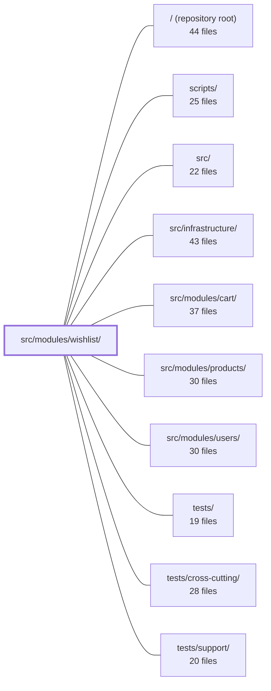

---
tags:
  - 2repo
  - 2repo/module
  - project/boilerplate-node-backend
type: module
module: src/modules/wishlist/
files: 20
updated: 2026-08-31T20:57:09.602629+00:00
---

# src/modules/wishlist/

## Purpose

The wishlist module implements the per-user "save for later" list: an authenticated user can mark a product as desired, list their saved products, remove one, or promote one into the cart. The data model is deliberately minimal—a flat list of product IDs with no quantities—so that "I want this" (wishlist) and "how many" (cart) remain separate concerns.

## Key parts

- **HTTP layer** — `routes.ts` wires the four endpoints behind authentication middleware. The four thin controllers (`get-wishlist`, `post-wishlist`, `delete-wishlist-item`, `post-move-to-cart`) each extract request context and delegate to the service; no business logic lives here.
- **Business logic** — `service.ts` is the single orchestrator. It resolves each endpoint's intent (list, add, remove, move-to-cart, cascade-delete) into a uniform response shape and coordinates the repository, product lookups, and the cart service.
- **Data layer** — `model.ts` defines the Mongoose schema (one document per `userId`, `items` as an array of `{ productId }` with no sub-doc identity, so `$addToSet` is the entire mutation story). `repository.ts` wraps Mongoose behind a typed interface, adding domain-specific writes and product/user-deletion cleanup so the service never touches Mongoose directly.
- **Module wiring & contracts** — `module.ts` registers the module into the kernel's `AppModule` contract (routes, events, demo seed, locale). `openapi.yaml` is the public API contract. `analytics.ts` augments the app-wide `AnalyticsEventMap` with wishlist event names (type-only, no runtime code). `probes.ts` lists edge-case requests the OpenAPI contract cannot express.
- **Test & demo data** — `demo.ts` seeds one wishlist per demo account. `fixtures.ts` provides a byte-stable `makeWishlist` builder for repository-level tests.
- **Tests** — `tests/unit/` pins the schema shape, router contract, fixture builder, and analytics strings. `tests/integration/` exercises the full service against a real test DB (idempotency, public-catalogue gate, move-to-cart ordering, cascade cleanup). `tests/contract/` verifies every declared HTTP response branch is reachable and spec-conformant.

## How it connects

- **`src/modules/cart/`** — The move-to-cart flow calls into the cart service to write the quantity before dropping the wishlist line, ensuring the user does not lose the item if the cart write fails. The two modules share a deliberate boundary: wishlist stores "which," cart stores "how many."
- **`src/modules/products/`** — Wishlist lines reference product IDs. The service enforces a public-catalogue gate (only visible products can be saved) and subscribes to product-deletion events to cascade-remove stale lines.
- **`src/modules/users/`** — Every wishlist is keyed by `userId`. User-deletion events trigger cleanup of the associated wishlist document.
- **`src/infrastructure/`** — The repository layer builds on the shared `createRepository` helper and Mongoose connection provided by the infrastructure package.
- **`tests/cross-cutting/` and `tests/support/`** — The module's `probes.ts` and `fixtures.ts` are consumed by cross-cutting test suites that exercise multi-module flows (e.g., save → move-to-cart → verify cart contents).

## Where to start

Read **`service.ts`** first: it is the single file that explains every behavioural decision (idempotent saves, the public-catalogue gate, the write-cart-before-dropping-line ordering, cascade cleanup) and shows how the repository, product service, and cart service fit together. Then read **`model.ts`** to understand the data shape that makes `$addToSet` the only mutation primitive and why quantities are absent by design.

## Connected modules

[[boilerplate-node-backend_ROOT|/ (repository root)]] · [[boilerplate-node-backend_scripts|scripts/]] · [[boilerplate-node-backend_src|src/]] · [[boilerplate-node-backend_src_infrastructure|src/infrastructure/]] · [[boilerplate-node-backend_src_modules_cart|src/modules/cart/]] · [[boilerplate-node-backend_src_modules_products|src/modules/products/]] · [[boilerplate-node-backend_src_modules_users|src/modules/users/]] · [[boilerplate-node-backend_tests|tests/]] · [[boilerplate-node-backend_tests_cross-cutting|tests/cross-cutting/]] · [[boilerplate-node-backend_tests_support|tests/support/]]

## Files
- `src/modules/wishlist/analytics.ts` — Declares the analytics event names emitted by the wishlist module (a "save funnel" with a single exit point into the purchase funnel) and registers them into the app-wide `AnalyticsEventMap` so that emit sites get autocomplete and type safety. It contains no runtime logic—only a const map and a `declare module` augmentation.
- `src/modules/wishlist/controllers/delete-wishlist-item.ts` — Thin HTTP adapter that handles `DELETE /wishlist/:productId`. It extracts the authenticated user and product ID from the request, validates the ID format, and delegates the actual removal to `wishlistService.wishlistRemove`, then maps the service result to a structured HTTP response.
- `src/modules/wishlist/controllers/get-wishlist.ts` — Thin HTTP adapter that exposes the authenticated user's wishlist as a `GET /wishlist` endpoint. It extracts the user ID from the auth context, delegates to the wishlist service, and formats the result into a standard HTTP response. No business logic lives here.
- `src/modules/wishlist/controllers/post-move-to-cart.ts` — Thin Express controller for `POST /wishlist/:productId/move-to-cart`. It validates the `productId` param, extracts auth/caller context, and delegates the actual move-to-cart business logic to `wishlistService.wishlistMoveToCart`. The file contains no domain logic itself — it is purely the HTTP adapter layer.
- `src/modules/wishlist/controllers/post-wishlist.ts` — Thin HTTP adapter for `POST /wishlist`. It extracts the authenticated user and validated product ID from the request, delegates the business logic to `wishlistService.wishlistAdd`, and shapes the HTTP response. The operation is idempotent: re-saving an already-saved product returns the same `200` rather than an error.
- `src/modules/wishlist/demo.ts` — Defines the wishlist module's slice of the demo dataset: one seeded wishlist per demo account, each containing only publicly visible products. It also exposes the seed and export functions that `db/demo/index.ts` orchestrates.
- `src/modules/wishlist/fixtures.ts` — Factory that builds a wishlist fixture for repository-level tests and demos. Mirrors the cart fixture pattern (owner-addressed, pinned `_id` for byte-stable exports) but treats each line as a bare product id rather than a quantity, since a wishlist answers "do I want this?" rather than "how many?"
- `src/modules/wishlist/model.ts` — Defines the Mongoose schema, model, and serialization transform for the per-user wishlist collection. A wishlist is a single document keyed by `userId` whose payload is a flat list of `{ productId }` entries—no quantity, no sub-identity—so that idempotent upserts via `$addToSet` are the entire mutation story.
- `src/modules/wishlist/module.ts` — Module manifest for the wishlist feature. It registers the module's name, base path, routes, event subscriptions, demo seeding, and locale path into the kernel's `AppModule` contract so the application can discover and wire up the module at startup.
- `src/modules/wishlist/openapi.yaml` — OpenAPI 3.0.3 contract for the wishlist module. It defines the four HTTP endpoints a client uses to save, list, remove, and move-to-cart a user's desired products, along with the request/response schemas. The wishlist is intentionally minimal — it stores product IDs only, never quantities — so that "I want this" and "how many" remain separate concerns (the latter belongs to the cart).
- `src/modules/wishlist/probes.ts` — Exports the wishlist module's list of contract-uncoverable edge-case requests (probes). These are requests whose failure modes a standard OpenAPI contract cannot express—stale references, malformed ids, or actions on rows the caller does not hold—each with a human-readable `why` explaining the exact gap in the contract.
- `src/modules/wishlist/repository.ts` — Data-access layer for the Wishlist domain. Wraps Mongoose operations behind a typed repository interface, combining the generic CRUD provided by `createRepository` with three domain-specific writes (add line, remove line) and two cleanup writes triggered by product/user deletion. Exists so the service layer never touches Mongoose directly.
- `src/modules/wishlist/routes.ts` — Defines the Express route table for all wishlist operations (save, unsave, move-to-cart). The entire router is wrapped with authentication middleware because a wishlist is inherently per-user. This file is the single wiring point between the wishlist controllers and the module's HTTP layer.
- `src/modules/wishlist/service.ts` — Business-logic layer for the wishlist domain. It resolves each endpoint's intent (get, add, remove, move-to-cart, cascade-delete) into a single response shape — `{ items: [{ productId }] }` — by orchestrating the wishlist repository, product lookups, and the cart service. Controllers import only the `wishlistService` barrel; the bare functions are module-private.
- `src/modules/wishlist/tests/contract/api.contract.test.ts` — Contract tests for the `/wishlist` routes. Every assertion exists solely to confirm each declared response branch (200, 401, 404, 422) is actually reachable over HTTP and conforms to the API spec. Behavioural logic is covered by the unit suite; this file only checks that the wire surface matches the contract.
- `src/modules/wishlist/tests/integration/service.test.ts` — Integration tests for `wishlistService` that exercise the full service layer against a real (test) database. They verify the behavioural contracts called out in the module docblock: idempotent saves, the public-catalogue gate, the "write cart before dropping the line" ordering in move-to-cart, and event-subscription cleanup on hard deletes of products and users.
- `src/modules/wishlist/tests/unit/analytics.test.ts` — Pins the exact string values of the wishlist analytics event constants and verifies they are registered in the app-wide `AnalyticsEventMap` type. It exists to prevent silent breakage: the strings are the keys Umami dashboards plot against, so renaming them without updating dashboards drops a series with no compile-time error.
- `src/modules/wishlist/tests/unit/fixtures.test.ts` — Unit tests for the `makeWishlist` fixture builder. They lock down the contract that the builder accepts bare product-id strings (not `{ productId }` objects), produces real `Types.ObjectId` values, and omits the `items` key entirely when no products are supplied so that the Mongoose schema default applies.
- `src/modules/wishlist/tests/unit/routes.test.ts` — Unit tests that pin the wishlist router's contract: the exact set and order of registered routes, the authentication requirement on every route, the deliberate absence of any admin guard, and the path-ordering constraint that keeps `/:productId/move-to-cart` from being shadowed by the bare `/:productId` route.
- `src/modules/wishlist/tests/unit/schema-contract.test.ts` — Contract test for the Mongoose `wishlistSchema`. It pins down the schema-level decisions that are invisible in the OpenAPI document but drive runtime behavior: the unique index that makes "one wishlist per user" a database guarantee, the `_id: false` on line items, the default `[]` for `items`, and the compound index that makes product-deletion lookups efficient.

---
[[boilerplate-node-backend_INDEX|← boilerplate-node-backend index]]
