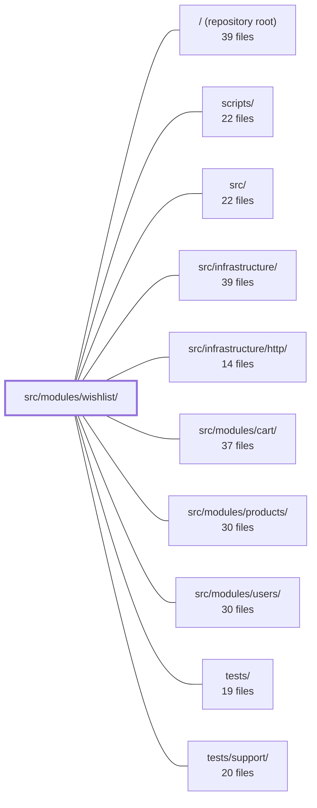

---
tags:
  - 2repo
  - 2repo/module
  - project/boilerplate-node-backend
type: module
module: src/modules/wishlist/
files: 21
updated: 2026-08-28T12:01:22.605381+00:00
---

# src/modules/wishlist/

## Purpose

The wishlist module manages each user's saved-products list — a deliberately minimal per-user document that stores product IDs only (no quantities), answering the single question "do I want this?" It exposes four HTTP endpoints (save, list, remove, move-to-cart) and enforces cross-module rules such as public-catalogue visibility and cart-first ordering before persisting any change.

## Key parts

- **Domain core** — `model.ts` (Mongoose schema, per-user isolation, items keyed solely by `productId`), `repository.ts` (data-access layer combining the shared base factory with the four domain-specific writes), `service.ts` (business rules, cross-module gating, analytics emission, wire-response shaping).
- **HTTP layer** — `routes.ts` (four Express routes, all behind session auth, no admin guard) and the `controllers/` directory (one handler per endpoint plus `shared/product-id.ts`, a guard all three writing controllers call to reject non-ObjectId values with 422).
- **Module assembly** — `module.ts` (single `AppModule` object the kernel registers; wires routes, dependencies, event subscriptions, and seed functions) and `analytics.ts` (owns the three event-name constants and registers them into the app-wide `AnalyticsEventMap`).
- **Demo & fixtures** — `demo.ts` (seeded wishlists for the two demo users) and `factory.ts` (test/demo fixture builder following the same ownership-by-`userId` convention as the cart factory).
- **API contract & tests** — `openapi.yaml` (OpenAPI 3.0.3 spec for the four endpoints), `probes.ts` (API rejection probes for 404/422 branches), and `tests/` (unit, integration, and contract suites covering invariants from schema shape to full HTTP response conformance).

## How it connects

- **`src/modules/cart/`** — The `move-to-cart` operation removes a product from the wishlist and inserts (or increments) it in the cart at quantity 1. The service enforces a "cart-first" ordering so the cart write is committed before the wishlist line is deleted, and the product-deletion event subscription coordinates cleanup across both modules.
- **`src/modules/products/`** — The service gates saves and moves on product visibility (public catalogue only). A compound index on the wishlist collection supports efficient product-deletion lookups, and the module subscribes to product hard-delete events to purge orphaned references.
- **`src/modules/users/`** — Wishlists are isolated per `userId`. The module subscribes to user-deletion events to remove the entire wishlist document.
- **`src/infrastructure/`** — Supplies the Mongoose connection, the shared base-repository factory, and the analytics port into which `analytics.ts` registers its event names.
- **`src/infrastructure/http/`** — Provides the Express app, session/middleware pipeline, and router utilities that `routes.ts` plugs into.
- **`tests/support/`** — Shared test harnesses (DB setup, auth fixtures) used by the wishlist integration and contract suites.

## Where to start

Read **`model.ts`** first — in ten lines it captures the entire data shape (one document per user, items are bare `productId` strings, no quantity) and the unique/compound indexes the rest of the system relies on. Then read **`service.ts`** to see the single decision point where cross-module rules (product visibility, cart-first ordering, idempotent saves) are enforced before any write reaches the repository.

## Connected modules

[[boilerplate-node-backend_ROOT|/ (repository root)]] · [[boilerplate-node-backend_scripts|scripts/]] · [[boilerplate-node-backend_src|src/]] · [[boilerplate-node-backend_src_infrastructure|src/infrastructure/]] · [[boilerplate-node-backend_src_infrastructure_http|src/infrastructure/http/]] · [[boilerplate-node-backend_src_modules_cart|src/modules/cart/]] · [[boilerplate-node-backend_src_modules_products|src/modules/products/]] · [[boilerplate-node-backend_src_modules_users|src/modules/users/]] · [[boilerplate-node-backend_tests|tests/]] · [[boilerplate-node-backend_tests_support|tests/support/]]

## Files
- `src/modules/wishlist/analytics.ts` — Declares the three analytics event names the wishlist module emits and registers them into the analytics port's type map. It exists so the module owns its event vocabulary locally (same pattern as `./audit.ts`) without the infrastructure layer needing to know about domain specifics.
- `src/modules/wishlist/controllers/delete-wishlist-item.ts` — Express controller handler for `DELETE /wishlist/:productId`. It extracts the caller's identity, validates the product ID, delegates removal to the wishlist service, and shapes the HTTP response (200 success, 404 for items the caller cannot see, or error).
- `src/modules/wishlist/controllers/get-wishlist.ts` — Express controller for `GET /wishlist`. It resolves the authenticated user's saved product IDs (not full product objects) and returns them as a JSON success response. The client is expected to join these IDs against its own product store.
- `src/modules/wishlist/controllers/post-move-to-cart.ts` — Express route handler for `POST /wishlist/:productId/move-to-cart`. It validates the product ID, extracts the authenticated user, and delegates to the wishlist service to move one product from the wishlist into the cart (quantity 1, or incremented if already present) while removing it from the wishlist.
- `src/modules/wishlist/controllers/post-wishlist.ts` — Controller handler for `POST /wishlist`. Validates authentication, request body (via Zod schema), and product-ID format, then delegates to the wishlist service to save a product. The operation is intentionally idempotent: saving an already-saved item returns the same `200` rather than an error.
- `src/modules/wishlist/controllers/shared/product-id.ts` — Single shared guard that the three wishlist writing controllers (`POST /wishlist`, `DELETE /wishlist/:productId`, `POST /wishlist/:productId/move-to-cart`) all call to reject a non-ObjectId `productId` with a 422 response before any service logic runs. Extracted to eliminate three byte-identical validation branches and their comments living in separate files.
- `src/modules/wishlist/demo.ts` — Provides the wishlist module's slice of the demo dataset: two seeded wishlists (one per demo user) plus the seed and export functions that `db/demo/index.ts` calls to populate and inspect the collection. The file exists so that the storefront has non-empty wishlist pages for the admin and regular demo users without manual data entry.
- `src/modules/wishlist/factory.ts` — Builds a ready-to-persist wishlist fixture for test/demo use. Follows the same ownership-by-`userId` convention as the cart factory: no wishlist id is part of the public shape, but a `_id` is still pinned so exported datasets remain byte-stable across runs.
- `src/modules/wishlist/model.ts` — Defines the Mongoose schema, document interfaces, and registered model for the wishlist collection. A wishlist is a per-user document keyed by `userId` (same isolation rationale as the cart), where each line carries only a `productId`—deliberately no quantity—because "do I want this" is the only question a wishlist answers.
- `src/modules/wishlist/module.ts` — Declares the wishlist module as a single `AppModule` object that the kernel can register. It wires the module's HTTP routes, cross-module dependencies, domain-event subscriptions, seed functions, and demo shape into one place so the rest of the application never needs to import individual wishlist pieces directly.
- `src/modules/wishlist/openapi.yaml` — OpenAPI 3.0.3 contract for the wishlist module. It defines the four HTTP endpoints a client uses to save, list, remove, and move-to-cart a user's desired products, along with the request/response schemas. The wishlist is intentionally minimal — it stores product IDs only, never quantities — so that "I want this" and "how many" remain separate concerns (the latter belongs to the cart).
- `src/modules/wishlist/probes.ts` — Exports a set of API rejection probes for the wishlist module. Because a contract can only declare valid calls and their declared answers, these probes cover the cases where the API must *reject* a request (404, 422) and have no natural home in the contract-derived collection. They are emitted into every client collection after the contract-derived requests.
- `src/modules/wishlist/repository.ts` — Data-access layer for the Wishlist domain. It wires the Mongoose model to the rest of the module by combining the shared base-repository factory (standard CRUD + serialization) with the four domain-specific write operations a wishlist actually needs. Every write is keyed by `userId` (a unique index), so no caller ever reads before writing.
- `src/modules/wishlist/routes.ts` — Express route definitions for the wishlist module. It wires the four wishlist HTTP endpoints (list, save, move-to-cart, remove) to their respective controllers and enforces authentication on every route, since a wishlist is inherently user-specific.
- `src/modules/wishlist/service.ts` — Service layer for the wishlist domain. Sits between the wishlist controllers and `wishlistRepository`, enforcing cross-module business rules (product visibility, cart eligibility), shaping the wire response, and emitting analytics. It is the single place where "what a wishlist operation may or may not do" is decided.
- `src/modules/wishlist/tests/contract/api.contract.test.ts` — Contract tests that exercise every `/wishlist` route over HTTP and assert each response satisfies the declared API spec. Unlike the unit suite (which verifies business logic), these tests exist to guarantee every declared response branch—success, 401, 404, 422—is actually reachable and correctly shaped for the four routes: `GET /wishlist`, `POST /wishlist`, `DELETE /wishlist/{productId}`, and `POST /wishlist/{productId}/move-to-cart`.
- `src/modules/wishlist/tests/integration/service.test.ts` — Integration test suite for `wishlistService` that verifies the service's core invariants against a real database: idempotent saves, public-catalogue gating, the "cart-first" ordering in move-to-cart, and event-subscription cleanup on hard-deleted products and users. It exists to catch regressions in the interplay between the wishlist, cart, and product modules that unit-level mocks would hide.
- `src/modules/wishlist/tests/unit/analytics.test.ts` — Unit test that pins the exact string values emitted by the wishlist analytics module. It exists because external dashboards (Umami) key their series on these literal strings — renaming a constant freely is safe, but silently changing its value would silently break a dashboard with no in-repo error. The test also confirms the module augmentation registers wishlist events into the app-wide `AnalyticsEventMap`.
- `src/modules/wishlist/tests/unit/factory.test.ts` — Unit tests for the `makeWishlist` fixture builder. Verifies that the factory correctly shapes raw string ids into a Mongoose-compatible wishlist document — specifically the `userId` → `ObjectId` cast, the absent-vs-empty distinction for `items`, and the bare-`productId`-only line shape that distinguishes a wishlist line from a cart line.
- `src/modules/wishlist/tests/unit/routes.test.ts` — Unit test for the wishlist router. It pins down four invariants: the exact set and order of endpoints, universal session auth, the deliberate absence of any admin guard, and the route-declaration ordering that prevents `move-to-cart` from being swallowed by the `/:productId` param match.
- `src/modules/wishlist/tests/unit/schema-contract.test.ts` — Contract test that pins the Mongoose `wishlistSchema` to its invariants: one wishlist per user (unique index), items addressed solely by `productId` (no subdocument `_id`, no quantity field), a default empty `items` array, correct ObjectId references, and the compound index that product-deletion lookups depend on. It exists so that any future change to the schema that silently breaks those invariants fails here rather than surfacing at runtime.

---
[[boilerplate-node-backend_INDEX|← boilerplate-node-backend index]]
