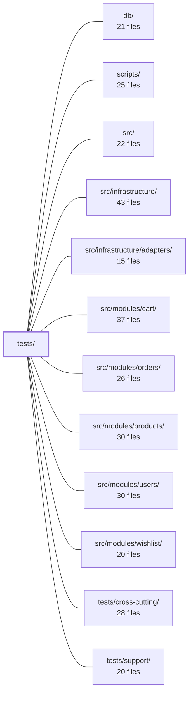

---
tags:
  - 2repo
  - 2repo/module
  - project/boilerplate-node-backend
type: module
module: tests/
files: 19
updated: 2026-08-31T20:57:32.737092+00:00
---

# tests/

## Purpose

The test suite for the application. It verifies runtime behavior across four complementary axes: integration (real HTTP against the mounted Express app), contract (OpenAPI spec conformance for both requests and responses), cluster (multi-process invariants invisible to single-process tests), and fuzz (spec-driven property-based stress testing). Together these layers catch regressions that no single approach covers—per-process state leaks, validator/spec drift, race conditions, and adversarial input handling.

## Key parts

- **`tests/integration/`** — The largest suite. Exercises the real app (from `src/app.ts`) over HTTP via supertest. Sub-areas:
  - *Concurrency* (`concurrency/`) — Firing parallel requests to lock in fixes for race-condition bugs in auth, cart/checkout, and wishlist.
  - *Database* (`db/`) — Migration ordering, demo-data integrity, and index compatibility between migrations and Mongoose schema declarations.
  - *Security & locale* — Auth hardening, observability auth, upload security (filesystem-level assertions), locale negotiation, and cache invalidation.
  - *App-level* — Root health route, product multipart write path.
- **`tests/contract/`** — Static and runtime checks that the API and its OpenAPI spec agree. `request-contract` and `request-sources` verify the spec is neither tighter nor looser than actual validators; `system.test.ts` checks shared error envelopes.
- **`tests/cluster/`** — Boots the real multi-process cluster with Redis and asserts cross-worker invariants (shared rate-limit budget) that a single-process test structurally cannot observe.
- **`tests/fuzz/`** — Auto-discovers every operation in `openapi.yaml`, generates hostile-but-spec-valid requests with `fast-check`, and asserts no 5xx plus shape conformance. Runs outside the CI gate.
- **`tests/cluster/support/`** — Harness that spawns the cluster via `npx tsx` with a disposable MongoDB and Redis (podman container or CI-supplied URL), exposing TCP helpers to talk to workers.

## How it connects

- **`src/` and `src/modules/*`** — Every integration, contract, and cluster test imports the application or its individual modules (cart, orders, products, users, wishlist) as the unit under test. The concurrency tests specifically target the write paths in cart, orders, users, and wishlist.
- **`src/infrastructure/adapters/`** — Tests instantiate or depend on the Redis and MongoDB adapters to set up disposable infrastructure (cluster Redis, in-memory Mongo) and to verify adapter-level behavior (e.g., shared counters).
- **`db/`** — The `integration/db/` tests read and replay migration artefacts and compare them against Mongoose model definitions and the published demo dataset.
- **`scripts/`** — Provides the `npm run test:fuzz` entry point and CI orchestration that decides which suites run on which schedule.
- **`tests/support/`** — Shared harness (supertest wiring, fixture helpers, `raceN` concurrency utility) consumed by most integration and contract tests in this module.
- **`tests/cross-cutting/`** — Sibling suite covering concerns (e.g., Zod schema validation, middleware ordering) that apply across modules; this module's contract tests complement it by tying behavior to the published OpenAPI contract.

## Where to start

1. **`tests/integration/app-health.test.ts`** — The shortest integration file. It shows the supertest harness, the app import, and the assert-on-real-HTTP pattern every other integration test follows.
2. **`tests/cluster/support/cluster.ts`** — If the multi-process model is new to you, this file (and its sibling `redis.ts`) reveals how the suite boots a real cluster and talks to workers, explaining *why* the cluster suite exists separately from everything else in `tests/`.

## Connected modules

[[boilerplate-node-backend_db|db/]] · [[boilerplate-node-backend_scripts|scripts/]] · [[boilerplate-node-backend_src|src/]] · [[boilerplate-node-backend_src_infrastructure|src/infrastructure/]] · [[boilerplate-node-backend_src_infrastructure_adapters|src/infrastructure/adapters/]] · [[boilerplate-node-backend_src_modules_cart|src/modules/cart/]] · [[boilerplate-node-backend_src_modules_orders|src/modules/orders/]] · [[boilerplate-node-backend_src_modules_products|src/modules/products/]] · [[boilerplate-node-backend_src_modules_users|src/modules/users/]] · [[boilerplate-node-backend_src_modules_wishlist|src/modules/wishlist/]] · [[boilerplate-node-backend_tests_cross-cutting|tests/cross-cutting/]] · [[boilerplate-node-backend_tests_support|tests/support/]]

## Files
- `tests/cluster/rate-limit.test.ts` — Verifies that the application's rate-limit budget is enforced as a **single shared allowance** across all worker processes when backed by Redis, and demonstrates (as a control) that without Redis each worker independently grants its own budget. Exists because every other test suite runs the app in one process, where a per-process counter is indistinguishable from a shared one — so a regression to the in-memory store would pass all other tests silently.
- `tests/cluster/support/cluster.ts` — Test-support harness that boots the real multi-process cluster (`src/cluster.ts` via `npx tsx`) with its own in-memory MongoDB and a random free port, then exposes helpers for talking to the workers over TCP. It exists because every other suite in the repo runs the app in a single process (supertest), which structurally cannot observe state that is correct per-worker but broken across the cluster (e.g. a per-process counter).
- `tests/cluster/support/redis.ts` — Provides a disposable Redis instance for the cluster test suite. It either reuses a URL supplied via `NODE_TEST_REDIS_URL` (the CI path) or spins up a short-lived container using the repo's named engine (podman by default). The file deliberately avoids the testcontainers library to keep the podman-first contract with no extra dependency or socket workaround.
- `tests/contract/request-contract.test.ts` — Contract-derived **request** tests. For every write endpoint, asserts that the API accepts every payload its own OpenAPI spec declares legal (expect 2xx) and rejects exactly the payloads the spec declares illegal (expect 422 with a `ValidationErrorResponse`-shaped body). This is the mirror image of the rest of `tests/contract/*`, which compare real *responses* against the spec; this file compares spec-derived *requests* against the real API, catching validators that are tighter or looser than their own contract.
- `tests/contract/request-sources.test.ts` — Static contract test that asserts every controller's declared request sources (`params`, `body`, `query`) are a **subset** of what the OpenAPI spec allows for the same route. It does this by reading source files with regex (no server, no imports of runtime modules) and comparing two written claims: the `surface:` / `readInput` declarations in controllers versus the `in:` / `requestBody` entries in `openapi.yaml`. It also verifies the module registry is honest — a wrong `basePath` or a module missing from `enabledModules` makes real operations unreachable, and this test is the only check that notices.
- `tests/contract/system.test.ts` — Contract tests for the system-level routes (`GET /`) and the shared error envelopes (404, 422). Ensures that these responses conform to the OpenAPI / Zod spec defined in the contract layer, catching drift between the runtime response shape and the documented type.
- `tests/fuzz/endpoints.fuzz.test.ts` — Spec-driven fuzzing harness that generates `fast-check`-valid but hostile requests for every operation in `openapi.yaml` and asserts two invariants: no 5xx response, and the response matches the spec (status code and shape). Operations are auto-discovered via `listOperations()`, so any new route added to the spec is covered on the next run with no test to write. Runs nightly or via `npm run test:fuzz`, not as part of the CI gate.
- `tests/integration/app-health.test.ts` — Integration tests for the root `/` route and the `/observability/*` family (metrics, events, health, audit). They exercise the real application exported from `src/app.ts` through the shared supertest harness, ensuring the actual middleware stack is under test. A database is required (session-cookie auth for the SSE endpoint); Redis is intentionally not started.
- `tests/integration/auth-hardening.test.ts` — Integration tests verifying two security-hardening properties that only manifest under attack: (1) credential endpoints carry a separate, small rate-limit budget distinct from the global API limiter, and (2) the 500 error handler never leaks internal implementation details to unauthenticated callers while still surfacing deliberately chosen error messages.
- `tests/integration/concurrency/auth-races.test.ts` — Integration tests that fire genuinely concurrent requests (via `raceN`) against the mounted Express app and assert **invariants** (exactly one account, all tokens retained, one-time token consumed once) rather than orderings. They exist to lock in fixes for two real race-condition bugs — R1 (check-then-insert on a non-unique index) and R4 (read-modify-write on the token array) — and to prevent regression.
- `tests/integration/concurrency/cart-races.test.ts` — Integration tests that fire N concurrent HTTP requests at the cart and checkout endpoints to verify race-condition invariants. Two historical bugs are covered: **R2** (two parallel checkouts both reading the same lines and double-charging) and **R3** (the cart upsert retry logic that was correct but entirely untested). A final case guards against an orphaned cart surviving account deletion.
- `tests/integration/concurrency/wishlist-races.test.ts` — Integration tests that verify the wishlist endpoints survive concurrent writes without producing duplicate documents, duplicate lines, or server errors. They specifically guard two invariants that the repository's shape (a set-append via `$addToSet` and an exact-equality `upsert` filter on `userId`) is supposed to provide, and they are the enforcement half of the same reasoning applied to the cart in `cart-races.test.ts`.
- `tests/integration/db/migration-demo-data.test.ts` — Integration test that asserts the demo dataset artefact (`db/demo/demo-data.json`) is identical whether migrations run before seeding, after seeding, or are replayed a second time. It closes the one gap no other gate covers: a migration silently rewriting seeded rows (e.g. `imageUrl`) into a shape the published artefact does not reflect, while schema checks and self-referential comparisons stay green.
- `tests/integration/db/migration-model-indexes.test.ts` — Verifies that database migrations and Mongoose schema-declared indexes are compatible with each other. It is the only test in the suite that exercises a database where **both** migrations have been applied **and** the app has built its own indexes — the exact state a real deployment reaches. Without this, a name or option mismatch between a migration-created index and a schema-declared index would surface only as a boot failure in dev/staging/production.
- `tests/integration/locale-cache-invalidation.test.ts` — End-to-end integration test that proves a write to the locales routes actually removes the cached public dictionary response, so the next anonymous reader sees fresh data. It drives the real app over HTTP and asserts on `x-cache: MISS|HIT` headers rather than on spy-call arguments, guarding against the tag-string mismatch between the read path (stores under `'locales'`) and the write path (clears `'locales'`) that nothing type-checks.
- `tests/integration/locale.test.ts` — Integration tests verifying that per-request locale negotiation (via the `Accept-Language` header) works end-to-end through the real middleware stack, Zod validation, and error-shaping path. The file exists to guard against regressions where locale resolution silently falls back to the boot language—especially under concurrency (AsyncLocalStorage) and across the multipart-upload boundary.
- `tests/integration/observability-auth.test.ts` — Integration tests for the two observability endpoints (`GET /observability/events` and `GET /observability/metrics`), verifying that each one's distinct authentication scheme correctly accepts legitimate callers and rejects every form of unauthorized or malformed access.
- `tests/integration/product-multipart-write.test.ts` — Integration test that writes and updates a product via `multipart/form-data` (the only way to attach an image) and verifies the server correctly decodes string-typed form fields — `price` as a number and `active` as a boolean — before they reach the Zod schema. No other suite exercises this combination, because JSON-path suites already send typed values and the upload-security suite has no numeric field.
- `tests/integration/upload-security.test.ts` — Integration tests that verify the unauthenticated `POST /account/signup` upload route enforces real content validation (not just client-declared types) and that the `express.static` serving layer for the public upload directory is safe. Tests assert on the filesystem state — what is actually stored on disk — rather than only on HTTP status codes, because the security question is "what is now available to read."

---
[[boilerplate-node-backend_INDEX|← boilerplate-node-backend index]]
