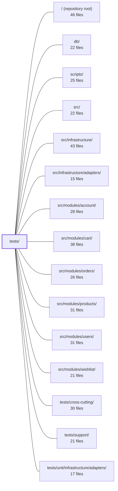

---
tags:
  - 2repo
  - 2repo/module
  - project/boilerplate-node-backend
type: module
module: tests/
files: 36
updated: 2026-09-02T18:36:24.678778+00:00
---

# tests/

## Purpose

The `tests/` directory is the application's complete test suite, organised by testing concern rather than by feature. It spans unit tests for individual functions, integration tests driving the real Express app over HTTP, contract tests auto-derived from `openapi.yaml`, multi-process cluster tests, concurrency/race-condition tests, and a nightly fuzz harness. Together they enforce behavioural, structural, and security invariants that no single layer of the codebase can verify on its own.

## Key parts

- **`tests/contract/`** — Spec-derived tests that compare the running API against `openapi.yaml` in both directions: `request-contract.test.ts` checks that legal payloads are accepted and illegal ones rejected; `authorization-contract.test.ts` sweeps every route for correct 401/403 guards; `request-sources.test.ts` statically verifies controller declarations are a subset of the spec; `system.test.ts` pins the root and error-envelope shapes.

- **`tests/integration/`** — End-to-end HTTP tests against the real app (`src/app.ts` via supertest). Covers auth hardening, two-factor lifecycle, locale negotiation and cache invalidation, multipart uploads, submission rate-limiting, and observability endpoints. Sub-groups:
  - **`integration/concurrency/`** — Fires N truly parallel requests to verify optimistic-concurrency guards on cart, wishlist, and account endpoints (duplicate-charge, duplicate-line, and token-rotation races).
  - **`integration/db/`** — Validates migration/seed ordering idempotency and index compatibility between migration files and Mongoose schema declarations.

- **`tests/cluster/`** — Boots the real multi-process cluster with a disposable Redis instance and an in-memory MongoDB; proves that the rate-limit budget is a *shared* allowance across workers (a property invisible to every single-process suite).

- **`tests/fuzz/`** — `fast-check`-driven harness that generates hostile-but-spec-valid requests for every OpenAPI operation and asserts no 5xx and spec-conformant responses. Runs nightly, not as a CI gate.

- **`tests/unit/`** — Isolated tests for kernel (authorization combinators, event bus, module registry), ESLint rule implementations, i18n email split-responsibility, DB helper scripts (`runScript`, host URI resolution, seed-fixture URL integrity), process error-handler installation, and the mutation-score ratchet / spec-identity scripts.

## How it connects

- **`src/`** — The system under test. Integration and contract tests import `src/app.ts` directly; unit tests stub or import individual kernel and module functions.
- **`src/modules/`** (account, cart, orders, products, users, wishlist) — Concurrency, integration, and contract tests target these modules' routes and invariants; the cluster test specifically guards the rate-limiter that sits in front of all of them.
- **`db/`** — Integration DB tests exercise the migration chain and seed artefact produced by `db/` scripts; `tests/unit/db/` validates the host-script wrapper and seed-fixture paths that those scripts rely on.
- **`scripts/`** — `tests/unit/scripts/` unit-tests the mutation-baseline ratchet and cross-repo spec-identity checks that live in `scripts/`.
- **`tests/support/`** — Shared supertest harness, test-data builders, and in-memory Mongo setup used across most integration and unit files.
- **`tests/cross-cutting/`** — Sibling suite for concerns that span multiple modules (e.g., middleware ordering, error-envelope consistency) and avoids duplication with the per-module integration files.
- **`tests/unit/infrastructure/adapters/`** — Sub-suite isolating adapter-layer contracts (storage, queue, Redis) from the higher-level integration tests that exercise them through HTTP.

## Where to start

1. **`tests/contract/request-contract.test.ts`** — It is the most mechanically readable entry point: you see exactly how the suite derives test cases from `openapi.yaml`, how it talks to the app, and what "conformant" means in this codebase. Understanding this pattern makes the authorization and system contract files trivial to follow.

2. **`tests/integration/two-factor.test.ts`** — A single file that exercises routing, auth guards, serialization, error shaping, and a security-critical invariant ("the bypass") against the *real* app. Reading it top-to-bottom shows how integration tests are structured, what the shared harness provides, and the level of detail the suite expects.

## Connected modules

[[boilerplate-node-backend_ROOT|/ (repository root)]] · [[boilerplate-node-backend_db|db/]] · [[boilerplate-node-backend_scripts|scripts/]] · [[boilerplate-node-backend_src|src/]] · [[boilerplate-node-backend_src_infrastructure|src/infrastructure/]] · [[boilerplate-node-backend_src_infrastructure_adapters|src/infrastructure/adapters/]] · [[boilerplate-node-backend_src_modules_account|src/modules/account/]] · [[boilerplate-node-backend_src_modules_cart|src/modules/cart/]] · [[boilerplate-node-backend_src_modules_orders|src/modules/orders/]] · [[boilerplate-node-backend_src_modules_products|src/modules/products/]] · [[boilerplate-node-backend_src_modules_users|src/modules/users/]] · [[boilerplate-node-backend_src_modules_wishlist|src/modules/wishlist/]] · [[boilerplate-node-backend_tests_cross-cutting|tests/cross-cutting/]] · [[boilerplate-node-backend_tests_support|tests/support/]] · [[boilerplate-node-backend_tests_unit_infrastructure_adapters|tests/unit/infrastructure/adapters/]]

## Files
- `tests/cluster/rate-limit.test.ts` — Verifies that the application's rate-limit budget is enforced as a **single shared allowance** across all worker processes when backed by Redis, and demonstrates (as a control) that without Redis each worker independently grants its own budget. Exists because every other test suite runs the app in one process, where a per-process counter is indistinguishable from a shared one — so a regression to the in-memory store would pass all other tests silently.
- `tests/cluster/support/cluster.ts` — Test-support harness that boots the real multi-process cluster (`src/cluster.ts` via `npx tsx`) with its own in-memory MongoDB and a random free port, then exposes helpers for talking to the workers over TCP. It exists because every other suite in the repo runs the app in a single process (supertest), which structurally cannot observe state that is correct per-worker but broken across the cluster (e.g. a per-process counter).
- `tests/cluster/support/redis.ts` — Provides a disposable Redis instance for the cluster test suite. It either reuses a URL supplied via `NODE_TEST_REDIS_URL` (the CI path) or spins up a short-lived container using the repo's named engine (podman by default). The file deliberately avoids the testcontainers library to keep the podman-first contract with no extra dependency or socket workaround.
- `tests/contract/authorization-contract.test.ts` — Contract-derived authorization sweep that generates one table-driven case per route (via `everyMountedRoute()`) asserting: every `isAuth`-guarded route returns **401** to an unauthenticated caller, and every `isAdmin`-guarded route returns **403** to an authenticated non-admin. Each response is also validated against the OpenAPI error contract via `toSatisfyApiSpec()`. It is the authorization mirror of `request-contract.test.ts`, which sweeps request bodies instead.
- `tests/contract/request-contract.test.ts` — Contract-derived **request** tests: for every write endpoint, verifies the API accepts every payload its OpenAPI spec declares legal (→ 2xx) and rejects every payload the spec declares illegal (→ 422 with a `ValidationErrorResponse` body). This is the mirror image of the other `tests/contract/*` files, which compare a real *response* against `openapi.yaml`; here, spec-derived *requests* are compared against the real API. It exists to catch validator drift in both directions (too tight, too lax) that scenario tests cannot answer.
- `tests/contract/request-sources.test.ts` — Static contract test that asserts every controller's declared request sources (`params`, `body`, `query`) are a **subset** of what the OpenAPI spec allows for the same route. It does this by reading source files with regex (no server, no imports of runtime modules) and comparing two written claims: the `surface:` / `readInput` declarations in controllers versus the `in:` / `requestBody` entries in `openapi.yaml`. It also verifies the module registry is honest — a wrong `basePath` or a module missing from `enabledModules` makes real operations unreachable, and this test is the only check that notices.
- `tests/contract/system.test.ts` — Contract tests for the system-level routes (`GET /`) and the shared error envelopes (404, 422). Ensures that these responses conform to the OpenAPI / Zod spec defined in the contract layer, catching drift between the runtime response shape and the documented type.
- `tests/fuzz/endpoints.fuzz.test.ts` — Spec-driven fuzzing harness that generates `fast-check`-valid but hostile requests for every operation in `openapi.yaml` and asserts two invariants: no 5xx response, and the response matches the spec (status code and shape). Operations are auto-discovered via `listOperations()`, so any new route added to the spec is covered on the next run with no test to write. Runs nightly or via `npm run test:fuzz`, not as part of the CI gate.
- `tests/integration/app-health.test.ts` — Integration tests for the system route (`/`) and the observability routes (`/observability/*`). They drive the **real** application exported from `src/app.ts` through the shared supertest harness to verify middleware ordering, response shapes, and auth behavior as deployed — not against a privately-assembled Express app.
- `tests/integration/auth-hardening.test.ts` — Integration tests verifying two security-hardening properties that only manifest under attack: (1) credential endpoints carry a separate, small rate-limit budget distinct from the global API limiter, and (2) the 500 error handler never leaks internal implementation details to unauthenticated callers while still surfacing deliberately chosen error messages.
- `tests/integration/concurrency/auth-races.test.ts` — Integration tests that fire N genuinely concurrent HTTP requests (via supertest) at the account endpoints and assert **invariants** (exactly one account, N distinct tokens, one superseded ancestor) rather than orderings. They cover three concurrency scenarios — duplicate signup (R1), token-array clobbering on concurrent login/logout-all (R4), and refresh-token rotation under simultaneous exchange (R5) — plus a one-time-token race. R1 and R4 were real bugs; R5 proves a deliberate grace-window design in `tokenSupersede`.
- `tests/integration/concurrency/cart-races.test.ts` — Integration tests that fire N concurrent HTTP requests against the cart and checkout endpoints to verify that the optimistic-concurrency guards actually prevent the two documented failure modes: **R2** (two parallel checkouts both read the same cart lines, both create an order, and the customer is charged twice) and **R3** (parallel cart upserts produce duplicate lines or duplicate cart documents). Also covers an edge race where account deletion and a cart write interleave.
- `tests/integration/concurrency/wishlist-races.test.ts` — Integration tests that verify the wishlist endpoints survive concurrent writes without producing duplicate documents, duplicate lines, or server errors. They specifically guard two invariants that the repository's shape (a set-append via `$addToSet` and an exact-equality `upsert` filter on `userId`) is supposed to provide, and they are the enforcement half of the same reasoning applied to the cart in `cart-races.test.ts`.
- `tests/integration/db/migration-demo-data.test.ts` — Integration test that asserts the demo dataset artefact (`db/demo/demo-data.json`) is identical whether migrations run before seeding, after seeding, or are replayed a second time. It closes the one gap no other gate covers: a migration silently rewriting seeded rows (e.g. `imageUrl`) into a shape the published artefact does not reflect, while schema checks and self-referential comparisons stay green.
- `tests/integration/db/migration-model-indexes.test.ts` — Verifies that database migrations and Mongoose schema-declared indexes are compatible with each other. It is the only test in the suite that exercises a database where **both** migrations have been applied **and** the app has built its own indexes — the exact state a real deployment reaches. Without this, a name or option mismatch between a migration-created index and a schema-declared index would surface only as a boot failure in dev/staging/production.
- `tests/integration/locale-cache-invalidation.test.ts` — End-to-end integration test that proves a write to the locales routes actually removes the cached public dictionary response, so the next anonymous reader sees fresh data. It drives the real app over HTTP and asserts on `x-cache: MISS|HIT` headers rather than on spy-call arguments, guarding against the tag-string mismatch between the read path (stores under `'locales'`) and the write path (clears `'locales'`) that nothing type-checks.
- `tests/integration/locale.test.ts` — Integration tests verifying that per-request locale negotiation (via the `Accept-Language` header) works end-to-end through the real middleware stack, Zod validation, and error-shaping path. The file exists to guard against regressions where locale resolution silently falls back to the boot language—especially under concurrency (AsyncLocalStorage) and across the multipart-upload boundary.
- `tests/integration/observability-auth.test.ts` — Integration tests for the two observability endpoints (`GET /observability/events` and `GET /observability/metrics`), verifying that each one's distinct authentication scheme correctly accepts legitimate callers and rejects every form of unauthorized or malformed access.
- `tests/integration/product-multipart-write.test.ts` — Integration test that writes and updates a product via `multipart/form-data` (the only way to attach an image) and verifies the server correctly decodes string-typed form fields — `price` as a number and `active` as a boolean — before they reach the Zod schema. No other suite exercises this combination, because JSON-path suites already send typed values and the upload-security suite has no numeric field.
- `tests/integration/submission-rate-limit.test.ts` — Integration test that verifies `submissionLimiter` (the rate limiter guarding `POST /feedback/contact`) spends its budget on **successful** requests — the inverse of `credentialLimiters`, which skip them. It exists as a regression guard for `FEEDBACK_PLAN.md` correction 1: mounting the wrong limiter on `/contact` would silently pass every abusive submission because they all return `201`.
- `tests/integration/two-factor.test.ts` — End-to-end integration suite for the full two-factor authentication lifecycle (enroll → confirm → challenge login → disable → admin recovery). Drives the real Express app over HTTP so routing, auth guards, and serialization all execute. The final describe block ("the bypass") is the security-critical assertion: a challenge token must never pass `isAuth` as a standalone credential.
- `tests/integration/upload-security.test.ts` — Integration tests that verify the unauthenticated `POST /account/signup` upload route enforces real content validation (not just client-declared types) and that the `express.static` serving layer for the public upload directory is safe. Tests assert on the filesystem state — what is actually stored on disk — rather than only on HTTP status codes, because the security question is "what is now available to read."
- `tests/unit/app/process-error-handlers.test.ts` — Verifies that `installErrorHandling` installs the correct process-level listeners for `uncaughtException` and `unhandledRejection` depending on `NODE_ENV`. It exists because a silent failure to log-and-exit on a fatal throw is invisible: the process keeps running in an unknown state, tests pass green, and the server simply "stops doing that thing" in production.
- `tests/unit/db/host-scripts.test.ts` — Validates the `npm run host -- <script>` wrapper and the database URI resolution logic it depends on. It guards against a class of silent failures where a script hardcodes a connection string (and with it a database name) that contradicts `.env`, causing `db:seed` or `db:migrate:up` to target the wrong database with no diagnostic output. The file pins five invariants: no literal URI in the wrapper, single source of hostname redirection, empty-string URI fallthrough, `migrate-mongo-config.js` parity with the application, and loopback-IPv4 targeting.
- `tests/unit/db/run-script.test.ts` — Unit tests for the `runScript` wrapper in `db/run-script.ts`, which adds three guarantees to a bare promise chain: a non-zero exit code on failure, guaranteed cleanup execution (critical for closing Mongo/Redis sockets on `db:seed`), and a logged error reason. This file verifies all of those behaviours plus edge cases like non-Error rejections and simultaneous body+cleanup failures.
- `tests/unit/db/seed-fixtures.test.ts` — Validates that every `imageUrl` string across all module seed fixtures is a well-formed, absolute URL path that resolves to a file actually present under `public/`. It exists because a bad path (e.g. a Windows-style `\images\x.jpg` from `path.join`) produces only a silent 404 in the browser — no other test catches it.
- `tests/unit/eslint/controller-chain-must-catch.test.ts` — Unit test for the `controller-chain-must-catch` ESLint rule, exercised via ESLint's own `RuleTester`. It asserts that the rule correctly flags controller handlers with an unhandled `.then()` chain and correctly allows the rule's documented carve-outs (chains inside `.catch` handlers, private helpers delegating `.catch` to the caller). Running through `RuleTester` means the rule receives a real parsed AST, matching production lint behavior.
- `tests/unit/eslint/no-hardcoded-user-text.test.ts` — Unit test for the `no-hardcoded-user-text` ESLint rule. It verifies that the rule flags bare string literals and `message:` values in the `errors` argument of `rejectResponse` / `generateReject`, while explicitly *not* flagging `code:` identifiers, `t(…)` calls, template literals containing expressions, or unrelated function calls.
- `tests/unit/eslint/no-persistence-imports.test.ts` — Unit test for the `noPersistenceImports` ESLint rule, exercised through ESLint's `RuleTester` so that assertions operate on the parsed AST exactly as a real lint run would. Covers both detection routes (imported binding name and module path) and both shipped configurations (strict for controllers, Model-only for the rest), catching regressions that a default-options-only test would miss.
- `tests/unit/i18n/email-locale.test.ts` — Guards the split-responsibility contract for localized email: the **producer** must fully resolve all copy (subject, body, footer, `<html lang>` value) before a job is published to the queue, and the **worker** must render only what it was handed without ever consulting a locale store. The tests assert both halves against the `reset-confirm` account email in English and Italian.
- `tests/unit/kernel/authorization.test.ts` — Unit tests for the two read-scoping combinators exported by `src/kernel/authorization.ts`. They assert the kernel's contract in isolation (using stub builders) so that a regression is attributable to the scoping rule itself rather than to any particular repository's filter logic.
- `tests/unit/kernel/authorizations.test.ts` — Unit tests for the authorization middlewares in `src/kernel/middlewares/authorizations.ts`. Verifies that each middleware (`getAuth`, `isAuth`, `isAdmin`, `getTokenBearer`, `isAdminViaCookie`, `requireFreshAuth`) honours its contracted failure mode—fail-open vs fail-closed—returns the correct status code and response envelope, and emits the correct audit event. Only the audit sink and the JWT/user-lookup boundary are stubbed; the response path is exercised for real so asserted status codes match what a client would receive.
- `tests/unit/kernel/events.test.ts` — Unit tests for the domain event bus. They lock in the two invariants that make the bus a safe *substitute* (not just a decoupling) for the direct products→cart / cart→catalogue calls: handlers are awaited before `emitDomainEvent` resolves, and a single failing handler does not reject the emitter or prevent remaining handlers from running.
- `tests/unit/kernel/registry.test.ts` — Unit tests for `registerModules`, the sole boot-time function the registry exposes. The file asserts exactly two observable contracts: every module that declares a `subscribe` callback has it invoked, and a module that declares none is a valid, non-error path.
- `tests/unit/scripts/mutation-baseline.test.ts` — Unit tests for the per-file mutation-score ratchet in `scripts/mutation-baseline.ts`. They pin the asymmetry at the heart of the design—improvements move the baseline up, regressions never move it down—and verify the scoring, comparison, formatting, and partial-run-guard logic against synthetic Stryker-shaped reports so no real 51-minute mutation run is needed.
- `tests/unit/scripts/spec-identity.test.ts` — Unit tests for the cross-repo contract check in `scripts/spec-identity.ts`. Verifies that the two shared spec files (OpenAPI, AsyncAPI) remain byte-identical between the backend and frontend checkouts, covering both the comparison logic (driven against synthetic temp-dir fixtures) and the live pair (conditional on the sibling checkout actually being present).

---
[[boilerplate-node-backend_INDEX|← boilerplate-node-backend index]]
