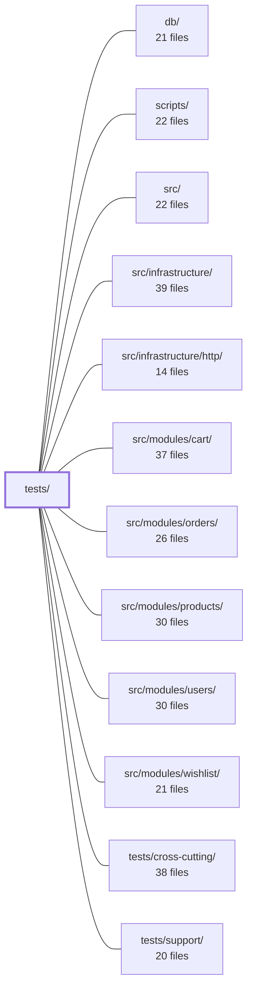

---
tags:
  - 2repo
  - 2repo/module
  - project/boilerplate-node-backend
type: module
module: tests/
files: 19
updated: 2026-08-28T12:01:37.297461+00:00
---

# tests/

## Purpose

The `tests/` directory is the project's entire test suite. It exercises the application at multiple levels of fidelity—from single-process HTTP integration to genuine multi-process cluster behaviour—and enforces that runtime behaviour stays in lock-step with the OpenAPI contract, the database schema, and documented concurrency invariants.

## Key parts

- **`tests/cluster/`** — Boots the real multi-process cluster (`src/cluster.ts`) with an in-memory MongoDB and a disposable Redis instance (via podman or a CI-supplied URL). Contains `rate-limit.test.ts`, the only suite that can detect a regression of the rate-limit store from Redis back to a per-process in-memory counter. `support/cluster.ts` and `support/redis.ts` provide the harness.

- **`tests/contract/`** — Spec-conformance tests that require no running server beyond supertest. `request-contract.test.ts` and `system.test.ts` assert the live API accepts/rejects exactly what `openapi.yaml` declares. `request-sources.test.ts` is a static-analysis check (regex over source files) that controller-declared input sources are a subset of the spec's, and that `src/modules.ts` wiring is complete.

- **`tests/fuzz/`** — `endpoints.fuzz.test.ts` auto-discovers every operation in the OpenAPI spec and fires `fast-check`-generated hostile requests, asserting no 5xx and spec-conformant responses. Intended for nightly / on-demand runs (`npm run test:fuzz`), not the CI gate.

- **`tests/integration/`** — The largest group; drives the real app (`src/app.ts`) through the shared supertest harness.
  - *General:* app-health, auth-hardening, locale negotiation, locale-cache-invalidation, product multipart writes, upload-security (filesystem-level assertions), observability-auth.
  - *Concurrency (`concurrency/`):* `auth-races`, `cart-races`, `wishlist-races` — fire N truly parallel requests to verify race invariants (unique signup, single checkout, no duplicate wishlist lines).
  - *Database (`db/`):* `migration-demo-data.test.ts` (idempotency of migrations around seeded data) and `migration-model-indexes.test.ts` (migration/index-name compatibility in the deployed state).

## How it connects

- **`src/`** — Every integration, contract, and fuzz test imports or boots code from `src/`; this suite is the behavioural contract for the entire application.
- **`src/infrastructure/` / `src/infrastructure/http/`** — The integration tests exercise middleware ordering, auth wiring, locale resolution, and error-shaping that live in these layers.
- **`src/modules/cart/`, `src/modules/orders/`, `src/modules/wishlist/`, `src/modules/users/`, `src/modules/products/`** — The concurrency sub-suite and the module-specific integration tests (multipart product writes, signup upload, auth races) target the repository and controller logic in these modules directly.
- **`db/`** — The `db/` integration tests load migrations and the `db/demo/demo-data.json` artefact to verify schema/data idempotency.
- **`tests/support/`** — Provides the shared supertest harness (app factory, in-memory Mongo, request helpers) that the bulk of `tests/integration/` and `tests/contract/` rely on.
- **`tests/cross-cutting/`** — Sibling test directory covering concerns that span multiple modules; the `tests/` suites here are the per-module and per-protocol counterparts.
- **`scripts/`** — The Redis support file and the fuzz runner are invoked through npm scripts defined in `scripts/`.

## Where to start

1. **`tests/cluster/support/cluster.ts`** — Reading this first reveals the two-tier test architecture (single-process supertest vs. multi-process cluster) and the helpers every cluster test builds on. It makes the "why does a separate cluster suite exist?" question concrete.
2. **`tests/contract/request-sources.test.ts`** — A pure static-analysis file with no server boot, it is the quickest way to understand how the suite cross-checks controllers against the OpenAPI spec and against `src/modules.ts` wiring—without needing to run the app.

## Connected modules

[[boilerplate-node-backend_db|db/]] · [[boilerplate-node-backend_scripts|scripts/]] · [[boilerplate-node-backend_src|src/]] · [[boilerplate-node-backend_src_infrastructure|src/infrastructure/]] · [[boilerplate-node-backend_src_infrastructure_http|src/infrastructure/http/]] · [[boilerplate-node-backend_src_modules_cart|src/modules/cart/]] · [[boilerplate-node-backend_src_modules_orders|src/modules/orders/]] · [[boilerplate-node-backend_src_modules_products|src/modules/products/]] · [[boilerplate-node-backend_src_modules_users|src/modules/users/]] · [[boilerplate-node-backend_src_modules_wishlist|src/modules/wishlist/]] · [[boilerplate-node-backend_tests_cross-cutting|tests/cross-cutting/]] · [[boilerplate-node-backend_tests_support|tests/support/]]

## Files
- `tests/cluster/rate-limit.test.ts` — Verifies that the application's rate-limit budget is enforced as a **single shared allowance** across all worker processes when backed by Redis, and demonstrates (as a control) that without Redis each worker independently grants its own budget. Exists because every other test suite runs the app in one process, where a per-process counter is indistinguishable from a shared one — so a regression to the in-memory store would pass all other tests silently.
- `tests/cluster/support/cluster.ts` — Test-support harness that boots the real multi-process cluster (`src/cluster.ts` via `npx tsx`) with its own in-memory MongoDB and a random free port, then exposes helpers for talking to the workers over TCP. It exists because every other suite in the repo runs the app in a single process (supertest), which structurally cannot observe state that is correct per-worker but broken across the cluster (e.g. a per-process counter).
- `tests/cluster/support/redis.ts` — Provides a disposable Redis instance for the cluster test suite. It either reuses a URL supplied via `NODE_TEST_REDIS_URL` (the CI path) or spins up a short-lived container using the repo's named engine (podman by default). The file deliberately avoids the testcontainers library to keep the podman-first contract with no extra dependency or socket workaround.
- `tests/contract/request-contract.test.ts` — Contract-derived **request** tests: for every write endpoint, asserts the API accepts every payload its own OpenAPI contract declares legal (2xx) and rejects exactly what it declares illegal (422 + `ValidationErrorResponse` body). This is the mirror image of the rest of `tests/contract/*`, which compare a known-good real **response** against `openapi.yaml`; this file compares spec-derived **requests** against the live API. It exists to catch validator drift in both directions (validator tighter or laxer than the spec) that scenario tests cannot surface.
- `tests/contract/request-sources.test.ts` — A static-analysis contract test that verifies two written claims agree: the request sources a controller actually reads (via `surface` declarations, `extractAndValidateId`, or shared factories) and the sources its OpenAPI operation declares (`in: path` / `in: query` / `requestBody`). It asserts the controller's declared sources are a **subset** of the spec's, catching undocumented input. It also doubles as a registry integrity check: if a module is missing from `src/modules.ts` or has a wrong `basePath`, the resulting unreachable routes fail here. No server is booted; everything is read from source files via regex.
- `tests/contract/system.test.ts` — Contract tests for the system-level routes (`GET /`) and the shared error envelopes (404, 422). Ensures that these responses conform to the OpenAPI / Zod spec defined in the contract layer, catching drift between the runtime response shape and the documented type.
- `tests/fuzz/endpoints.fuzz.test.ts` — Spec-driven fuzzing harness that generates `fast-check`-valid but hostile requests for every operation in `openapi.yaml` and asserts two invariants: no 5xx response, and the response matches the spec (status code and shape). Operations are auto-discovered via `listOperations()`, so any new route added to the spec is covered on the next run with no test to write. Runs nightly or via `npm run test:fuzz`, not as part of the CI gate.
- `tests/integration/app-health.test.ts` — Integration tests that exercise the **real** application (from `src/app.ts`) via the shared supertest harness. They cover the root welcome endpoint, 404 handling, and the `/observability/*` routes (metrics, events/SSE, and auth-gated paths). The file exists to catch regressions in middleware ordering, auth wiring, and response contracts without spinning up Redis.
- `tests/integration/auth-hardening.test.ts` — Integration tests that verify two security hardening properties on credential endpoints: (1) rate limiting is applied with separate identity and address budgets so that neither a single account nor a single IP can be used to brute-force credentials beyond a small budget, and (2) the uncaught-error handler never leaks internal error details (connection strings, filesystem paths) to the caller while still surfacing deliberately-chosen error messages.
- `tests/integration/concurrency/auth-races.test.ts` — Integration test suite that fires N genuinely concurrent HTTP requests (via supertest) at the account endpoints to verify concurrency invariants—exactly one account per email, all N login tokens survive, one-time tokens are spent once—rather than asserting which request "won." It guards two previously-real race bugs (R1: duplicate signup via non-unique index; R4: token array clobbered by read-modify-write) and confirms the rate limiter remains active.
- `tests/integration/concurrency/cart-races.test.ts` — Integration tests that exercise concurrent (racy) access to the cart and checkout endpoints, covering two documented bug classes: **R2** (double-checkout producing two orders from one cart, fixed by a conditional `__v`-based cart clear) and **R3** (the cart upsert retry path in `repositories/carts.ts` being completely untested). The file also covers the edge case of account deletion racing a cart write.
- `tests/integration/concurrency/wishlist-races.test.ts` — Integration tests that exercise the wishlist repository's contention-safety claims under concurrent load. Where `cart/repository.ts` carries an explicit retry budget, `wishlist/repository.ts` argues its safety comes from the shape of its writes (`$addToSet` + exact-match `upsert` filter). These tests are the proof: they race the save and move-to-cart endpoints and assert the invariants those write shapes must uphold (one document, no duplicate lines, no 5xx, no spurious 409).
- `tests/integration/db/migration-demo-data.test.ts` — Integration test that asserts the demo dataset artefact (`db/demo/demo-data.json`) is identical whether migrations run before seeding, after seeding, or are replayed a second time. It closes the one gap no other gate covers: a migration silently rewriting seeded rows (e.g. `imageUrl`) into a shape the published artefact does not reflect, while schema checks and self-referential comparisons stay green.
- `tests/integration/db/migration-model-indexes.test.ts` — Verifies that database migrations and Mongoose schema-declared indexes are compatible with each other. It is the only test in the suite that exercises a database where **both** migrations have been applied **and** the app has built its own indexes — the exact state a real deployment reaches. Without this, a name or option mismatch between a migration-created index and a schema-declared index would surface only as a boot failure in dev/staging/production.
- `tests/integration/locale-cache-invalidation.test.ts` — End-to-end integration test that proves a write to the locales routes actually removes the cached public dictionary response, so the next anonymous reader sees fresh data. It drives the real app over HTTP and asserts on `x-cache: MISS|HIT` headers rather than on spy-call arguments, guarding against the tag-string mismatch between the read path (stores under `'locales'`) and the write path (clears `'locales'`) that nothing type-checks.
- `tests/integration/locale.test.ts` — Integration tests verifying that per-request locale negotiation (via the `Accept-Language` header) works end-to-end through the real middleware stack, Zod validation, and error-shaping path. The file exists to guard against regressions where locale resolution silently falls back to the boot language—especially under concurrency (AsyncLocalStorage) and across the multipart-upload boundary.
- `tests/integration/observability-auth.test.ts` — Integration tests that verify the authentication and authorization behavior of the two observability endpoints (`GET /observability/events` and `GET /observability/metrics`). Each endpoint uses a different auth mechanism (cookie vs. bearer token) because of the constraints of its caller (SSE vs. Prometheus scraper), and the tests are split accordingly to confirm that unauthenticated, unprivileged, forged, and revoked credentials are all rejected.
- `tests/integration/product-multipart-write.test.ts` — Integration test verifying that the server correctly decodes string-typed fields (numbers, booleans) arriving via a multipart/form-data body when creating or updating a product with an image. This is the only test path that exercises the combination of a file attachment *and* typed scalar fields, since JSON-based suites already send native types and the frontend mock coerces values before sending.
- `tests/integration/upload-security.test.ts` — Integration test that verifies `POST /account/signup` (the only upload route reachable without auth) rejects malicious payloads disguised as images and enforces file-size limits — asserting on the **filesystem** (what is actually stored) rather than only the HTTP status. A second block verifies the serving side: correct content types, safe headers, no directory listing, no dotfile exposure, and no path traversal out of the public directory.

---
[[boilerplate-node-backend_INDEX|← boilerplate-node-backend index]]
