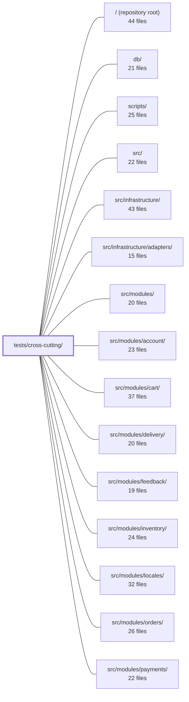

---
tags:
  - 2repo
  - 2repo/module
  - project/boilerplate-node-backend
type: module
module: tests/cross-cutting/
files: 28
updated: 2026-08-31T20:58:00.635379+00:00
---

# tests/cross-cutting/

## Purpose

Cross-cutting invariant tests that sweep the entire `src/modules/` tree (and selected infrastructure files) to enforce rules no single module can check on its own: naming uniqueness across modules, auth-guard completeness, serialization safety, contract-document consistency, and cross-repo alignment. Where per-module tests verify local behavior, this directory catches the *inter-module* and *app-wide* failure modes that only become visible when you look at the whole system at once.

## Key parts

- **Vocabulary & naming guards** — `analytics-events`, `audit-actions`, `metric-names`, `locale-namespaces`, `locale-parity`, `outbox-names`. Each asserts that a particular string vocabulary (event names, action names, metric names, locale keys, mail names) is unique, well-formed, and collision-free across every module simultaneously.
- **Contract & API-doc integrity** — `contract-aliases`, `contract-bundles`, `contract-error-declarations`, `contract-scalars`, `contract-search-parity`. Validate that the OpenAPI/AsyncAPI fragments, generated bundles, and orval-emitted constants stay mutually consistent and faithful to the authored source.
- **Security & auth invariants** — `authenticated-controllers`, `write-routes-are-guarded`, `credential-fields`, `search-regex`, `search.property`. Verify that auth middleware is actually mounted, credential-shaped fields never survive serialization, and public search input is safe against ReDoS and BSON-rejecting bytes.
- **Serialization & data integrity** — `serialize.property`, `seed-conformance`, `paginated-sort-is-total`. Property-based and structural checks that the wire-format transform, demo seed data, and pagination pipelines behave correctly for *any* input, not just the cases unit tests cover.
- **Architectural layering** — `side-effects-have-one-layer`, `process-snapshot`, `search-pagination`. Enforce that domain side effects are published from exactly one layer, process-metric reads are whitelisted, and pagination defaults are applied in the right place.
- **Cross-repo & CI alignment** — `ci-covers-the-gate`, `frontend-pairing`, `probes-are-wired`, `module-subscriptions`, `mail-copy`. Close gaps where a hand-maintained map, a CI workflow, or a paired frontend checkout could drift from this repo's actual module list.
- **Test-infra guard** — `coverage-thresholds`. Ensures Jest's `coverageThreshold` globs still resolve to at least one file, so the gate can't silently die.

## How it connects

- **`src/modules/` (all sub-modules)** — Nearly every test here discovers and sweeps files (`analytics.ts`, `audit.ts`, `metrics.ts`, `locales/en.json`, `emails.ts`, `probes.ts`, `routes.ts`, `metrics.ts`) inside each module directory. The tests do not import the modules; they read source text or resolved middleware stacks to avoid booting Mongoose or executing queries.
- **`src/infrastructure/`** — `serialize.property`, `search-regex`, and `search.property` target the shared helpers (`applySerialization`, `escapeRegex`, `normalizePagination`) that every module depends on.
- **`src/infrastructure/adapters/`** — Referenced indirectly via the contract and serialization tests that verify what the persistence adapter must produce.
- **`db/`** — `seed-conformance` loads `db/demo/demo-data.json` and validates it against the generated Zod schemas.
- **`scripts/`** — `contract-bundles` and `probes-are-wired` assert that committed bundles and the probe-registration map are in sync with what the build scripts produce.
- **Repository root (`.github/workflows/`, `jest.config.js`, `openapi.yaml`)** — `ci-covers-the-gate` cross-references the `npm run complete` chain against CI jobs; `coverage-thresholds` re-expands the Jest config's threshold globs; several contract tests parse the root `openapi.yaml`.
- **`tests/`, `tests/support/`, `tests/unit/`** — This directory sits as a sibling to `tests/unit/` and `tests/support/`. It does not depend on the unit-test fixtures; instead it operates at a higher level of abstraction (whole-tree sweeps, cross-repo maps, source-text parsing).

## Where to start

1. **`write-routes-are-guarded.test.ts`** — Short, concrete, and immediately illustrates the "sweep every module, assert one app-wide rule" pattern that defines this directory. The `WRITE_EXCEPTIONS` table shows how explicit opt-outs work.
2. **`serialize.property.test.ts`** — Introduces the property-based testing approach (fast-check) used for the most safety-critical invariant (wire-format correctness) and demonstrates why a cross-cutting test is needed where per-module tests only cover a handful of shapes.

## Connected modules

[[boilerplate-node-backend_ROOT|/ (repository root)]] · [[boilerplate-node-backend_db|db/]] · [[boilerplate-node-backend_scripts|scripts/]] · [[boilerplate-node-backend_src|src/]] · [[boilerplate-node-backend_src_infrastructure|src/infrastructure/]] · [[boilerplate-node-backend_src_infrastructure_adapters|src/infrastructure/adapters/]] · [[boilerplate-node-backend_src_modules|src/modules/]] · [[boilerplate-node-backend_src_modules_account|src/modules/account/]] · [[boilerplate-node-backend_src_modules_cart|src/modules/cart/]] · [[boilerplate-node-backend_src_modules_delivery|src/modules/delivery/]] · [[boilerplate-node-backend_src_modules_feedback|src/modules/feedback/]] · [[boilerplate-node-backend_src_modules_inventory|src/modules/inventory/]] · [[boilerplate-node-backend_src_modules_locales|src/modules/locales/]] · [[boilerplate-node-backend_src_modules_orders|src/modules/orders/]] · [[boilerplate-node-backend_src_modules_payments|src/modules/payments/]] · … and 7 more

## Files
- `tests/cross-cutting/analytics-events.test.ts` — Cross-cutting guard that sweeps every `src/modules/<name>/analytics.ts` to enforce a single, collision-free analytics event vocabulary. Because all events are emitted to one Umami website and the paired frontend emits no custom events, this sweep is the sole defense against duplicate or malformed event names that would produce indistinguishable rows. It is the twin of `audit-actions.test.ts`.
- `tests/cross-cutting/audit-actions.test.ts` — A structural, cross-cutting test that enforces invariants on the audit-action vocabulary across every module under `src/modules/` simultaneously. Rather than hard-coding a single list of every allowed action string (which would re-introduce the coupling the module split eliminates), it discovers each module's `audit.ts` at runtime and asserts four properties: uniqueness of action strings across modules, adherence to the dotted lower-snake-case naming convention, that no module silently goes un-audited, and that the explicit non-auditing exemption list stays accurate.
- `tests/cross-cutting/authenticated-controllers.test.ts` — Cross-cutting invariant test: every controller handler that calls `authContextOf()` must be mounted on a route whose middleware stack includes `isAuth`. It closes the gap that no single type can cover — a controller can be written to read the caller while `routes.ts` accidentally leaves the route public — by inspecting the *resolved* Express middleware stack rather than re-parsing route source text.
- `tests/cross-cutting/ci-covers-the-gate.test.ts` — Guard test that asserts every check in the `npm run complete` chain (the local pre-commit gate) has a corresponding job in `.github/workflows/`. It exists because the "what must pass" rule is defined in two places and had drifted: five checks reached the local gate but had no CI job, so `--no-verify`, missing husky, or fork PRs could bypass them while CI stayed green.
- `tests/cross-cutting/contract-aliases.test.ts` — Validates the `x-alias-of` annotation in `openapi.yaml` to enforce that aliased operations (e.g. `DELETE /users` vs `DELETE /users/{id}`) are true alternates of a single canonical operation. It guarantees the annotation points to a real, non-aliased operation and that the alias and canonical return the same success status and response schema — the invariants a caller depends on when treating them as interchangeable.
- `tests/cross-cutting/contract-bundles.test.ts` — Cross-cutting tests that verify every contract bundle (OpenAPI, AsyncAPI, API client collections) is a faithful product of its authored source fragments. It guards two distinct invariants: committed bundles must equal a fresh build (byte-for-byte, enforced by `check:contracts-bundle --check` and asserted here only for structural properties), and generated bundles must be reproducible in memory with correct content coverage.
- `tests/cross-cutting/contract-error-declarations.test.ts` — Cross-cutting contract test that asserts every OpenAPI operation accepting an id parameter declares a `422` response in its module's `openapi.yaml` fragment. It exists because the shared error interpreter (`databaseErrorInterpreter`) can return `422 Invalid identifier` for any malformed id on any such route, so the contract must declare that status consistently or the generated client and the PHP twin's response-schema suite will break. It is written as a test rather than a linter because the contract fragments are a shared artifact that must stay byte-identical across three repositories.
- `tests/cross-cutting/contract-scalars.test.ts` — Guarantees that the scalar bounds declared once in `infrastructure` (page-size maximum, hard-delete default) still match every per-operation constant that orval emits from the OpenAPI contract. Because orval duplicates a shared component into one constant per endpoint, `infrastructure` cannot import a single "the" constant without coupling to a domain name; this test replaces that import-time guarantee with a runtime one that sweeps the entire generated module.
- `tests/cross-cutting/contract-search-parity.test.ts` — Verifies that the two spellings of a search endpoint (`GET /x?text=…` and `POST /x/search {text}`) declare **identical validation constraints** on every shared filter. It exists to close a gap left by `contract-aliases.test.ts`, which checks that the two routes *answer* alike but says nothing about whether they *ask* alike. The original drift it prevents: one spelling documents a field as an open `type: string` while the other constrains it to a four-value `enum`.
- `tests/cross-cutting/coverage-thresholds.test.ts` — Guards against a silent failure mode in `jest.config.js`: a `coverageThreshold` key that matches zero files is ignored by Jest (run stays green, gate is dead). This test re-expands every threshold key with the same `glob` instance the CoverageReporter uses and fails the suite if any key resolves to nothing measurable. It exists because three keys detached simultaneously during a directory restructure and 203 of 275 source files sat under no floor before anyone noticed.
- `tests/cross-cutting/credential-fields.test.ts` — Cross-cutting sweep that asserts no credential-shaped field (password, token, secret, salt, apikey, credential, privatekey, otp, etc.) survives `toJSON()` serialization on any registered Mongoose model. It exists because the only line of defence against accidental exposure is the `omit` list passed to `buildTransform`; adding a field to a schema is a one-line edit that nothing mechanically links to that list.
- `tests/cross-cutting/frontend-pairing.test.ts` — Cross-repo pairing test that verifies the hand-maintained `FRONTEND_PAIRING` map stays consistent with both this repository's enabled modules **and** the actual module folders in the paired `boilerplate-vue-frontend` checkout. It exists because a simple name-matcher gets the mapping wrong (e.g. `audit-logs` → `admin`) and because drift in either direction — a renamed, added, or removed module — is otherwise invisible to either repo's own test suite.
- `tests/cross-cutting/locale-namespaces.test.ts` — Guards the locale namespace boundaries across modules. Because `infrastructure` deep-merges every module's `locales/en.json` onto the shared dictionary at boot (last-writer-wins), a key collision or accidental shadowing produces silently wrong copy rather than an error. This test catches both failure modes and enforces that each module's keys live under its own namespace prefix.
- `tests/cross-cutting/locale-parity.test.ts` — Asserts that every supported locale declares exactly the same set of leaf keys across the **merged** (shared + all module) dictionaries. A missing translation is otherwise invisible at build time — each JSON file is valid in isolation, and the runtime defect is simply the raw key string printed to a user in the wrong language. This file is the single, domain-agnostic guard that catches that gap.
- `tests/cross-cutting/mail-copy.test.ts` — Statically cross-checks that every EJS mail template interpolates only variables its corresponding email builder actually supplies. It reads template files as text (no EJS render, no framework boot) and scans `src/modules/*/emails.ts` source for `template:` / `data:` pairs, then asserts every required variable has a matching key. It exists because the failure mode it guards is silent: a missing key means the template renders `<%= undefined %>` or throws at send time, not at review time.
- `tests/cross-cutting/metric-names.test.ts` — Cross-cutting test that guarantees metric name consistency between three places that must agree: module `metrics.ts` declarations, the observability overview controller (which reads names as raw strings to avoid importing domain modules), and external Prometheus/Grafana dashboards. It works by parsing **source text** rather than importing modules, because importing would boot Mongoose and execute aggregation queries. Its job is to catch the silent failure mode where a renamed counter still compiles, lints, and passes unit tests but quietly disappears from the overview endpoint and goes flat on dashboards.
- `tests/cross-cutting/module-subscriptions.test.ts` — Verifies that every module declaring a `subscribe` hook in its manifest actually registers at least one real event handler, and that no module registers the same event twice. Without this test, an emptied `subscribe` body is invisible: the module still registers routes and passes every other cross-cutting check, but silently stops reacting to the rest of the system.
- `tests/cross-cutting/outbox-names.test.ts` — Validates that every outbox mail name published by `src/modules/*/emails.ts` is a stable, cross-repo identifier: extension-free, kebab-case, two-segment, collision-free, resolvable to a real template file, and matching the exact set the paired PHP/Laravel backend also publishes. The names are shared with the frontend's e2e specs (which run against both backends), so any backend-specific detail in a name breaks the other side.
- `tests/cross-cutting/paginated-sort-is-total.test.ts` — Cross-cutting invariant test that verifies every aggregation pipeline in `src/` which pages results (uses `$skip`) also sorts with a **total** ordering — i.e. its `$sort` spec's last key is unique (`_id`, `id`, or the known `DEFAULT_SORT` constant). Because a count query and a page query are separate round-trips, a non-total sort can duplicate or drop documents at page boundaries. The check is purely syntactic: it greps source for `$sort` stages rather than executing queries, so it also covers pipelines that don't yet exist in tests.
- `tests/cross-cutting/probes-are-wired.test.ts` — Guard test that asserts a one-directional completeness invariant: every `src/modules/<name>/probes.ts` that exists on disk is listed in `PROBED_SECTIONS` in the client-collections bundle script. This catches the silent failure mode where a new module writes a valid `probes.ts` but forgets to add its name to the hand-maintained map — a case the static import (which only catches *deletion*) cannot surface.
- `tests/cross-cutting/process-snapshot.test.ts` — A cross-cutting invariant test that enforces two architectural rules about process metrics: (1) only a whitelisted set of files may call `process.memoryUsage()` / `process.uptime()` directly, and (2) the `ProcessMemory` schema declared in `openapi.yaml` and `asyncapi.yaml` must stay structurally identical (same fields, same order, both closed). It exists because a prior refactor consolidated three divergent reads into one shared reader, but nothing mechanically prevents a fourth direct read or a silent schema drift between the two API documents.
- `tests/cross-cutting/search-pagination.test.ts` — Cross-cutting test suite for `normalizePagination`, the single authority on pagination **defaults** for every search query. It verifies the coercion, defaulting, and env-fallback behavior that runs after the request layer and before the query is built, and it explicitly documents what the function does *not* do (i.e., enforce bounds—that belongs to the HTTP schema layer).
- `tests/cross-cutting/search-regex.test.ts` — Verifies that user-supplied search text is safe to pass into MongoDB `$regex` on the public, unauthenticated endpoints (`POST /products/search`, `GET /products?text=`). Covers two failure modes the module under test must neutralise: catastrophic-backtracking ReDoS via unescaped metacharacters, and server-500s from bytes (NUL, control chars) that MongoDB's C-string pattern compiler rejects.
- `tests/cross-cutting/search.property.test.ts` — Property-based tests (fast-check) for the security-critical helpers in `src/infrastructure/persistence/search.ts`. `escapeRegex` is treated as a denial-of-service control against catastrophic MongoDB backtracking from public endpoints; `normalizePagination` must never emit a skip value that the Mongo driver rejects. Because both are claims about *every* possible input, the file uses generated arbitraries rather than fixed tables.
- `tests/cross-cutting/seed-conformance.test.ts` — Validates that `db/demo/demo-data.json` conforms to the generated Zod schemas (derived from `openapi.yaml`). It is the backend mirror of `tests/cross-cutting/seedConformance.spec.ts` in the paired frontend repo, closing the drift direction where a field rename in `openapi.yaml` was previously silent—seeders kept writing the old name and nothing compared the output to the contract.
- `tests/cross-cutting/serialize.property.test.ts` — Property-based tests (via `fast-check`) that verify the universal guarantees of `applySerialization` — the single point where a stored document becomes a wire payload. It proves the `_id`→`id` rename, `__v` deletion, and `omit` removal hold for *any* input shape, not just the handful the models define. This matters because 95 of `openapi.yaml`'s schemas use `additionalProperties: false`, and the transform must handle both the `toJSON` path (Mongoose pre-strips) and the `.lean()`/`.aggregate()` path (raw BSON, no Mongoose help).
- `tests/cross-cutting/side-effects-have-one-layer.test.ts` — Enforces the architectural rule that the four domain side effects (`enqueueEmail`, `emitAuditEvent`, `emitAnalyticsEvent`, `emitDomainEvent`) are each published from exactly one layer (the service layer), with any departure explicitly justified in a named allowlist. It exists because a per-file lint rule cannot see the *set* of files calling the same function; this test sweeps the whole module tree and asserts the set conforms to a declared intention.
- `tests/cross-cutting/write-routes-are-guarded.test.ts` — Enforces one app-wide invariant in a single place: every write route (POST/PUT/PATCH/DELETE) across all routed modules is guarded by `isAuth` then `isAdmin`, unless the route appears in the `WRITE_EXCEPTIONS` table with an explicit reason. This replaces the weaker pattern of repeating "my writes are admin-guarded" inside each module's own `routes.test.ts`, which would leave a thirteenth module with no test suite completely unguarded.

---
[[boilerplate-node-backend_INDEX|← boilerplate-node-backend index]]
