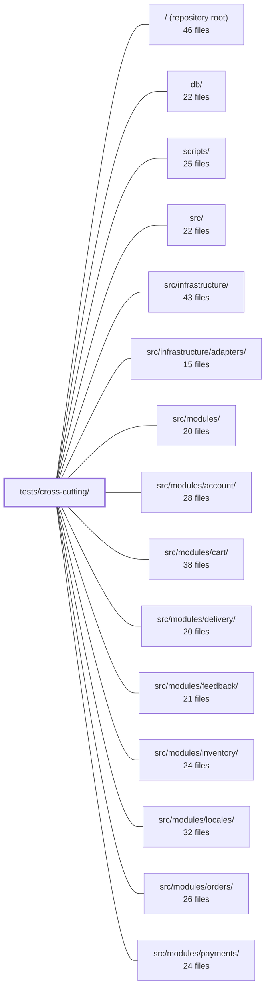

---
tags:
  - 2repo
  - 2repo/module
  - project/boilerplate-node-backend
type: module
module: tests/cross-cutting/
files: 30
updated: 2026-09-02T18:36:41.735616+00:00
---

# tests/cross-cutting/

## Purpose

A collection of structural, cross-cutting guard tests that enforce app-wide invariants no single module can verify about itself: naming-namespace uniqueness, contract fidelity across generated artifacts, authentication and authorization coverage, serialization safety, and architectural layering rules. Each test reads or inspects files across `src/modules/`, `src/infrastructure/`, and committed artifacts to catch the silent drift that per-module unit tests cannot see.

## Key parts

- **Contract & API fidelity** — `contract-aliases`, `contract-bundles`, `contract-error-declarations`, `contract-scalars`, `contract-search-parity`, and `seed-conformance` collectively verify that `openapi.yaml` fragments, generated client bundles, Zod schemas, and the demo dataset all stay mutually consistent.
- **Security & authorization** — `write-routes-are-guarded`, `step-up-auth-routes`, `authenticated-controllers`, `credential-fields`, `search-regex`, and `search.property` enforce that write routes carry auth middleware, sensitive routes carry step-up guards, credentials never leak through `toJSON`, and public search inputs are safe against ReDoS and malformed bytes.
- **Vocabulary & naming invariants** — `analytics-events`, `audit-actions`, `audit-actions-registered`, `locale-namespaces`, `locale-parity`, `metric-names`, and `outbox-names` sweep every module's event/action/metric/locale/email names to guarantee collision-free, convention-conforming identifiers across the app.
- **Architectural layering** — `side-effects-have-one-layer`, `module-subscriptions`, `probes-are-wired`, and `process-snapshot` enforce that side effects originate in one layer, subscription manifests are non-empty, probe files are registered, and process-metric reads stay consolidated.
- **CI & test-infra guardrails** — `ci-covers-the-gate` and `coverage-thresholds` ensure the local pre-commit gate and Jest coverage floors are actually live and mirrored in CI.
- **Serialization & pagination** — `serialize.property` (property-based, fast-check), `search-pagination`, and `paginated-sort-is-total` verify the wire-transform contract, pagination coercion, and total-ordering guarantees for paginated aggregation pipelines.
- **Cross-repo pairing** — `frontend-pairing` and `mail-copy` validate the hand-maintained mapping to the Vue frontend and the EJS-template variable contract, respectively.

## How it connects

- **`src/modules/`** — Nearly every test here discovers and inspects per-module files (`analytics.ts`, `audit.ts`, `routes.ts`, `emails.ts`, `metrics.ts`, `locales/en.json`, `probes.ts`) to assert global invariants. A new module added under `src/modules/` is automatically subject to all sweeps.
- **`src/infrastructure/`** — `contract-scalars` validates constants generated from `infrastructure/http/schemas.ts`; `search-regex`, `search.property`, and `search-pagination` exercise `infrastructure/persistence/search.ts`; `serialize.property` targets the universal `applySerialization` helper.
- **`src/modules/locales/`** and other locale-bearing modules — `locale-namespaces` and `locale-parity` read every module's `locales/en.json` to detect key collisions and missing translations in the merged dictionary.
- **`db/`** — `seed-conformance` validates `db/demo/demo-data.json` against the OpenAPI-generated Zod schemas.
- **`scripts/`** — `probes-are-wired` checks the hand-maintained `PROBED_SECTIONS` list in the client-collections bundle script; `contract-bundles` verifies committed bundles match a fresh build.
- **Repository root (`/`)** — `ci-covers-the-gate` cross-references `npm run complete` chain entries with `.github/workflows/` jobs; `coverage-thresholds` re-expands the globs in `jest.config.js`.
- **`tests/`** and **`tests/support/`** — This module lives alongside and leverages shared test helpers from `tests/support/`; it is the sibling of `tests/unit/infrastructure/` which covers infrastructure in isolation, while this directory covers the *interaction* between modules and infrastructure.

## Where to start

1. **`audit-actions.test.ts`** — It is the most representative example of the directory's approach: discovering module files at runtime, asserting a global invariant (uniqueness, naming convention, no silent gaps), and explicitly documenting *why* a per-module test cannot do the job. Reading it gives the mental model for the rest.
2. **`contract-bundles.test.ts`** — It ties together the OpenAPI source, the build pipeline in `scripts/`, and the committed generated artifacts, showing how this module closes the "three repositories must stay byte-identical" gap that no single repo's own suite can see.

## Connected modules

[[boilerplate-node-backend_ROOT|/ (repository root)]] · [[boilerplate-node-backend_db|db/]] · [[boilerplate-node-backend_scripts|scripts/]] · [[boilerplate-node-backend_src|src/]] · [[boilerplate-node-backend_src_infrastructure|src/infrastructure/]] · [[boilerplate-node-backend_src_infrastructure_adapters|src/infrastructure/adapters/]] · [[boilerplate-node-backend_src_modules|src/modules/]] · [[boilerplate-node-backend_src_modules_account|src/modules/account/]] · [[boilerplate-node-backend_src_modules_cart|src/modules/cart/]] · [[boilerplate-node-backend_src_modules_delivery|src/modules/delivery/]] · [[boilerplate-node-backend_src_modules_feedback|src/modules/feedback/]] · [[boilerplate-node-backend_src_modules_inventory|src/modules/inventory/]] · [[boilerplate-node-backend_src_modules_locales|src/modules/locales/]] · [[boilerplate-node-backend_src_modules_orders|src/modules/orders/]] · [[boilerplate-node-backend_src_modules_payments|src/modules/payments/]] · … and 6 more

## Files
- `tests/cross-cutting/analytics-events.test.ts` — Cross-cutting guard that sweeps every `src/modules/<name>/analytics.ts` to enforce a single, collision-free analytics event vocabulary. Because all events are emitted to one Umami website and the paired frontend emits no custom events, this sweep is the sole defense against duplicate or malformed event names that would produce indistinguishable rows. It is the twin of `audit-actions.test.ts`.
- `tests/cross-cutting/audit-actions-registered.test.ts` — Compile-time (and minimal runtime) verification that every auditing module's `declare module` augmentation actually contributes its action constants to the app-wide `AuditAction` union. If a module's augmentation is removed, this file fails to type-check — catching the regression where `emitAuditEvent` would silently reject that module's actions at call sites rather than at the augmentation site.
- `tests/cross-cutting/audit-actions.test.ts` — A structural, cross-cutting test that enforces invariants on the audit-action vocabulary across every module under `src/modules/` simultaneously. Rather than hard-coding a single list of every allowed action string (which would re-introduce the coupling the module split eliminates), it discovers each module's `audit.ts` at runtime and asserts four properties: uniqueness of action strings across modules, adherence to the dotted lower-snake-case naming convention, that no module silently goes un-audited, and that the explicit non-auditing exemption list stays accurate.
- `tests/cross-cutting/authenticated-controllers.test.ts` — Cross-cutting invariant test: every controller handler that calls `authContextOf()` must be mounted on a route whose middleware stack includes `isAuth`. It closes the gap that no single type can cover — a controller can be written to read the caller while `routes.ts` accidentally leaves the route public — by inspecting the *resolved* Express middleware stack rather than re-parsing route source text.
- `tests/cross-cutting/ci-covers-the-gate.test.ts` — Guard test that asserts every check in the `npm run complete` chain (the local pre-commit gate) has a corresponding job in `.github/workflows/`. It exists because the "what must pass" rule is defined in two places and had drifted: five checks reached the local gate but had no CI job, so `--no-verify`, missing husky, or fork PRs could bypass them while CI stayed green.
- `tests/cross-cutting/contract-aliases.test.ts` — Validates the `x-alias-of` annotation in `openapi.yaml` to enforce that aliased operations (e.g. `DELETE /users` vs `DELETE /users/{id}`) are true alternates of a single canonical operation. It guarantees the annotation points to a real, non-aliased operation and that the alias and canonical return the same success status and response schema — the invariants a caller depends on when treating them as interchangeable.
- `tests/cross-cutting/contract-bundles.test.ts` — Cross-cutting tests that verify every contract bundle (OpenAPI, AsyncAPI, API client collections) is a faithful product of its authored source fragments. It guards two distinct invariants: committed bundles must equal a fresh build (byte-for-byte, enforced by `check:contracts-bundle --check` and asserted here only for structural properties), and generated bundles must be reproducible in memory with correct content coverage.
- `tests/cross-cutting/contract-error-declarations.test.ts` — Cross-cutting contract test that asserts every OpenAPI operation accepting an id parameter declares a `422` response in its module's `openapi.yaml` fragment. It exists because the shared error interpreter (`databaseErrorInterpreter`) can return `422 Invalid identifier` for any malformed id on any such route, so the contract must declare that status consistently or the generated client and the PHP twin's response-schema suite will break. It is written as a test rather than a linter because the contract fragments are a shared artifact that must stay byte-identical across three repositories.
- `tests/cross-cutting/contract-scalars.test.ts` — Guarantees that the shared scalar bounds declared in `infrastructure/http/schemas.ts` stay in lockstep with every per-operation constant that orval generates from `openapi.yaml`. Because orval duplicates a shared component into one constant per endpoint (e.g. forty identical `PageSizeMax` values), infrastructure cannot simply import "the" constant; this test closes that gap so a contract change fails loudly here instead of silently returning 422 for a legal value.
- `tests/cross-cutting/contract-search-parity.test.ts` — Verifies that the two spellings of a search endpoint (`GET /x?text=…` and `POST /x/search {text}`) declare **identical validation constraints** on every shared filter. It exists to close a gap left by `contract-aliases.test.ts`, which checks that the two routes *answer* alike but says nothing about whether they *ask* alike. The original drift it prevents: one spelling documents a field as an open `type: string` while the other constrains it to a four-value `enum`.
- `tests/cross-cutting/coverage-thresholds.test.ts` — Guards against a silent failure mode in `jest.config.js`: a `coverageThreshold` key that matches zero files is ignored by Jest (run stays green, gate is dead). This test re-expands every threshold key with the same `glob` instance the CoverageReporter uses and fails the suite if any key resolves to nothing measurable. It exists because three keys detached simultaneously during a directory restructure and 203 of 275 source files sat under no floor before anyone noticed.
- `tests/cross-cutting/credential-fields.test.ts` — Cross-cutting sweep that asserts no credential-shaped field (password, token, secret, salt, apikey, credential, privatekey, otp, etc.) survives `toJSON()` serialization on any registered Mongoose model. It exists because the only line of defence against accidental exposure is the `omit` list passed to `buildTransform`; adding a field to a schema is a one-line edit that nothing mechanically links to that list.
- `tests/cross-cutting/frontend-pairing.test.ts` — Cross-repo pairing test that verifies the hand-maintained `FRONTEND_PAIRING` map stays consistent with both this repository's enabled modules **and** the actual module folders in the paired `boilerplate-vue-frontend` checkout. It exists because a simple name-matcher gets the mapping wrong (e.g. `audit-logs` → `admin`) and because drift in either direction — a renamed, added, or removed module — is otherwise invisible to either repo's own test suite.
- `tests/cross-cutting/locale-namespaces.test.ts` — Guards the locale namespace boundaries across modules. Because `infrastructure` deep-merges every module's `locales/en.json` onto the shared dictionary at boot (last-writer-wins), a key collision or accidental shadowing produces silently wrong copy rather than an error. This test catches both failure modes and enforces that each module's keys live under its own namespace prefix.
- `tests/cross-cutting/locale-parity.test.ts` — Asserts that every supported locale declares exactly the same set of leaf keys across the **merged** (shared + all module) dictionaries. A missing translation is otherwise invisible at build time — each JSON file is valid in isolation, and the runtime defect is simply the raw key string printed to a user in the wrong language. This file is the single, domain-agnostic guard that catches that gap.
- `tests/cross-cutting/mail-copy.test.ts` — Statically cross-checks that every EJS mail template interpolates only variables its corresponding email builder actually supplies. It reads template files as text (no EJS render, no framework boot) and scans `src/modules/*/emails.ts` source for `template:` / `data:` pairs, then asserts every required variable has a matching key. It exists because the failure mode it guards is silent: a missing key means the template renders `<%= undefined %>` or throws at send time, not at review time.
- `tests/cross-cutting/metric-names.test.ts` — Cross-cutting test that guarantees metric name consistency between three places that must agree: module `metrics.ts` declarations, the observability overview controller (which reads names as raw strings to avoid importing domain modules), and external Prometheus/Grafana dashboards. It works by parsing **source text** rather than importing modules, because importing would boot Mongoose and execute aggregation queries. Its job is to catch the silent failure mode where a renamed counter still compiles, lints, and passes unit tests but quietly disappears from the overview endpoint and goes flat on dashboards.
- `tests/cross-cutting/module-subscriptions.test.ts` — Verifies that every module declaring a `subscribe` hook in its manifest actually registers at least one real event handler, and that no module registers the same event twice. Without this test, an emptied `subscribe` body is invisible: the module still registers routes and passes every other cross-cutting check, but silently stops reacting to the rest of the system.
- `tests/cross-cutting/outbox-names.test.ts` — Static-analysis test that validates the `template:` names published by every module's `emails.ts`. These names are shared identifiers consumed by a paired frontend's e2e specs (which run against both this backend and a PHP/Blade twin), so they must be extension-free, collision-free, and resolvable to a real template file. The test reads source text rather than importing modules, keeping it independent of runtime wiring.
- `tests/cross-cutting/paginated-sort-is-total.test.ts` — Cross-cutting invariant test that verifies every aggregation pipeline in `src/` which pages results (uses `$skip`) also sorts with a **total** ordering — i.e. its `$sort` spec's last key is unique (`_id`, `id`, or the known `DEFAULT_SORT` constant). Because a count query and a page query are separate round-trips, a non-total sort can duplicate or drop documents at page boundaries. The check is purely syntactic: it greps source for `$sort` stages rather than executing queries, so it also covers pipelines that don't yet exist in tests.
- `tests/cross-cutting/probes-are-wired.test.ts` — Guard test that asserts a one-directional completeness invariant: every `src/modules/<name>/probes.ts` that exists on disk is listed in `PROBED_SECTIONS` in the client-collections bundle script. This catches the silent failure mode where a new module writes a valid `probes.ts` but forgets to add its name to the hand-maintained map — a case the static import (which only catches *deletion*) cannot surface.
- `tests/cross-cutting/process-snapshot.test.ts` — A cross-cutting invariant test that enforces two architectural rules about process metrics: (1) only a whitelisted set of files may call `process.memoryUsage()` / `process.uptime()` directly, and (2) the `ProcessMemory` schema declared in `openapi.yaml` and `asyncapi.yaml` must stay structurally identical (same fields, same order, both closed). It exists because a prior refactor consolidated three divergent reads into one shared reader, but nothing mechanically prevents a fourth direct read or a silent schema drift between the two API documents.
- `tests/cross-cutting/search-pagination.test.ts` — Cross-cutting test suite for `normalizePagination`, the single authority on pagination **defaults** for every search query. It verifies the coercion, defaulting, and env-fallback behavior that runs after the request layer and before the query is built, and it explicitly documents what the function does *not* do (i.e., enforce bounds—that belongs to the HTTP schema layer).
- `tests/cross-cutting/search-regex.test.ts` — Verifies that user-supplied search text is safe to pass into MongoDB `$regex` on the public, unauthenticated endpoints (`POST /products/search`, `GET /products?text=`). Covers two failure modes the module under test must neutralise: catastrophic-backtracking ReDoS via unescaped metacharacters, and server-500s from bytes (NUL, control chars) that MongoDB's C-string pattern compiler rejects.
- `tests/cross-cutting/search.property.test.ts` — Property-based tests (fast-check) for the security-critical helpers in `src/infrastructure/persistence/search.ts`. `escapeRegex` is treated as a denial-of-service control against catastrophic MongoDB backtracking from public endpoints; `normalizePagination` must never emit a skip value that the Mongo driver rejects. Because both are claims about *every* possible input, the file uses generated arbitraries rather than fixed tables.
- `tests/cross-cutting/seed-conformance.test.ts` — Validates that the exported demo dataset (`db/demo/demo-data.json`) still conforms to the OpenAPI-generated Zod schemas. It exists to close a drift gap: renaming a field in `openapi.yaml` is silent for the seeders (no compile error), so without this check the dataset could silently diverge from the contract. It is a deliberate mirror of the paired frontend's `seedConformance.spec.ts`; a companion job (`check:spec-identity`) only compares the two file copies to each other, not either to `openapi.yaml`.
- `tests/cross-cutting/serialize.property.test.ts` — Property-based tests (via `fast-check`) that verify the universal guarantees of `applySerialization` — the single point where a stored document becomes a wire payload. It proves the `_id`→`id` rename, `__v` deletion, and `omit` removal hold for *any* input shape, not just the handful the models define. This matters because 95 of `openapi.yaml`'s schemas use `additionalProperties: false`, and the transform must handle both the `toJSON` path (Mongoose pre-strips) and the `.lean()`/`.aggregate()` path (raw BSON, no Mongoose help).
- `tests/cross-cutting/side-effects-have-one-layer.test.ts` — A structural (cross-cutting) test that enforces a single architectural invariant across all modules: each of the four tracked side effects (`enqueueEmail`, `emitAuditEvent`, `emitAnalyticsEvent`, `emitDomainEvent`) must be called from exactly one designated layer (the service layer), unless an explicit, sentence-length justification is recorded. It exists because no per-file lint rule can see the *set* of call sites across fourteen+ files, so a test that reads the tree is the only enforcement mechanism.
- `tests/cross-cutting/step-up-auth-routes.test.ts` — Guarantees that every money or identity route across the account, cart, and payments modules carries a `requireFreshAuth` or `requireFreshAuthWhen` guard at the correct tier (critical or sensitive), and that no route carries the guard without being documented in the `STEP_UP_ROUTES` table. The check runs in both directions (stale-entry and silent-omission) so the table stays the single source of truth for which routes are gated.
- `tests/cross-cutting/write-routes-are-guarded.test.ts` — Enforces a single app-wide invariant: **every write route (POST/PUT/PATCH/DELETE) must be guarded by `isAuth` then `isAdmin`** unless explicitly listed in `WRITE_EXCEPTIONS` with a documented reason. It exists so that a 13th module added to `src/modules/` inherits the guarantee automatically rather than needing to restate it in its own per-module `routes.test.ts`.

---
[[boilerplate-node-backend_INDEX|← boilerplate-node-backend index]]
