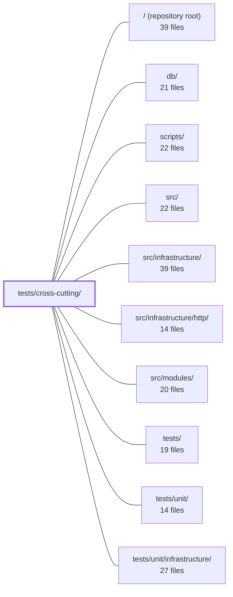

---
tags:
  - 2repo
  - 2repo/module
  - project/boilerplate-node-backend
type: module
module: tests/cross-cutting/
files: 38
updated: 2026-08-28T12:01:55.288055+00:00
---

# tests/cross-cutting/

## Purpose

`tests/cross-cutting/` is a suite of structural and invariant tests that validate properties spanning the entire codebase simultaneously. Individual module tests can only see their own boundary; these tests close the gaps by asserting global rules—naming conventions, contract coherence, architectural layering, cross-repo consistency, and security invariants—that no single-file test or type check can express on its own.

## Key parts

- **Contract & API coherence** — `contract-aliases`, `contract-bundles`, `contract-error-declarations`, `contract-scalars`, `contract-search-parity`, and `seed-conformance` collectively keep `openapi.yaml` fragments, AsyncAPI documents, the generated client, the demo seed, and the paired frontend contract mutually consistent.
- **Module structure & naming** — `module-file-shapes`, `module-shape`, `module-subscriptions`, `controller-naming`, `published-language`, `published-repositories`, `service-namespaces`, `subdomain-discipline`, and `audit-actions` enforce the closed vocabulary of file types, barrel exports, service namespaces, DDD subdomain labels, and the audit-action grammar across every module.
- **Security & serialization guards** — `authenticated-controllers`, `credential-fields`, `search-regex`, `search.property`, `serialize.property`, and `paginated-sort-is-total` guard against unauthenticated handler exposure, secret leakage in `toJSON()`, ReDoS in MongoDB `$regex`, reserved-key leakage in serialization, and non-total page sorts.
- **Cross-repo & twin consistency** — `frontend-pairing`, `outbox-names`, `mail-copy`, and `generated-type-shadowing` keep the backend in lockstep with the Vue frontend checkout, the PHP Laravel twin, and the Orval-generated type bundle.
- **Architectural boundaries** — `process-snapshot`, `metric-names`, `probes-are-wired`, `tier-walls`, `side-effects-have-one-layer`, and `unit-layer-is-framework-free` enforce single-writer rules for side effects, tier isolation, process-metric access, and the framework-free guarantee of the unit test layer.
- **Locale & documentation integrity** — `locale-namespaces`, `locale-parity`, and `docs-match-the-tree` prevent key collisions in the merged i18n dictionary, missing translations, and stale citations in `docs/theory/`.
- **Tooling & CI hygiene** — `ci-covers-the-gate`, `coverage-thresholds`, and `context-map` verify that the local `npm run complete` gate and the GitHub Actions workflow cover the same checks, that Jest coverage thresholds actually match files, and that the `dependsOn` manifest matches real imports.
- **Search & pagination behavior** — `search-pagination` unit-tests the `normalizePagination` authority for defaults and coercion.

## How it connects

- **`src/modules/`** is the primary scan target: nearly every test here iterates over `src/modules/*/` to read controllers, services, emails, probes, locales, manifests, and barrels.
- **`src/infrastructure/`** (and **`src/infrastructure/http/`**) provides the shared constants, locale-merging logic, search helpers, auth middleware, and route definitions that the security and contract tests validate.
- **`db/`** supplies `demo/demo-data.json`, which `seed-conformance` checks against the Zod schemas derived from `openapi.yaml`.
- **`scripts/`** contains the client-collections bundle script whose `PROBED_SECTIONS` map is verified by `probes-are-wired`.
- **`/` (repository root)** — `ci-covers-the-gate` reads `.github/workflows/` and `package.json`; `coverage-thresholds` reads `jest.config.js`.
- **`tests/unit/`** and **`tests/unit/infrastructure/`** are constrained by `unit-layer-is-framework-free`, which scans those directories to forbid database or HTTP imports.

## Where to start

1. **`module-shape.test.ts`** — It encodes the highest-level structural contract (every folder is registered, every registration maps to a folder, controllers co-occur with a base path). Reading it first gives you the mental model of what a "module" is supposed to look like, which most other tests then refine.
2. **`contract-bundles.test.ts`** — Once you understand module shape, this file shows how the contract artifacts (OpenAPI, AsyncAPI, generated bundles) are assembled and where the boundaries between full and public subsets are enforced. It anchors the "shared artifact" mental model that many other contract tests build on.

## Connected modules

[[boilerplate-node-backend_ROOT|/ (repository root)]] · [[boilerplate-node-backend_db|db/]] · [[boilerplate-node-backend_scripts|scripts/]] · [[boilerplate-node-backend_src|src/]] · [[boilerplate-node-backend_src_infrastructure|src/infrastructure/]] · [[boilerplate-node-backend_src_infrastructure_http|src/infrastructure/http/]] · [[boilerplate-node-backend_src_modules|src/modules/]] · [[boilerplate-node-backend_tests|tests/]] · [[boilerplate-node-backend_tests_unit|tests/unit/]] · [[boilerplate-node-backend_tests_unit_infrastructure|tests/unit/infrastructure/]]

## Files
- `tests/cross-cutting/audit-actions.test.ts` — A structural, cross-cutting test that enforces invariants on the audit-action vocabulary across every module under `src/modules/` simultaneously. Rather than hard-coding a single list of every allowed action string (which would re-introduce the coupling the module split eliminates), it discovers each module's `audit.ts` at runtime and asserts four properties: uniqueness of action strings across modules, adherence to the dotted lower-snake-case naming convention, that no module silently goes un-audited, and that the explicit non-auditing exemption list stays accurate.
- `tests/cross-cutting/authenticated-controllers.test.ts` — A static-analysis guard test that verifies no controller handler using the `authContextOf` accessor is mounted on a route lacking `isAuth` protection. It exists because TypeScript cannot express "this route is authenticated" — that knowledge lives in `routes.ts` routing order, and a misplaced `router.use(isAuth)` (e.g., mid-file) would otherwise let a public route silently call `authContextOf` and crash at runtime with `undefined.id`.
- `tests/cross-cutting/ci-covers-the-gate.test.ts` — Guard test that asserts every check in the `npm run complete` chain (the local pre-commit gate) has a corresponding job in `.github/workflows/`. It exists because the "what must pass" rule is defined in two places and had drifted: five checks reached the local gate but had no CI job, so `--no-verify`, missing husky, or fork PRs could bypass them while CI stayed green.
- `tests/cross-cutting/context-map.test.ts` — Validates that the `dependsOn` context map declared in each module's manifest is in lockstep with the actual cross-module imports in the codebase, and that every declared edge carries a valid relationship label and a substantive reason. It turns the `dependsOn` field from a decorative annotation into an enforced contract.
- `tests/cross-cutting/contract-aliases.test.ts` — Validates the `x-alias-of` annotation in `openapi.yaml` to enforce that aliased operations (e.g. `DELETE /users` vs `DELETE /users/{id}`) are true alternates of a single canonical operation. It guarantees the annotation points to a real, non-aliased operation and that the alias and canonical return the same success status and response schema — the invariants a caller depends on when treating them as interchangeable.
- `tests/cross-cutting/contract-bundles.test.ts` — Validates that every contract bundle in the registry is structurally consistent and internally coherent. For compiled (committed) bundles it checks that source fragments are non-empty and that the assembled document partitions its content correctly (OpenAPI paths, AsyncAPI channels/servers/messages). For generated bundles it verifies the generator output directly, since no committed copy exists to diff against. It also enforces the boundary between the full AsyncAPI contract and the public subset that the frontend consumes.
- `tests/cross-cutting/contract-error-declarations.test.ts` — Cross-cutting contract test that asserts every OpenAPI operation accepting an id parameter declares a `422` response in its module's `openapi.yaml` fragment. It exists because the shared error interpreter (`databaseErrorInterpreter`) can return `422 Invalid identifier` for any malformed id on any such route, so the contract must declare that status consistently or the generated client and the PHP twin's response-schema suite will break. It is written as a test rather than a linter because the contract fragments are a shared artifact that must stay byte-identical across three repositories.
- `tests/cross-cutting/contract-scalars.test.ts` — Guarantees that the scalar bounds declared once in `infrastructure` (page-size maximum, hard-delete default) still match every per-operation constant that orval emits from the OpenAPI contract. Because orval duplicates a shared component into one constant per endpoint, `infrastructure` cannot import a single "the" constant without coupling to a domain name; this test replaces that import-time guarantee with a runtime one that sweeps the entire generated module.
- `tests/cross-cutting/contract-search-parity.test.ts` — Verifies that the two spellings of a search endpoint (`GET /x?text=…` and `POST /x/search {text}`) declare **identical validation constraints** on every shared filter. It exists to close a gap left by `contract-aliases.test.ts`, which checks that the two routes *answer* alike but says nothing about whether they *ask* alike. The original drift it prevents: one spelling documents a field as an open `type: string` while the other constrains it to a four-value `enum`.
- `tests/cross-cutting/controller-naming.test.ts` — Enforces that every controller file in `src/modules/*/controllers/` is named `<verb>-<thing>.ts` (verb ∈ `get|post|put|patch|delete|write`). It exists so that no controller can be added under a resource-form or arbitrary name without immediately failing CI, and so the convention is guarded mechanically rather than by memory.
- `tests/cross-cutting/coverage-thresholds.test.ts` — Guards against a silent failure mode in `jest.config.js`: a `coverageThreshold` key that matches zero files is ignored by Jest (run stays green, gate is dead). This test re-expands every threshold key with the same `glob` instance the CoverageReporter uses and fails the suite if any key resolves to nothing measurable. It exists because three keys detached simultaneously during a directory restructure and 203 of 275 source files sat under no floor before anyone noticed.
- `tests/cross-cutting/credential-fields.test.ts` — Cross-cutting sweep that asserts no credential-shaped field (password, token, secret, salt, apikey, credential, privatekey, otp, etc.) survives `toJSON()` serialization on any registered Mongoose model. It exists because the only line of defence against accidental exposure is the `omit` list passed to `buildTransform`; adding a field to a schema is a one-line edit that nothing mechanically links to that list.
- `tests/cross-cutting/docs-match-the-tree.test.ts` — Validates that the specific numbers (line counts) and paths (file citations, controller names) published in `docs/theory/` pages still match the actual codebase. It exists because prose that cites concrete metrics rots silently when code changes on a different commit—this test makes that rot a test failure instead of a quiet lie on the page.
- `tests/cross-cutting/frontend-pairing.test.ts` — Cross-repo pairing test that verifies the hand-written `FRONTEND_PAIRING` map stays consistent with both this backend's enabled modules and the actual module folders in the paired `boilerplate-vue-frontend` checkout. It catches drift in either direction (renamed, added, or removed modules on either side) and forces a written justification wherever the two repos do not use the same name for a domain.
- `tests/cross-cutting/generated-type-shadowing.test.ts` — A cross-cutting guard that enforces a single-source-of-truth rule: any type shape whose name already exists in the Orval-generated `api/models` bundle must be imported from `@types` rather than redeclared as a handwritten `interface` or `type` in `src/`. It exists because duplicate names are invisible in code review, and the local copy silently wins at call sites, so drift goes undetected until the contract changes.
- `tests/cross-cutting/locale-namespaces.test.ts` — Guards the locale namespace boundaries across modules. Because `infrastructure` deep-merges every module's `locales/en.json` onto the shared dictionary at boot (last-writer-wins), a key collision or accidental shadowing produces silently wrong copy rather than an error. This test catches both failure modes and enforces that each module's keys live under its own namespace prefix.
- `tests/cross-cutting/locale-parity.test.ts` — Asserts that every supported locale declares exactly the same set of leaf keys across the **merged** (shared + all module) dictionaries. A missing translation is otherwise invisible at build time — each JSON file is valid in isolation, and the runtime defect is simply the raw key string printed to a user in the wrong language. This file is the single, domain-agnostic guard that catches that gap.
- `tests/cross-cutting/mail-copy.test.ts` — Statically cross-checks that every EJS mail template interpolates only variables its corresponding email builder actually supplies. It reads template files as text (no EJS render, no framework boot) and scans `src/modules/*/emails.ts` source for `template:` / `data:` pairs, then asserts every required variable has a matching key. It exists because the failure mode it guards is silent: a missing key means the template renders `<%= undefined %>` or throws at send time, not at review time.
- `tests/cross-cutting/metric-names.test.ts` — Cross-cutting guard that catches metric-name drift — the failure mode where renaming a counter compiles, lints, and passes every unit test, yet silently breaks the overview endpoint, Prometheus dashboards, and alerts. It does this by reading `metrics.ts` files and the overview controller as **source text** (via `node:fs`), never importing them, so no database, no Mongoose, no domain boot is triggered.
- `tests/cross-cutting/module-file-shapes.test.ts` — Enforces that every file inside `src/modules/<name>/` matches a named "shape" in a closed regex catalogue. Any file that matches no pattern (or any pattern that matches no file) fails the suite, forcing a deliberate, two-file act (add pattern here + add row in `docs/reference/src-modules.md`) before a new file kind can appear in a module folder.
- `tests/cross-cutting/module-shape.test.ts` — Cross-cutting test that enforces structural invariants no type system can: every module folder is registered, every registered name matches a folder, controller presence and `basePath` co-occur, and module barrels don't leak demo fixtures. It exists because the three places a module announces itself (its directory, its entry in `enabledModules`, its manifest) are checked by nothing at compile time.
- `tests/cross-cutting/module-subscriptions.test.ts` — Verifies that every module's `subscribe()` hook actually registers event handlers and only listens to events from modules it explicitly declares in `dependsOn`. This check exists because `subscribe` is the sole manifest field that is pure behaviour — an empty body is invisible to every other cross-cutting test (routes, seeds, dependsOn are all statically readable values).
- `tests/cross-cutting/outbox-names.test.ts` — Cross-cutting test that validates every outbox `template` name published by the modules in `src/modules/*/emails.ts`. It enforces the naming contract shared with the PHP twin backend (boilerplate-php-laravel-backend): names must be extension-free, unique, literal, well-formed, resolve to real template files, and match the exact agreed set. It exists because the names are a cross-repository identifier consumed by shared e2e specs, and a violation here silently breaks the other backend's tests.
- `tests/cross-cutting/paginated-sort-is-total.test.ts` — Cross-cutting invariant test that verifies every aggregation pipeline in `src/` which pages results (uses `$skip`) also sorts with a **total** ordering — i.e. its `$sort` spec's last key is unique (`_id`, `id`, or the known `DEFAULT_SORT` constant). Because a count query and a page query are separate round-trips, a non-total sort can duplicate or drop documents at page boundaries. The check is purely syntactic: it greps source for `$sort` stages rather than executing queries, so it also covers pipelines that don't yet exist in tests.
- `tests/cross-cutting/probes-are-wired.test.ts` — Guard test that asserts a one-directional completeness invariant: every `src/modules/<name>/probes.ts` that exists on disk is listed in `PROBED_SECTIONS` in the client-collections bundle script. This catches the silent failure mode where a new module writes a valid `probes.ts` but forgets to add its name to the hand-maintained map — a case the static import (which only catches *deletion*) cannot surface.
- `tests/cross-cutting/process-snapshot.test.ts` — A cross-cutting invariant test that enforces two architectural rules about process metrics: (1) only a whitelisted set of files may call `process.memoryUsage()` / `process.uptime()` directly, and (2) the `ProcessMemory` schema declared in `openapi.yaml` and `asyncapi.yaml` must stay structurally identical (same fields, same order, both closed). It exists because a prior refactor consolidated three divergent reads into one shared reader, but nothing mechanically prevents a fourth direct read or a silent schema drift between the two API documents.
- `tests/cross-cutting/published-language.test.ts` — Cross-cutting test that enforces the "barrel as published language" rule: a module's `index.ts` may export only the names that at least one *sibling* module actually imports. It exists to prevent barrels from accumulating dead exports (or entire barrels) that promise stability to no one, making the module surface a structural guarantee rather than a polite convention.
- `tests/cross-cutting/published-repositories.test.ts` — Enforces that every repository handle exported through a module's barrel (`index.ts`) is justified by (a) at least one **production** caller in sibling code, and (b) a documented, non-trivial reason in an in-file allowlist. It exists because a published repository is a write handle on a collection the caller does not own, making it a materially different (and more dangerous) export than a type, which `published-language.test.ts` already governs.
- `tests/cross-cutting/search-pagination.test.ts` — Cross-cutting test suite for `normalizePagination`, the single authority on pagination **defaults** for every search query. It verifies the coercion, defaulting, and env-fallback behavior that runs after the request layer and before the query is built, and it explicitly documents what the function does *not* do (i.e., enforce bounds—that belongs to the HTTP schema layer).
- `tests/cross-cutting/search-regex.test.ts` — Verifies that user-supplied search text is safe to pass into MongoDB `$regex` on the public, unauthenticated endpoints (`POST /products/search`, `GET /products?text=`). Covers two failure modes the module under test must neutralise: catastrophic-backtracking ReDoS via unescaped metacharacters, and server-500s from bytes (NUL, control chars) that MongoDB's C-string pattern compiler rejects.
- `tests/cross-cutting/search.property.test.ts` — Property-based tests (fast-check) for the security-critical helpers in `src/infrastructure/persistence/search.ts`. `escapeRegex` is treated as a denial-of-service control against catastrophic MongoDB backtracking from public endpoints; `normalizePagination` must never emit a skip value that the Mongo driver rejects. Because both are claims about *every* possible input, the file uses generated arbitraries rather than fixed tables.
- `tests/cross-cutting/seed-conformance.test.ts` — Validates that `db/demo/demo-data.json` conforms to the generated Zod schemas (derived from `openapi.yaml`). It is the backend mirror of `tests/cross-cutting/seedConformance.spec.ts` in the paired frontend repo, closing the drift direction where a field rename in `openapi.yaml` was previously silent—seeders kept writing the old name and nothing compared the output to the contract.
- `tests/cross-cutting/serialize.property.test.ts` — Property-based tests (fast-check) that verify the universal guarantees of `applySerialization` — `_id`→`id` rename, `__v` deletion, `omit` key removal, and preservation of untouched keys — for *any* document shape, not just the five model shapes in use. The universality is load-bearing: 95 `openapi.yaml` schemas declare `additionalProperties: false`, so a single leaked reserved key is a contract violation. The tests specifically cover the `.lean()`/`.aggregate()` path, where Mongoose does not pre-strip `__v` or supply `id`.
- `tests/cross-cutting/service-namespaces.test.ts` — Enforces a structural convention across all modules in `src/modules/`: each service must expose exactly one namespace object (suffixed `*Service`) that contains every function the service exports. It exists to catch the silent failure mode where a newly added function is left as a loose export outside the namespace, which would break `jest.spyOn`-based specs and fragment the service's public surface.
- `tests/cross-cutting/side-effects-have-one-layer.test.ts` — Enforces the architectural rule that the four domain side effects (`enqueueEmail`, `emitAuditEvent`, `emitAnalyticsEvent`, `emitDomainEvent`) are each published from exactly one layer (the service layer), with any departure explicitly justified in a named allowlist. It exists because a per-file lint rule cannot see the *set* of files calling the same function; this test sweeps the whole module tree and asserts the set conforms to a declared intention.
- `tests/cross-cutting/subdomain-discipline.test.ts` — Architectural guard that enforces two structural rules across all enabled modules: every module must declare a valid subdomain classification (`core`, `supporting`, or `generic`), and `generic` modules must not contain a `domain/` directory. It exists to keep DDD's subdomain guidance actionable rather than aspirational — a mislabelled or bloated generic module is caught at CI time instead of in review.
- `tests/cross-cutting/tier-walls.test.ts` — Text-level cross-tier wall enforcement. While `eslint-plugin-boundaries` and `check:dependencies` validate the import *graph*, this suite scans raw source lines for tier names appearing in string literals, config arrays, or dynamic `import()` specifiers — forms that produce no graph edge and are therefore invisible to those tools. It also runs inside `npm test`, making violations visible to contributors before review.
- `tests/cross-cutting/unit-layer-is-framework-free.test.ts` — Enforces that no unit test (top-level or per-module) imports or references a real or in-memory database. It is the file-system-scan counterpart to the ESLint rule in `eslint.config.ts` that bans `supertest` and `@tests/http` from the same directories. Together they keep the `tests/unit` layer free of both HTTP and database infrastructure, which matters because Stryker re-runs the unit suite once per mutant and a `beforeEach` DB wipe would be paid thousands of times over.

---
[[boilerplate-node-backend_INDEX|← boilerplate-node-backend index]]
