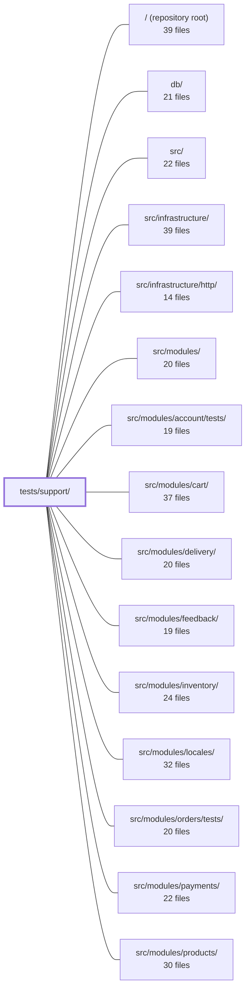

---
tags:
  - 2repo
  - 2repo/module
  - project/boilerplate-node-backend
type: module
module: tests/support/
files: 20
updated: 2026-08-28T12:02:11.192562+00:00
---

# tests/support/

## Purpose

`tests/support/` is the shared test-infrastructure layer for the entire test suite. It provides database lifecycle management, HTTP-level and unit-level test harnesses, contract-testing tooling, environment bootstrapping, and small assertion helpers so that individual test files in `tests/`, `tests/unit/`, and per-module `tests/` directories can focus on behaviour rather than plumbing.

## Key parts

- **Database lifecycle** — `global-setup.ts` and `global-teardown.ts` start and stop a single in-memory MongoDB for the whole Jest run; `database.ts` exposes `connect` / `disconnect` / `clearAll` for per-file isolation; `setup-test-db.ts` wires Mongoose connection and per-test clearing hooks; `migrations.ts` loads and runs the real migration files from `db/migrations/` against the test database.
- **HTTP & contract testing** — `http.ts` drives the fully mounted Express app via supertest; `contract.ts` registers `jest-openapi` against `openapi.yaml`; `contract-data.ts` generates request payloads from Zod schemas; `spec-walk.ts` enumerates every operation declared in the spec so the fuzz suite needs no manual endpoint list.
- **Unit-level stubs & assertions** — `express.ts` (Response stub), `caller-context.ts` (minimal `CallerContext` fixture), `response.ts` (asserts the expected branch of a `ResponseSuccess | ResponseReject` union before reading properties), `stub.ts` (sanctioned `as` cast behind one named export), `ports.ts` (port `jest.fn()` helper that works across `ts-jest`/`@swc/jest` and Stryker).
- **Configuration & boot ordering** — `setup.ts` (Jest `setupFiles` bootstrap that places env values before import-time captures), `environment.ts` (`withEnvironment` for temporary single-key env changes), `i18n-boot.ts` (reproduces production import ordering so `i18next.init()` runs at the right point).
- **Introspection & concurrency** — `schema.ts` reads Mongoose schema objects directly to assert declared contracts; `routes.ts` inspects an Express router's internal stack for endpoint/middleware tables; `race.ts` fires N simultaneous HTTP requests to verify true concurrency handling.

## How it connects

- **`db/`** — `migrations.ts` loads the CommonJS migration files from `db/migrations/` exactly as `migrate-mongo` would, giving migration-focused integration suites a single source of truth for "the migration set."
- **`src/infrastructure/` and `src/infrastructure/http/`** — `setup.ts` ensures environment values are present before infrastructure modules (rate limiters, i18n, Zod message thunks) capture config at import time; `http.ts` and `express.ts` exercise the HTTP layer and middleware stack that live in `src/infrastructure/http/`.
- **`src/modules/` (all domain modules)** — Every test helper in this directory exists so the per-module test suites under `src/modules/*/tests/` and `tests/unit/` can call service functions, assert on responses, or inspect schemas without each suite re-implementing the same plumbing.
- **`tests/` and `tests/unit/`** — This module is the `support` sibling to `tests/unit/infrastructure/` and `tests/unit/infrastructure/adapters/`; those suites import helpers (database, ports, response, schema) from here rather than defining them locally.
- **`/ (repository root)`** — `global-setup.ts` reads the repo's `openapi.yaml` and writes temporary data under the gitignored `.tmp/` directory; `setup.ts` reads the project's Jest configuration to run at the correct phase of the worker lifecycle.

## Where to start

1. **`tests/support/setup.ts`** — It runs first in every worker and explains *why* certain values must exist before any `src/` module is imported. Understanding this boot order prevents a whole class of confusing "undefined at import time" failures.
2. **`tests/support/database.ts`** — Nearly every integration test calls `connect` / `clearAll`. Reading these three short functions gives you the ground rules for how test data isolation works before you write or debug any DB-touching test.

## Connected modules

[[boilerplate-node-backend_ROOT|/ (repository root)]] · [[boilerplate-node-backend_db|db/]] · [[boilerplate-node-backend_src|src/]] · [[boilerplate-node-backend_src_infrastructure|src/infrastructure/]] · [[boilerplate-node-backend_src_infrastructure_http|src/infrastructure/http/]] · [[boilerplate-node-backend_src_modules|src/modules/]] · [[boilerplate-node-backend_src_modules_account_tests|src/modules/account/tests/]] · [[boilerplate-node-backend_src_modules_cart|src/modules/cart/]] · [[boilerplate-node-backend_src_modules_delivery|src/modules/delivery/]] · [[boilerplate-node-backend_src_modules_feedback|src/modules/feedback/]] · [[boilerplate-node-backend_src_modules_inventory|src/modules/inventory/]] · [[boilerplate-node-backend_src_modules_locales|src/modules/locales/]] · [[boilerplate-node-backend_src_modules_orders_tests|src/modules/orders/tests/]] · [[boilerplate-node-backend_src_modules_payments|src/modules/payments/]] · [[boilerplate-node-backend_src_modules_products|src/modules/products/]] · … and 6 more

## Files
- `tests/support/caller-context.ts` — Provides a minimal `CallerContext` fixture so that service-level tests (which invoke service functions directly, bypassing the HTTP controller) can supply the required caller argument without constructing a full request object. Keeps those tests focused on service logic rather than plumbing.
- `tests/support/contract-data.ts` — Zod-schema-driven fixture generator that produces request payloads satisfying (or violating) an API contract, used exclusively by `tests/contract/request-contract.test.ts`. It answers "does the API honour its own contract for *any* legal input?" — a complement to hand-written per-module factories that cover specific scenarios.
- `tests/support/contract.ts` — Side-effect setup file that registers `jest-openapi` with the project's `openapi.yaml` spec, making the `toSatisfyApiSpec()` assertion available globally. It exists to guard against over-serialization (leaking `_id`, `password`, populated sub-documents, etc.) by validating real HTTP responses against the OpenAPI document — a check that the generated Zod schemas cannot provide in this repo.
- `tests/support/database.ts` — Provides the three-lifecycle test-database helpers (`connect`, `disconnect`, `clearAll`) that every DB-touching integration test uses. It connects Mongoose to a **shared** in-memory Mongo started once by `globalSetup`, allocating a unique database name per test file to preserve isolation without spawning a `mongod` per file.
- `tests/support/environment.ts` — Provides a single test helper, `withEnvironment`, that temporarily sets one `process.env` key for the duration of an async test body and then restores the original state. It exists because the codebase's config layer (`@infrastructure/runtime/environment`) reads every value lazily at the point of use, so tests can vary a single setting in isolation — but only if the variable is reliably restored afterward.
- `tests/support/express.ts` — Provides a chainable Express `Response` stub for unit tests that assert on what a middleware, error responder, or controller rejection path sends. It is intentionally *not* a replacement for integration testing via `tests/support/http.ts` — it answers "what did this function try to send", not "what does the API actually return".
- `tests/support/global-setup.ts` — Jest global setup that starts a single in-memory MongoDB server for the entire test run and passes its connection URI to worker processes via environment variables. It also owns the on-disk data directory for that server (under the repo's gitignored `.tmp/`) and sweeps directories left behind by dead sibling instances, preventing unbounded disk growth caused by Stryker's SIGKILL-then-restart cycle.
- `tests/support/global-teardown.ts` — Jest global teardown hook that cleans up after a test instance finishes: stops the shared in-memory MongoDB started by `global-setup.ts` and deletes the instance's temporary data directory. It exists so that no leftover processes or temp files outlive a test run.
- `tests/support/http.ts` — HTTP-level test harness for contract tests. It drives the fully mounted Express app through supertest so that requests pass through routing, middleware, auth, serialization, and the error handler — the only layer where a response can be meaningfully compared against `openapi.yaml`. Unit suites call services and repositories directly and bypass this stack.
- `tests/support/i18n-boot.ts` — Test infrastructure that reproduces the production import ordering—module code loads *before* `i18next.init()`—which Jest's `setupFiles` normally masks. It exists so specs can assert real translated copy and catch the class of bug where an eagerly-called `t()` bakes `undefined` into Zod validators because i18next was not yet initialised.
- `tests/support/migrations.ts` — Shared test-support module that loads the real CommonJS migration files from `db/migrations/` the same way `migrate-mongo` would (disk scan, filename sort, `require`), and exposes helpers to run them against the live test database. It exists so the two migration-focused integration suites have a single, unambiguous definition of "the migration set" rather than each maintaining its own loading logic.
- `tests/support/ports.ts` — A single-function test helper that hands out a `jest.fn()`-backed port (e.g. `emitAuditEvent`, `emitAnalyticsEvent`) with its call history cleared, so tests can assert "this event fired, that one didn't" from a known-clean baseline. It exists because the naïve `jest.spyOn(namespace, 'fn')` pattern is not portable across the project's transform pipeline (`ts-jest` vs `@swc/jest`) and Stryker's instrumented sandbox, where CommonJS namespace getters are non-configurable and `spyOn` throws a `TypeError`.
- `tests/support/race.ts` — Concurrency-test harness that fires N identical HTTP requests truly simultaneously and exposes per-participant outcomes for assertion. It exists because serial test suites (and mutation testing) cannot verify that a race condition is actually handled — the question is "does it still do the right thing when all of it happens at once?"
- `tests/support/response.ts` — Test helper that narrows a service's `ResponseSuccess<T> | ResponseReject` union at the assertion site. Instead of an inline `as` cast (which silently succeeds even when the wrong arm is hit), these helpers **assert the expected branch first**, so a response that took the wrong path fails on that single, readable fact before any property is read from it.
- `tests/support/routes.ts` — Test-only utilities that inspect an Express router's internal stack to produce a deterministic table of every mounted endpoint, its middleware chain, and its router-level guards. This makes silent route-configuration changes (missing auth guard, wrong cache tag, reordered `/:id`) visible as assertion failures instead of undetected regressions.
- `tests/support/schema.ts` — A pure, database-free set of introspection readers for Mongoose schema objects. It lets unit tests assert the *contract* a schema declares—required paths, index names and directions, defaults, enums, sub-schemas, schema-level options—by reading the schema object directly, catching silent regressions (dropped `required`, lost `_id: false`, renamed indexes, removed `timestamps`) that document-shape integration tests cannot see.
- `tests/support/setup-test-db.ts` — Registers Mongoose connection and per-test database clearing hooks for any test suite that touches MongoDB. It exists so every test starts against a guaranteed-empty database, letting assertions use absolute counts instead of relative deltas, and eliminating order-dependent failures.
- `tests/support/setup.ts` — Jest's `setupFiles` global bootstrap: runs once per worker **before** any test module or its dependencies are imported. Its sole reason to exist is that several application modules (`security.ts` rate limiters, `@infrastructure/i18n`, Zod message thunks) capture their configuration at **import time**, so the values must be in place before those modules are ever evaluated.
- `tests/support/spec-walk.ts` — Derives the full list of HTTP operations (and their schemas) directly from `openapi.yaml`, so the fuzz test suite automatically covers every route the spec declares without anyone manually maintaining an endpoint list. It is intentionally limited to the schema subset this repo actually uses and is *not* a general OpenAPI parser.
- `tests/support/stub.ts` — Provides a single sanctioned cast helper for hand-built test stubs. Because framework types (`Request`, `Response`, Mongoose `CastError`, etc.) have hundreds of members that a minimal stub cannot structurally satisfy, some cast is unavoidable. This file centralizes that cast behind one named export so the ESLint `no-restricted-syntax` rule can ban the raw `as unknown as T` spelling everywhere else in the codebase.

---
[[boilerplate-node-backend_INDEX|← boilerplate-node-backend index]]
