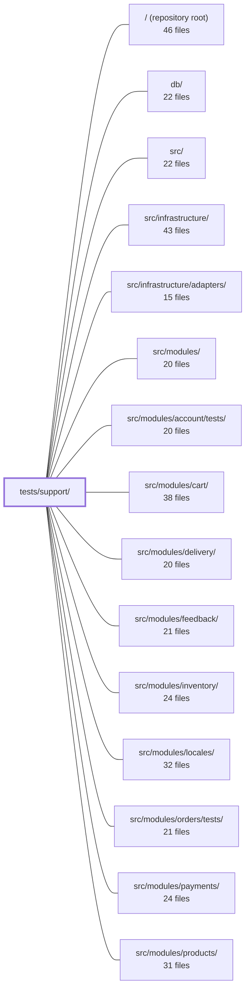

---
tags:
  - 2repo
  - 2repo/module
  - project/boilerplate-node-backend
type: module
module: tests/support/
files: 21
updated: 2026-09-02T18:36:55.819201+00:00
---

# tests/support/

## Purpose

Shared test infrastructure for the entire suite. This module contains no test cases of its own; it provides the lifecycle hooks, HTTP harnesses, fixture generators, assertion helpers, and environment bootstrapping that every other test file depends on.

## Key parts

- **Test bootstrap & lifecycle** — `setup.ts` (per-worker env vars + i18next init before any import), `i18n-boot.ts` (reproduces production import ordering for translation assertions), `global-setup.ts` / `global-teardown.ts` (start/stop the shared in-memory Mongo for the whole run), `database.ts` / `setup-test-db.ts` (per-suite connect, per-test wipe), `environment.ts` (scoped `process.env` mutation with guaranteed restore).
- **HTTP & contract layer** — `http.ts` (supertest harness exercising the full Express pipeline), `contract.ts` (registers `jest-openapi` against `openapi.yaml`), `contract-routes.ts` (flat endpoint/guard enumeration without pulling in module side-effects), `contract-data.ts` (Zod-schema-driven valid/invalid payload generator), `spec-walk.ts` (derives the operation list from the spec so fuzz coverage is automatic).
- **Unit-test assertion helpers** — `routes.ts` (route-table introspection + labelled middleware mocks), `schema.ts` (Mongoose schema declaration introspection without a DB round-trip), `response.ts` (branch-narrowing for `ResponseSuccess | ResponseReject`), `express.ts` (chainable `Response` stub for middleware/controller unit tests), `caller-context.ts` (minimal caller-identity fixture), `ports.ts` (safe `jest.fn()` port factory), `stub.ts` (single sanctioned structural cast).
- **Concurrency** — `race.ts` (fires N truly simultaneous requests and exposes per-participant outcomes).
- **Migrations** — `migrations.ts` (loads the real `db/migrations/` files the same way `migrate-mongo` does and runs them against the test database).

## How it connects

- **`src/` and `src/modules/*`** — `routes.ts`, `contract-routes.ts`, `schema.ts`, and `caller-context.ts` import the production route tables, Mongoose schemas, service signatures, and context types so tests can introspect or stub them. `ports.ts` replaces infrastructure adapter calls (audit, analytics) without touching the real adapters in `src/infrastructure/adapters/`.
- **`src/infrastructure/`** — `environment.ts` and `setup.ts` exist specifically because `@infrastructure/runtime/environment` reads `process.env` lazily; the helpers guarantee a known baseline. `i18n-boot.ts` mirrors the runtime's i18next initialisation order.
- **`db/`** — `migrations.ts` reads the migration files on disk and replays them against the in-memory Mongo started by `global-setup.ts`.
- **`tests/`, `tests/cross-cutting/`, `tests/unit/infrastructure/`, and per-module `tests/` directories** — all consume the helpers here. `setup-test-db.ts` is the most pervasive dependency; `http.ts` and `contract.ts` gate the contract and cross-cutting suites; `ports.ts` and `response.ts` appear in nearly every service-level unit test.

## Where to start

1. **`setup.ts`** — small, and it explains *why* the test environment looks the way it does (env vars, i18next, Zod messages) before any module is loaded. Reading it first makes the rest of the scaffolding less surprising.
2. **`http.ts`** — the primary integration harness. Once you understand how a contract test mounts the full Express app and asserts against `openapi.yaml`, the roles of `contract.ts`, `contract-routes.ts`, and `spec-walk.ts` become self-evident.

## Connected modules

[[boilerplate-node-backend_ROOT|/ (repository root)]] · [[boilerplate-node-backend_db|db/]] · [[boilerplate-node-backend_src|src/]] · [[boilerplate-node-backend_src_infrastructure|src/infrastructure/]] · [[boilerplate-node-backend_src_infrastructure_adapters|src/infrastructure/adapters/]] · [[boilerplate-node-backend_src_modules|src/modules/]] · [[boilerplate-node-backend_src_modules_account_tests|src/modules/account/tests/]] · [[boilerplate-node-backend_src_modules_cart|src/modules/cart/]] · [[boilerplate-node-backend_src_modules_delivery|src/modules/delivery/]] · [[boilerplate-node-backend_src_modules_feedback|src/modules/feedback/]] · [[boilerplate-node-backend_src_modules_inventory|src/modules/inventory/]] · [[boilerplate-node-backend_src_modules_locales|src/modules/locales/]] · [[boilerplate-node-backend_src_modules_orders_tests|src/modules/orders/tests/]] · [[boilerplate-node-backend_src_modules_payments|src/modules/payments/]] · [[boilerplate-node-backend_src_modules_products|src/modules/products/]] · … and 6 more

## Files
- `tests/support/caller-context.ts` — Provides a minimal `CallerContext` fixture for tests that invoke service functions directly, bypassing the HTTP controller layer that would normally construct one from an incoming request. Most service-level tests don't need a meaningful caller identity—only that the field is present so the code path doesn't throw on a missing value.
- `tests/support/contract-data.ts` — A Zod-schema-driven fixture generator that produces valid and invalid request payloads for contract testing. It recursively walks a Zod v4 schema's `_zod.def` introspection surface to emit deterministic, seed-reproducible data, answering "does the API honour its contract for *any* legal input?" — a question the per-module hand-written factories in `tests/fixtures.ts` don't cover. It is additive; deterministic scenario tests still use the hand-written factories.
- `tests/support/contract-routes.ts` — Provides the contract-test layer's flat view of every endpoint mounted across the app (method, absolute path, effective guard chain). It exists as a separate module from `tests/support/routes.ts` so that contract tests can enumerate routes without paying the cost of `enabledModules` pulling in event subscriptions and demo seeding that per-module route unit tests don't need.
- `tests/support/contract.ts` — Side-effect setup file that registers `jest-openapi` with the project's `openapi.yaml` spec, making the `toSatisfyApiSpec()` assertion available globally. It exists to guard against over-serialization (leaking `_id`, `password`, populated sub-documents, etc.) by validating real HTTP responses against the OpenAPI document — a check that the generated Zod schemas cannot provide in this repo.
- `tests/support/database.ts` — Provides the three-lifecycle test-database helpers (`connect`, `disconnect`, `clearAll`) that every DB-touching integration test uses. It connects Mongoose to a **shared** in-memory Mongo started once by `globalSetup`, allocating a unique database name per test file to preserve isolation without spawning a `mongod` per file.
- `tests/support/environment.ts` — Provides a single test helper, `withEnvironment`, that temporarily sets one `process.env` key for the duration of an async test body and then restores the original state. It exists because the codebase's config layer (`@infrastructure/runtime/environment`) reads every value lazily at the point of use, so tests can vary a single setting in isolation — but only if the variable is reliably restored afterward.
- `tests/support/express.ts` — Provides a chainable Express `Response` stub for unit tests that assert on what a middleware, error responder, or controller rejection path sends. It is intentionally *not* a replacement for integration testing via `tests/support/http.ts` — it answers "what did this function try to send", not "what does the API actually return".
- `tests/support/global-setup.ts` — Jest global setup that starts a single in-memory MongoDB server for the entire test run and passes its connection URI to worker processes via environment variables. It also owns the on-disk data directory for that server (under the repo's gitignored `.tmp/`) and sweeps directories left behind by dead sibling instances, preventing unbounded disk growth caused by Stryker's SIGKILL-then-restart cycle.
- `tests/support/global-teardown.ts` — Jest global teardown hook that cleans up after a test instance finishes: stops the shared in-memory MongoDB started by `global-setup.ts` and deletes the instance's temporary data directory. It exists so that no leftover processes or temp files outlive a test run.
- `tests/support/http.ts` — HTTP-level test harness that lets contract tests exercise the full Express pipeline (routing, middleware, auth, serialization, error handler) via `supertest`, rather than calling services or repositories directly. This is the only layer where a response body can be meaningfully compared against `openapi.yaml`.
- `tests/support/i18n-boot.ts` — Test infrastructure that reproduces the production import ordering—module code loads *before* `i18next.init()`—which Jest's `setupFiles` normally masks. It exists so specs can assert real translated copy and catch the class of bug where an eagerly-called `t()` bakes `undefined` into Zod validators because i18next was not yet initialised.
- `tests/support/migrations.ts` — Shared test-support module that loads the real CommonJS migration files from `db/migrations/` the same way `migrate-mongo` would (disk scan, filename sort, `require`), and exposes helpers to run them against the live test database. It exists so the two migration-focused integration suites have a single, unambiguous definition of "the migration set" rather than each maintaining its own loading logic.
- `tests/support/ports.ts` — A single-function test helper that hands out a `jest.fn()`-backed port (e.g. `emitAuditEvent`, `emitAnalyticsEvent`) with its call history cleared, so tests can assert "this event fired, that one didn't" from a known-clean baseline. It exists because the naïve `jest.spyOn(namespace, 'fn')` pattern is not portable across the project's transform pipeline (`ts-jest` vs `@swc/jest`) and Stryker's instrumented sandbox, where CommonJS namespace getters are non-configurable and `spyOn` throws a `TypeError`.
- `tests/support/race.ts` — Concurrency-test harness that fires N identical HTTP requests truly simultaneously and exposes per-participant outcomes for assertion. It exists because serial test suites (and mutation testing) cannot verify that a race condition is actually handled — the question is "does it still do the right thing when all of it happens at once?"
- `tests/support/response.ts` — Test helper that narrows a service's `ResponseSuccess<T> | ResponseReject` union at the assertion site. Instead of an inline `as` cast (which silently succeeds even when the wrong arm is hit), these helpers **assert the expected branch first**, so a response that took the wrong path fails on that single, readable fact before any property is read from it.
- `tests/support/routes.ts` — Provides a route-table introspection utility and a set of jest mock factories that label Express middleware produced by factory functions (which would otherwise appear as anonymous closures). Together they let each module's route test assert the **complete** set of mounted methods, paths, and middleware chains—including the arguments captured inside factory closures (cache tags, TTLs, upload field names, auth tiers)—so that any silent route or middleware change must be a deliberate, reviewable edit to the test.
- `tests/support/schema.ts` — A set of read-only introspection helpers that extract a Mongoose schema's contract (required fields, indexes, defaults, enums, nested schemas, schema-level options) directly from the schema object at runtime. This lets unit tests assert the *declaration* of a schema — things that don't change the shape of a valid document but break quietly (a dropped `required`, a renamed index, a missing `_id: false`) — without spinning up a database or round-tripping a document.
- `tests/support/setup-test-db.ts` — Registers Jest lifecycle hooks (`beforeAll` / `afterAll` / `beforeEach`) that connect to the run's shared in-memory mongod and wipe every collection before each test case. It exists so that any suite touching Mongo gets an isolated, empty database per `it()` without each test file repeating the boilerplate.
- `tests/support/setup.ts` — Jest `setupFiles` bootstrap that runs once per worker **before** any test module is imported. It sets environment variables (rate-limit budgets, JWT secrets, TOTP key, metrics token, Redis opt-out) and initialises i18next + Zod validation messages so that modules which capture defaults at import time see correct values. It deliberately does **not** start a database—that is per-suite via `setupTestDb()`.
- `tests/support/spec-walk.ts` — Derives the full list of HTTP operations (and their schemas) directly from `openapi.yaml`, so the fuzz test suite automatically covers every route the spec declares without anyone manually maintaining an endpoint list. It is intentionally limited to the schema subset this repo actually uses and is *not* a general OpenAPI parser.
- `tests/support/stub.ts` — Provides a single sanctioned cast helper for hand-built test stubs. Because framework types (`Request`, `Response`, Mongoose `CastError`, etc.) have hundreds of members that a minimal stub cannot structurally satisfy, some cast is unavoidable. This file centralizes that cast behind one named export so the ESLint `no-restricted-syntax` rule can ban the raw `as unknown as T` spelling everywhere else in the codebase.

---
[[boilerplate-node-backend_INDEX|← boilerplate-node-backend index]]
