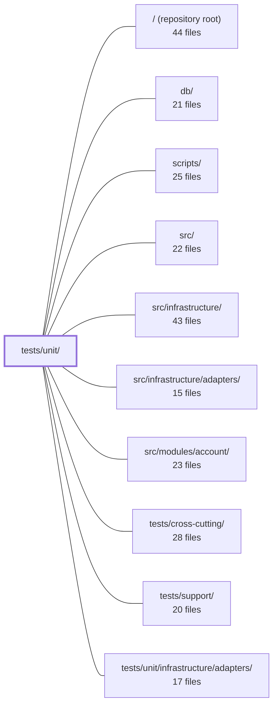

---
tags:
  - 2repo
  - 2repo/module
  - project/boilerplate-node-backend
type: module
module: tests/unit/
files: 14
updated: 2026-08-31T20:58:45.836737+00:00
---

# tests/unit/

## Purpose

`tests/unit/` holds the project's fast, isolated unit tests. Each file targets a single function, rule, or contract in `src/`, `db/`, or `scripts/`, stubbing external I/O so that a regression is attributable to the unit under test rather than to a downstream integration. The suite runs in milliseconds and is expected to pass before any broader integration or cross-cutting test is attempted.

## Key parts

- **`kernel/`** — The largest sub-group. Covers the domain event bus (`events.test.ts`), the three auth middlewares plus `getTokenBearer` (`authorizations.test.ts`), the two read-scoping combinators (`authorization.test.ts`), and the boot-time `registerModules` function (`registry.test.ts`). Together they pin the contracts the rest of the application relies on at every request.
- **`eslint/`** — Three files exercising custom lint rules (`controller-chain-must-catch`, `no-hardcoded-user-text`, `no-persistence-imports`) through ESLint's `RuleTester`, so assertions operate on a real parsed AST exactly as a production lint run would.
- **`db/`** — Guards the database tooling layer: the `npm run host` wrapper and URI resolution (`host-scripts.test.ts`), the `runScript` promise-wrapper guarantees (`run-script.test.ts`), and that every seed-fixture `imageUrl` resolves to a shipped static file (`seed-fixtures.test.ts`).
- **`scripts/`** — Tests for CI-side utilities: the mutation-score ratchet logic (`mutation-baseline.test.ts`) and the cross-repo spec-identity check (`spec-identity.test.ts`), both driven against synthetic fixtures so no real mutation run or sibling checkout is required.
- **`i18n/`** — `email-locale.test.ts` locks the producer-resolves / worker-renders split for localized email using the `reset-confirm` account email as the concrete case.
- **`app/`** — `process-error-handlers.test.ts` verifies that `installErrorHandling` wires the correct `uncaughtException` / `unhandledRejection` listeners per `NODE_ENV`.

## How it connects

- **`src/`** — Nearly every test in this module imports a function, class, or rule from `src/` (kernel, middleware, i18n helpers, ESLint rule definitions) and asserts its observable contract in isolation.
- **`db/`** — The `db/` sub-group tests the npm-script wrappers and URI-resolution logic that live in `db/`, pinning invariants that prevent silent wrong-database targeting.
- **`scripts/`** — The `scripts/` sub-group tests the mutation-baseline ratchet and spec-identity check modules that ship under `scripts/`.
- **`src/modules/account/`** — `i18n/email-locale.test.ts` exercises the account email producer (subject, body, footer, `lang` attribute) as the concrete case for the localization contract.
- **`tests/support/`** — Provides shared fixtures, stubs, and helpers that unit tests import to avoid duplicating setup logic.
- **`tests/cross-cutting/`** — Sits one level up in scope; unit tests here intentionally do *not* depend on it, keeping the unit layer fast and self-contained.
- **`/` (repository root)** — `spec-identity.test.ts` reaches into the sibling frontend checkout relative to the repo root; `seed-fixtures.test.ts` resolves paths against the root `public/` directory.

## Where to start

1. **`tests/unit/kernel/events.test.ts`** — Short, self-contained, and it demonstrates the exact testing style used throughout: import the unit, stub the boundaries, assert one or two invariants. Reading this file orients you on how every other test in the module is structured.
2. **`tests/unit/db/run-script.test.ts`** — Slightly larger but still tight; it shows how the suite handles edge cases (non-Error rejections, simultaneous failures) and how cleanup guarantees are verified without a live database. Together these two files cover the two dominant patterns (pure-logic contracts and async-lifecycle guarantees) you will see repeated across the module.

## Connected modules

[[boilerplate-node-backend_ROOT|/ (repository root)]] · [[boilerplate-node-backend_db|db/]] · [[boilerplate-node-backend_scripts|scripts/]] · [[boilerplate-node-backend_src|src/]] · [[boilerplate-node-backend_src_infrastructure|src/infrastructure/]] · [[boilerplate-node-backend_src_infrastructure_adapters|src/infrastructure/adapters/]] · [[boilerplate-node-backend_src_modules_account|src/modules/account/]] · [[boilerplate-node-backend_tests_cross-cutting|tests/cross-cutting/]] · [[boilerplate-node-backend_tests_support|tests/support/]] · [[boilerplate-node-backend_tests_unit_infrastructure_adapters|tests/unit/infrastructure/adapters/]]

## Files
- `tests/unit/app/process-error-handlers.test.ts` — Verifies that `installErrorHandling` installs the correct process-level listeners for `uncaughtException` and `unhandledRejection` depending on `NODE_ENV`. It exists because a silent failure to log-and-exit on a fatal throw is invisible: the process keeps running in an unknown state, tests pass green, and the server simply "stops doing that thing" in production.
- `tests/unit/db/host-scripts.test.ts` — Validates the `npm run host -- <script>` wrapper and the database URI resolution logic it depends on. It guards against a class of silent failures where a script hardcodes a connection string (and with it a database name) that contradicts `.env`, causing `db:seed` or `db:migrate:up` to target the wrong database with no diagnostic output. The file pins five invariants: no literal URI in the wrapper, single source of hostname redirection, empty-string URI fallthrough, `migrate-mongo-config.js` parity with the application, and loopback-IPv4 targeting.
- `tests/unit/db/run-script.test.ts` — Unit tests for the `runScript` wrapper in `db/run-script.ts`, which adds three guarantees to a bare promise chain: a non-zero exit code on failure, guaranteed cleanup execution (critical for closing Mongo/Redis sockets on `db:seed`), and a logged error reason. This file verifies all of those behaviours plus edge cases like non-Error rejections and simultaneous body+cleanup failures.
- `tests/unit/db/seed-fixtures.test.ts` — Validates that every `imageUrl` in the seed/demo fixture data is a well-formed URL path that resolves to a file actually shipped in the repository under `public/`. It exists because a bad URL (Windows backslashes, a missing file, a path outside the static mount) produces only a silent 404 in the browser with no other test to catch it.
- `tests/unit/eslint/controller-chain-must-catch.test.ts` — Unit test for the `controller-chain-must-catch` ESLint rule, exercised via ESLint's own `RuleTester`. It asserts that the rule correctly flags controller handlers with an unhandled `.then()` chain and correctly allows the rule's documented carve-outs (chains inside `.catch` handlers, private helpers delegating `.catch` to the caller). Running through `RuleTester` means the rule receives a real parsed AST, matching production lint behavior.
- `tests/unit/eslint/no-hardcoded-user-text.test.ts` — Unit test for the `no-hardcoded-user-text` ESLint rule. It verifies that the rule flags bare string literals and `message:` values in the `errors` argument of `rejectResponse` / `generateReject`, while explicitly *not* flagging `code:` identifiers, `t(…)` calls, template literals containing expressions, or unrelated function calls.
- `tests/unit/eslint/no-persistence-imports.test.ts` — Unit test for the `noPersistenceImports` ESLint rule, exercised through ESLint's `RuleTester` so that assertions operate on the parsed AST exactly as a real lint run would. Covers both detection routes (imported binding name and module path) and both shipped configurations (strict for controllers, Model-only for the rest), catching regressions that a default-options-only test would miss.
- `tests/unit/i18n/email-locale.test.ts` — Guards the split-responsibility contract for localized email: the **producer** must fully resolve all copy (subject, body, footer, `<html lang>` value) before a job is published to the queue, and the **worker** must render only what it was handed without ever consulting a locale store. The tests assert both halves against the `reset-confirm` account email in English and Italian.
- `tests/unit/kernel/authorization.test.ts` — Unit tests for the two read-scoping combinators exported by `src/kernel/authorization.ts`. They assert the kernel's contract in isolation (using stub builders) so that a regression is attributable to the scoping rule itself rather than to any particular repository's filter logic.
- `tests/unit/kernel/authorizations.test.ts` — Unit tests for the three authorization middlewares (`getAuth`, `isAuth`, `isAdmin`) and the `getTokenBearer` helper in `src/kernel/middlewares/authorizations.ts`. The file exists to pin the deliberately different failure modes of each middleware (fail-open vs. fail-closed vs. role-gated), the exact status codes a client receives, and the audit events emitted on rejection. The response layer is exercised for real; only the JWT/DB boundary and the audit sink are stubbed.
- `tests/unit/kernel/events.test.ts` — Unit tests for the domain event bus. They lock in the two invariants that make the bus a safe *substitute* (not just a decoupling) for the direct products→cart / cart→catalogue calls: handlers are awaited before `emitDomainEvent` resolves, and a single failing handler does not reject the emitter or prevent remaining handlers from running.
- `tests/unit/kernel/registry.test.ts` — Unit tests for `registerModules`, the sole boot-time function the registry exposes. The file asserts exactly two observable contracts: every module that declares a `subscribe` callback has it invoked, and a module that declares none is a valid, non-error path.
- `tests/unit/scripts/mutation-baseline.test.ts` — Unit tests for the per-file mutation-score ratchet in `scripts/mutation-baseline.ts`. They pin the asymmetry at the heart of the design—improvements move the baseline up, regressions never move it down—and verify the scoring, comparison, formatting, and partial-run-guard logic against synthetic Stryker-shaped reports so no real 51-minute mutation run is needed.
- `tests/unit/scripts/spec-identity.test.ts` — Unit tests for the cross-repo contract check in `scripts/spec-identity.ts`. Verifies that the two shared spec files (OpenAPI, AsyncAPI) remain byte-identical between the backend and frontend checkouts, covering both the comparison logic (driven against synthetic temp-dir fixtures) and the live pair (conditional on the sibling checkout actually being present).

---
[[boilerplate-node-backend_INDEX|← boilerplate-node-backend index]]
