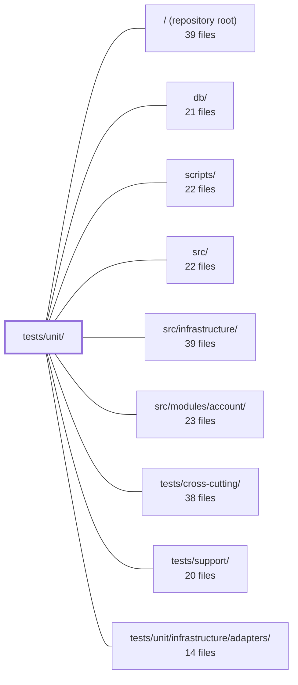

---
tags:
  - 2repo
  - 2repo/module
  - project/boilerplate-node-backend
type: module
module: tests/unit/
files: 14
updated: 2026-08-28T12:02:29.064329+00:00
---

# tests/unit/

## Purpose

Unit tests for the backend's internal building blocks: process-level error handling, database utility wrappers, custom ESLint rules, the i18n email pipeline, kernel services (authorization, event bus, module registry), and repository-level scripts. Each test file pins a specific contractual invariant so that a regression fails fast and loudly rather than surfacing as a silent production misbehaviour.

## Key parts

- **`app/`** — `process-error-handlers.test.ts`: verifies that `installErrorHandling` attaches the correct `uncaughtException` / `unhandledRejection` listeners per `NODE_ENV`, preventing a silent "server stops doing that thing" in production.
- **`db/`** — `host-scripts.test.ts` pins the `npm run host --` wrapper and URI-resolution invariants (no hardcoded URI, single hostname source, loopback targeting). `run-script.test.ts` guarantees non-zero exit, cleanup execution, and logged errors from the `runScript` wrapper. `seed-fixtures.test.ts` asserts every `imageUrl` in seed data resolves to a real file under `public/`.
- **`eslint/`** — Three files, each exercising one custom lint rule through ESLint's `RuleTester` (real AST): `controller-chain-must-catch` (unhandled `.then` in controllers), `no-hardcoded-user-text` (bare strings vs. `t()` calls), and `no-persistence-imports` (binding-name and module-path detection across two severity tiers).
- **`i18n/`** — `email-locale.test.ts`: asserts the "translate at producer, render at worker" contract for outbound email using mocked SMTP/queue adapters.
- **`kernel/`** — `authorization.test.ts` (read-scoping combinators in isolation), `authorizations.test.ts` (the three auth middlewares' distinct failure modes, status codes, and audit events), `events.test.ts` (domain event bus: handlers are awaited; one failure doesn't cascade), and `registry.test.ts` (module registry rejects duplicates, cycles, and missing deps at boot).
- **`scripts/`** — `mutation-baseline.test.ts` (per-file mutation-score ratchet: improvements raise the bar, regressions never lower it) and `spec-identity.test.ts` (cross-repo contract check against synthetic temp roots, with an optional live test when the frontend sibling is present).

## How it connects

- **`src/`** — The kernel and i18n tests import and exercise production code from `src/` (authorization helpers, event bus, module registry, email producers). The ESLint tests exercise custom rules defined alongside the source tree.
- **`db/`** — The `db/` sub-directory of tests directly targets the host-script wrapper, `runScript`, and seed-fixture data that live in `db/`.
- **`scripts/`** — `scripts/mutation-baseline.test.ts` and `spec-identity.test.ts` are the unit-level companions to the mutation-runner and cross-repo sync tooling in `scripts/`.
- **`src/infrastructure/`** & **`src/modules/account/`** — The i18n email-locale test and the authorizations test reach into infrastructure adapters (SMTP, queue, JWT) and the account module's role/permission definitions, stubbing only the external boundary.
- **`tests/support/`** — Provides shared fakes, fixtures, and helper utilities that multiple files here import to keep setup DRY.
- **`tests/cross-cutting/`** — Sibling directory that covers integration/contract scenarios spanning multiple modules; the unit tests here deliberately isolate each concern so that failures in `tests/cross-cutting/` can be attributed to interaction, not to a single unit.
- **`tests/unit/infrastructure/adapters/`** — Sibling within the same unit-test directory tree, focused on adapter implementations (DB, Redis, etc.); these tests complement it by covering the higher-level logic that *uses* those adapters.

## Where to start

1. **`tests/unit/kernel/events.test.ts`** — Short, self-contained, and illustrates the test style (stub the boundary, assert the contract, cover the failure path). The two invariants it locks in (awaited handlers, isolated failures) are the mental model for how this codebase treats cross-module communication.
2. **`tests/unit/db/run-script.test.ts`** — Shows the "guarantee per edge case" pattern (non-Error rejections, simultaneous body + cleanup failures) and why the project insists on explicit exit codes and cleanup. Reading it alongside the source in `db/run-script.ts` gives a quick feel for the codebase's tolerance for failure.

## Connected modules

[[boilerplate-node-backend_ROOT|/ (repository root)]] · [[boilerplate-node-backend_db|db/]] · [[boilerplate-node-backend_scripts|scripts/]] · [[boilerplate-node-backend_src|src/]] · [[boilerplate-node-backend_src_infrastructure|src/infrastructure/]] · [[boilerplate-node-backend_src_modules_account|src/modules/account/]] · [[boilerplate-node-backend_tests_cross-cutting|tests/cross-cutting/]] · [[boilerplate-node-backend_tests_support|tests/support/]] · [[boilerplate-node-backend_tests_unit_infrastructure_adapters|tests/unit/infrastructure/adapters/]]

## Files
- `tests/unit/app/process-error-handlers.test.ts` — Verifies that `installErrorHandling` installs the correct process-level listeners for `uncaughtException` and `unhandledRejection` depending on `NODE_ENV`. It exists because a silent failure to log-and-exit on a fatal throw is invisible: the process keeps running in an unknown state, tests pass green, and the server simply "stops doing that thing" in production.
- `tests/unit/db/host-scripts.test.ts` — Validates the `npm run host -- <script>` wrapper and the database URI resolution logic it depends on. It guards against a class of silent failures where a script hardcodes a connection string (and with it a database name) that contradicts `.env`, causing `db:seed` or `db:migrate:up` to target the wrong database with no diagnostic output. The file pins five invariants: no literal URI in the wrapper, single source of hostname redirection, empty-string URI fallthrough, `migrate-mongo-config.js` parity with the application, and loopback-IPv4 targeting.
- `tests/unit/db/run-script.test.ts` — Unit tests for the `runScript` wrapper in `db/run-script.ts`, which adds three guarantees to a bare promise chain: a non-zero exit code on failure, guaranteed cleanup execution (critical for closing Mongo/Redis sockets on `db:seed`), and a logged error reason. This file verifies all of those behaviours plus edge cases like non-Error rejections and simultaneous body+cleanup failures.
- `tests/unit/db/seed-fixtures.test.ts` — Validates that every `imageUrl` in the seed/demo fixture data is a well-formed URL path that resolves to a file actually shipped in the repository under `public/`. It exists because a bad URL (Windows backslashes, a missing file, a path outside the static mount) produces only a silent 404 in the browser with no other test to catch it.
- `tests/unit/eslint/controller-chain-must-catch.test.ts` — Unit test for the `controller-chain-must-catch` ESLint rule, exercised via ESLint's own `RuleTester`. It asserts that the rule correctly flags controller handlers with an unhandled `.then()` chain and correctly allows the rule's documented carve-outs (chains inside `.catch` handlers, private helpers delegating `.catch` to the caller). Running through `RuleTester` means the rule receives a real parsed AST, matching production lint behavior.
- `tests/unit/eslint/no-hardcoded-user-text.test.ts` — Unit test for the `no-hardcoded-user-text` ESLint rule. It verifies that the rule flags bare string literals and `message:` values in the `errors` argument of `rejectResponse` / `generateReject`, while explicitly *not* flagging `code:` identifiers, `t(…)` calls, template literals containing expressions, or unrelated function calls.
- `tests/unit/eslint/no-persistence-imports.test.ts` — Unit tests for the `no-persistence-imports` ESLint rule, exercising it through ESLint's `RuleTester` so that assertions mirror exactly what a lint run produces (parsed AST, not source strings). The cases are split along the rule's two detection routes — binding-name match and module-path match — and across its two shipped configurations (strict for controllers, `Model`-only elsewhere), catching regressions in either axis that a defaults-only test would miss.
- `tests/unit/i18n/email-locale.test.ts` — Guards the "translate at the producer, render at the worker" email architecture: the enqueueing side must resolve all copy into a concrete language before the job hits the queue, and the worker must render whatever strings it is given regardless of any ambient locale context. Both halves are asserted with mocked SMTP and queue adapters.
- `tests/unit/kernel/authorization.test.ts` — Unit tests for the two read-scoping combinators exported by `src/kernel/authorization.ts`. They assert the kernel's contract in isolation (using stub builders) so that a regression is attributable to the scoping rule itself rather than to any particular repository's filter logic.
- `tests/unit/kernel/authorizations.test.ts` — Unit tests for the three authorization middlewares (`getAuth`, `isAuth`, `isAdmin`) and the `getTokenBearer` helper in `src/kernel/middlewares/authorizations.ts`. The file exists to pin the deliberately different failure modes of each middleware (fail-open vs. fail-closed vs. role-gated), the exact status codes a client receives, and the audit events emitted on rejection. The response layer is exercised for real; only the JWT/DB boundary and the audit sink are stubbed.
- `tests/unit/kernel/events.test.ts` — Unit tests for the domain event bus. They lock in the two invariants that make the bus a safe *substitute* (not just a decoupling) for the direct products→cart / cart→catalogue calls: handlers are awaited before `emitDomainEvent` resolves, and a single failing handler does not reject the emitter or prevent remaining handlers from running.
- `tests/unit/kernel/registry.test.ts` — Unit tests for the kernel module registry's validation and registration logic. The registry decides what "this build" means at boot time, so these tests ensure misconfigurations (duplicates, missing deps, cycles, self-references) are caught immediately with a specific, named error rather than surfacing later as a 500 on the first request.
- `tests/unit/scripts/mutation-baseline.test.ts` — Unit tests for the per-file mutation-score ratchet in `scripts/mutation-baseline.ts`. They pin the asymmetry at the heart of the design—improvements move the baseline up, regressions never move it down—and verify the scoring, comparison, formatting, and partial-run-guard logic against synthetic Stryker-shaped reports so no real 51-minute mutation run is needed.
- `tests/unit/scripts/spec-identity.test.ts` — Unit tests for `scripts/spec-identity.ts`, the cross-repo contract checker that verifies shared spec/seed files between the backend (this repo) and its frontend sibling. Tests run against synthetic roots in a temp directory so they work on any CI runner without the sibling checked out, plus a conditional live test that only fires when the sibling is actually present.

---
[[boilerplate-node-backend_INDEX|← boilerplate-node-backend index]]
