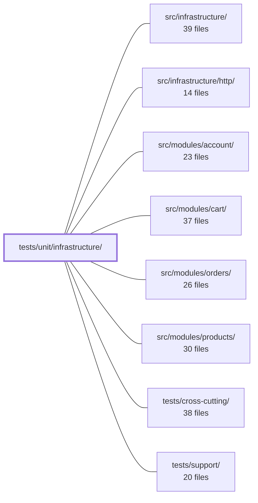

---
tags:
  - 2repo
  - 2repo/module
  - project/boilerplate-node-backend
type: module
module: tests/unit/infrastructure/
files: 27
updated: 2026-08-28T12:02:44.237218+00:00
---

# tests/unit/infrastructure/

## Purpose

Unit tests for the application's infrastructure layer — the shared, cross-cutting building blocks (HTTP plumbing, i18n, observability, persistence helpers, and runtime connection management) that every feature module depends on. Each test file targets a single source file in `src/infrastructure/`, pinning contracts, edge cases, and failure modes that integration or cluster suites would exercise only incidentally.

## Key parts

- **HTTP error & request/response contracts** — `http/errors.test.ts`, `http/request.test.ts`, `http/response.test.ts`, `http/schemas.test.ts`, `http/uploads.test.ts`. Together these lock in the API's dialect: how errors map to status codes, how `readInput` decodes bodies, what shape every response envelope takes, how shared scalar schemas interpret query params, and how upload/multer shapes are normalised.

- **HTTP middleware behaviour** — `http/middlewares/cache.test.ts`, `locale.test.ts`, `rate-limit-store-selection.test.ts`, `rate-limit-store.test.ts`, `request-logger.test.ts`, `route-flag.test.ts`, `security.test.ts`. Covers the decision logic of each middleware (cache-key construction, locale scoping, store selection/wiring, log-level selection, param mutation, budget relationships, and the metrics-scraper credential guard) while stubbing only external I/O.

- **i18n layer** — `i18n/catalog.test.ts`, `context.test.ts`, `negotiate.test.ts`, `overrides.test.ts`. Guards locale discovery, `AsyncLocalStorage` scoping, `Accept-Language` negotiation, and the override-overlay lifecycle so that `t()` resolves correctly under concurrency and out-of-scope code paths.

- **Observability** — `observability/analytics.test.ts`, `audit.test.ts`, `dependency-health.test.ts`, `metrics-http.test.ts`, `stream.test.ts`, `tracer.test.ts`. Pins the wire payloads for analytics, severity/sink routing for audit logs, the raw-state→health-word mapping, Prometheus label cardinality, SSE byte-level output and timer lifecycle, and OpenTelemetry span helpers.

- **Persistence helpers** — `persistence/base-repository.test.ts`, `factory.test.ts`, `seed.test.ts`. Validated against stubs (no DB): the filter-bag→Mongo-query compiler, the four shared fixture helpers, and the `upsertById` skip-path that integration suites never hit.

- **Runtime** — `runtime/environment.test.ts`, `managed-connection.test.ts`. Fail-fast boot-check validation for env readers and the four load-bearing invariants of the shared connection lifecycle (never-reject, no double-open, single warning, clean shutdown).

## How it connects

- **`src/infrastructure/`** is the direct code under test; every file here mirrors a source file one-to-one and asserts its public contract in isolation.
- **`src/infrastructure/http/`** is the largest tested area; the middleware and request/response files exercise the Express-level helpers that `src/modules/*` controllers call on every request.
- **`src/modules/account/`, `cart/`, `orders/`, `products/`** are the primary consumers of these contracts. A regression in, e.g., `response.test.ts` or `schemas.test.ts` would surface as a 500 or a misinterpreted query param inside any of these modules; testing at the infrastructure level catches it before it propagates.
- **`tests/support/`** provides shared fixtures, fake clients, and helper utilities (e.g., the fake Redis client used by the rate-limit tests) that this module imports to keep tests container-free.
- **`tests/cross-cutting/`** complements this module: where unit tests here verify a single function's contract in isolation, cross-cutting tests verify that multiple infrastructure pieces cooperate correctly across module boundaries.

## Where to start

1. **`http/response.test.ts`** — the envelope helpers define the shape of every API response; reading them first gives you the vocabulary (success/reject, `code`, `message`, `errors`) that the rest of the infrastructure tests reference.
2. **`http/errors.test.ts`** — the `ExtendedError` and `databaseErrorInterpreter` pipeline is the backbone of how failures become client-facing status codes; understanding this contract makes the security, cache, and request-logger tests much more readable.

## Connected modules

[[boilerplate-node-backend_src_infrastructure|src/infrastructure/]] · [[boilerplate-node-backend_src_infrastructure_http|src/infrastructure/http/]] · [[boilerplate-node-backend_src_modules_account|src/modules/account/]] · [[boilerplate-node-backend_src_modules_cart|src/modules/cart/]] · [[boilerplate-node-backend_src_modules_orders|src/modules/orders/]] · [[boilerplate-node-backend_src_modules_products|src/modules/products/]] · [[boilerplate-node-backend_tests_cross-cutting|tests/cross-cutting/]] · [[boilerplate-node-backend_tests_support|tests/support/]]

## Files
- `tests/unit/infrastructure/http/errors.test.ts` — Unit tests for `src/infrastructure/http/errors.ts`, covering the `ExtendedError` class (construction, message composition, `instanceof` semantics, default operational flag, and the logging-on-construction contract) and the `databaseErrorInterpreter` / `isDuplicateKey` pipeline (mapping driver and Mongoose errors to `[httpCode, message]` tuples). The tests pin behavior that guards against two failure modes: a client error (4xx) being reported as a server error (500), and a server bug being swallowed as a routine operational failure.
- `tests/unit/infrastructure/http/middlewares/cache.test.ts` — Unit tests for the HTTP response-cache middleware (`setCache` and friends). The file exercises everything the middleware *decides*—cache-key construction, response headers, TTL clamping, the size gate, and corrupt-entry recovery—against real implementations, while stubbing only the Redis round-trip (`getCacheValue` / `setCacheValue` / `invalidateCacheTags`).
- `tests/unit/infrastructure/http/middlewares/locale.test.ts` — Unit tests for the `attachLocale` Express middleware. They verify the four contracts the middleware must fulfil — locale negotiation onto the request, executing `next` inside an `AsyncLocalStorage`-based locale context, setting the correct response headers, and graceful degradation on malformed input — so that downstream services reading the ambient `t()` or the locale context keep working.
- `tests/unit/infrastructure/http/middlewares/rate-limit-store-selection.test.ts` — Unit tests for the `rateLimitStore` factory's **selection and wiring** logic: which concrete store is built (in-process `MemoryStore` vs. `RedisStore`), URL-resolution priority, lazy construction and memoisation, the missing-config alert path, and the init-failure fail-open regression. It is deliberately kept separate from `rate-limit-store.test.ts` because this file mocks `RedisStore` at the class level (via `jest.mock('rate-limit-redis')`) to control `init`/`increment` directly, whereas the sibling file lets a real `RedisStore` run against a fake low-level `redis` client to exercise the `connecting`-promise handshake. One `jest.mock('rate-limit-redis')` per file, so the two strategies cannot coexist in a single file.
- `tests/unit/infrastructure/http/middlewares/rate-limit-store.test.ts` — Unit test guarding a specific race in the Redis-backed rate-limit store: two `init()`-triggered Lua script loads issued back-to-back must not each call `connect()` on the same socket. It reproduces the exact node-redis handshake interleaving (fake client where `isReady` stays false until the promise resolves) and asserts a single `connect()` call plus no destructive `destroy()`. It exists to catch that regression in the fast, container-free `npm test` gate, complementing the slower cluster suite in `tests/cluster/rate-limit.test.ts`.
- `tests/unit/infrastructure/http/middlewares/request-logger.test.ts` — Unit tests for the `requestLogger` Express middleware. Verifies that the middleware is non-blocking, defers logging until the response `finish` event, selects the correct log level by status code, emits only a fixed set of metadata fields, and fires the log call exactly once regardless of how many times `finish` is emitted.
- `tests/unit/infrastructure/http/middlewares/route-flag.test.ts` — Unit tests that pin the contract of the `routeFlag` middleware: it writes a named flag (as a **string**) onto `request.params` so that alternate URL patterns (e.g. `/hard` vs `?hardDelete=true`) can share a single controller entry point. End-to-end routing behaviour is covered by integration suites; these tests isolate the middleware's own mutation of the params object.
- `tests/unit/infrastructure/http/middlewares/security.test.ts` — Unit tests for the security middleware module (`security.ts`), pinning the numeric relationship between the two rate-limit budgets and the full authentication contract of `isMetricsScraper` — the standalone credential guard for the Prometheus metrics endpoint that bypasses the normal JWT flow.
- `tests/unit/infrastructure/http/request.test.ts` — Unit tests for `readInput` and its companion helpers (`extractAndValidateId`, `isValidObjectId`, `callerContextOf`) from `@infrastructure/http/request`. The file exists because `readInput` is a small function reached by every controller yet exercised by integration/contract suites only incidentally; these tests pin down each rule the declaration encodes—precedence, undefined-key handling, transport-specific decoding, and the express-5 no-body edge case—so a regression surfaces here rather than in a 500 on `DELETE /cart/:productId`.
- `tests/unit/infrastructure/http/response.test.ts` — Unit tests for the API response-envelope helpers in `src/infrastructure/http/response.ts`. They pin the public contract every endpoint answers in: the shape of success/reject bodies, the status→`code` mapping, the status→`message` wording, and the Express-send wrappers. The file exists because the envelope is the API's dialect, not an implementation detail, and a well-meaning refactor could silently drop guarantees (e.g. an empty `errors` array, a leaked 5xx sub-code) without any caller noticing.
- `tests/unit/infrastructure/http/schemas.test.ts` — Unit tests for the shared scalar schemas (`hardDeleteSchema`, `pageSchema`, `pageSizeSchema`, `paginationSchema`) that guarantee every endpoint interprets the same query-parameter questions identically. The file exists to lock in the contract so that a value like `?hardDelete=false` can never be misread as "delete" and a `pageSize` out of range can never be answered differently by two controllers.
- `tests/unit/infrastructure/http/uploads.test.ts` — Unit tests for the upload helper functions in `src/infrastructure/http/uploads.ts`. The file exists to lock down two invariants: (1) `getFormFiles` collapses all three multer request shapes (`single`, `array`, `fields`) into one uniform return type, and (2) `resolveImageUrl` reads the URL only from the image store and never falls back to a filesystem path. It also covers the small `toPosixPath` normalizer.
- `tests/unit/infrastructure/i18n/catalog.test.ts` — Unit tests for the i18n catalog layer: locale discovery, per-dictionary loading with module merge, and the resource shape handed to `i18next.init()`. The suite guards the invariant that the supported-locale list stays in lockstep with the resources `i18next` actually registered at init time.
- `tests/unit/infrastructure/i18n/context.test.ts` — Unit tests for the request-scoped i18n context — the `AsyncLocalStorage`-based mechanism that lets `t()` resolve against the locale set by the current request, while silently falling back to the global instance outside any scope. The file exists because the failure modes it guards (out-of-scope raw keys, concurrent-request cross-talk) are invisible to integration tests and only surface under deliberate concurrency or out-of-band code paths.
- `tests/unit/infrastructure/i18n/negotiate.test.ts` — Unit tests for `negotiateLocale`, the pure function that resolves a client-supplied `Accept-Language` header (or the absence of one) into a concrete supported locale. Because malformed and edge-case headers are tedious to reproduce over real HTTP, the function is exercised here directly rather than only through integration tests.
- `tests/unit/infrastructure/i18n/overrides.test.ts` — Unit tests for the locale-override overlay layer. Validates that overrides correctly layer on top of deployed translation files without corrupting them, that deletion and provider failures are handled safely, and that the background refresh timer behaves predictably across start/stop lifecycles.
- `tests/unit/infrastructure/observability/analytics.test.ts` — Unit tests for the analytics provider port (`@infrastructure/observability/analytics`) and its two implementations (Umami, PostHog). Because the emit contract is fire-and-forget by design, every assertion targets the decoded wire payload (URL, headers, JSON body) rather than a return value—the payload is the only observable a provider has.
- `tests/unit/infrastructure/observability/audit.test.ts` — Unit tests for the core audit-observability module. Verifies that audit events are logged at the correct severity level, forwarded to any registered sink, and that request-context extraction produces the expected shape — without touching disk or requiring a live OpenTelemetry SDK.
- `tests/unit/infrastructure/observability/dependency-health.test.ts` — Unit tests that pin the exact mapping from each dependency's raw state to its health word and the fold from individual words to an overall service status (`ok` / `degraded`). The contract suite elsewhere can only assert that the payload uses the four allowed words; this file locks *which* word each state produces and *when* the service degrades, covering two mappings that are easy to invert (`disabled` must not degrade, `connecting` must not read as broken).
- `tests/unit/infrastructure/observability/metrics-http.test.ts` — Unit tests for the HTTP request metrics module (`metrics-http.ts`). Validates that route labels are derived safely (bounded cardinality), that Prometheus counters/gauges are incremented correctly, and that histogram-percentile math behaves as expected.
- `tests/unit/infrastructure/observability/stream.test.ts` — Unit tests for the SSE observability metrics stream. The suite exists because three failure modes in `stream.ts` are silent — wire-format whitespace, uncleared timers on disconnect, and unhandled rejections inside interval callbacks — and none of them produce an error visible to the developer. The tests pin the exact bytes written to the socket, the timer lifecycle, and the error-absorption contract.
- `tests/unit/infrastructure/observability/tracer.test.ts` — Unit tests for the OpenTelemetry tracing utilities in `src/infrastructure/observability/tracer.ts`. Verifies that the four exported helpers (`getTracer`, `withSpan`, `getActiveSpanContext`, `recordErrorOnActiveSpan`) behave correctly on both success and failure paths without requiring a live collector.
- `tests/unit/infrastructure/persistence/base-repository.test.ts` — Unit tests for `createBaseRepository(...).buildWhere`, the filter-bag-to-Mongo-query compiler that every module's `search()` calls. The tests are pure and DB-free: a stub model is passed in and never invoked, so the suite validates only the id-coercion, empty/blank handling, and per-kind compilation rules defined in `base-repository.ts`.
- `tests/unit/infrastructure/persistence/factory.test.ts` — Unit tests for the four shared fixture helpers (`toObjectId`, `compact`, `toDate`, `identityOf`) that every per-module `factory.ts` composes. The tests lock down the "unspecified field" contract: which values are dropped, which are preserved, and how a seeded record's identity and timestamps are derived when the caller omits fields.
- `tests/unit/infrastructure/persistence/seed.test.ts` — Unit tests for the `upsertById` helper, covering both branches of its upsert policy: the **created** path (no prior document) and the **skipped** path (id already present). The skip arm historically went unexercised by integration suites (which always seed into a fresh database), leaving that branch invisible to coverage; this file exists to pin that behavior explicitly.
- `tests/unit/infrastructure/runtime/environment.test.ts` — Exhaustive unit tests for the three environment-readers in `src/infrastructure/runtime/environment.ts`. The file exists to close a coverage gap left when the source moved from `src/infrastructure/` into `runtime/` and the coverage glob no longer matched it. Because the source is a fail-fast boot check, the tests emphasise every failure mode (missing, blank, whitespace-only, partially-numeric, unrecognised) rather than the happy path.
- `tests/unit/infrastructure/runtime/managed-connection.test.ts` — Unit tests for `manageConnection`, the shared connection-lifecycle runtime used by both the Redis cache adapter and the RabbitMQ queue adapter. It verifies the four load-bearing invariants — never rejecting, no double-open during an in-flight connect, exactly one warning per outage, and clean shutdown — against a `FakeHandle` with no real Redis or broker involved.

---
[[boilerplate-node-backend_INDEX|← boilerplate-node-backend index]]
