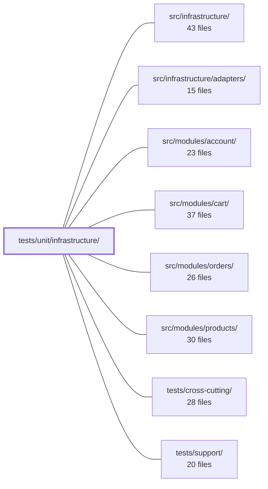

---
tags:
  - 2repo
  - 2repo/module
  - project/boilerplate-node-backend
type: module
module: tests/unit/infrastructure/
files: 27
updated: 2026-08-31T20:59:07.642889+00:00
---

# tests/unit/infrastructure/

## Purpose

Unit tests for the `src/infrastructure/` layer. This module exercises the framework-agnostic and transport-level building blocks—HTTP error mapping, middleware, request/response helpers, i18n plumbing, observability providers, persistence utilities, and runtime environment parsing—in isolation from any business module, using stubs and fakes rather than live databases or network peers.

## Key parts

- **HTTP core** (`http/errors.test.ts`, `http/request.test.ts`, `http/response.test.ts`, `http/schemas.test.ts`, `http/uploads.test.ts`, `http/router-internals.test.ts`) — Pin the contracts every endpoint depends on: error-to-status mapping, input parsing precedence, the response envelope shape, shared query-parameter schemas, multer-shape normalisation, and the Express-internal shapes that the shared route-test helper reads.

- **HTTP middleware** (`http/middlewares/`) — Cover `setCache`, `attachLocale`, the rate-limit store factory (split across `rate-limit-store-selection.test.ts` and `rate-limit-store.test.ts` to allow different `jest.mock` strategies), the rate-limit middleware itself, `requestLogger`, and `routeFlag`. Each file isolates a single middleware's decision logic while stubbing only the external round-trip (Redis, Express lifecycle events).

- **i18n** (`i18n/`) — Four files covering locale negotiation (`negotiate`), the `AsyncLocalStorage` request context (`context`), catalog discovery and `i18next` init shape (`catalog`), and the runtime override overlay (`overrides`).

- **Observability** (`observability/`) — Tests for analytics provider wire payloads (Umami, PostHog), audit-event routing, dependency-health state mapping, Prometheus HTTP metrics, the SSE metrics stream, and OpenTelemetry span helpers.

- **Persistence helpers** (`persistence/`) — DB-free tests for `buildWhere` filter compilation, shared fixture coercion functions, and the `upsertById` skip/created branches.

- **Runtime** (`runtime/environment.test.ts`) — Exhaustive failure-mode tests for `environmentNumber` and `environmentFlag` coercions.

## How it connects

- **`src/infrastructure/`** — The direct system under test. Every file here imports and exercises a specific export from that module; a breaking rename or behaviour change in `src/infrastructure/` surfaces first as a red suite in this directory.
- **`src/infrastructure/adapters/`** — The rate-limit store tests mock `RedisStore` at the class level; the analytics tests assert on the same provider interfaces the adapters implement. The i18n catalog tests validate the resource shape the adapter hands to `i18next`.
- **`src/modules/{account,cart,orders,products}/`** — These business modules consume the infrastructure helpers (response envelope, locale context, rate-limit, repository builders) tested here. The unit tests in this module guarantee the contracts those modules rely on *before* any module-level integration test runs.
- **`tests/support/`** — `router-internals.test.ts` exists specifically to protect the shared route-discovery helper in `tests/support/routes.ts`; a failure here signals that helper needs updating before the twelve downstream suites in `tests/cross-cutting/` break opaquely.
- **`tests/cross-cutting/`** — Cross-cutting integration suites call the same HTTP helpers and middleware exercised here, but under real Express and (where applicable) a real Redis. This module runs first in the fast `npm test` gate and catches regressions before the slower, container-dependent suites do.

## Where to start

1. **`http/response.test.ts`** — The response envelope is the single contract every API endpoint answers in. Reading its tests tells you the exact JSON shape, status-to-code mapping, and `errors`-array guarantees that the rest of the codebase (and its clients) depend on.

2. **`i18n/context.test.ts`** — The `AsyncLocalStorage` locale context is the mechanism that makes `t()` work correctly under concurrency. Understanding its in-scope/out-of-scope behaviour and fallback rules is prerequisite to reading any middleware or controller test that asserts translated output.

## Connected modules

[[boilerplate-node-backend_src_infrastructure|src/infrastructure/]] · [[boilerplate-node-backend_src_infrastructure_adapters|src/infrastructure/adapters/]] · [[boilerplate-node-backend_src_modules_account|src/modules/account/]] · [[boilerplate-node-backend_src_modules_cart|src/modules/cart/]] · [[boilerplate-node-backend_src_modules_orders|src/modules/orders/]] · [[boilerplate-node-backend_src_modules_products|src/modules/products/]] · [[boilerplate-node-backend_tests_cross-cutting|tests/cross-cutting/]] · [[boilerplate-node-backend_tests_support|tests/support/]]

## Files
- `tests/unit/infrastructure/http/errors.test.ts` — Unit tests for `src/infrastructure/http/errors.ts`, covering the `ExtendedError` class (construction, message composition, `instanceof` semantics, default operational flag, and the logging-on-construction contract) and the `databaseErrorInterpreter` / `isDuplicateKey` pipeline (mapping driver and Mongoose errors to `[httpCode, message]` tuples). The tests pin behavior that guards against two failure modes: a client error (4xx) being reported as a server error (500), and a server bug being swallowed as a routine operational failure.
- `tests/unit/infrastructure/http/middlewares/cache.test.ts` — Unit tests for the HTTP response-cache middleware (`setCache` and friends). The file exercises everything the middleware *decides*—cache-key construction, response headers, TTL clamping, the size gate, and corrupt-entry recovery—against real implementations, while stubbing only the Redis round-trip (`getCacheValue` / `setCacheValue` / `invalidateCacheTags`).
- `tests/unit/infrastructure/http/middlewares/locale.test.ts` — Unit tests for the `attachLocale` Express middleware. They verify the four contracts the middleware must fulfil — locale negotiation onto the request, executing `next` inside an `AsyncLocalStorage`-based locale context, setting the correct response headers, and graceful degradation on malformed input — so that downstream services reading the ambient `t()` or the locale context keep working.
- `tests/unit/infrastructure/http/middlewares/rate-limit-store-selection.test.ts` — Unit tests for the `rateLimitStore` factory's **selection and wiring** logic: which concrete store is built (in-process `MemoryStore` vs. `RedisStore`), URL-resolution priority, lazy construction and memoisation, the missing-config alert path, and the init-failure fail-open regression. It is deliberately kept separate from `rate-limit-store.test.ts` because this file mocks `RedisStore` at the class level (via `jest.mock('rate-limit-redis')`) to control `init`/`increment` directly, whereas the sibling file lets a real `RedisStore` run against a fake low-level `redis` client to exercise the `connecting`-promise handshake. One `jest.mock('rate-limit-redis')` per file, so the two strategies cannot coexist in a single file.
- `tests/unit/infrastructure/http/middlewares/rate-limit-store.test.ts` — Unit test guarding a specific race in the Redis-backed rate-limit store: two `init()`-triggered Lua script loads issued back-to-back must not each call `connect()` on the same socket. It reproduces the exact node-redis handshake interleaving (fake client where `isReady` stays false until the promise resolves) and asserts a single `connect()` call plus no destructive `destroy()`. It exists to catch that regression in the fast, container-free `npm test` gate, complementing the slower cluster suite in `tests/cluster/rate-limit.test.ts`.
- `tests/unit/infrastructure/http/middlewares/rate-limit.test.ts` — Unit tests for the rate-limit middleware's default constants and for `isMetricsScraper`, the sole credential check that bypasses the JWT pipeline (Prometheus cannot log in). The tests pin the relationship between the two rate-limit budgets and exhaustively cover every reject/accept path of the scrape guard, including the `timingSafeEqual` length-mismatch edge case.
- `tests/unit/infrastructure/http/middlewares/request-logger.test.ts` — Unit tests for the `requestLogger` Express middleware. Verifies that the middleware is non-blocking, defers logging until the response `finish` event, selects the correct log level by status code, emits only a fixed set of metadata fields, and fires the log call exactly once regardless of how many times `finish` is emitted.
- `tests/unit/infrastructure/http/middlewares/route-flag.test.ts` — Unit tests that pin the contract of the `routeFlag` middleware: it writes a named flag (as a **string**) onto `request.params` so that alternate URL patterns (e.g. `/hard` vs `?hardDelete=true`) can share a single controller entry point. End-to-end routing behaviour is covered by integration suites; these tests isolate the middleware's own mutation of the params object.
- `tests/unit/infrastructure/http/request.test.ts` — Unit tests for `readInput` (and, by import, `callerContextOf`, `extractAndValidateId`, `isValidObjectId`) in `@infrastructure/http/request`. Because `readInput` is reached by every controller, the integration and contract suites exercise it without probing its edge cases; this file pins the precedence chain, ID resolution, and multipart transport-decoding rules that are easy to regress silently.
- `tests/unit/infrastructure/http/response.test.ts` — Unit tests for the API response-envelope helpers in `src/infrastructure/http/response.ts`. They pin the public contract every endpoint answers in: the shape of success/reject bodies, the status→`code` mapping, the status→`message` wording, and the Express-send wrappers. The file exists because the envelope is the API's dialect, not an implementation detail, and a well-meaning refactor could silently drop guarantees (e.g. an empty `errors` array, a leaked 5xx sub-code) without any caller noticing.
- `tests/unit/infrastructure/http/router-internals.test.ts` — Pins the undocumented Express internals (`Router.stack`, `layer.route.methods`, `route.stack[].handle`) that the shared test helper `tests/support/routes.ts` relies on. If Express changes this internal shape in a future version, this single test fails with a clear message pointing at the helper that needs updating — rather than letting twelve downstream suites fail opaquely with `cannot read properties of undefined`.
- `tests/unit/infrastructure/http/schemas.test.ts` — Unit tests for the shared scalar schemas (`hardDeleteSchema`, `pageSchema`, `pageSizeSchema`, `paginationSchema`) that guarantee every endpoint interprets the same query-parameter questions identically. The file exists to lock in the contract so that a value like `?hardDelete=false` can never be misread as "delete" and a `pageSize` out of range can never be answered differently by two controllers.
- `tests/unit/infrastructure/http/uploads.test.ts` — Unit tests for the upload helper functions in `src/infrastructure/http/uploads.ts`. The file exists to lock down two invariants: (1) `getFormFiles` collapses all three multer request shapes (`single`, `array`, `fields`) into one uniform return type, and (2) `resolveImageUrl` reads the URL only from the image store and never falls back to a filesystem path. It also covers the small `toPosixPath` normalizer.
- `tests/unit/infrastructure/i18n/catalog.test.ts` — Unit tests for the i18n catalog layer: locale discovery, per-dictionary loading with module merge, and the resource shape handed to `i18next.init()`. The suite guards the invariant that the supported-locale list stays in lockstep with the resources `i18next` actually registered at init time.
- `tests/unit/infrastructure/i18n/context.test.ts` — Unit tests for the request-scoped i18n context — the `AsyncLocalStorage`-based mechanism that lets `t()` resolve against the locale set by the current request, while silently falling back to the global instance outside any scope. The file exists because the failure modes it guards (out-of-scope raw keys, concurrent-request cross-talk) are invisible to integration tests and only surface under deliberate concurrency or out-of-band code paths.
- `tests/unit/infrastructure/i18n/negotiate.test.ts` — Unit tests for `negotiateLocale`, the pure function that resolves a client-supplied `Accept-Language` header (or the absence of one) into a concrete supported locale. Because malformed and edge-case headers are tedious to reproduce over real HTTP, the function is exercised here directly rather than only through integration tests.
- `tests/unit/infrastructure/i18n/overrides.test.ts` — Unit tests for the locale-override overlay layer. Validates that overrides correctly layer on top of deployed translation files without corrupting them, that deletion and provider failures are handled safely, and that the background refresh timer behaves predictably across start/stop lifecycles.
- `tests/unit/infrastructure/observability/analytics.test.ts` — Unit tests for the analytics provider port and its Umami/PostHog implementations. Because the public contract is fire-and-forget (no return value to assert on), every test asserts on the outgoing wire payload — the decoded `fetch` call or the PostHog `capture` arguments — which is the only observable a provider produces. The file also pins behaviours discovered against a live Umami 2.14 instance that are invisible from its API (e.g. silent event discard without a `User-Agent` header).
- `tests/unit/infrastructure/observability/audit.test.ts` — Unit tests for the core audit-observability module. Verifies that audit events are logged at the correct severity level, forwarded to any registered sink, and that request-context extraction produces the expected shape — without touching disk or requiring a live OpenTelemetry SDK.
- `tests/unit/infrastructure/observability/dependency-health.test.ts` — Unit tests that pin the exact mapping from each dependency's raw state to its health word and the fold from individual words to an overall service status (`ok` / `degraded`). The contract suite elsewhere can only assert that the payload uses the four allowed words; this file locks *which* word each state produces and *when* the service degrades, covering two mappings that are easy to invert (`disabled` must not degrade, `connecting` must not read as broken).
- `tests/unit/infrastructure/observability/metrics-http.test.ts` — Unit tests for the HTTP request metrics module (`metrics-http.ts`). Validates that route labels are derived safely (bounded cardinality), that Prometheus counters/gauges are incremented correctly, and that histogram-percentile math behaves as expected.
- `tests/unit/infrastructure/observability/stream.test.ts` — Unit tests for the SSE observability metrics stream. The suite exists because three failure modes in `stream.ts` are silent — wire-format whitespace, uncleared timers on disconnect, and unhandled rejections inside interval callbacks — and none of them produce an error visible to the developer. The tests pin the exact bytes written to the socket, the timer lifecycle, and the error-absorption contract.
- `tests/unit/infrastructure/observability/tracer.test.ts` — Unit tests for the OpenTelemetry tracing utilities in `src/infrastructure/observability/tracer.ts`. Verifies that the four exported helpers (`getTracer`, `withSpan`, `getActiveSpanContext`, `recordErrorOnActiveSpan`) behave correctly on both success and failure paths without requiring a live collector.
- `tests/unit/infrastructure/persistence/create-repository.test.ts` — Unit tests for the `buildWhere` method returned by `createRepository`, which compiles a caller's filter bag into a MongoDB query object. The tests are pure and DB-free: the Mongoose model is a stub that is never invoked, so the suite isolates the id-coercion, blank/empty handling, and per-kind compilation rules (objectIds, exact, booleans, regex, arrayRegex, text, ranges) without any database or Mongoose internals.
- `tests/unit/infrastructure/persistence/fixtures.test.ts` — Unit tests for the four shared fixture helper functions (`toObjectId`, `compact`, `toDate`, `identityOf`) that every module's `fixtures.ts` composes from. The tests exist to pin down the "missing field" semantics of seeded records — each helper has a silent-failure mode (e.g. a hex string that never becomes a real `ObjectId` matching zero documents in a `$match`) that this suite is written to catch.
- `tests/unit/infrastructure/persistence/seed.test.ts` — Unit tests for the `upsertById` helper, covering both branches of its upsert policy: the **created** path (no prior document) and the **skipped** path (id already present). The skip arm historically went unexercised by integration suites (which always seed into a fresh database), leaving that branch invisible to coverage; this file exists to pin that behavior explicitly.
- `tests/unit/infrastructure/runtime/environment.test.ts` — Exhaustive unit tests for the two shared environment-variable coercions (`environmentNumber` and `environmentFlag`). The suite focuses on failure modes — unset, blank, partial, and unrecognised inputs — because those are the silent regressions (NaN leaking into `Date`/`maxAge`, `parseInt` reading a prefix, inconsistent flag vocabulary) the helpers exist to prevent.

---
[[boilerplate-node-backend_INDEX|← boilerplate-node-backend index]]
